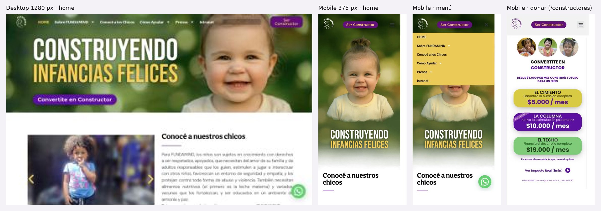

# 3.3.1 - FUNDAMIND

> Método: recorrido con WebFetch (resumen automático del contenido de cada página) el 2026-10-05. No se evaluó diseño visual ni mobile. Algunas señales técnicas (atributo `lang`, `alt`) se infieren de la conversión a texto y deben confirmarse con inspección del código.

## Información general
- **Organización:** FUNDAMIND, "organización humanitaria sin fines de lucro" fundada en 1990 [F1, F2].
- **Tipo:** **Indirect competitor.** Justificación: comparte mercado (Argentina, niñez vulnerable, recursos para familias y educadores en "Familias Resilientes" [F9]) y compite por los mismos donantes y empresas, pero su producto es distinto: **asistencia directa** (centro de primera infancia, nutrición, test de VIH en sede [F8, F11]) y no prevención de violencias ni derivación a líneas oficiales. Toca temas de violencia solo en contenidos editoriales (informes sobre grooming, violencia de género, múltiples violencias [F7]). Producto distinto a una audiencia parcialmente compartida = indirecto.
- **Ubicación:** 24 de Noviembre 142, Balvanera, Buenos Aires (edificio propio de 1.200 m² comprado en 2004) [F1, F4].
- **Oferta:** 4 programas: Educar y Ser Feliz (primera infancia, primeros 1000 días), Nutrición Integral, No más chicos con VIH (prevención, test rápido L a V 9–14 h, educación en escuelas), Familias Resilientes (materiales y videos para crianza) [F3, F8, F9, F11]. Además: Revista FUNDAMIND (37 números), Informes Especiales mensuales, eventos de recaudación [F7, F13, F14].
- **Website:** https://www.fundamind.org.ar
- **Tamaño o alcance:** Datos escasos. Equipo listado de 30+ personas entre consejo, asesores y nivel operativo [F2]. Hitos: unidad móvil de prevención de VIH con más de 300.000 km recorridos (desde 1998), "7 aulas maternales" para 200 chicos, cofundadora de la red ALACVIH (10 países de América Latina y el Caribe) [F4]. No hay cifras actuales de chicos o familias atendidas [F1, F2, F3].
- **Target audience:** principalmente donantes individuales (suscripción mensual "Constructores"), empresas (RSE), voluntarios; en segundo plano familias y educadores (Familias Resilientes) y opinión pública/prensa (Informes Especiales) [F1, F5, F6, F9, F10].
- **Unique value proposition:** "Construir infancias felices" con foco en los primeros 1000 días; metáfora de construcción en toda la recaudación (Constructores, niveles "El Cimiento / La Columna / El Techo") [F1, F12, F15].
- **Otros datos de posicionamiento:** trayectoria y premios (Premio Madre Teresa de Calcuta 2010, Premio Fundación Leo Messi 2010, entre otros) [F4]; aliados corporativos visibles (Fundación IRSA, Fundación Marolio, La Segunda Seguros, TGS) [F1]; uso de celebridades en eventos y sección "amigos" [F1, F14]; exenta de Ganancias [F5].

## Arquitectura y navegación
**Menú principal (HECHO, [F1]):**
- HOME
- Sobre FUNDAMIND → Misión, Visión y Valores · Quiénes somos · Nuestros Programas (→ Educar y Ser Feliz · Nutrición Integral · No más chicos con VIH · Familias Resilientes) · Trayectoria · Nuestra Sede
- Conocé a los Chicos
- Cómo Ayudar → Personas · Empresas · Otras formas de donar
- Prensa → Informes Especiales · Eventos Especiales · Revista FUNDAMIND · Fotogalería Histórica
- Intranet (enlace externo a sistema.fundamind.org.ar, login interno)
- Botón destacado fuera del menú: "Ser Constructor" / "Convertite en Constructor" [F1, F2].

**Profundidad:** hasta 3 niveles (Sobre FUNDAMIND > Nuestros Programas > programa) [F1].

**Organización por audiencia:** parcial y solo en recaudación ("Cómo Ayudar" separa Personas y Empresas) [F1]. No hay entradas para familias, educadores, jóvenes ni internacionales. OBSERVACIÓN: "Prensa" agrupa contenido propio (informes, eventos, revista), no herramientas para periodistas.

**Buscador:** presente (campo "Buscar") [F1].

**Footer:** repite el menú, atajos (Trayectoria, Historias de Vida, Voluntariado, Cumpleaños solidarios, Testimonios, Eventos Especiales, Informes Especiales), suscripción al newsletter "NOTIMIND", redes (Facebook, Instagram, X, TikTok, YouTube), Política de Privacidad, CTA "Quiero Construir", datos de contacto y WhatsApp [F1, F2].

**Hallazgos:** OBSERVACIÓN: Voluntariado no figura en el menú principal, solo en el footer y dentro de Cómo Ayudar [F1, F5]. La "Intranet" ocupa lugar en la navegación pública [F1]. /inicio devuelve 404 aunque la conversión listaba ese slug [F16].

## User flows clave
- **Pedir ayuda / derivación:** **No existe como flujo.** No hay sección "Necesito ayuda", ni líneas 102/137/911, ni derivación [F1]. Las páginas de programas no explican requisitos ni inscripción [F3, F8]. Único servicio de acceso explícito: test rápido de VIH en sede, L a V 9–14 h, sin un teléfono propio para eso [F11]. Fricción: una familia tiene que llegar a "Sobre FUNDAMIND > Nuestros Programas > programa" y después usar el contacto general.
- **Donar:** El flujo más cuidado. Home → "Convertite en Constructor" → /constructores: suscripción mensual en pesos con 3 niveles ($5.000 "El Cimiento": nutrición; $10.000 "La Columna": estimulación; $19.000 "El Techo": desarrollo completo), con "Podés cancelar o cambiar tu aporte cuando quieras" y video "Ver Impacto Real (1min)"; el pago sigue en Mercado Pago (dominio externo) [F12]. Alternativas en "Otras formas de donar": transferencia (Banco Macro, CBU y alias FUNDAMIND.DONACIONES), en persona en sede, PayPal (paypal.me/fundamind), mail donaciones@ y WhatsApp específico [F10]. Fricciones: la página "Personas" no detalla el proceso y deriva a otra página [F6]; varios CTAs distintos para lo mismo ("Ser Constructor", "Quiero Construir", "Donar Ahora", "Doná Aquí") [F1, F6, F10]; no muestra la donación única en /constructores [F12].
- **Voluntariado / empresas:** Voluntariado: formulario en la página (nombre, mail, WhatsApp, modalidad presencial/remoto, días y horarios, habilidades, experiencia), con 5 áreas (alimentación, programa educativo 1–3 años, redes, eventos, vía pública/captación) y requisitos actitudinales [F13]. Empresas: 10 modalidades (transferencia, tarjeta, campañas, padrinazgos, patrocinio de eventos, publicidad en revista y web, matching, donación de productos, compra de insumos, desarrollo de producto), beneficios de RSE y deducción impositiva, CTA "DONA AHORA AQUÍ" que abre un formulario de contacto [F6b]. Fricción: voluntariado escondido en el footer [F1].
- **Recursos / formación:** "Familias Resilientes" ofrece materiales, flyers y videos para padres y educadores [F9]; el programa VIH menciona 3 libros publicados y material educativo [F11]. No hay biblioteca de recursos filtrable ni sección propia en el menú: los recursos están adentro de un programa, a 3 niveles [F1, F9].
- **Prensa:** Hay menú "Prensa", pero su contenido es editorial: Informes Especiales mensuales (12 páginas de archivo, el último de septiembre de 2026), Eventos, Revista (37 números), Fotogalería [F7, F14, F15]. **No hay** kit de prensa, contacto de prensa propio, ni apariciones en medios (el contacto es el general) [F7].
- **Contacto institucional:** Teléfono (+5411) 4957-7111/7333, info@fundamind.org.ar, dirección y WhatsApp en todas las páginas [F1, F2]. Formulario de contacto con intereses múltiples en Cómo Ayudar [F5]. No se encontró una página "Contacto" en el menú [F1].
- **Público internacional:** **No existe.** Solo español; /en da 404 [F17]. Para donar desde el exterior solo aparece PayPal, sin mención explícita de moneda extranjera [F10]. Los montos están en pesos [F12].

## Contenido
- **Claridad:** OBSERVACIÓN: buena en recaudación (niveles con resultado concreto) [F12]; floja en programas (la página de programas solo lista nombres, sin descripción) [F3] y en cómo acceder a servicios [F8].
- **Tono:** emotivo, aspiracional y cercano, con voseo y la metáfora de la construcción. Citas: "la felicidad no es una meta futura, es una condición inicial" [F15]; "Los primeros años de vida son una etapa única y decisiva." [F8].
- **Organización:** institucional ("Sobre FUNDAMIND") más recaudación. La home sigue este orden: hero "CONSTRUYENDO infancias felices" → Conocé a nuestros chicos → Historias de Vida → Testimonios → Amigos/celebridades → Publicaciones → Newsletter → Footer [F1].
- **Cantidad de información:** mucho archivo editorial (37 revistas, 12 páginas de informes, eventos desde 2015) [F7, F14, F15]; poco dato operativo actual.
- **CTAs (textuales):** "Convertite en Constructor", "Ser Constructor", "Quiero Construir", "Ver más >", "Conocelas >", "¡Hacete amigo de los chicos!", "Conocé a nuestros amigos >", "Ver informes >", "Conoce más >" [F1]; "Donar Ahora" [F5, F6]; "DONA AHORA AQUÏ >" (sic) [F6b]; "Doná Aquí >" [F10]; "Conoce las Formas de Ayudar>" [F7, F14]; "Si queres ser Voluntario, llena este formulario", "ENVIAR" [F13]; "Ver Impacto Real (1min)" [F12]; "LEER MÁS..." [F14].
- **Impacto / transparencia:** HECHO: la home no muestra cifras de impacto [F1]. Los números aparecen dispersos en Trayectoria (300.000 km, 200 chicos en 7 aulas, red en 10 países, premios) [F4], el dato de divulgación "un millón de conexiones neuronales por segundo" [F15] y la traducción del aporte a resultado por nivel [F12]. No se encontraron memorias, balances ni auditorías [F4, F5]. Señales de credibilidad: año de fundación, premios, gobierno institucional detallado (consejo con mandato de 3 años) [F2, F4], logos de aliados corporativos [F1], testimonios de donantes [F1].
- **Presencia en medios:** no hay sección de "FUNDAMIND en los medios" ni logos de medios [F1, F7]. INFERENCIA: los Informes Especiales mensuales funcionan como contenido para prensa y agenda pública, pero sin herramientas para periodistas.
- **Ética de imagen de NNyA:** "Historias de Vida" aclara que usa "imágenes y nombres ilustrativos" para cuidar la identidad [F1]; "Conocé a los Chicos" muestra una galería de fotos de niños que asisten o asistieron al centro [F11b].

## Idiomas y accesibilidad (lo verificable desde el contenido)
- **Idiomas:** solo español; sin selector de idioma; /en devuelve 404 [F1, F17].
- **Idioma declarado:** la conversión solo detectó `og:locale: es_ES` y no un `lang` en `<html>` [F1]. Es **no concluyente** porque la herramienta no muestra el HTML crudo: hay que confirmarlo inspeccionando el código.
- **Texto alternativo:** imágenes de galería con `alt=""` (p. ej. "conoce 16") y muchas imágenes como placeholders SVG (lazy-load) [F1]. INFERENCIA: las fotos con contenido (chicos, aliados) no tendrían descripción para lectores de pantalla.
- **Skip link:** "Ir al contenido" presente [F1].
- **Meta viewport:** configurada [F1, F3].
- **Otros:** el contacto por WhatsApp suma un canal además del teléfono y el mail [F1]. Erratas en CTAs ("AQUÏ", "queres", "llena") [F6b, F13].

## First impressions (capturas propias, 2026-10-05)
- **Primera impresión (OBSERVACIÓN):** hero emotivo con foto de una bebé y el lema "Construyendo infancias felices"; el CTA de donación ("Convertite en Constructor") es lo primero que se ve.
- **Claridad de la propuesta:** se entiende que es una ONG de primera infancia que pide donaciones; **no** se entiende qué servicios ofrece ni a quién (los programas no tienen descripción).
- **Jerarquía visual:** fuerte para donar (botón violeta fijo en el header); débil para cualquier otra tarea.
- **Desktop — Good.** + Hero claro y CTA visible. − En una ventana de 978 px el menú ya colapsa en hamburguesa.
- **Mobile — Okay.** + Responsive, sin scroll horizontal, "Ser Constructor" fijo en el header. − El hero ocupa toda la primera pantalla sin texto explicativo; el ícono de menú gris sobre la foto tiene poco contraste; el teléfono no se puede tocar (0 enlaces `tel:`), solo hay WhatsApp flotante.
- **Responsive design:** el menú móvil se despliega como panel amarillo con 6 ítems; funciona, pero repite la estructura institucional.

## Visual design
- **Branding / identidad — Good.** + Paleta violeta, amarillo y verde aplicada con consistencia; metáfora de construcción en todos los CTAs. − Tipografía condensada en mayúsculas en el hero, distinta del resto.
- **Imágenes:** fotos reales de niñas y niños (la sección Historias aclara que usa "imágenes y nombres ilustrativos").
- **Coherencia entre páginas:** la página de donación (/constructores) mantiene la marca con tarjetas de color por nivel; es la pieza visual más clara del sitio.
- **Relación diseño–audiencia:** el diseño está pensado para el donante emocional, no para familias o profesionales.

## Verificación técnica (JavaScript sobre el DOM, 2026-10-05)
| Chequeo | Resultado |
| --- | --- |
| `lang` del documento | `es` (confirma lo que WebFetch no pudo ver) |
| Skip link | Sí |
| Imágenes con `alt=""` | 31 de 73 |
| Buscador | Sí |
| Enlaces `tel:` | 0 |
| H1 | 1 ("CONSTRUYENDO") |
| Plataforma | WordPress |

## Ratings finales
| Dimensión | Rating | Por qué |
| --- | --- | --- |
| Desktop | Good | Hero y CTA claros |
| Mobile | Okay | Responsive, pero el hero tapa el contenido y el teléfono no se toca |
| Navegación | Okay | Simple, pero por institución; voluntariado solo en el footer |
| User flow | Okay | Donar excelente; pedir ayuda inexistente |
| Accesibilidad | Needs work | 31 de 73 imágenes sin descripción; sin `tel:` |
| Diseño visual | Good | Marca consistente y emotiva |
| Contenido | Okay | Tono cálido; sin impacto en números ni descripción de programas |

## Lentes del objetivo del audit
| Lente | ¿Lo resuelve? | Evidencia |
| --- | --- | --- |
| Navegación por audiencia | Parcial | Solo "Cómo Ayudar" separa Personas y Empresas |
| Pedir ayuda / derivación | No | Sin líneas 102, 137, 911 ni ruta de ayuda |
| Impacto y credibilidad | Parcial | Impacto por nivel de donación; sin cifras globales ni memorias |
| Prensa | Parcial | "Prensa" es contenido propio, sin contacto de prensa |
| Internacional | No | Solo español; /en da 404; solo PayPal |

## Qué significa → qué decisión podría afectar
- La donación por niveles con resultado concreto funciona → **afecta** el diseño de la sección para donantes (US-15, US-32).
- "Prensa" como cajón de contenido propio no sirve a periodistas → **afecta** separar Novedades de Prensa (US-31).
- Sin ruta de ayuda → **confirma** la diferenciación de RPI con "Necesito ayuda" (US-01 a US-03).

## Evidencia
Capturas: home desktop (1280 px), home mobile (375 px), menú mobile y página de donación mobile. `evidencia/capturas/fundamind_*.jpg` (hoja resumen: `evidencia/fundamind_evidencia.jpg`).

## Ratings preliminares (solo contenido, antes de las capturas) (Needs work / Okay / Good / Outstanding, con + y −)
- **Content: Okay.** + Tono cálido y coherente, propuesta de donación muy clara con resultado por nivel, producción editorial sostenida (informes mensuales, revista) [F7, F12, F15]. − Sin impacto actual en números, programas sin descripción ni forma de acceso, sin transparencia financiera visible [F1, F3, F4].
- **Interaction / Navigation: Okay.** + Menú simple, buscador, skip link, contacto y WhatsApp en todas las páginas [F1]. − Organizado por institución y no por audiencia; programas a 3 niveles; voluntariado fuera del menú; "Intranet" en el menú público; "Prensa" sin herramientas de prensa [F1].
- **User flow: Okay.** + Flujo de donación mensual corto y concreto, varios medios de pago, formularios de voluntariado y empresas bien definidos [F6b, F10, F12, F13]. − No existe flujo de pedir ayuda ni de derivación; CTAs de donación repetidos con nombres distintos; nada para internacionales salvo PayPal [F1, F10].
- **Accessibility (preliminar): Needs work.** + Skip link y viewport [F1]. − Alt vacíos en imágenes, `lang` no detectado (a confirmar), un solo idioma [F1, F17]. El contraste, el foco y el teclado no son verificables con esta herramienta.

## Fortalezas
- La donación mensual se presenta como producto, con niveles, montos y resultado tangible, y ofrece cancelar cuando se quiera [F12].
- Una marca narrativa coherente ("Constructores") en todos los CTAs [F1, F12].
- Una oferta para empresas muy detallada (10 modalidades más beneficios de RSE e impositivos) [F6b].
- Producción de contenido periódico que la posiciona en la agenda pública (Informes Especiales mensuales, revista) [F7, F15].
- Credibilidad por trayectoria (desde 1990, premios, gobierno institucional transparente) [F2, F4].
- Varios canales de contacto, incluido WhatsApp, en todas las páginas [F1, F10].

## Debilidades
- No hay ningún camino para pedir ayuda ni derivación a líneas oficiales [F1].
- No hay impacto en números ni memorias o balances [F1, F4].
- No hay navegación por público (familias, educadores y jóvenes no tienen entrada propia) [F1].
- Solo en español; la donación internacional se limita a PayPal [F10, F17].
- La sección "Prensa" no le sirve a la prensa (sin contacto propio, kit ni clipping) [F7].
- Los CTAs de donación están fragmentados y hay erratas [F1, F6b, F10, F13].
- Hay señales de accesibilidad débiles (alt vacíos) [F1].

## Patrones o ideas relevantes para Red por la Infancia
1. **[HECHO] Donación mensual por niveles con resultado concreto** ("El Cimiento / La Columna / El Techo", con montos y para qué sirve cada uno) [F12]. Objetivo (3) impacto para donantes: RPI puede traducir el aporte en prevención concreta (p. ej. talleres o casos de Bajalo Ya!). INFERENCIA: reduce la abstracción de "prevenir".
2. **[HECHO] "Podés cancelar o cambiar tu aporte cuando quieras" junto al CTA** [F12]. Objetivo (3): un microtexto que baja la ansiedad del donante mensual y es fácil de copiar.
3. **[HECHO] Página "Otras formas de donar" con CBU, alias, PayPal, mail y WhatsApp de donaciones** [F10]. Objetivos (3) y (4): para el 31% de usuarios del exterior, RPI necesita al menos una vía internacional explícita. OBSERVACIÓN: FUNDAMIND no la etiqueta como "desde el exterior", y eso es un antipatrón a evitar.
4. **[HECHO] Página de empresas con un menú de modalidades y beneficios de RSE** [F6b]. Objetivo (1) y (3): sirve de modelo para una entrada "Empresas y financiadores" dentro de la navegación por audiencia.
5. **[HECHO] Informes Especiales mensuales sobre problemáticas de NNyA (incluido grooming e IA)** [F7]. Objetivo (3) presencia en medios: INFERENCIA: RPI puede tener contenido periódico de agenda, pero debe sumar lo que falta acá (contacto de prensa, kit, clipping).
6. **[OBSERVACIÓN] Antipatrón: "Prensa" como cajón de contenido propio** [F1, F7]. Objetivo (3): conviene separar "Novedades" (contenido) de "Prensa" (vocerías, kit, apariciones).
7. **[OBSERVACIÓN] Antipatrón: no hay ruta de ayuda** [F1, F8]. Objetivo (2): confirma la oportunidad de diferenciación de RPI con un "Necesito ayuda" persistente.
8. **[HECHO] WhatsApp como canal de contacto en todo el sitio** [F1]. Objetivo (5) mobile: INFERENCIA: con 50% de visitas desde el celular, un canal de mensajería persistente puede ser útil. En RPI debe evaluarse para no confundirlo con atención de urgencias.
9. **[HECHO] Aviso de "imágenes y nombres ilustrativos" en historias** [F1]. Es un patrón ético para mostrar casos sin exponer a NNyA, alineado con credibilidad (3).
10. **[OBSERVACIÓN] Recursos para familias enterrados dentro de un programa** [F9]. Objetivo (1): es un argumento para que RPI suba "Recursos" (ReConectate, Pantasaurus, Campus) al primer nivel, filtrados por público.

## Fuentes
(todas consultadas el 2026-10-05)
- [F1] https://www.fundamind.org.ar/ (home, consultada 2 veces)
- [F2] https://www.fundamind.org.ar/quienes-somos
- [F3] https://www.fundamind.org.ar/nuestros-programas
- [F4] https://www.fundamind.org.ar/trayectoria
- [F5] https://www.fundamind.org.ar/como-ayudar
- [F6] https://www.fundamind.org.ar/personas
- [F6b] https://www.fundamind.org.ar/empresas
- [F7] https://www.fundamind.org.ar/informes-especiales
- [F8] https://www.fundamind.org.ar/educar-y-ser-feliz
- [F9] https://www.fundamind.org.ar/familias-resilientes
- [F10] https://www.fundamind.org.ar/otras-formas-de-donar
- [F11] https://www.fundamind.org.ar/no-mas-chicos-con-vih
- [F11b] https://www.fundamind.org.ar/conoce-a-los-chicos
- [F12] https://www.fundamind.org.ar/constructores
- [F13] https://www.fundamind.org.ar/voluntariado
- [F14] https://www.fundamind.org.ar/eventos-especiales
- [F15] https://www.fundamind.org.ar/revista-fundamind y https://www.fundamind.org.ar/1000-dias-para-construir
- [F16] https://www.fundamind.org.ar/inicio (no accesible: 404)
- [F17] https://www.fundamind.org.ar/en (no accesible: 404)

## Capturas

