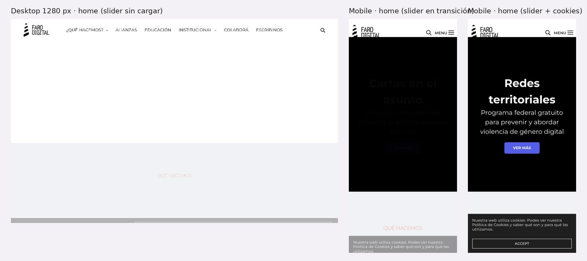

# 3.3.10 - Faro Digital

> Método: lectura de contenido con WebFetch (17 páginas de farodigital.org y su subdominio de certificación, más 1 documento externo que menciona a Faro Digital). WebFetch devuelve un resumen del HTML, no la página renderizada: menús desplegables, sliders y estados interactivos pueden no aparecer completos. Se suman datos de observación propia en el navegador del celular (2026-10-05), marcados como tales. Fecha de consulta: 2026-10-05. Referencias entre corchetes [n] = número en la sección Fuentes. Se leyeron además dos páginas de control (categoría "Grooming" y la campaña "#SexteáConLaCabeza") que confirmaron lo mismo que [6] y [16]; no se citan para respetar el máximo de 17 páginas.

## Información general
- **Organización:** Faro Digital. Se presenta como un "Grupo de personas comprometidas con la exploración, análisis y promoción de la ciudadanía en los territorios digitales"; fundada en 2015 [2]. Trabaja con talleres, campañas, investigaciones y contenidos [2]. El footer dice "© 2019 ElFaro" (nombre y año desactualizados) [1].
- **Tipo: Direct competitor.** Justificación según las definiciones del certificado: ofrece un **producto similar** —prevención de violencias digitales y ciudadanía digital para chicas, chicos y adolescentes mediante guías, talleres en escuelas, campañas e investigaciones— a la **misma audiencia en el mismo mercado** (escuelas, docentes, familias y adolescentes en Argentina, más empresas y donantes) [6][7][8][10]. Trata los mismos temas que ReConectate y Bajalo Ya!: grooming, difusión de imágenes íntimas sin permiso, ciberbullying [6][7][5]. Compite además por los mismos aliados (Meta, WhatsApp, Instagram, UNICEF Argentina, Fundación Telefónica) [10]. Diferencias: no tiene un servicio equivalente a Bajalo Ya! ni deriva a líneas de ayuda [12][16], y vende servicios a instituciones (talleres, Certificación e3) [8][9] (HECHO; clasificación = INFERENCIA).
- **Ubicación:** Buenos Aires, Argentina, y Barcelona, España (indicado en el footer de todas las páginas) [2][11].
- **Oferta:** Proyecto Escuelas (talleres para estudiantes, docentes, familias y directivos) [8]; Certificación e3 en "buenas prácticas de ciudadanía digital" para empresas, escuelas, clubes y ONG [9]; capacitaciones, consultorías, investigaciones y campañas para "organizaciones, empresas e instituciones públicas" [10]; 12 guías (2019–2025) [7]; recursos educativos en 8 temáticas [6]; 8 investigaciones [5]; 21 campañas listadas [4]; blog "Modo avión" [14]; newsletter [1].
- **Website:** https://farodigital.org (+ https://certificacion.farodigital.org para la Certificación e3) [1][9].
- **Tamaño / alcance:** HECHO: equipo de unos 26 integrantes, 17 de ellos talleristas [13]. La única cifra de alcance encontrada está en una nota del 5 de noviembre de 2024: "más de 21,000 estudiantes, docentes y familias" y "más de 120 instituciones" en "lo que va del año" (2024) [15]. Acerca de no publica cifras de alcance [2]. No se encontraron datos de presupuesto ni informes anuales [2].
- **Target audience:** escuelas (estudiantes, docentes, familias, directivos) [8]; adolescentes e infancias (guías específicas) [7]; madres y padres [7]; empresas e instituciones públicas [9][10]; donantes individuales en ARS y USD [11].
- **Unique value proposition:** INFERENCIA: referente de "ciudadanía digital" con producción propia de investigación (por ejemplo, el "RELEVAMIENTO NACIONAL DE ACTORES, SERVICIOS Y CIRCUITOS DE ATENCIÓN DEL GROOMING. 2022 – 2023") y un equipo grande de talleristas para escuelas [5][13]. El tagline del equipo es "Trabajando día a día para la ciudadanía digital." [13]
- **Otros datos de posicionamiento:** declarada de interés social y educativo por la Legislatura de la Ciudad de Buenos Aires (nota del 5 de noviembre de 2024) [15]. Aparece como "organización civil colaboradora" en la guía de actuación de la Línea 102 ante situaciones de violencia digital [18]. Lista de aliados con Mercado Pago, Meta, Fundación Telefónica, Telefónica, WhatsApp, Instagram, UNICEF Argentina, Universidad de Barcelona, Wikimedia Argentina, CEIBAL, Conectados al Sur, Chequeado y SAP [10].

## Arquitectura y navegación
- **Menú principal (6 ítems) [1]:** ¿Qué hacemos? · Alianzas · Educación · Institucional · Colaborá · Escribinos, más íconos de redes sociales (observación propia en el navegador).
  - **¿Qué hacemos?:** Proyectos, Campañas, Investigaciones, Recursos educativos (Guías / Por temática), Certificación e3 [1].
  - **Alianzas:** una página [10].
  - **Educación:** lleva a "Proyecto escuelas" [1][8].
  - **Institucional:** Acerca de nosotros, Equipo, Blog (Modo avión) [1].
  - **Colaborá** y **Escribinos:** una página cada uno [11][12].
- **Profundidad:** 3 niveles (menú > listado > ficha de proyecto, campaña o guía) [3][4][7][16]. La Certificación e3 está en un subdominio con navegación propia [9].
- **¿Organiza por audiencia?** No en el menú: organiza por **tipo de producción** (proyectos, campañas, investigaciones, recursos) e institución [1]. "Educación" es el único ítem que apunta a un público (escuelas) [1][8]. Dentro de Proyecto Escuelas sí separa por público: Estudiantes, Docentes, Familias, Directivos [8]. Los recursos se ordenan por **tema** (8 temáticas) [6]; las guías, por fecha, con el público solo implícito en el título [7].
- **Listados sin descripción:** Proyectos (unos 25) y Campañas (21) se muestran como galería de nombres e imágenes, sin año, público ni descripción [3][4]. Investigaciones lista 8 títulos sin año ni formato (salvo "2022 – 2023" en el título del relevamiento de grooming) [5].
- **Buscador:** sí (observación propia en el navegador). No verificable con WebFetch [1].
- **Footer:** Políticas de Cookies, redes (X, Instagram, Facebook, Spotify, YouTube, LinkedIn, TikTok), email consultas@farodigital.org, ubicaciones, "© 2019 ElFaro" [1].
- **Accesos persistentes:** "Colaborá" y "Escribinos" en el menú en todas las páginas [1]. No hay acceso persistente a ayuda (OBSERVACIÓN [1][12]).

## User flows clave
1. **Pedir ayuda / derivación — no existe.** HECHO: ni la home, ni Escribinos, ni Recursos educativos, ni la "Guía de difusión de imágenes íntimas sin permiso" mencionan las líneas 102, 137 o 911, fiscalías o canales de reporte en plataformas [1][6][12][16]. El único contacto es consultas@farodigital.org [12][16]. El formulario de Escribinos pide "Tipo de contacto" (Individuo o particular / Institución / Empresa), "País" y "¿Cómo nos conociste?", sin opción para una situación de violencia [12]. Fricción: la guía de imágenes íntimas (publicada en 2019, modificada en junio de 2025) dice que los adolescentes "sienten ausencia de responsables que los acompañen", pero no ofrece a dónde acudir [16]. INFERENCIA: es coherente con un perfil educativo, pero quien llega por una búsqueda sobre grooming o imágenes íntimas no encuentra una salida.
2. **Escuelas (flujo principal del sitio).** Menú > Educación > Proyecto escuelas, con el aviso "Estamos actualizando las propuestas 2026" [8]. Ofrece 4 modalidades: "Jornadas presenciales" (4 talleres de 60 minutos para estudiantes), "Talleres + Espacio de Trabajo" (90 minutos), "Talleres Codiseño" (máximo 30 participantes, 90 minutos) y "Programa Puentes" ("Talleres intergeneracionales") [8]. Cada público tiene una propuesta de una línea; por ejemplo, Familias: "Talleres participativos con espacios de reflexión, estrategias de prevención y consejos para el acompañamiento." [8] Fricciones: no hay aranceles ni formulario específico; el contacto es el email general [8].
3. **Recursos / formación por audiencia.** Menú > ¿Qué hacemos? > Recursos educativos > 8 temáticas (Ciudadanía Digital, Ciberbullying, Grooming, Desinformación, Pantallas, Violencia de género, Apuestas Online, Inteligencia Artificial), cada una con "VER TODO" [6]. Formatos: guías descargables, cuadernillos, videos y artículos [6]. No se pide registro para descargar [6][16]. La guía de imágenes íntimas es página web + PDF ("Descargar esta guía") sin pedir datos [16]. Fricción: no se puede filtrar por público ni por año; el público se deduce del título ("Guía de acompañamiento de adolescencias…", "…de infancias…") [7].
4. **Donar.** Menú > Colaborá > "DONAR EN ARS" (Mercado Pago: mensual, anual o única vez) o "DONAR EN USD" (PayPal) [11]. CTA en la home: "¿QUERÉS COLABORAR?" [1]. Fricciones: la página no muestra montos sugeridos, qué financia cada aporte, CUIT ni datos de transparencia [11]; el pago ocurre fuera del sitio [11].
5. **Empresas / alianzas.** Menú > Alianzas: texto general ("Desarrollamos programas que fortalecen a las comunidades a través de la educación y la comunicación…"), lista de aliados y enlaces a "Proyectos" y "Campañas" [10]. No hay tipos de alianza, casos ni contacto específico [10]. La Certificación e3 sí tiene un flujo propio: 4 ejes, 5 etapas (diagnóstico, formación, documentos, acompañamiento, certificado), CTA "¡Quiero certificarme!" y formulario (apellido, email, celular, organización) [9]. No muestra costos ni instituciones certificadas; dice "Certificación válida para el período 2024-2025" (desactualizado a octubre de 2026) [9].
6. **Prensa — no existe.** No hay sala de prensa, contacto de prensa ni voceros [13]. El blog "Modo avión" se define como el lugar de "las últimas noticias y los artículos que escribimos desde Faro" [14], pero no contiene notas de prensa ni apariciones en medios [14]. El reconocimiento de la Legislatura se publicó como entrada del sitio [15].
7. **Público internacional / otros idiomas.** Solo español (locale es_ES) [1]. La URL /en/ no lleva a una versión en inglés: resuelve a la ficha de la campaña "#EnInternetTambiénTenésDerechos" [17]. Señales internacionales: oficina en Barcelona [2], donación en USD por PayPal [11], campo "País" en el formulario de contacto [12] y aliados de Uruguay y España (CEIBAL, Universidad de Barcelona) [10]. El banner de cookies está en español con el botón en inglés "ACCEPT" (HECHO [1]; observación propia en el navegador).

## Contenido
- **Claridad:** alta en Proyecto Escuelas y Certificación e3 (modalidades y pasos concretos) [8][9]; baja en Proyectos, Campañas e Investigaciones, que son listados de títulos sin contexto [3][4][5].
- **Tono:** cercano, con voseo en CTAs y títulos ("Colaborá", "Escribinos", "Suscribite", "¡Quiero certificarme!") [1][9]; reflexivo y ensayístico en el blog ("Docentes pobres, escuelas rotas", "¿El celular es un cuchillo o una lapicera?") [14]. Con adolescentes, no adulto-céntrico: "No pierdas tu adolescencia apostando" [7].
- **Organización:** por tipo de producción y por tema, no por público [1][6]. La home (según WebFetch) muestra "QUÉ HACEMOS", "Ejes de Trabajo" (EDUCACIÓN, COMUNICACIÓN, INVESTIGACIÓN), "Publicación del mes", "Un poco más de Faro", "Suscribite a nuestro newsletter" y "NOS ACOMPAÑAN" [1]. En el celular se ven otros encabezados: "Proyectos", "Modo avión", "Campañas", "Equipo", "Suscribite a nuestro newsletter", y un slider oscuro que rota campañas ("Cartas en el asunto", "Redes territoriales") (observación propia en el navegador). La diferencia puede deberse a que WebFetch lee el HTML completo y el celular muestra otra versión; a confirmar con capturas. "Cartas en el asunto" no figura en el listado de Campañas [4]; "Redes territoriales…" figura en Proyectos [3].
- **Cantidad de información:** alta en volumen (unos 25 proyectos, 21 campañas, 12 guías, 8 investigaciones) [3][4][5][7], pero con poca información por ítem en los listados [3][4][5].
- **CTAs (textuales):** "Ver más" / "VER MÁS", "¿QUERÉS COLABORAR?" [1]; "VER TODO" [6]; "Descargar esta guía" [16]; "DONAR EN ARS", "DONAR EN USD" [11]; "¡Quiero certificarme!" [9]; "Conocé a nuestro equipo" [2]; "ACCEPT" (banner de cookies) [1].
- **Impacto / transparencia:** débil. Solo una cifra, en una nota de 2024: "más de 21,000 estudiantes, docentes y familias" y "más de 120 instituciones" [15]. Sin informes anuales, memoria, balance ni reportes de transparencia [2]. La credibilidad se apoya en la lista de aliados [10], el reconocimiento de la Legislatura [15] y las investigaciones propias [5]. Señales de desactualización: "© 2019 ElFaro" [1], Certificación "2024-2025" [9], "Estamos actualizando las propuestas 2026" [8].
- **Presencia en medios / newsroom:** No verificable que tenga presencia en medios desde el sitio: no hay sección de prensa ni menciones [13][14].

## Idiomas y accesibilidad (lo verificable desde el contenido)
- **Idiomas:** solo español [1][17]. Banner de cookies con botón en inglés (HECHO [1]). Investigaciones sin versiones en otros idiomas [5].
- **Accesibilidad (señales en el contenido):** el meta viewport incluye "maximum-scale=1" [1]; esto suele impedir el zoom con los dedos en el celular (confirmado en el DOM; ver Verificación técnica). No se identificó skip link [1]. Recursos descargables sin registro [6][16]. No se encontró declaración de accesibilidad [1].
- **No verificable:** contraste del slider oscuro, texto alternativo, foco de teclado, subtítulos de videos, accesibilidad de los PDF.

## First impressions (capturas propias, 2026-10-05)
- **Primera impresión (OBSERVACIÓN):** la home abre con un slider negro a pantalla completa que rota campañas con un fundido ("Cartas en el asunto", "Redes territoriales"). En desktop, a los 10 s el área del hero se veía en blanco; en mobile el texto aparecía y desaparecía con la transición. En nuestra vista emulada algunos heroes con animación o video no terminaron de cargar; se informa lo que se vio, sin asumir que siempre pasa. En mobile el logo queda recortado en el header y el banner de cookies tiene un solo botón, en inglés: "ACCEPT".
- **Claridad de la propuesta:** depende de qué campaña esté en pantalla; la home no dice en una frase qué es Faro Digital.
- **Jerarquía visual:** campañas primero; "Colaborá" y "Escribinos" en el menú.
- **Desktop — Okay.** + Menú de 6 ítems con buscador. − Hero que se ve vacío durante la transición y mucho espacio en blanco.
- **Mobile — Needs work.** + Sin scroll horizontal. − Zoom bloqueado; logo recortado; contraste bajo durante el fundido; cookies sin opción de rechazar.

## Visual design
- **Branding / identidad — Okay.** + Estética sobria en blanco y negro con un faro como símbolo. − Poco color para distinguir acciones.
- **Imágenes:** piezas de campaña y fotos de talleres.
- **Coherencia entre páginas:** media; cada campaña tiene su propia gráfica.
- **Relación diseño–audiencia:** institucional; no hay un tratamiento distinto para chicas y chicos (INFERENCIA).

## Verificación técnica (JavaScript sobre el DOM, 2026-10-05)
| Chequeo | Resultado |
| --- | --- |
| `lang` | `es` |
| Skip link | No |
| Imágenes sin `alt` / con `alt` vacío (home) | 1 / 45 de 50 |
| H1 en la home | Ninguno |
| Enlaces `tel:` | 0 |
| Buscador | Sí |
| Zoom bloqueado | **Sí** (`maximum-scale=1`) |
| Cookies | Un solo botón, "ACCEPT", en inglés |
| Salida rápida | No |

## Ratings finales
| Dimensión | Rating | Por qué |
| --- | --- | --- |
| Desktop | Okay | Menú claro; hero vacío durante la transición |
| Mobile | Needs work | Zoom bloqueado, logo recortado, slider poco legible |
| Navegación | Okay | Por tipo de producción; solo Escuelas separa públicos |
| User flow | Needs work | Sin ruta de ayuda ni prensa; escuelas y recursos sí funcionan |
| Accesibilidad | Needs work | Sin H1, 45 `alt` vacíos, zoom bloqueado |
| Diseño visual | Okay | Sobrio, con poca jerarquía |
| Contenido | Okay | Buenas guías; casi sin impacto |

## Lentes del objetivo del audit
| Lente | ¿Lo resuelve? | Evidencia |
| --- | --- | --- |
| Navegación por audiencia | Parcial | Menú por tipo de producción; solo Proyecto Escuelas separa Estudiantes / Docentes / Familias / Directivos [1][8] |
| Pedir ayuda / derivación | No | Ninguna línea (102, 137, 911) ni canal de reporte, ni siquiera en la guía de imágenes íntimas [12][16] |
| Impacto y credibilidad | Parcial | Aliados conocidos y reconocimiento de la Legislatura; una sola cifra (2024), sin informes [10][15][2] |
| Prensa | No | Sin sala de prensa ni contacto de prensa [13][14] |
| Internacional | Parcial | Solo español; donación en USD, oficina en Barcelona, campo "País" en el formulario [11][2][12] |

## Qué significa → qué decisión podría afectar
- El competidor directo más cercano no deriva a ninguna línea, ni en sus guías sobre grooming e imágenes íntimas → **refuerza** que "Necesito ayuda" con 102/137/911 tocables y Bajalo Ya! es el diferencial de RPI (lente 2; US-01, US-02, US-03, US-11).
- Proyecto Escuelas muestra una propuesta por público en una sola página → **afecta** la plantilla de páginas por audiencia de RPI (lente 1; US-29, US-05, US-27).
- Recursos sin registro, por tema y con año en las guías → **afecta** el repositorio de recursos: sumar filtros por público y año, que Faro no tiene (lente 1; US-08, US-09, US-10, US-17).
- Donar en ARS y USD con dos plataformas conocidas es una base mínima para el 31% de usuarios fuera de Argentina → **afecta** el flujo de donación y la estrategia internacional (lentes 3 y 4; US-14, US-21, US-24).
- Impacto basado en logos de aliados y una nota de 2024 → **afecta** la oportunidad de RPI de diferenciarse con impacto en números por año (lente 3; US-15, US-32, US-33).
- "maximum-scale=1" y banner en inglés son antipatrones de bajo costo de evitar → **afecta** los criterios mobile e idioma (lentes 4 y 5; US-06, US-26).

## Evidencia
Capturas: home desktop (1280 px) y dos capturas de la home mobile (slider en transición y con cookies). Archivos: `evidencia/capturas/faro_*.jpg` (hoja resumen: `evidencia/faro_evidencia.jpg`).

## Ratings preliminares (solo contenido, antes de las capturas) (Needs work / Okay / Good / Outstanding, con + y −)
- **Content: Okay.** + Producción propia amplia y vigente sobre los mismos temas que RPI (grooming, imágenes íntimas, IA, apuestas) [5][6][7]; + Proyecto Escuelas y Certificación e3 explicados con modalidades y pasos [8][9]; + tono cercano, con voseo [1][7]. − Listados de proyectos, campañas e investigaciones sin descripción, año ni público [3][4][5]; − sin impacto cuantificado salvo una cifra de 2024 [15]; − señales de desactualización ("© 2019 ElFaro", certificación 2024-2025) [1][9].
- **Interaction / Navigation: Okay.** + Menú corto (6 ítems) con submenú claro en "¿Qué hacemos?" [1]; + buscador (observación propia en el navegador). − No navega por audiencia; "Educación" es el único ítem por público [1]; − recursos sin filtros por público ni año [6][7]; − /en/ cae en una página de campaña [17].
- **User flow: Okay (escuelas y recursos) / Needs work (ayuda, prensa, empresas).** + Descargas sin registro [6][16]; + donación en ARS (mensual, anual, única) y USD [11]; + certificación con 5 etapas y formulario [9]. − Ninguna ruta de ayuda ni derivación [12][16]; − Alianzas sin tipos ni contacto específico [10]; − sin prensa [13].
- **Accessibility (preliminar): Needs work.** + Recursos en HTML además de PDF en al menos una guía [16]. − "maximum-scale=1" en el viewport [1]; − sin skip link identificado ni declaración de accesibilidad [1]; − solo español y banner de cookies en inglés [1]. Contraste del slider oscuro y lectores de pantalla: No verificable.

## Fortalezas
- Cubre los mismos temas que RPI con producción propia y fechada: 12 guías 2019–2025, investigación nacional sobre grooming 2022–2023 [5][7].
- Proyecto Escuelas: propuesta diferenciada para estudiantes, docentes, familias y directivos, con duración y tamaño de grupo [8].
- Recursos educativos organizados en 8 temas y sin registro [6].
- Donación en dos monedas y tres frecuencias [11].
- Producto para instituciones (Certificación e3) con proceso claro [9].
- Aliados de peso en tecnología y niñez [10]; citado como organización colaboradora por la Línea 102 [18].
- Formulario de contacto que segmenta por tipo (individuo, institución, empresa) y país [12].

## Debilidades
- Nada para quien necesita ayuda, incluso en contenidos sobre grooming e imágenes íntimas [12][16].
- Arquitectura por tipo de producción, no por audiencia [1].
- Listados sin contexto (año, público, descripción) en Proyectos, Campañas e Investigaciones [3][4][5].
- Impacto casi ausente: sin informes ni cifras actuales [2][15].
- Sin sala de prensa ni voceros [13][14].
- Solo español, con banner de cookies en inglés [1][17].
- Señales de desactualización en footer, certificación y propuestas 2026 [1][8][9].
- Viewport que limita el zoom [1].

## Patrones o ideas relevantes para Red por la Infancia
1. **Una página por programa con bloques por público** (Estudiantes / Docentes / Familias / Directivos, una línea cada uno) → lente 1; aplicable a Campus y ReConectate (US-29, US-27, US-05). (HECHO [8]; aplicabilidad = INFERENCIA)
2. **Recursos por tema, sin registro, con fecha en cada guía** → lente 1; base para el repositorio de RPI, al que conviene sumar filtros por público, provincia y año que Faro no tiene (US-08, US-09, US-10, US-17). (HECHO [6][7]; INFERENCIA)
3. **Hueco de mercado: el competidor directo no deriva** → lente 2; RPI puede ocupar el lugar de "qué hacer y a quién llamar" en cada recurso sobre grooming e imágenes íntimas, con un bloque fijo "Si te está pasando ahora" (US-01, US-03, US-04, US-11, US-28). (HECHO [12][16]; INFERENCIA)
4. **Donación en ARS y USD con plataformas conocidas** (Mercado Pago, PayPal) y frecuencia mensual/anual/única → lentes 3 y 4 (US-14, US-24). Mejorar lo que falta: montos sugeridos, qué financia cada uno y CUIT (US-15). (HECHO [11])
5. **Producto institucional con proceso en pasos** (Certificación e3: 5 etapas y "¡Quiero certificarme!") → lente 3; modelo para una oferta RSE de RPI con pasos y formulario propio (US-16). (HECHO [9])
6. **Formulario de contacto con "Tipo de contacto" y "País"** → lentes 1 y 4; permite derivar internamente consultas de empresas, instituciones y aliados internacionales (US-18, US-24). (HECHO [12])
7. **Credibilidad por terceros** (aliados, declaración de interés de la Legislatura, mención en guías estatales) → lente 3; RPI puede mostrar reconocimientos y citas en documentos oficiales junto a sus números (US-32). (HECHO [10][15][18])
8. **Antipatrones a evitar:** listados de proyectos sin año ni público; impacto solo con logos; "© 2019" y certificaciones vencidas a la vista; banner de cookies en otro idioma; viewport que bloquea el zoom → lentes 3, 4 y 5 (US-06, US-15, US-26, US-33). (OBSERVACIÓN [1][3][9][15])
9. **Prensa como espacio vacante** → lente 3; ni Faro ni la mayoría de los competidores locales tienen sala de prensa, así que una sala con voceros y datos con fuente diferencia a RPI frente a periodistas (US-31). (HECHO [13][14]; INFERENCIA)

## Fuentes
Consultadas el 2026-10-05 con WebFetch, salvo la observación propia indicada.
1. https://farodigital.org — home
2. https://farodigital.org/acerca-de/ — Acerca de nosotros
3. https://farodigital.org/proyectos/ — Proyectos
4. https://farodigital.org/campanas/ — Campañas
5. https://farodigital.org/investigaciones/ — Investigaciones
6. https://farodigital.org/recursos-educativos/ — Recursos educativos por temática
7. https://farodigital.org/guias/ — Guías
8. https://farodigital.org/proyecto-escuelas/ — Proyecto escuelas (Educación)
9. https://certificacion.farodigital.org/ — Certificación e3
10. https://farodigital.org/alianzas/ — Alianzas
11. https://farodigital.org/colabora/ — Colaborá
12. https://farodigital.org/escribinos/ — Escribinos
13. https://farodigital.org/equipo/ — Equipo
14. https://farodigital.org/modo-avion/ — Blog "Modo avión"
15. https://farodigital.org/la-legislatura-de-la-ciudad-de-buenos-aires-declara-de-interes-social-y-educativo-a-faro-digital/ — nota del 5 de noviembre de 2024
16. https://farodigital.org/guia-de-difusion-de-imagenes-intimas-sin-permiso/ — Guía de difusión de imágenes íntimas sin permiso
17. https://farodigital.org/en/ — no hay versión en inglés: resuelve a la campaña "#EnInternetTambiénTenésDerechos"
18. https://www.argentina.gob.ar/sites/default/files/2020/09/dgdi_2021_linea102_guia-violencia-digital_0.pdf — Guía de actuación de la Línea 102 ante situaciones de violencia digital (fuente externa)
- Observación propia en el navegador (celular), 2026-10-05: menú, slider, encabezados de la home, buscador y banner de cookies.
- No accesibles: ninguna de las URLs intentadas falló.
- Nota: los nombres del equipo [13] y los enlaces de pago [11] se omiten a propósito; no hacen falta para la auditoría.

## Capturas

