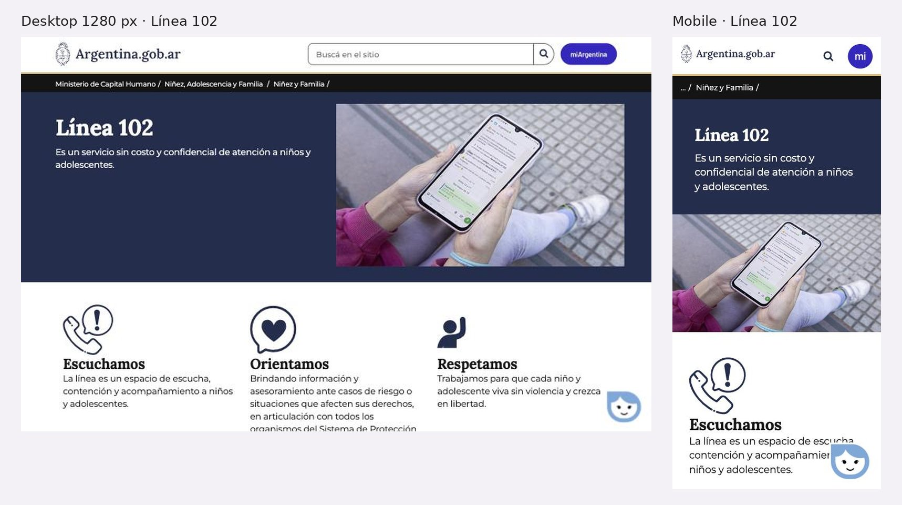

# 3.3.11 - Línea 102 (SENAF)

> Método: lectura de contenido con WebFetch (15 URLs intentadas en argentina.gob.ar, 5 de ellas PDF de la propia Línea 102). WebFetch devuelve un resumen del HTML, no la página renderizada. Durante la consulta, argentina.gob.ar limitó las solicitudes (HTTP 429): 4 páginas no se pudieron leer, entre ellas "Si sos niño" y "Si sos adolescente"; se indican en Fuentes como "no accesible (bloqueo)" y lo que dependía de ellas figura como "No verificable". Se suman datos de observación propia en el navegador del celular (2026-10-05), marcados como tales. Fecha de consulta: 2026-10-05. Referencias entre corchetes [n] = número en la sección Fuentes.

## Información general
- **Organización:** Línea 102, servicio de la Secretaría Nacional de Niñez, Adolescencia y Familia (SENAF), Ministerio de Capital Humano. Breadcrumb: "Inicio > Ministerio de Capital Humano > Niñez, Adolescencia y Familia > Niñez y Familia > Línea 102" [1]. Se presenta como "un servicio sin costo y confidencial de atención a niños y adolescentes" [1].
- **Tipo: Indirect competitor.** Justificación según las definiciones del certificado: es un **producto distinto** —un servicio telefónico de escucha, orientación e intervención atendido por "equipos especializados de cada provincia" [1]— para **la misma audiencia en el mismo mercado** (niñas, niños, adolescentes, familias, docentes y vecinos en Argentina) [1]. No es directo porque RPI no brinda asistencia: la 102 es uno de los servicios a los que RPI deriva. Por eso su relación con RPI es de **complemento**, no de rivalidad: compiten por la atención de las mismas personas en el momento de buscar ayuda, pero el éxito de RPI incluye que esas personas lleguen a la 102 (HECHO [1]; clasificación = INFERENCIA). Su interés para RPI es cómo explica a quién llamar y cómo les habla a niñas, niños y adolescentes.
- **Ubicación:** nacional; las llamadas las atienden los organismos de niñez de cada provincia [1][9].
- **Oferta:** línea telefónica 102 "de escucha y orientación gratuita y confidencial" [9]; derivación a áreas de niñez provinciales cuando no se puede comunicar [1][5]; materiales para talleres y guías para equipos [4][9][10][11]; informes de llamadas 2020–2022 [4][7][8].
- **Website:** https://www.argentina.gob.ar/capital-humano/familia/ninez-y-familia/linea-102 [1]. La subpágina Materiales cuelga de otra ruta: /capital-humano/familia/politicas-familiares/linea-102/materiales [4]. La URL anterior /capital-humano/familia/linea-102 da 404 (observación propia en el navegador; no accesible con WebFetch por bloqueo [14]).
- **Tamaño / alcance:** HECHO: 45.589 llamados entre octubre de 2020 y septiembre de 2021, con "veintitrés Líneas 102 habilitadas" [8]; 39.409 "llamadas pertinentes" en 2022, en 24 jurisdicciones ("la totalidad de las provincias del país") [7]. No hay datos posteriores a 2022 en Materiales (actualizada el 15 de mayo de 2024) [4].
- **Target audience:** "niños, adolescentes, familiares, docentes, vecinos" y "cualquier otra persona que tenga conocimiento o sospecha sobre una situación de vulneración de derechos" [1]; equipos de las líneas provinciales [10][11]; docentes y referentes comunitarios (guía de talleres) [9].
- **Unique value proposition:** INFERENCIA: ser el número nacional, gratuito y de tres dígitos para cualquier vulneración de derechos de NNyA, con atención local en cada provincia [1][7].
- **Otros datos de posicionamiento:** página publicada el 20 de mayo de 2020 y actualizada el 8 de septiembre de 2026 [1]. La guía de violencia digital nombra a Faro Digital como organización civil colaboradora [10].

## Arquitectura y navegación
- **Menú:** la página vive dentro del portal argentina.gob.ar, con header común (Mi Argentina, buscador, secciones temáticas) y footer ("Acerca de este sitio", "Términos y condiciones", "Sugerencias") [12]. No tiene menú propio [1].
- **Estructura de la página (encabezados, observación propia en el navegador y [1]):** "Si sos niño conocé más sobre tus derechos" · "Si sos adolescente conocé más sobre tus derechos" · "¿Quién puede llamar a la Línea 102?" · "¿Cómo funciona?" · "¿Qué hacer si no podés comunicarte?" · "¿A dónde llamar ante una emergencia?" · "Marco normativo" · "Áreas de niñez provinciales" · "Materiales" · "Otras líneas de atención ante situaciones de violencia" · "137".
- **Profundidad:** 1 página principal + 2 niveles: Materiales (6 PDF) [4] y Áreas de niñez provinciales (lista por provincia) [5]. Los accesos "Si sos niño" y "Si sos adolescente" salen a portales generales del Estado (/chicas-y-chicos y /adolescentes) [1].
- **¿Organiza por audiencia?** Parcial. Las dos primeras entradas son por edad ("Si sos niño…", "Si sos adolescente…") y "¿Quién puede llamar?" enumera públicos [1]. El resto se organiza por pregunta [1]. El contenido de las páginas por edad: No verificable (bloqueo [2][3]).
- **Buscador:** el del portal, en el header [12].
- **Inconsistencia de rutas:** la página principal está bajo "ninez-y-familia" y Materiales bajo "politicas-familiares" [1][4]; la URL vieja no redirige (observación propia en el navegador). OBSERVACIÓN: los cambios de estructura del ministerio rompen enlaces externos.

## User flows clave
1. **Saber si llamar y llamar.**
   - Pasos: la página responde en orden quién puede llamar, cómo funciona, qué hacer si no hay comunicación y qué hacer ante una emergencia [1]. Límite explícito: "La Línea 102 no es un servicio de emergencia"; ante una emergencia, 911 o el servicio de emergencias local [1].
   - Fricción principal: la página no tiene ningún enlace `tel:` (0) (observación propia en el navegador); el 102 y el 911 aparecen como texto [1]. En el celular, la persona no puede llamar con un toque desde la página del servicio (INFERENCIA).
   - No se informa horario ni otros canales (WhatsApp, chat) en la página [1]; el informe 2022 tampoco los menciona [7].
2. **Si no podés comunicarte → áreas provinciales.** "¿Qué hacer si no podés comunicarte?" remite a "Áreas de niñez provinciales" [1]. Esa página lista cada provincia con organismo, dirección, teléfonos como enlaces `tel:` y emails, sin horarios [5]. Ejemplo: Córdoba, "Secretaría de Niñez, Adolescencia y Familia", "(0351) 434-3456/3458/3459" [5]. Fricciones: lista larga sin buscador ni mapa [5]; algunos organismos publican correos de Gmail (por ejemplo, Buenos Aires y Tierra del Fuego) [5]; actualizada el 21 de noviembre de 2024 [5].
3. **Derivación a otra línea (137).** "Otras líneas de atención ante situaciones de violencia" enlaza a la página de la 137, no a una llamada [1]. La página de la 137 sí resuelve la acción: "Llamá a la Línea 137 opción 1" como enlace `tel:137` y "Escribinos por Whatsapp" [6]. Aclara que atiende "Violencia familiar o sexual y/o grooming", 24 horas los 365 días (opción 1) [6]. No explica cuándo llamar a la 102 y cuándo a la 137 [1][6].
4. **Niñas, niños y adolescentes.** Entradas "Si sos niño conocé más sobre tus derechos" y "Si sos adolescente conocé más sobre tus derechos" [1]. Destinos no accesibles (bloqueo): No verificable si hablan de la 102, con qué tono o con qué formatos [2][3]. Lo verificable está en los materiales: la guía de talleres (octubre de 2022) propone para chicas y chicos de hasta 11 años un video animado, el juego de escape "Derechos 1, 2, 3 ¡YA!" y actividades grupales [9]; los informes se titulan "Línea 102: la línea de chicas y chicos" [4].
5. **Materiales.** 6 PDF con "Descargar": 3 informes de llamadas (2020, 2020–2021, 2022) y 3 guías (talleres, violencia digital, atención con enfoque de derechos) [4]. Todos en español [4].
6. **Prensa, donación, empresas:** no aplican a un servicio estatal; no hay contacto de prensa en la página [1].
7. **Público internacional:** No. El portal no tiene selector de idioma ni versión en inglés [12]; los materiales no están en lenguas originarias, inglés ni lectura fácil [4].

## Contenido
- **Claridad:** alta. Estructura de preguntas que una persona se hace antes de llamar, en orden de uso [1]. El límite del servicio se dice sin rodeos: "La Línea 102 no es un servicio de emergencia" [1].
- **Tono con NNyA (en los materiales para equipos):** la guía de atención con enfoque de derechos (mayo de 2018) pide usar lenguaje "acorde a la edad y madurez", preguntas cotidianas con los más chicos ("¿Con quién vivís?, ¿Quién te lleva al colegio?"), preguntas directas con adolescentes ("¿Cómo crees que te puedo ayudar?"), evitar "menor", "princesa" o "mujercita", "No exija nombres reales" y "Pregúntele cómo quiere que se le nombre" [11]. La guía de violencia digital indica "Evitar juzgar prácticas digitales de chicas y chicos" y "Recordar que lo que sucede en Internet es real, así como sus efectos" [10].
- **Tono en la página pública:** voseo ("conocé", "podés") [1]. Los encabezados para NNyA usan solo masculino ("Si sos niño") [1], mientras que los materiales dicen "la línea de chicas y chicos" [4]. OBSERVACIÓN: inconsistencia de lenguaje entre página y materiales.
- **Confidencialidad:** la página dice "confidencial" [1]; la guía para equipos aclara que la confidencialidad "tiene límites ante la identificación de situaciones que atenten contra la vida" de una NNyA [11]. Esa aclaración no está en la página pública [1] (HECHO; relevancia = INFERENCIA).
- **CTAs (textuales):** "Si sos niño conocé más sobre tus derechos", "Si sos adolescente conocé más sobre tus derechos" [1]; "Descargar" [4]; en la 137: "Llamá a la Línea 137 opción 1", "Escribinos por Whatsapp" [6].
- **Impacto / transparencia:** informes de llamadas en PDF [4]. Cifras: 45.589 llamados (oct. 2020–sep. 2021), 18% de NNyA, 43% adultos del entorno afectivo o comunitario, 38% adultos de instituciones; 90 llamadas por violencia cibernética [8]. En 2022: 39.409 llamadas pertinentes; quienes llaman: 81,4% adultos (22.494) y 3,3% NNyA (900); "violencia cibernética" 0,3% [7]. **Inconsistencias:** (a) en el informe 2022, 22.494 personas = 81,4% implica una base de unas 27.600, no 39.409, así que los porcentajes parecen calculados sobre otra unidad [7]; (b) la proporción de NNyA que llaman cae de 18% (2020–2021) a 3,3% (2022) sin explicación en los resúmenes leídos [7][8]. No hay informes posteriores a 2022 [4].
- **Presencia en medios:** no aplica; No verificable desde estas páginas.

## Idiomas y accesibilidad (lo verificable desde el contenido)
- **Idiomas:** solo español, sin selector en el portal [12]; materiales solo en español [4].
- **Accesibilidad (señales en el contenido):** el portal tiene skip link "Pasar al contenido principal" en la home [12] (en la página de la 102 también está, según el DOM); `tel:` en Áreas provinciales [5] y en la 137 [6], pero 0 en la página de la 102 (observación propia en el navegador). Materiales solo en PDF [4].
- **Patrón de la página 404:** la página de error de argentina.gob.ar muestra un pedido de ayuda para encontrar a una niña desaparecida, con enlaces `tel:` a la línea 142 y a un 0800 (observación propia en el navegador). OBSERVACIÓN: la página de error tiene números tocables y la del servicio 102 no.
- **No verificable:** contraste, foco de teclado, lectores de pantalla, accesibilidad de los PDF, contenido de las páginas para niños y adolescentes [2][3].

## First impressions (capturas propias, 2026-10-05)
- **Primera impresión (OBSERVACIÓN):** banda azul con "Línea 102" y "Es un servicio sin costo y confidencial de atención a niños y adolescentes.", foto de manos con un celular (sin caras) y tres bloques: "Escuchamos", "Orientamos", "Respetamos". El número no aparece como botón para llamar en ninguna parte de la página. Abajo a la derecha hay un asistente flotante.
- **Claridad de la propuesta:** muy clara: qué es, que no cuesta y que es confidencial.
- **Jerarquía visual:** valores primero; quién puede llamar, cómo funciona y a dónde llamar ante una emergencia, más abajo.
- **Desktop — Good.** + Sistema de diseño de Argentina.gob.ar, buscador y migas de pan. − Tres bloques de valores antes de la información práctica.
- **Mobile — Okay.** + Legible, sin scroll horizontal, skip link. − El 102 no se puede tocar para llamar.

## Visual design
- **Branding / identidad — Good.** + Sistema de diseño del Estado, consistente con el resto de argentina.gob.ar.
- **Imágenes:** una foto que no expone a chicas ni chicos; íconos de línea.
- **Coherencia entre páginas:** alta; la de la 137 y la de áreas provinciales siguen el mismo sistema.
- **Relación diseño–audiencia:** el texto le habla a chicas y chicos ("Si sos niño…"), pero el diseño es institucional y el mismo que para adultos (INFERENCIA).

## Verificación técnica (JavaScript sobre el DOM, 2026-10-05)
| Chequeo | Resultado |
| --- | --- |
| `lang` | `es` |
| Skip link | Sí |
| Imágenes sin `alt` / con `alt` vacío | 0 / 1 de 3 |
| H1 | 2: "Presidencia de la Nación" y "Línea 102" |
| Enlaces `tel:` | **0** |
| Buscador | Sí |
| Zoom bloqueado | No |
| URL vieja (/capital-humano/familia/linea-102) | 404 sin redirección; la página 404 sí muestra teléfonos tocables (142 y 0800) |
| Salida rápida | No |

## Ratings finales
| Dimensión | Rating | Por qué |
| --- | --- | --- |
| Desktop | Good | Clara, ordenada, sistema consistente |
| Mobile | Okay | Legible, pero el número no se puede tocar |
| Navegación | Okay | Por audiencia (niño / adolescente) dentro de la página; URL vieja rota |
| User flow | Okay | Preguntas en orden de uso; llamar exige copiar el número |
| Accesibilidad | Okay | Skip link y estructura; dos H1 y sin `tel:` |
| Diseño visual | Good | Sistema del Estado |
| Contenido | Good | Explica a quién llamar y qué no es; datos hasta 2022 |

## Lentes del objetivo del audit
| Lente | ¿Lo resuelve? | Evidencia |
| --- | --- | --- |
| Navegación por audiencia | Parcial | "Si sos niño…" / "Si sos adolescente…" y "¿Quién puede llamar?"; destinos no verificables (bloqueo) [1][2][3] |
| Pedir ayuda / derivación | Parcial | Preguntas en orden de uso, límite "no es un servicio de emergencia" → 911, áreas provinciales con `tel:`; la página de la 102 no tiene ningún `tel:` [1][5]; observación propia |
| Impacto y credibilidad | Parcial | Informes de llamadas 2020–2022 en PDF, sin datos posteriores y con cifras inconsistentes [4][7][8] |
| Prensa | No | No aplica a un servicio estatal; sin contacto de prensa [1] |
| Internacional | No | Solo español; sin lenguas originarias ni lectura fácil [4][12] |

## Qué significa → qué decisión podría afectar
- La estructura "¿Quién puede llamar? / ¿Cómo funciona? / ¿Qué hacer si no podés comunicarte? / ¿A dónde llamar ante una emergencia?" es un guion probado para explicar a quién llamar → **afecta** el contenido de "Necesito ayuda" (lente 2; US-03).
- Ni la página oficial de la 102 permite llamar con un toque → **afecta** la regla de que todo número en el sitio de RPI sea `tel:` (lentes 2 y 5; US-01, US-02).
- La URL vieja de la 102 da 404 y no redirige → **afecta** cómo RPI enlaza a servicios oficiales: enlazar a la llamada (`tel:102`) más que a la página, y revisar los enlaces externos periódicamente (lente 2; US-02, US-20).
- La mayoría de quienes llaman son adultos (81,4% en 2022; 81% en 2020–2021) → **afecta** a quién le habla primero "Necesito ayuda": a la persona adulta (Laura), con una entrada propia para adolescentes (lente 2; US-03, US-04, US-12). (HECHO [7][8]; INFERENCIA)
- La violencia digital es una fracción mínima de las llamadas a la 102 (0,3% en 2022) y la 137 declara grooming 24 h → **afecta** la tabla de derivación por situación de RPI (grooming e imágenes íntimas → 137, Bajalo Ya!; otras vulneraciones → 102; peligro inmediato → 911), a validar con el equipo (lente 2; US-03, US-11, US-30). (HECHO [6][7]; INFERENCIA)
- Las pautas para hablar con NNyA están en guías internas en PDF, no en la página pública → **afecta** la oportunidad de RPI de traducir esas pautas a microtextos para Camila y para familias (US-04, US-12).

## Evidencia
Capturas: página de la Línea 102 en desktop (1280 px) y en mobile. Archivos: `evidencia/capturas/linea102_*.jpg` (hoja resumen: `evidencia/linea102_evidencia.jpg`).

## Ratings preliminares (solo contenido, antes de las capturas) (Needs work / Okay / Good / Outstanding, con + y −)
- **Content: Good.** + Preguntas en el orden en que una persona decide si llamar [1]; + límite del servicio explícito y derivación a 911 [1]; + pautas de lenguaje con NNyA muy concretas en los materiales [10][11]. − Sin horario ni canales alternativos en la página [1]; − "Si sos niño" solo en masculino [1]; − informes hasta 2022 y con cifras inconsistentes [4][7][8].
- **Interaction / Navigation: Okay.** + Página única, corta, con accesos por edad al principio [1]; + buscador del portal [12]. − Rutas inconsistentes (ninez-y-familia / politicas-familiares) y URL vieja sin redirección [1][4]; observación propia; − la 137 aparece como enlace a otra página y no como llamada [1].
- **User flow: Okay.** + Plan B claro si no hay comunicación, con teléfonos `tel:` por provincia [1][5]; + la página de la 137 resuelve llamar y escribir por WhatsApp en un toque [6]. − 0 enlaces `tel:` en la página de la 102 (observación propia en el navegador); − lista provincial sin buscador ni horarios [5]; − no explica cuándo conviene 102 y cuándo 137 [1][6].
- **Accessibility (preliminar): Okay.** + Skip link en el portal [12]; + `tel:` en páginas vecinas [5][6]. − Solo español, sin lenguas originarias ni lectura fácil, pese a ser un servicio para niñas y niños [4]; − materiales solo en PDF [4]. Contenido de las páginas para NNyA: No verificable (bloqueo [2][3]).

## Fortalezas
- Explica el servicio con preguntas reales y en orden de uso [1].
- Dice qué no es ("no es un servicio de emergencia") y a dónde ir en ese caso [1].
- Ofrece un plan B si la línea no responde: organismo de cada provincia con `tel:` [1][5].
- Entradas por edad al principio de la página [1].
- Materiales con pautas de lenguaje respetuosas con NNyA ("Pregúntele cómo quiere que se le nombre", "Evitar juzgar prácticas digitales") [10][11].
- Publica datos de llamadas por tipo de consultante y motivo [7][8].

## Debilidades
- Ningún enlace `tel:` en la página del propio servicio (observación propia en el navegador).
- Sin horario, sin WhatsApp ni chat [1][7].
- Rutas cambiadas sin redirección: la URL anterior da 404 (observación propia en el navegador) [1][4].
- No explica la diferencia entre 102 y 137 [1][6].
- Datos solo hasta 2022 y con inconsistencias [4][7][8].
- Solo español; sin lectura fácil ni lenguas originarias [4][12].
- Lenguaje en masculino en los accesos para NNyA [1].

## Patrones o ideas relevantes para Red por la Infancia
1. **Guion de cuatro preguntas para derivar** ("¿Quién puede llamar?", "¿Cómo funciona?", "¿Qué hacer si no podés comunicarte?", "¿A dónde llamar ante una emergencia?") → lente 2; plantilla para cada línea en "Necesito ayuda" (US-03). (HECHO [1])
2. **Decir el límite del servicio en una frase** ("no es un servicio de emergencia" → 911) → lente 2; equivalente para RPI: "No brindamos asistencia directa. Llamá a…" en la primera pantalla (US-03). (HECHO [1]; INFERENCIA)
3. **Plan B por provincia con teléfonos tocables** → lente 2; base para el "protocolo de derivación por provincia" que pide Dr. Javier, con buscador o selector de provincia que la página oficial no tiene (US-30, US-02). (HECHO [5]; INFERENCIA)
4. **Llamar y escribir en un toque, como la 137** (`tel:137` y WhatsApp) → lentes 2 y 5; todos los números del sitio de RPI como botones (US-01, US-02). Antipatrón opuesto: la página de la 102 sin `tel:`. (HECHO [6]; observación propia en el navegador)
5. **Accesos por edad al principio ("Si sos niño…", "Si sos adolescente…")** → lente 1; idea para "Necesito ayuda" con una entrada para adolescentes, en lenguaje inclusivo ("Si sos chica o chico…") (US-12, US-28, US-29). (HECHO [1]; INFERENCIA)
6. **Pautas de lenguaje con NNyA** (no juzgar prácticas digitales, no usar "menor", preguntar cómo quiere que se le nombre) → lente 2; criterio editorial para los textos de Bajalo Ya! y ReConectate adolescentes (US-12, US-04). (HECHO [10][11])
7. **Enlazar a la acción, no solo a la página oficial** → lente 2; las URL del Estado cambian (la vieja de la 102 da 404); RPI debería usar `tel:` y medir clics, y revisar enlaces externos (US-02, US-20). (Observación propia en el navegador; INFERENCIA)
8. **La página 404 como espacio de servicio público** (pedido de búsqueda con `tel:` a la 142 y a un 0800) → lentes 2 y 5; el 404 de RPI puede mostrar "Necesito ayuda" con los números tocables (US-01). (Observación propia en el navegador)
9. **Datos de quién llama para decidir a quién hablarle** (mayoría adultos) → lente 2; "Necesito ayuda" escrito primero para adultos que acompañan, con un camino propio para adolescentes (US-03, US-04, US-12). (HECHO [7][8]; INFERENCIA)
10. **Antipatrones a evitar:** materiales solo en PDF y solo en español, datos sin actualizar desde 2022, rutas que cambian sin redirección → lentes 3, 4 y 5 (US-10, US-17, US-26). (HECHO [4][7]; observación propia)

## Fuentes
Consultadas el 2026-10-05 con WebFetch, salvo la observación propia indicada.
1. https://www.argentina.gob.ar/capital-humano/familia/ninez-y-familia/linea-102 — Línea 102 (página principal)
2. https://www.argentina.gob.ar/chicas-y-chicos — "Si sos niño…" — no accesible (bloqueo, HTTP 429)
3. https://www.argentina.gob.ar/adolescentes — "Si sos adolescente…" — no accesible (bloqueo, HTTP 429)
4. https://www.argentina.gob.ar/capital-humano/familia/politicas-familiares/linea-102/materiales — Materiales
5. https://www.argentina.gob.ar/areas-de-ninez-provinciales — Áreas de niñez provinciales
6. https://www.argentina.gob.ar/justicia/violencia-familiar-sexual — Línea 137
7. https://www.argentina.gob.ar/sites/default/files/sennaf_-_informe_linea_102_enero_diciembre_2022.pdf — Informe de llamadas enero–diciembre 2022
8. https://www.argentina.gob.ar/sites/default/files/senaf_-_informe_de_llamadas_linea_102_22_dic_2021.pdf — Informe de llamadas octubre 2020–septiembre 2021
9. https://www.argentina.gob.ar/sites/default/files/senaf_dngi_linea_102_guia_para_talleres_oct_2022.pdf — Guía para talleres (octubre 2022)
10. https://www.argentina.gob.ar/sites/default/files/2020/09/dgdi_2021_linea102_guia-violencia-digital_0.pdf — Guía de actuación ante situaciones de violencia digital
11. https://www.argentina.gob.ar/sites/default/files/guia_de_atencion_con_enfoque_de_derechos.pdf — Guía de atención con enfoque de derechos (mayo 2018)
12. https://www.argentina.gob.ar/ — home del portal
13. https://www.argentina.gob.ar/capital-humano/familia/ninez-y-familia — Niñez y Familia — no accesible (bloqueo, HTTP 429)
14. https://www.argentina.gob.ar/capital-humano/familia/linea-102 — URL anterior — no accesible (bloqueo, HTTP 429); según observación propia en el navegador, da 404
15. https://www.argentina.gob.ar/justicia/violencia-familiar-sexual/grooming — no accesible (404)
- Observación propia en el navegador (celular), 2026-10-05: 0 enlaces `tel:` en la página de la 102, encabezados completos de la página, 404 de la URL anterior y contenido de la página 404 (sin datos de la persona buscada).
- Nota: los datos de contacto de organismos provinciales se citan solo como ejemplo de formato [5].

## Capturas

