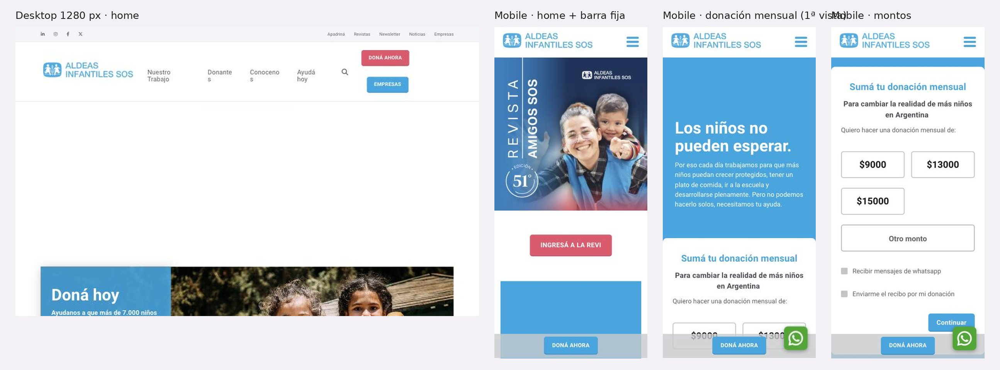

# 3.3.12 - Aldeas Infantiles SOS Argentina

> Método: lectura de contenido con WebFetch (resúmenes generados por la herramienta a partir del HTML). Se leyeron 19 páginas (dos más que el rango del brief, para cubrir los flujos de aumento y baja de la donación) y una URL dio 404. Varios elementos se cargan con JavaScript (montos del formulario mensual, barra fija, WhatsApp) y no aparecen en la extracción; para esos se usa la observación propia en el navegador del celular [21]. Fecha de consulta: 2026-10-05. Referencias entre corchetes [n] = número en la sección Fuentes. Se omiten a propósito nombres de personas que figuran en el sitio.

## Información general
- **Organización:** Aldeas Infantiles SOS Argentina, ONG que se presenta con la misión "Brindamos un entorno protector con amor, respeto y seguridad a niños, niñas y adolescentes" [10]. Parte de la federación internacional SOS Children's Villages (fundada en Austria en 1949); en Argentina desde 1979 [10].
- **Tipo: Indirect competitor.** Justificación según el brief: ofrece un **producto distinto** —cuidado alternativo, fortalecimiento familiar, centros educativos; es decir, **asistencia directa**— a **la misma audiencia que RPI busca como donante**: personas en Argentina que donan mensualmente o por única vez, empresas con RSE y personas que evalúan un legado [2][3][4][5][11]. Compite por los mismos donantes argentinos con argumentos equivalentes a los que necesita RPI: deducción de Ganancias ("deducibles del Impuesto a las Ganancias según el Art. 81 de la Ley N° 20.628") [2][3], auditoría externa y certificación [6]. Hay una superposición parcial de contenido con RPI: el ciclo "Hablemos de esto" tiene un episodio "Bullying, Ciberacoso y Grooming" [17] y en noticias publica sobre ESI y no violencia [9]. No alcanza para ser directo: no deriva a líneas de ayuda ni ofrece recursos de prevención de violencia digital como producto central [11][17] (HECHO [2][4][11][17]; clasificación = INFERENCIA).
- **Ubicación:** sede en Moreno 1850, 5° piso, CABA [1][10]; filiales en Oberá, Mar del Plata, Córdoba, Luján, Rosario, Mendoza y CABA [10][14].
- **Oferta:** 7 programas: Fortalecimiento Familiar y Desarrollo Comunitario, Cuidado Alternativo, Adolescentes y Jóvenes, Reintegro Familiar y Adopción, Desarrollo de Capacidades, Centros Educativos, Incidencia Pública [11]. Contenidos: revista "Amigos SOS", ciclo audiovisual "Hablemos de esto", guías descargables (cuidado residencial, crianza positiva) [15][17]. Donación mensual ("Amigo SOS"), única, padrinazgo de Espacios de Cuidado Diario, eventos solidarios, legados, empresas y campañas de emergencia [1][13].
- **Website:** https://www.aldeasinfantiles.org.ar (+ app/portal de donantes midonacion.aldeasinfantiles.org.ar mencionado en la página mensual) [1][2].
- **Tamaño / alcance:** HECHO con inconsistencia: "más de 7.000 niños" (home) [1] y "más de 7.000 participantes" (FAQ) [8]; "más de 7.400" niños y familias (página de baja) [12]; "más de 7500 niños" (empresas) [4] y ~7.500 participantes (donantes) [7]. Ninguna de estas cifras tiene año. Antigüedad: "más de 40 años" (FAQ) [8] y "46 años" (Conocenos) [10].
- **Target audience:** donantes individuales (sobre todo mensuales), donantes existentes (gestión de su aporte), empresas, personas que evalúan un legado, familias solidarias, equipos técnicos y garantes de derechos (Desarrollo de Capacidades), postulantes laborales [1][4][5][7][11].
- **Unique value proposition:** INFERENCIA: marca internacional reconocida + cuidado directo de chicos sin cuidado parental, con un argumento de confianza fuerte (auditoría de Grant Thornton, certificación Keeping Children Safe 2025-2028, miembro de RACI) [6]. Claim de la página mensual: "Los niños no pueden esperar" [2].
- **Otros datos de posicionamiento:** certificación Keeping Children Safe 2025-2028 repetida en el pie de las páginas de donación [2][3][5]; "El 100% de lo recaudado se destina a sostener los Programas" (FAQ) [8]; campaña de emergencia internacional activa: terremoto en Colombia (10 de agosto) [13].

## Arquitectura y navegación
- **Menú principal (4 ítems) [1]:** Nuestro Trabajo · Donantes · Conocenos · Ayudá hoy.
  - **Nuestro Trabajo:** Nuestros programas (7 programas como subítems) [1].
  - **Donantes:** Aumentá tu aporte · Actualizá tus datos · Dejá tu legado · Preguntas frecuentes [1].
  - **Conocenos:** Noticias · Nuestras Políticas · Nuestros contenidos [1].
  - **Ayudá hoy:** Doná mensualmente · Doná por única vez · Hacé un evento solidario · Apadriná un Espacio de Cuidado Diario [1].
- **Profundidad:** 3 niveles (menú > sección > programa o página de donación) (OBSERVACIÓN [1][11]).
- **¿Organiza por audiencia?** Parcialmente. "Donantes" es un ítem de menú dedicado al donante **existente** (gestionar, aumentar, legar) y "Ayudá hoy" al donante **nuevo** [1]. Esa separación por momento de la relación es poco común (OBSERVACIÓN). Empresas no está en el menú: se llega desde el bloque "Alianzas" de la home ("CONOCÉ MÁS") o desde el mapa del sitio [1][14]. No hay entradas para prensa, profesionales ni público internacional [1][14].
- **Mapa del sitio:** usa una etiqueta distinta al menú ("AYUDANOS" en lugar de "Ayudá hoy") e incluye "Memorias Anuales" y "Nuestra Historia", que no están en el menú principal [14].
- **Buscador:** No verificable (la extracción de la home no lo mencionó) [1].
- **Footer:** Doná Ahora · Actualizá tus Datos · Solicitá la Baja · Preguntas Frecuentes · Políticas de Privacidad · Mapa del Sitio · Trabaja con Nosotros; además "CERTIFICACION" y "Auditoría y transparencia"; redes (Facebook, Instagram, YouTube, LinkedIn, X) y WhatsApp [1].
- **Accesos persistentes:** barra fija abajo con "DONÁ AHORA" en todas las pantallas y botón flotante de WhatsApp (OBSERVACIÓN [21]); en el HTML aparecen enlaces wa.me con el texto "Hola" precargado [1].

## User flows clave
1. **Pedir ayuda / derivación — no existe.** HECHO: en programas, "Hablemos de esto" y políticas no aparecen 102, 137, 911 ni una ruta para pedir ayuda o denunciar [11][17][18]; el mapa del sitio no tiene "denunciar" [14]. El episodio sobre grooming [17] no enlaza a líneas de ayuda según la extracción. La política de Salvaguarda Infantil y Juvenil está como PDF, pero el canal de contacto que se muestra es el mail de donantes [18]. INFERENCIA: es coherente con su rol (el ingreso de chicos se hace con las autoridades de niñez [8]), pero deja sin salida a quien llega por un tema de violencia.
2. **Donación mensual ("Amigo SOS").** Pasos: barra fija "DONÁ AHORA" o Ayudá hoy > Doná mensualmente > /ayuda-hoy/amigo-sos ("Sumá tu donación mensual") > formulario [1][2][21]. Montos sugeridos: $9000, $13000 y $15000 más "otro monto" (OBSERVACIÓN [21]; la extracción de WebFetch no los muestra porque se cargan con JavaScript [2]). La página explica en general qué permite la donación ("Sostener espacios de cuidado diario... Brindar espacios de contención... Garantizar el acceso a la educación") [2], pero **ningún monto dice qué financia** (OBSERVACIÓN [21]). Señales de confianza: "Toda la información es transmitida de manera segura y encriptada", deducción por Art. 81 Ley 20.628, auditoría externa, certificación [2]. Fricción: en mobile la barra fija "DONÁ AHORA" tapa los botones de monto (OBSERVACIÓN [21]).
3. **Donación única.** Ayudá hoy > Doná por única vez > /ayuda-hoy/donacion-unica; CTA "Hacé tu donación por única vez hoy" [3]. Montos, campos y medios de pago: No verificables (no aparecen en la extracción) [3]. La campaña de emergencia (terremoto en Colombia) usa el CTA "Sumá tu donación por única vez", pero según la extracción el botón lleva a /ayuda-hoy/amigo-sos, la página de donación **mensual** [13]. Si se confirma en el navegador, es una inconsistencia entre el mensaje y el destino (INFERENCIA; verificar en capturas).
4. **Gestión del donante (aumentar, actualizar, baja).** Es el flujo más completo. Menú Donantes > "Aumentá tu aporte": formulario en el mismo sitio con aumentos sugeridos de $1.000, $1.500, $2.500, $3.000 y $5.000 + monto libre, tarjetas de crédito (9 marcas), Visa Débito y débito por CBU; CTA "Aumentá tu aporte hoy y ayudanos a llegar a más chicos." [19]. "Actualizá tus datos" permite cambiar contacto y medio de pago [7]. **Baja:** footer > "Solicitá la Baja" > página "BAJAS" con formulario; antes del formulario recuerda el impacto ("más de 7.400") y agradece ("Tu apoyo es muy importante para nosotros"); no ofrece pausar ni bajar el monto según la extracción [12]. Canales alternativos: teléfono 0810-345-0455, WhatsApp, mail de donantes y app "Mi Donacion" [2][7]. Fricción: las Preguntas frecuentes no responden cómo cancelar, cómo cambiar el monto ni cómo pedir el certificado para Ganancias [8].
5. **Empresas / RSE.** Home (bloque "Alianzas") > /ayuda-hoy/empresas: "Tu empresa puede ser parte", 8 modalidades (padrinazgo de programas, "Empresas SOS" mensual, donación a proyectos, voluntariado corporativo, empleabilidad juvenil con pasantías y talleres, sponsoreo de campañas, marketing con causa —redondeo solidario, co-branding— y donaciones en especie), deducción de Ganancias, logos de más de 40 empresas (Google, Microsoft, Philips, DHL, J.P. Morgan, Mercado Libre, Salesforce, Nissan, entre otras), CTA "QUIERO SUMARME", mail y teléfono específicos [4]. Fricción: no hay resultados por alianza ni casos con cifras [4]; Empresas no está en el menú principal [1].
6. **Legados.** Menú Donantes > "Dejá tu legado": "Potencia tu ayudá destinando los bienes que vos decidas" [5]. La página no explica pasos legales (testamento, escribano, tipos de bienes) según la extracción; deriva a teléfono, WhatsApp y mail [5].
7. **Impacto, transparencia y prensa.** Footer > "Auditoría y transparencia": Informe de Auditoría 2025 descargable (Grant Thornton), dos gráficos ("Informe Financiero" de ingresos e "Inversión en Desarrollo" de gastos), fuentes de recursos (donantes particulares, empresas, subsidios nacionales e internacionales) y formulario para deducción [6]. Memorias anuales: la página lista solo 2013 a 2019, en PDF [16], aunque "Nuestros contenidos" menciona una "Memoria Anual 2025" [15] (inconsistencia; verificar). Prensa: no hay sala de prensa [14]; solo un mail de comunicación en el contacto [1][9] y una sección Noticias con notas fechadas (9 entre el 21 de septiembre y el 4 de octubre, sin año visible en la extracción) [9].
8. **Público internacional.** No hay selector de idioma ni versión en inglés en la home ni en el mapa del sitio [1][14]. No se encontró un enlace a la federación internacional en las páginas leídas. La campaña de Colombia muestra que capta donantes argentinos para emergencias en otros países, no al revés [13].

## Contenido
- **Claridad:** alta en los flujos de donación (títulos con verbo en voseo: "Doná mensualmente", "Aumentá tu aporte", "Dejá tu legado") [1][19]; media en impacto: cifras sin año y repartidas en varias páginas [1][4][8][12].
- **Tono:** cálido y de urgencia en donación ("Los niños no pueden esperar") [2]; agradecido en la baja ("Tu apoyo es muy importante para nosotros") [12]; institucional y de derechos en programas ("Promovemos cambios políticos, sociales, económicos y culturales") [11].
- **Organización:** por programa (7) y por etapa del donante (nuevo / existente) [1][11].
- **Cantidad de información:** baja en programas (una frase por programa, sin cifras) [11]; alta en textos legales repetidos al pie de cada formulario (Ley 25.326, Art. 81) [2][3][5][12].
- **CTAs (textuales):** "DONÁ AHORA" (barra fija) [21], "Doná Ahora", "QUIERO SUMARME", "CONOCÉ MÁS", "Ver más noticias", "Ingresá a la revi[sta]", "Mirá todos los episodios", "¡SUMATE!", "Enviar mensaje" [1]; "Hacé tu donación por única vez hoy" [3]; "Sumá tu donación por única vez" [13]; "Aumentá tu aporte hoy y ayudanos a llegar a más chicos." [19]; "Solicitá la Baja" [1]; "Leer" (memorias) [16].
- **Impacto / transparencia:** fuerte en **credibilidad** (auditoría externa con informe descargable, certificación Keeping Children Safe 2025-2028, RACI, "100% de lo recaudado" a programas) [6][8]; débil en **resultados**: no hay cifras por programa ni con año [11], las memorias publicadas terminan en 2019 [16] y la cifra de alcance cambia según la página (7.000 / 7.400 / 7.500) [1][4][12]. El hero de la home es la tapa de la revista "Amigos SOS" (edición 51°) con el texto dentro de la imagen (OBSERVACIÓN [21]); la extracción confirma "banners con textos superpuestos" [1].
- **Presencia en medios / newsroom:** No hay sala de prensa, comunicados ni kit [14]. Hay contenido propio con valor para prensa (episodios con especialistas sobre grooming, infancia y medios) [17] y una revista institucional [15], pero no están presentados como recursos para periodistas.
- **Inconsistencias detectadas:** cifra de alcance (7.000 / 7.400 / 7.500, sin año) [1][4][8][12]; memorias 2013–2019 vs. mención de "Memoria Anual 2025" [15][16]; "Informe de Auditoría 2025" que, según "Nuestros contenidos", corresponde al ejercicio 2024 [6][15]; código postal de la sede distinto entre páginas (C1094ABB vs. C1037ACC) y dos teléfonos generales (0810-345-0455 y (011) 5352-2000) [1][10].

## Idiomas y accesibilidad (lo verificable desde el contenido)
- **Idiomas:** solo español; sin selector [1][14].
- **Accesibilidad (señales en el contenido):** meta viewport presente [1]. Según la extracción, no hay skip link; el DOM declara `lang="es-AR"` y bloquea el zoom (ver Verificación técnica) [1]. Hero con texto dentro de la imagen [1][21]. Memorias y políticas en PDF [16][18]. "Hablemos de esto": la extracción no menciona subtítulos ni transcripciones [17]. Textos legales largos al pie de cada formulario [2][12]. No se encontró declaración de accesibilidad [1][14].

## First impressions (capturas propias, 2026-10-05)
- **Primera impresión (OBSERVACIÓN):** en desktop, el header tiene dos botones, "DONÁ AHORA" y "EMPRESAS", y los ítems del menú se cortan a mitad de palabra en dos líneas ("Donante / s", "Conoceno / s"). El hero quedó vacío a los 5 s; debajo aparece "Doná hoy — Ayudanos a que más de 7.000 niños…". En nuestra vista emulada algunos heroes con animación o video no terminaron de cargar; se informa lo que se vio, sin asumir que siempre pasa. En mobile, el hero es la tapa de la revista "Amigos SOS" con el texto dentro de la imagen, y una barra fija "DONÁ AHORA" queda siempre abajo.
- **Claridad de la propuesta:** clara para donantes; poco clara sobre qué hace la organización en la primera pantalla mobile (una revista).
- **Jerarquía visual:** donar es la acción principal en todas las pantallas.
- **Desktop — Okay.** + Donante particular y empresa como dos accesos. − Menú con palabras cortadas; hero vacío.
- **Mobile — Okay.** + Barra fija de donación y WhatsApp siempre visibles; montos grandes y tocables. − Zoom bloqueado; en la primera vista de la donación mensual la barra fija tapa parte de los botones de monto; hero con texto en imagen.

## Visual design
- **Branding / identidad — Good.** + Celeste institucional y fotos de chicos con sus cuidadoras, consistente.
- **Imágenes:** fotos de chicos (con caras) y tapas de revista con texto incrustado.
- **Coherencia entre páginas:** alta en home y donación.
- **Relación diseño–audiencia:** diseñado para donantes; la familia que busca información no tiene un camino visible (INFERENCIA).

## Verificación técnica (JavaScript sobre el DOM, 2026-10-05)
| Chequeo | Resultado |
| --- | --- |
| `lang` | `es-AR` |
| Skip link | No |
| Imágenes sin `alt` / con `alt` vacío (home) | 0 / 12 de 28 |
| H1 en la home | 5, repetidos: "Doná hoy" ×2, "Alianzas" ×2 y uno vacío |
| Enlaces `tel:` | 0 |
| Enlaces a WhatsApp | 2 |
| Buscador | Sí |
| Zoom bloqueado | **Sí** |
| Salida rápida | No |

## Ratings finales
| Dimensión | Rating | Por qué |
| --- | --- | --- |
| Desktop | Okay | Accesos de donación claros; menú con palabras cortadas |
| Mobile | Okay | Barra fija útil que a veces tapa los montos; zoom bloqueado |
| Navegación | Okay | Separa donante nuevo, donante actual y empresas |
| User flow | Good | Donación mensual en pocos pasos, con baja visible |
| Accesibilidad | Needs work | H1 repetidos y vacíos, zoom bloqueado, texto en imágenes |
| Diseño visual | Good | Identidad sólida |
| Contenido | Okay | Credibilidad por terceros; cifras sin año y memorias hasta 2019 |

## Lentes del objetivo del audit
| Lente | ¿Lo resuelve? | Evidencia |
| --- | --- | --- |
| Navegación por audiencia | Parcial | Separa donante nuevo ("Ayudá hoy") y existente ("Donantes"); empresas fuera del menú; sin prensa ni profesionales [1][14] |
| Pedir ayuda / derivación | No | Sin 102/137/911 ni canal de denuncia, incluso en el episodio sobre grooming [11][17][18] |
| Impacto y credibilidad | Parcial | Auditoría Grant Thornton, Keeping Children Safe 2025-2028, RACI [6]; cifras de alcance sin año e inconsistentes, memorias hasta 2019 [1][12][16] |
| Prensa | No | Sin sala de prensa; solo mail de comunicación y Noticias [9][14] |
| Internacional | No | Solo español, sin selector [1][14] |
| Experiencia mobile | Parcial | Barra fija "DONÁ AHORA" y WhatsApp siempre visibles, pero la barra tapa los montos y el hero es una imagen con texto [21] |

## Qué significa → qué decisión podría afectar
- Separar "quiero empezar a donar" de "ya dono y quiero gestionar" (aumentar, actualizar, baja) ordena el menú del donante → **afecta** la sección para donantes de RPI (lente 1 y 3; US-14, US-15).
- Una barra fija de donación que tapa los botones de monto convierte la acción principal en un obstáculo → **afecta** las reglas de componentes fijos en mobile: dejar espacio inferior y no superponer CTAs (lente 5; US-01, US-14).
- La credibilidad se apoya en auditoría y certificación, no en resultados; las cifras sin año y las memorias viejas la debilitan → **afecta** cómo RPI presenta impacto: pocas cifras, siempre con año y una sola fuente (lente 3; US-15, US-32, US-33).
- Publicar contenido sobre grooming sin derivar a líneas de ayuda deja un hueco que RPI sí puede cubrir → **refuerza** "Necesito ayuda" como diferencial (lente 2; US-01, US-03).

## Evidencia
Capturas: home desktop (1280 px), home mobile con barra fija y dos vistas de la donación mensual en mobile. Archivos: `evidencia/capturas/aldeas_*.jpg` (hoja resumen: `evidencia/aldeas_evidencia.jpg`).

## Ratings preliminares (solo contenido, antes de las capturas) (Needs work / Okay / Good / Outstanding, con + y −)
- **Content: Okay.** + Señales de confianza claras y repetidas en cada formulario (auditoría, certificación, deducción de Ganancias) [2][3][6]; + 8 modalidades para empresas bien descriptas [4]. − Impacto sin año, cifras distintas según la página y sin datos por programa [1][4][11][12]; − memorias publicadas hasta 2019 [16]; − ningún monto dice qué financia [2][21]; − hero con texto en imagen [1][21].
- **Interaction / Navigation: Okay.** + Menú corto (4 ítems) con un ítem para el donante existente [1]; + "Solicitá la Baja" visible en el footer [1]; + barra fija de donación y WhatsApp [21]. − Empresas, memorias y transparencia fuera del menú principal [1][14]; − etiquetas distintas entre menú y mapa del sitio ("Ayudá hoy" / "AYUDANOS") [1][14]; − sin prensa ni idiomas [14].
- **User flow: Good.** + Cubre los cinco flujos de donación: mensual, única, empresas, legados y baja, más aumento de aporte y actualización de datos [2][3][4][5][7][12][19]; + aumento con montos sugeridos y varios medios de pago en el mismo sitio [19]. − La barra fija tapa los montos en mobile [21]; − la FAQ no responde preguntas de donantes (baja, certificado, cambio de monto) [8]; − la baja no ofrece alternativas (pausar o bajar el monto) [12]; − el CTA de donación única de la emergencia lleva a la página mensual según la extracción [13]; − legados sin pasos [5].
- **Accessibility (preliminar): Needs work.** + Meta viewport [1]; + teléfono, WhatsApp y mail como canales alternativos [2]. − Texto dentro de la imagen del hero [1][21]; − sin skip link según la extracción [1]; − solo español [1]; − memorias y políticas en PDF [16][18]; − sin evidencia de subtítulos en los videos [17]. Contraste, foco y lector de pantalla: No verificable con el contenido.

## Fortalezas
- Gestión completa del donante recurrente desde el menú y el footer: aumentar, actualizar datos, legado y baja [1][7][12][19].
- Aumento de aporte con montos sugeridos y 11 medios de pago en el mismo sitio [19].
- Propuesta para empresas con 8 modalidades, deducción de Ganancias, logos de más de 40 empresas y contacto específico [4].
- Transparencia verificable: informe de auditoría descargable, gráficos de ingresos y gastos, certificación externa vigente [6].
- Barra fija de donación y WhatsApp siempre visibles en mobile [21].
- Contenido audiovisual con especialistas sobre temas de agenda (grooming, ESI, infancia y medios) [17].

## Debilidades
- Ninguna derivación a ayuda ni canal de denuncia, aun publicando sobre grooming y violencia [9][17][18].
- Cifras de impacto sin año e inconsistentes; memorias hasta 2019 [1][4][12][16].
- Montos de donación sin resultado asociado [2][21].
- La barra fija tapa los botones de monto en mobile [21].
- Hero con texto dentro de la imagen [1][21].
- Sin sala de prensa ni versión en otros idiomas [14].
- FAQ pensada para el funcionamiento de las aldeas, no para las dudas del donante [8].

## Patrones o ideas relevantes para Red por la Infancia
1. **Menú "Donantes" para quien ya dona** (aumentar, actualizar datos, legado, FAQ) separado de "Ayudá hoy" para quien empieza → lente 1 y 3; US-14, US-15. Aplicable a escala RPI como dos bloques dentro de una sola sección "Sumate". (HECHO [1]; aplicabilidad = INFERENCIA)
2. **"Solicitá la Baja" en el footer** → lente 3 (confianza del donante recurrente); US-14. Mejora posible: ofrecer pausar o bajar el monto antes del formulario. (HECHO [1][12]; INFERENCIA)
3. **Página para empresas con modalidades concretas, logos y contacto propio** → lente 3; US-16. RPI puede adaptar 3–4 modalidades (capacitación a equipos, campañas, voluntariado, marketing con causa). (HECHO [4])
4. **Credibilidad por terceros (auditoría, certificación de salvaguarda, red de transparencia) al pie de cada formulario** → lente 3; US-15, US-32. Para RPI, una certificación de salvaguarda infantil es especialmente pertinente por su tema. (HECHO [2][6]; INFERENCIA)
5. **Antipatrón: cifras de impacto sin año y distintas en cada página, y memorias que terminan en 2019** → lente 3; US-15, US-32, US-33: definir una única fuente de cifras con año que alimente todas las páginas. (HECHO [1][4][12][16])
6. **Antipatrón: barra fija que tapa los controles del formulario** → lente 5; US-14. Si RPI usa una barra fija ("Necesito ayuda" / "Doná"), debe ocultarse o dejar espacio en formularios. (OBSERVACIÓN [21])
7. **Antipatrón: texto institucional dentro de la imagen del hero** → lente 5; US-06. (OBSERVACIÓN [1][21])
8. **Contenido sobre grooming sin derivación** → lente 2; US-01, US-03, US-11: RPI puede ser la organización que, además de hablar del tema, dice qué hacer y a qué línea llamar. (HECHO [17]; INFERENCIA)
9. **WhatsApp flotante con mensaje precargado** → lente 5; US-07. Para RPI conviene distinguir WhatsApp institucional de las líneas de ayuda para no generar expectativas de asistencia (INFERENCIA [1][21]).

## Fuentes
Consultadas el 2026-10-05 con WebFetch, salvo [21].
1. https://www.aldeasinfantiles.org.ar — home (consultada dos veces: estructura y lista de URLs)
2. https://www.aldeasinfantiles.org.ar/ayuda-hoy/amigo-sos — Doná mensualmente
3. https://www.aldeasinfantiles.org.ar/ayuda-hoy/donacion-unica — Doná por única vez
4. https://www.aldeasinfantiles.org.ar/ayuda-hoy/empresas — Empresas
5. https://www.aldeasinfantiles.org.ar/ayuda-hoy/legados — Legados
6. https://www.aldeasinfantiles.org.ar/conocenos/como-lo-hacemos/transparencia — Transparencia
7. https://www.aldeasinfantiles.org.ar/donantes — Donantes
8. https://www.aldeasinfantiles.org.ar/preguntas-frecuentes — Preguntas frecuentes
9. https://www.aldeasinfantiles.org.ar/comunidad/noticias — Noticias
10. https://www.aldeasinfantiles.org.ar/conocenos — Conocenos
11. https://www.aldeasinfantiles.org.ar/nuestro-trabajo/programas — Nuestros programas
12. https://www.aldeasinfantiles.org.ar/donantes/baja — Bajas
13. https://www.aldeasinfantiles.org.ar/ayuda-hoy/terremoto-colombia — campaña de emergencia
14. https://www.aldeasinfantiles.org.ar/mapadelsitio — Mapa del sitio
15. https://www.aldeasinfantiles.org.ar/conocenos/nuestros-contenidos — Nuestros contenidos
16. https://www.aldeasinfantiles.org.ar/conocenos/nuestros-contenidos/memorias-anuales — Memorias anuales
17. https://www.aldeasinfantiles.org.ar/conocenos/nuestros-contenidos/hablemosdeesto — Hablemos de esto
18. https://www.aldeasinfantiles.org.ar/conocenos/como-lo-hacemos/nuestras-politicas — Nuestras políticas
19. https://www.aldeasinfantiles.org.ar/ayuda-hoy/aumenta-tu-aporte — Aumentá tu aporte
20. https://www.aldeasinfantiles.org.ar/nuestro-trabajo/nuestros-programas — no accesible (404); la URL correcta es [11]
21. Observación propia en el navegador (celular, 2026-10-05): barra fija "DONÁ AHORA", hero con la tapa de la revista "Amigos SOS" (edición 51°), encabezados de la home, montos $9000 / $13000 / $15000 + "otro monto" en /ayuda-hoy/amigo-sos, barra que tapa los montos, botón flotante de WhatsApp, rutas /donantes, /ayuda-hoy/donacion-unica y campaña de emergencia.

## Capturas

