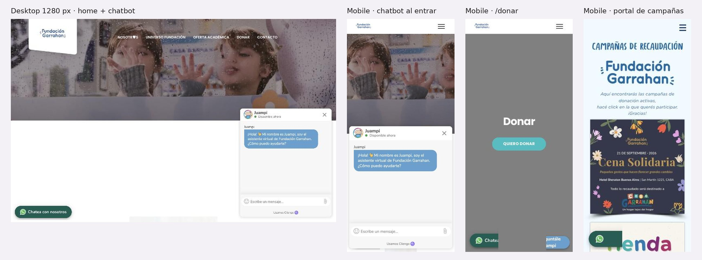

# 3.3.13 - Fundación Garrahan

> Método: lectura de contenido con WebFetch (resúmenes generados por la herramienta a partir del HTML). Se leyeron 14 páginas; 2 quedaron bloqueadas por límite de solicitudes del proxy (HTTP 429) y 1 dio 404. Varios elementos se cargan con JavaScript o están dentro de imágenes (chatbot, montos de los botones, banners de campañas) y no aparecen en la extracción; para esos se usa la observación propia en el navegador del celular [18]. Fecha de consulta: 2026-10-05. Referencias entre corchetes [n] = número en la sección Fuentes. Se omiten a propósito nombres y mails personales que figuran en el sitio.

## Información general
- **Organización:** Fundación Garrahan, institución sin fines de lucro vinculada al Hospital de Pediatría Garrahan; "Desde 1988, trabajando por la salud de los niños de Argentina" [3]. Alienta "las tareas de docencia e investigación, capacitación en recursos humanos y educación continua" [5].
- **Tipo: Indirect competitor.** Justificación según el brief: ofrece un **producto distinto** —apoyo a la salud pediátrica: equipamiento y obras para el hospital, alojamiento de familias (Casa Garrahan), capacitación de profesionales, reciclado— a **la misma audiencia donante que RPI**: personas en Argentina que donan por única vez o mensualmente ("Hacete Amig💙"), empresas (relaciones institucionales, sponsoreo, alianzas de RSE) y asistentes a eventos solidarios [2][3][12][14]. Es una de las marcas solidarias más visibles del país (la cena 2026 tuvo 500 invitados y cobertura en Clarín, Infobae, La Nación y TN) [11], por lo que compite por la atención de los mismos donantes y empresas. No es directo: no trabaja prevención de violencias ni deriva a líneas de ayuda [7]; el único punto de contacto temático son talleres para familias alojadas que abordan violencia de género y salud sexual [8] (HECHO [2][7][8][11][14]; clasificación = INFERENCIA).
- **Ubicación:** CABA. Oficinas en Combate de los Pozos 1881, 2° piso [3]; Casa Garrahan en Pichincha 1731 [8]; programa de reciclado en Av. Amancio Alcorta 2690 [9].
- **Oferta:** Casa Garrahan ("hogar lejos del hogar", 43 habitaciones, abierta el 25 de marzo de 1997) [8]; aportes al hospital (remodelación de áreas como "Centro quirúrgico", "Sala de Terapia de Quemados", "Centro de Simulación") [10]; capacitación, investigación y Programa de Simulación [5]; Programa de Reciclado y Medio Ambiente (papel desde 1999, tapitas desde 2006, llaves de bronce desde 2008, latas desde 2018) [9]; editorial (Revista Medicina Infantil y Revista Fundación Garrahan) [5][6]; Tienda Solidaria en Mercado Libre [1]; eventos [1][11].
- **Website:** https://fundaciongarrahan.org.ar (institucional) + https://www.donaciones.fundaciongarrahan.org (portal de donaciones, otro dominio) + pagos en Mercado Pago (mpago.la), PayPal, tienda en Mercado Libre, portalgarrahan.org.ar y eventosfundaciongarrahan.com [1][2][3][13].
- **Tamaño / alcance:** "38 años comprometid♥s" (home, 2026) [1]; "27º Aniversario" del Programa de Reciclado (2026) [1]; más de 350 oficinas de comunicación a distancia en el país (sin año) [12]; Casa Garrahan: 43 habitaciones y ampliación en curso con 7 nuevas habitaciones [8][12]. Las cifras que aparecen en "Aportes al Hospital" son **del hospital, no de la fundación** ("633.293 consultas", "9.999 cirugías", "115 trasplantes", "más de 4.200 personas") y no tienen año [10]. Los contadores de Casa Garrahan salen en cero en la extracción (probablemente animados con JavaScript): No verificable [8].
- **Target audience:** donantes individuales; empresas e instituciones; asistentes a eventos; profesionales de la salud (oferta académica, simulación, portal); familias de pacientes alojadas en Casa Garrahan; escuelas, empresas y vecinos que reciclan; voluntarios [1][5][8][9][14].
- **Unique value proposition:** INFERENCIA: el vínculo directo con el hospital pediátrico de referencia del país; la donación se asocia a un lugar concreto y conocido. Claim del portal: "Desde 1988, trabajando por la salud de los niños de Argentina" [3].
- **Otros datos de posicionamiento:** certificación ISO 9001:2015 mencionada en Casa Garrahan [8]; documento "Data Fiscal" descargable en el portal [3]; programa de reciclado con instrucciones detalladas y alto valor educativo [9].

## Arquitectura y navegación
- **Menú principal (5 ítems) [1][2]:** Nosotr♥︎s · Universo Fundación · Oferta académica · Donar · Contacto (en el celular se ven en mayúsculas: NOSOTR♥︎S, UNIVERSO FUNDACIÓN, OFERTA ACADÉMICA, DONAR, CONTACTO [18]).
  - **Universo Fundación:** 13 áreas enlazadas sin descripción: Casa Garrahan, Aportes al Hospital, Capacitación e Investigación, Simulación, Reciclado y Medioambiente, Editorial, Portal Garrahan, Relaciones Institucionales, Colaborativos de Asistencia, Comunicación y Prensa, Organización de Eventos, Observatorio, Tienda Solidaria [7].
- **Home (encabezados):** "NOSOTROS", "UNIVERSO FUNDACIÓN", "OFERTA ACADÉMICA", "¿CÓMO DONAR?", "Tienda Solidaria", "38 años comprometid♥s", "Hacete amig♥ de Fundación Garrahan", "Seguí nuestra campaña en las redes", "EVENTOS", "CAMPAÑAS", "LOGROS" [1].
- **Profundidad:** 3 niveles en el sitio (menú > Universo > área) más saltos a otros dominios para donar, comprar o ver eventos (OBSERVACIÓN [1][2][7]).
- **¿Organiza por audiencia?** No. El menú es institucional ("Nosotr♥︎s", "Universo Fundación") con una sola entrada por público: "Oferta académica" (profesionales de la salud) [1]. Empresas y prensa quedan como áreas dentro de "Universo Fundación" [7].
- **Portal de donaciones (otro dominio):** menú propio: Campañas de Recaudación · Tienda Solidaria · Fundación Garrahan · Más [3].
- **Buscador:** No verificable (no aparece en la extracción) [1].
- **Footer:** redes (Facebook, X, Instagram, LinkedIn) [1]; teléfono y mail institucionales no aparecen en la home según la extracción [1]. La página Contacto no se pudo leer (bloqueo) [16].
- **Accesos persistentes:** botón flotante de WhatsApp y chatbot "Juampi" (asistente virtual) que se abre solo al entrar en mobile y tapa media pantalla (OBSERVACIÓN [18]; la extracción no lo detecta porque se carga con JavaScript [1]).

## User flows clave
1. **Pedir ayuda / derivación — no existe.** HECHO: "Universo Fundación" no tiene referencias a violencia, maltrato, abuso ni a 102, 137 o 911 [7]. Es coherente con su rol (salud pediátrica), pero confirma que ninguna de las marcas solidarias de niñez más visibles cubre la derivación (INFERENCIA).
2. **Donación única.** Menú "DONAR" > /donar/: según la observación, cinco secciones tituladas igual ("Donar") con cinco botones iguales "QUIERO DONAR" [18]. La extracción muestra un solo párrafo ("tu aporte es muy importante para que podamos continuar con nuestra misión como Institución") y botones sin texto que llevan a 5 links distintos de Mercado Pago (mpago.la), uno de suscripción, uno a transferencia, uno a "Together", "Otras formas" y el portal [2]. Los montos no están en el texto de la página: si existen, están dentro de imágenes (OBSERVACIÓN [2][12][18]). Fricción: quien dona no puede distinguir las opciones sin abrir cada una; un lector de pantalla tampoco (INFERENCIA [2][18]). No hay mensaje de qué financia cada monto [2][12].
3. **Donación mensual ("Hacete Amig💙").** Home ("Hacete amig♥ de Fundación Garrahan") o portal > /haceteamigo > botones con imágenes que llevan a Mercado Pago (única o suscripción), transferencia o débito en dólares [12]. La página explica en general qué se financia (capacitación, investigación, Casa Garrahan con 7 nuevas habitaciones, oficinas de comunicación a distancia, hospitales Elizalde y Gutiérrez) [12]. Aviso útil: "recordá que en tu resumen figurará el débito como www.mercadopago.com.ar" [12]. **Cancelación o cambio de monto: No verificable**; no hay instrucciones en las páginas leídas [2][12]; INFERENCIA: se gestionaría desde la cuenta de Mercado Pago, fuera del sitio.
4. **Campañas en el portal.** donaciones.fundaciongarrahan.org > "Campañas de Recaudación": tres banners (Cena 2026, Tienda Solidaria, Haciéndome Amigo) con el pedido "hacé click en la que querés participar. ¡Gracias!" [3]. Las campañas son imágenes con el texto adentro (OBSERVACIÓN [18]). La "Cena Solidaria" ya ocurrió y sigue publicada como campaña activa [3][11][18]. Inconsistencia de fecha: el banner dice 21 de septiembre de 2026 (OBSERVACIÓN [18]) y la noticia dice que la cena se hizo el 22 de septiembre de 2026 (HECHO [11]); verificar en capturas.
5. **Empresas / RSE.** Universo Fundación > Relaciones Institucionales: texto general ("Generamos alianzas que se sostienen y van creciendo, a través del trabajo conjunto"), cuatro vías (donaciones, eventos, sponsoreo, alianzas de RSE) y un teléfono [14]. No hay modalidades con detalle, beneficios fiscales, empresas aliadas nombradas ni resultados en la extracción [14]. El reciclado también funciona como vía de participación para empresas y escuelas [9].
6. **Legados.** Donar > "Otras formas" > Legados / Especies / Eventos [4]. La página /legados no fue accesible (bloqueo) [15]: contenido **No verificable**.
7. **Impacto, transparencia y prensa.** No se encontró memoria, balance ni estados contables: "Aportes al Hospital" no tiene documentos descargables [10] y /transparencia da 404 [17]. Lo único financiero es el documento "Data Fiscal" del portal [3]. "LOGROS" es un encabezado de la home, pero su contenido no aparece en la extracción [1]. Prensa: página "Comunicación y Prensa" (dentro de Universo) con objetivo ("dar a conocer a la comunidad todas las acciones de nuestra institución"), contactos con nombre por tipo de evento (social, científico, portal, profesionales de la salud), contacto para manual de marca y la Revista Fundación Garrahan (24 números; el último, julio de 2026) [6]. No hay comunicados fechados ni notas en medios en esa página [6]; las menciones en medios aparecen solo dentro de una noticia [11].
8. **Público internacional.** No hay selector de idioma [1]. La única página en inglés encontrada es /together, una campaña de COVID-19 con PayPal ("From Fundación Garrahan, we are committed to collaborate against the advance of the Coronavirus (COVID-19)"; "those who have been with us for more than 32 years") [13]. Por la antigüedad que menciona (32 años desde 1988) es de 2020 y sigue enlazada desde /donar (INFERENCIA [2][13]).

## Contenido
- **Claridad:** alta en Reciclado (qué se recibe, qué no y por qué, con ejemplos literales: "Papel blanco o de color (impreso en negro o color, con o sin ganchitos), sobres de todo tipo") [9] y en Casa Garrahan [8]. Baja en Donar: títulos repetidos y botones sin texto [2][18]. Universo lista 13 áreas sin explicar ninguna [7].
- **Tono:** afectivo y cercano, con corazones en lugar de letras ("Nosotr♥︎s", "comprometid♥s", "Hacete amig♥", "Hacete Amig💙") [1][12]; institucional en Nosotros [5].
- **Organización:** por áreas institucionales [1][7]. La donación está repartida entre el sitio, el portal, Mercado Pago, PayPal y Mercado Libre [2][3][13].
- **Cantidad de información:** baja en impacto y en empresas [10][14]; alta en reciclado y en estructura interna (organigrama por cargos) [5][9].
- **CTAs (textuales):** "QUIERO DONAR" (×5 en /donar) [18], "Hacer una donación", "Ver más", "Conocer", "Ver modalidad", "Ir a Tienda" [1]; "Otras formas" [2]; "hacé click en la que querés participar. ¡Gracias!" [3]; "Click on the button to be taken to PayPal" [13].
- **Impacto / transparencia:** débil. Las cifras visibles son del hospital y sin año [10]; los contadores de Casa Garrahan no muestran valores en la extracción [8]; no hay memoria ni balance publicados en las páginas leídas [10][17]. La credibilidad se apoya en la marca del hospital, la antigüedad (38 años) [1], la ISO 9001:2015 de Casa Garrahan [8] y la "Data Fiscal" [3].
- **Presencia en medios / newsroom:** alta en la realidad (cobertura de la cena en Clarín, Infobae, La Nación y TN) [11] pero no capitalizada en el sitio: no hay sección "en los medios", comunicados ni kit de prensa; la página de prensa es un organigrama de contactos más la revista [6].
- **Inconsistencias detectadas:** fecha de la cena (21 vs. 22 de septiembre de 2026) [11][18]; campaña vencida publicada como activa [3][11]; página en inglés de 2020 aún enlazada [2][13]; un mismo mail personal figura como contacto para cuatro tipos de consulta de prensa [6].

## Idiomas y accesibilidad (lo verificable desde el contenido)
- **Idiomas:** español; sin selector. Una página aislada en inglés de la campaña COVID-19 [1][13].
- **Accesibilidad (señales en el contenido):** meta viewport presente [1]. No hay skip link; la extracción no encontró `lang`, pero el DOM sí declara `lang="es"` (ver Verificación técnica) [1]. Corazones y emojis en lugar de letras en el menú y los títulos ("Nosotr♥︎s", "Amig💙"): un lector de pantalla los lee como símbolos y no como "o" (INFERENCIA [1][12]). Botones de donación sin texto (montos en imágenes) [2][12] y campañas como imágenes con texto [18]. Chatbot que se abre solo y tapa media pantalla en mobile [18]. No se encontró declaración de accesibilidad [1].

## First impressions (capturas propias, 2026-10-05)
- **Primera impresión (OBSERVACIÓN):** foto de dos chicos detrás de un vidrio con gotas. Al entrar se abre solo el chatbot "Juampi" ("¡Hola! 👋 Mi nombre es Juampi, soy el asistente virtual de Fundación Garrahan."), que en mobile tapa la mitad de la pantalla y en desktop un tercio; además hay un botón de WhatsApp "Chatea con nosotros". Debajo del hero, en desktop, quedó un espacio en blanco.
- **/donar (mobile):** fondo gris, "Donar" y un botón "QUIERO DONAR"; la página repite ese bloque cinco veces, sin montos en texto. Los dos widgets flotantes se superponen abajo.
- **Portal de campañas (mobile):** piezas gráficas con el texto dentro de la imagen; la primera es la "Cena Solidaria" del 21 de septiembre de 2026, ya pasada.
- **Desktop — Needs work.** + Menú corto con DONAR. − Chatbot automático y espacio vacío bajo el hero.
- **Mobile — Needs work.** − El chatbot tapa media pantalla al entrar; dos widgets superpuestos; donación sin montos ni explicación en texto.

## Visual design
- **Branding / identidad — Okay.** + Marca reconocida y tipografía amable. − Etiquetas con símbolos ("NOSOTR♥︎S") y piezas de campaña con estilos distintos.
- **Imágenes:** fotos de chicos con caras; piezas gráficas con texto incrustado.
- **Coherencia entre páginas:** baja entre el sitio, el portal de donaciones y Mercado Pago.
- **Relación diseño–audiencia:** donantes y público general; la emoción de la foto reemplaza a la información (INFERENCIA).

## Verificación técnica (JavaScript sobre el DOM, 2026-10-05)
| Chequeo | Resultado |
| --- | --- |
| `lang` | `es` |
| Skip link | No |
| Imágenes sin `alt` / con `alt` vacío (home) | 0 / 1 de 17 |
| H1 en la home | Ninguno |
| Enlaces `tel:` | 0 |
| Buscador | No |
| Chatbot al entrar | Se abre solo (Cliengo) |
| Alto del documento | 812 px: el scroll ocurre dentro de un contenedor, no en la página |
| Salida rápida | No |

## Ratings finales
| Dimensión | Rating | Por qué |
| --- | --- | --- |
| Desktop | Needs work | Chatbot automático y huecos vacíos |
| Mobile | Needs work | Chatbot tapa media pantalla; widgets superpuestos |
| Navegación | Needs work | Institucional, con etiquetas simbólicas |
| User flow | Needs work | Cinco botones iguales; donación repartida en 5 plataformas |
| Accesibilidad | Needs work | Sin H1 ni skip link; montos solo en imágenes |
| Diseño visual | Okay | Marca fuerte, piezas inconsistentes |
| Contenido | Okay | Sin memoria; campañas vencidas publicadas |

## Lentes del objetivo del audit
| Lente | ¿Lo resuelve? | Evidencia |
| --- | --- | --- |
| Navegación por audiencia | No | Menú institucional; solo "Oferta académica" apunta a un público; empresas y prensa dentro de "Universo Fundación" [1][7] |
| Pedir ayuda / derivación | No | Sin referencias a violencia ni a 102/137/911 [7] |
| Impacto y credibilidad | Parcial | Marca, 38 años, ISO 9001:2015 y "Data Fiscal" [1][3][8]; sin memoria ni balance, cifras del hospital sin año, /transparencia 404 [10][17] |
| Prensa | Parcial | Página con contactos por tipo de evento y revista (24 números, julio 2026); sin comunicados ni notas en medios [6] |
| Internacional | No | Sin selector; única página en inglés es una campaña COVID-19 de 2020 [1][13] |
| Experiencia mobile | No | Chatbot que se abre solo y tapa media pantalla; botones "QUIERO DONAR" idénticos; campañas en imágenes con texto [18] |

## Qué significa → qué decisión podría afectar
- Un chatbot que se abre solo tapa el contenido justo cuando la persona llega → **afecta** la regla de RPI de no interrumpir rutas críticas con elementos que se abren solos (lente 5 y 2; US-01, US-13).
- Cinco botones iguales bajo cinco títulos iguales no permiten elegir → **afecta** el diseño del formulario de donación: montos como texto, con etiqueta y resultado (lente 3 y 5; US-14, US-15).
- Una marca con mucha cobertura en medios que no la muestra en el sitio pierde credibilidad ante financiadores → **afecta** la sala de prensa y la sección "en los medios" de RPI (lente 3; US-31, US-32).
- Campañas vencidas y una página COVID-19 todavía enlazadas muestran el costo de no tener fecha de baja en el contenido → **afecta** el modelo de contenido: campañas con fecha de fin y despublicación (lente 3; US-19, US-33).
- La única página en otro idioma está desactualizada → **afecta** la estrategia de idiomas: pocas páginas clave en inglés, pero mantenidas (lente 4; US-22, US-23).

## Evidencia
Capturas: home desktop (1280 px) con chatbot, home mobile con chatbot, /donar mobile y portal de campañas mobile. Archivos: `evidencia/capturas/garrahan_*.jpg` (hoja resumen: `evidencia/garrahan_evidencia.jpg`).

## Ratings preliminares (solo contenido, antes de las capturas) (Needs work / Okay / Good / Outstanding, con + y −)
- **Content: Okay.** + Reciclado y Casa Garrahan explicados con detalle y ejemplos concretos [8][9]; + revista institucional al día (julio 2026) [6]; + tono cercano [1]. − Sin memoria, balance ni cifras propias con año [10][17]; − montos de donación y campañas como imágenes [12][18]; − contenido vencido publicado (cena, COVID-19) [3][13]; − Universo lista 13 áreas sin descripción [7].
- **Interaction / Navigation: Needs work.** + Menú corto (5 ítems) con Donar y Contacto visibles [1]. − Etiquetas poco descriptivas ("Universo Fundación") y con símbolos ("Nosotr♥︎s") [1]; − donación repartida en 5 dominios o plataformas (sitio, portal, Mercado Pago, PayPal, Mercado Libre) [2][3][13]; − empresas y prensa escondidas dentro de Universo [7]; − /transparencia 404 [17].
- **User flow: Needs work.** + Muchas vías de aporte: única, mensual, transferencia, dólares, tienda, reciclado, especies, eventos [2][4][9][12]; + aviso de cómo figura el débito en el resumen [12]. − /donar con cinco secciones y cinco botones iguales [2][18]; − sin instrucciones para cancelar o cambiar la donación mensual [12]; − empresas sin modalidades ni contacto específico más allá de un teléfono [14]; − legados no verificable [15]; − campaña vencida en el portal [3][11].
- **Accessibility (preliminar): Needs work.** + Meta viewport [1]. − Sin skip link (confirmado en el DOM) [1]; − símbolos en lugar de letras en el menú [1]; − botones sin texto y montos en imágenes [2][12]; − chatbot que se abre solo en mobile [18]; − solo español [1]. Contraste, foco y lector de pantalla: No verificable con el contenido.

## Fortalezas
- Diversidad de vías de aporte, incluidas opciones sin dinero (reciclado de papel, tapitas, llaves, latas) con instrucciones claras [9].
- Donación en dólares y vía PayPal para quien está afuera, aunque presentada en una página vieja [12][13].
- Aviso de cómo aparece el débito en el resumen de la tarjeta (reduce desconocimientos y contracargos) [12].
- Contactos de prensa separados por tipo de consulta y revista institucional actualizada [6].
- Eventos con alta convocatoria y cobertura en medios nacionales [11].

## Debilidades
- Sin transparencia financiera publicada: ni memoria ni balance; /transparencia 404 [10][17].
- Flujo de donación confuso: títulos repetidos, botones idénticos, montos en imágenes [2][12][18].
- Donación fragmentada en varios dominios y plataformas [2][3][13].
- Sin información para cancelar o modificar la donación mensual [12].
- Contenido vencido publicado (Cena 2026, campaña COVID-19 en inglés) [3][11][13].
- Chatbot intrusivo en mobile [18].
- Sin navegación por audiencia; empresas y prensa poco visibles [1][7].

## Patrones o ideas relevantes para Red por la Infancia
1. **Antipatrón: chatbot o pop-up que se abre solo en mobile** → lente 5 y 2; US-01, US-13: en RPI ningún elemento debe abrirse solo sobre "Necesito ayuda" ni sobre Bajalo Ya!. (OBSERVACIÓN [18])
2. **Antipatrón: botones de donación idénticos con el monto dentro de una imagen** → lente 3 y 5; US-06, US-14, US-15: montos como texto, cada uno con su resultado y una sola página de donación. (OBSERVACIÓN [2][12][18])
3. **"En tu resumen figurará el débito como…"** → lente 3; US-14: un microtexto simple que da confianza al donante mensual; aplicable en el formulario de RPI. (HECHO [12])
4. **Participación sin dinero con instrucciones claras (reciclado)** → lente 1 y 3; US-16: RPI puede ofrecer a escuelas y empresas una forma de sumarse sin donar (por ejemplo, talleres o difusión de campañas). (HECHO [9]; INFERENCIA)
5. **Contactos de prensa por tipo de consulta** → lente 3; US-31: idea aprovechable, pero con un mail institucional (prensa@) en vez de mails personales. (HECHO [6]; INFERENCIA)
6. **Antipatrón: cobertura en medios que no se muestra en el sitio** → lente 3; US-32: RPI debería tener "RxI en los medios" con fecha y medio. (HECHO [11][6])
7. **Antipatrón: contenido sin fecha de baja (campaña vencida, página COVID-19)** → lente 3 y 4; US-19, US-33: las plantillas de campaña de RPI deberían tener fecha de fin y despublicación automática. (HECHO [3][11][13])
8. **Antipatrón: símbolos en lugar de letras en el menú ("Nosotr♥︎s")** → lente 1 y accesibilidad; US-29: etiquetas de menú en texto plano y descriptivo. (HECHO [1]; INFERENCIA sobre lectores de pantalla)
9. **Opción de donar en dólares para quien está afuera** → lente 4; US-24, US-25: con 31% de usuarios fuera de Argentina, RPI necesita una vía de aporte internacional en inglés y actualizada. (HECHO [12][13]; INFERENCIA)

## Fuentes
Consultadas el 2026-10-05 con WebFetch, salvo [18].
1. https://fundaciongarrahan.org.ar — home (consultada dos veces: estructura y lista de URLs)
2. https://fundaciongarrahan.org.ar/donar/ — Donar (consultada dos veces: resumen y transcripción de botones)
3. https://www.donaciones.fundaciongarrahan.org — portal de donaciones
4. https://fundaciongarrahan.org.ar/otras_formas — Otras formas de donar
5. https://fundaciongarrahan.org.ar/nosotros — Nosotros
6. https://fundaciongarrahan.org.ar/comunicacion-y-prensa/ — Comunicación y prensa
7. https://fundaciongarrahan.org.ar/universo — Universo Fundación
8. https://fundaciongarrahan.org.ar/casa-garrahan — Casa Garrahan
9. https://fundaciongarrahan.org.ar/reciclado-y-medioambiente/ — Reciclado y Medio Ambiente
10. https://fundaciongarrahan.org.ar/aportes-al-hospital — Aportes al Hospital
11. https://fundaciongarrahan.org.ar/cena-solidaria-edicion-2026-de-fundacion-garrahan/ — noticia Cena Solidaria 2026
12. https://www.donaciones.fundaciongarrahan.org/haceteamigo — Hacete Amigo (donación mensual)
13. https://www.donaciones.fundaciongarrahan.org/together — página en inglés (campaña COVID-19)
14. https://fundaciongarrahan.org.ar/relaciones-institucionales — Relaciones Institucionales
15. https://fundaciongarrahan.org.ar/legados — no accesible (bloqueo: HTTP 429 del proxy de WebFetch)
16. https://fundaciongarrahan.org.ar/contacto — no accesible (bloqueo: HTTP 429 del proxy de WebFetch)
17. https://fundaciongarrahan.org.ar/transparencia — no accesible (404)
18. Observación propia en el navegador (celular, 2026-10-05): chatbot "Juampi" que se abre solo y tapa media pantalla, menú en mayúsculas, /donar con cinco secciones "Donar" y cinco botones "QUIERO DONAR", campañas del portal como imágenes con texto, banner de la "Cena Solidaria" del 21 de septiembre de 2026, botón flotante de WhatsApp.

## Capturas

