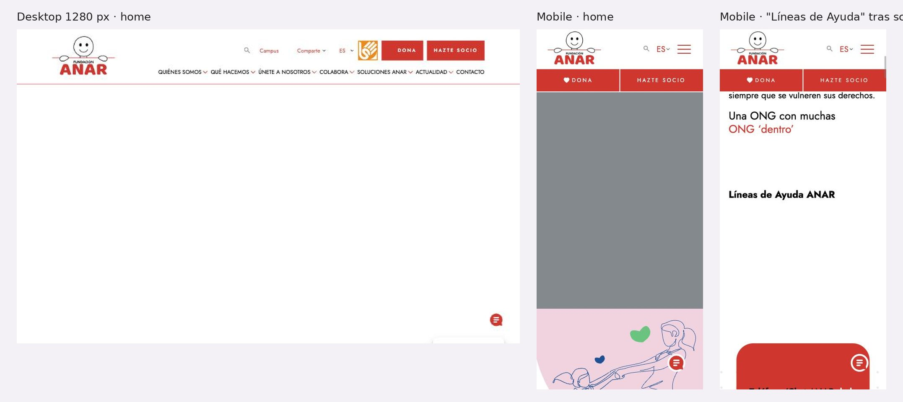

# 3.3.14 - Fundación ANAR

> Método: lectura de contenido con WebFetch (17 páginas, 2026-10-05). WebFetch devuelve un resumen del HTML, no la página renderizada: menús desplegables, estados interactivos y detalles visuales pueden no aparecer completos. Se suman datos de una observación propia en el navegador del celular (2026-10-05), citada como [O]. Lo que no se pudo confirmar se indica como "No verificable". Referencias entre corchetes [n] = número en la sección Fuentes.

## Información general
- **Organización:** Fundación ANAR (Ayuda a Niños y Adolescentes en Riesgo). Título de la home: "Fundación ANAR - Ayuda a Niños y Adolescentes en Riesgo" [1] (el DOM tiene 6 H1, uno por bloque; ver Verificación técnica). Trabaja "Desde 1970" (título de sección de la home) [1]. Sede en Madrid y delegaciones en Castilla y León, Comunidad Valenciana, Baleares y Canarias [17].
- **Tipo: Indirect competitor.** Justificación según las definiciones del brief: ofrece un producto similar —orientación ante violencias contra NNyA, guías y consejos de prevención para familias, docentes y adolescentes (incluye redes sociales, porno, videojuegos, grooming)— pero para **otro mercado** (España) [1][10][11]. A diferencia de RPI, ANAR **sí brinda asistencia directa**: opera líneas de ayuda gratuitas atendidas por psicólogos, varias por convenio con ministerios (acoso escolar con el Ministerio de Educación desde 2018; violencia de género con el Ministerio de Igualdad desde 2009) [3][6][7]. En Argentina su equivalente funcional serían las líneas 102 y 137 a las que RPI deriva, no la fundación (HECHO [3][6][7]; clasificación = INFERENCIA).
- **Ubicación:** Madrid (tel. 91 72 62 700) + 4 delegaciones regionales [17]. Alcance: toda España [3][4].
- **Oferta:** seis líneas de ayuda con teléfono y chat según la situación [1][3]–[7]; Email ANAR [8]; chat único en chatanar.es [9]; Centro de Estudios e Investigación (informes anuales) [1][12]; Hogares de acogida [1]; programa en colegios e institutos [1]; "Soluciones ANAR": Consejos, Guías e Informes [1][10][11][12]; voluntariado, universidades y formación de las líneas [1]; Campus (campus.anar.org) [1].
- **Website:** https://www.anar.org (+ chatanar.es para el chat, campus.anar.org) [1][9].
- **Tamaño / alcance:** "252.561" solicitudes de ayuda (llamadas y chats) y "19.990" menores atendidos en 2025 [1][3]; "700" llamadas/chats diarios (home, sin año; coincide con 252.561/365 ≈ 692) [1]. Por comunidad: Castilla y León 70.628 y Comunidad de Madrid 51.423 solicitudes (página de la línea de familia; año no explícito en la extracción) [4].
- **Target audience:** niñas, niños y adolescentes; madres, padres, docentes, vecinos y profesionales que necesitan orientación sobre un menor ("Detrás de un menor de edad con problemas, hay un adulto que necesita ser orientado") [4]; familias de chicos desaparecidos [5]; madres e hijos afectados por violencia de género [6]; centros educativos [7]; socios, donantes y empresas [15][16]; medios [14].
- **Unique value proposition:** INFERENCIA: ser el servicio de escucha 24 h para NNyA de España, gratuito, anónimo y atendido por psicólogos, con datos propios únicos sobre la infancia que alimentan informes y prensa [3][12][14].
- **Otros datos de posicionamiento:** gestión de líneas públicas por convenio (Ministerio de Educación, Ministerio de Igualdad) [6][7]; conexión con la red europea de los 116000 [5]; Sello Fundación Lealtad (2024) e ISO 9001 [13]; sección de la home "Una ONG con muchas ONG 'dentro'" [1].

## Arquitectura y navegación
- **Menú principal tal cual (extracción) [1]:**
  - **Quiénes somos:** Sobre Nosotros, Patronato, Organigrama, Transparencia, Dónde estamos, Alianzas, Redes y plataformas.
  - **Qué hacemos:** Líneas de Ayuda ANAR, Centro de Estudios e Investigación, Hogares de acogida, Colegios e institutos.
  - **Únete a nosotros:** Voluntarios, Universidades, Formación de las Líneas de Ayuda ANAR.
  - **Colabora:** Haz una donación, Hazte socio, Empresas, Fondo de herencias ANAR, Regala ANAR.
  - **Soluciones ANAR:** Consejos, Guías, Informes.
  - **Actualidad:** Noticias, Sala de Prensa, Campañas.
  - **Contacto.**
- OBSERVACIÓN [O]: en el celular el menú muestra QUIÉNES SOMOS, QUÉ HACEMOS, ÚNETE A NOSOTROS, COLABORA, SOLUCIONES ANAR, CONTACTO; "Actualidad" no figuraba en lo anotado. Confirmar en captura si está o no en el menú mobile.
- **Header mobile [O]:** buscador, selector de idioma "ES" y menú; debajo, barra fija con "DONA" y "HAZTE SOCIO". Botón flotante de chat. No hay acceso fijo a las líneas de ayuda en el header (OBSERVACIÓN [O]).
- **Profundidad:** home → Qué hacemos → Líneas de Ayuda → página de cada línea = 3 niveles [1][3].
- **¿Organiza por audiencia?** **No en el menú**, que es institucional (Quiénes somos / Qué hacemos / Colabora) [1]. Pero **sí en las líneas de ayuda**: hay una línea para NNyA [3] y otra "de la Familia y los Centros Escolares" para adultos [4], y el chat empieza preguntando "Menor de edad" o "Adulto/a (Por el problema de un menor de edad)" [9]. Los Consejos también están escritos por público en el título ("dirigidos a profesionales", "dirigidos a adolescentes", "dirigidos a madres y padres") [11].
- **Buscador:** sí, en el header [O].
- **Footer [1]:** Mapa Web, Aviso legal, Política de privacidad, Política de cookies, Política de calidad (PDF), Normas de atención al usuario, Canal de Denuncias (externo); redes (X, Facebook, LinkedIn, YouTube, Instagram, TikTok).
- **Selector de idioma:** "ES" en el header [O]; versión en inglés en /en/ [1][2]; hreflang es y en declarados [O].
- **Ícono de mano** en el header que enlaza a anar.svisual.org [1]. INFERENCIA: es un servicio de atención en lengua de signos (SVisual) y no una salida rápida, aunque WebFetch lo interpretó como "Quick Exit" [1]. La observación en el navegador confirma que **no hay botón de salida rápida** [O].

## User flows clave
1. **Pedir ayuda (elegir la línea correcta).**
   - Pasos: Home → scroll hasta "Líneas de Ayuda ANAR" (primer H2 de la home [1]) → elegir la línea por situación → página de la línea con teléfono y enlace al chat [3]–[7]. Alternativa: botón "LLÁMANOS" (tel:+34900202010) [1] o botón flotante de chat [O].
   - **Cómo explica qué línea corresponde (HECHO):**
     | Línea | Número | Para quién / cuándo |
     | --- | --- | --- |
     | Teléfono/Chat ANAR de Ayuda a Niños/as y Adolescentes | 900 20 20 10 (y 116 111 en algunas comunidades) | Menores con "dificultades de relación, violencia en sus diferentes formas, problemas psicológicos entre otros" [3] |
     | Teléfono/Chat ANAR de la Familia y los Centros Escolares | 600 50 51 52 | Padres, docentes, vecinos, profesionales: orientación jurídica, psicológica y social [4] |
     | Teléfono/Chat ANAR para Casos de Niños/as Desaparecidos | 116000 | Familias; "Colabora en la denuncia y conexión inmediata con Policía y Guardia Civil"; apoyo emocional 24 h [5] |
     | Teléfono/Chat ANAR de Violencia de Género en Menores de Edad | 900 20 20 10 | Madres víctimas preocupadas por sus hijos, hijos que ven la violencia, adolescentes en pareja. El 016 deriva a esta línea los casos con víctima menor [6] |
     | Teléfono/Chat ANAR Contra el Acoso Escolar | 900 018 018 | Alumnos, familias y personal de centros; "24 horas", "365 días del año" [7] |
     | Email ANAR | formulario web | Menores o adultos por un menor; "confidencial, no anónimo" [8] |
   - **Mensajes de confianza (HECHO [3]):** gratuito y confidencial en la línea general; "Confidencial y anónimo" y "Servicio gratuito" en la de acoso escolar (una verificación posterior no encontró la mención a la factura); "encontrará al otro lado un psicólogo/a que le va a escuchar el tiempo necesario". El Email aclara que no es anónimo y recomienda el teléfono/chat para anonimato [8]: buen ejemplo de honestidad sobre privacidad.
   - **Chat:** un solo chat (chatanar.es) para todas las líneas; la primera pantalla separa "Menor de edad" de "Adulto/a (Por el problema de un menor de edad)" [9]. Horario y preguntas siguientes: No verificable (la extracción solo leyó la bienvenida) [9].
   - **Fricciones:** en la home mobile las líneas aparecen recién después de mucho scroll (home de unos 13.300 px de alto) y hay un solo enlace tel: (+34900202010); los demás números (600 50 51 52, 116000, 900 018 018) no están como tel: en la home [O]. La barra fija ofrece "DONA" y "HAZTE SOCIO", no "LLAMA" [O]. Dos líneas comparten el 900 20 20 10 (NNyA y violencia de género) [3][6], lo que puede confundir sobre si son servicios distintos (INFERENCIA). La línea general no dice horario en la extracción ni explicita cuándo llamar al 112 [3]. No hay salida rápida [O].
2. **Donar / hacerse socio.** Barra fija "DONA" / "HAZTE SOCIO" [O] → /colabora/dona/: periodicidad "Puntual", "Mensual", "Trimestral", "Semestral", "Anual"; montos únicos 80 / 160 / 240 € y recurrentes 15 / 25 / 50 € [16]. Pago con tarjeta, PayPal, Bizum ("BIZUM al 02416"), domiciliación o transferencia [1][16]. Impacto por monto: "€30 = 2 consultas de psicología por acoso escolar", "€120 = atender a un menor con maltrato familiar", "€300 = apoyo a 2 adolescentes con ideación suicida" (extracción traducida; texto original No verificable) [16]. Deducción: "Puedes recuperar hasta un 80% de tus donaciones" [16]. Teléfono para socios y donantes: 900 92 82 92 [17].
3. **Empresas.** /colabora/empresas/: donaciones en especie, colaboraciones probono, eventos corporativos, acciones con empleados; sello "Compromiso ANAR"; logos/menciones de empresas aliadas (Inditex, TikTok, Mutua Madrileña, Disney, Santander, Iberdrola, Leroy Merlin, entre otras); deducción para personas jurídicas 40–50%; contacto con teléfono y CTA "Quiero saber más" [15]. Contacto específico empresas@anar.org en Contacto [17].
4. **Recursos para chicos y adultos.**
   - **Guías:** 12 guías listadas con fecha, de "Guías ANAR sobre redes sociales" (29 junio 2026) a "Cómo prevenir y actuar ante el intento de suicidio de un menor de edad" (19 julio 2023); incluye "El lenguaje secreto de los menores de edad en redes sociales", "El porno no es real | Decálogo para familias y menores de edad", "Guías ANAR sobre riesgos y beneficios de los videojuegos" [10]. Se filtran **por año**, no por público ni tema; sin buscador visible en la extracción [10].
   - **Consejos:** títulos explícitos por público, p. ej. "Consejos ANAR dirigidos a adolescentes para prevenir la ideación suicida" y "…dirigidos a madres y padres para prevenir el suicidio" [11].
   - **Por línea:** acoso escolar enlaza materiales separados para familias ("AcoS.O.S: Mi hijo/a es víctima, ¿Qué hago?", "Mi hijo/a acosa, ¿Qué hago?") y para docentes ("AcoSOS: Soy docente, ¿qué hago?") [7]; violencia de género enlaza "Informe Violencia de Género en menores 2021" [6].
   - Fricción: el formato de cada guía (web o PDF) No verificable (contenido cargado con JavaScript) [10][11].
5. **Prensa.** Actualidad → Sala de Prensa: teléfono de prensa 673 43 28 53, email (ofuscado en la extracción), registro en base de datos de periodistas, newsletter, "Kit multimedia", Memoria Anual 2024 y guías/informes [14]. Ofrece "Estadísticas y datos únicos", "Valoración y análisis de nuestros expertos" y aclara que no da "Información de ningún tipo sobre casos concretos que atendemos" [14]. No se vieron notas de prensa fechadas en la extracción [14].
6. **Impacto / informes.** Informes por año: "Informe Anual Líneas de Ayuda ANAR 2025" (2026), "Informe Anual Desaparecidos 2025" (2026), "VIII Informe 'La opinión de los estudiantes'" (2026), "Estudio 'Tecnología. Impacto en la infancia'" (2025), etc., con botones "DESCARGAR" / "SEGUIR LEYENDO" [12].
7. **Público internacional.** /en/ traduce menú ("Who we are", "What we do", "Join us", "Donate", "Current News"), títulos ("Need help?", "30 years saving lives") y CTAs ("CALL US", "BECOME A MEMBER", "MAKE A DONATION") [2]. Quedan en español el banner de cookies y el newsletter [2]. No aclara si las líneas atienden en inglés ni desde fuera de España [2][3]. El 116000 tiene "Conexión en red con todos los 116000 de Europa" para casos transfronterizos [5].

## Contenido
- **Claridad:** alta en las páginas de cada línea: a quién va dirigida, qué ofrece y qué garantías tiene (gratis y confidencial; "anónimo" solo en algunas) [3]–[7]. La línea de familia se explica con una frase que justifica su existencia: "Detrás de un menor de edad con problemas, hay un adulto que necesita ser orientado" [4].
- **Tono:** cercano y tranquilizador en ayuda ("le va a escuchar el tiempo necesario") [3]; claro sobre límites ("confidencial, no anónimo") [8]; institucional en Transparencia y Empresas [13][15].
- **Organización:** por institución en el menú; por situación en las líneas; por año en Guías e Informes; por público (en el título) en Consejos [1][10][11][12].
- **Cantidad de información:** muy alta en la home (11 H2, de "Líneas de Ayuda ANAR" a "¿Aún no sabes cómo colaborar?") [1] y muy larga en mobile (≈13.300 px) [O].
- **CTAs (textuales):** "LLÁMANOS", "DONA", "HAZTE SOCIO", "BIZUM al 02416" [1]; "SEGUIR LEYENDO" [11][12]; "DESCARGAR" [12]; "Quiero saber más" [15]; "COLABORA COMO PARTICULAR/EMPRESA/INSTITUCIÓN" [11]; en /en/: "CALL US", "BECOME A MEMBER", "MAKE A DONATION" [2]; en el chat: "Menor de edad", "Adulto/a (Por el problema de un menor de edad)" [9].
- **Impacto / transparencia:** cifras de resultado 2025 en home y línea general (252.561 solicitudes, 19.990 menores atendidos) [1][3]; informes anuales por línea [12]; Transparencia con Memoria Anual 2024, Cuentas anuales e Informe de Auditoría 2024 (Atenea Auditores), Plan de Actuación 2024 y 2025, convenios y subvenciones 2025, Sello Fundación Lealtad (2024), ISO 9001 AENOR (vigente "hasta abril 2025") e IQNET [13]. **Desactualización (OBSERVACIÓN):** Transparencia indica última actualización en abril de 2025 y el certificado AENOR figura vigente hasta abril de 2025 [13], mientras Informes ya publica datos 2025 [12]; la Sala de Prensa ofrece la Memoria 2024 [14].
- **Presencia en medios / newsroom:** sala de prensa con contacto directo, kit y oferta de datos y expertos [14]; no se encontró una sección "en los medios" ni notas fechadas en la extracción [14].

## Idiomas y accesibilidad (lo verificable desde el contenido)
- **Idiomas:** español y versión en inglés en /en/ (traducción parcial: cookies y newsletter en español) [2]; hreflang es y en [O]. Las guías solo aparecen en español [10].
- **Accesibilidad (señales en el contenido):** enlace a atención en lengua de signos (anar.svisual.org, ícono de mano; función = INFERENCIA) [1]; "LLÁMANOS" como enlace tel: [1]; chat como alternativa al teléfono para quien no puede hablar [9]. No se encontró declaración de accesibilidad en el footer [1]. Sin botón de salida rápida [O].
- **No verificable:** contraste, foco de teclado, skip link, texto alternativo, formato de guías (PDF o web).

## First impressions (capturas propias, 2026-10-05)
- **Primera impresión (OBSERVACIÓN):** header con buscador, "Campus", "Comparte", selector "ES", un ícono de lengua de signos y los botones "DONA" y "HAZTE SOCIO"; menú de 7 ítems. El hero quedó vacío en desktop y gris en mobile a los 5 s. En nuestra vista emulada algunos heroes con animación o video no terminaron de cargar; se informa lo que se vio, sin asumir que siempre pasa. En mobile, la barra roja fija es para "DONA" y "HAZTE SOCIO"; el bloque "Líneas de Ayuda ANAR" aparece después de mucho scroll, con un espacio vacío grande antes de las tarjetas. Banner de cookies con "Aceptar", "Rechazar" y "Preferencias". Botón de chat flotante.
- **Claridad de la propuesta:** el nombre ("Ayuda a Niños y Adolescentes en Riesgo") lo dice; la home lo muestra tarde.
- **Jerarquía visual:** donar arriba y fijo; pedir ayuda abajo.
- **Desktop — Okay.** + Selector de idioma y acceso a lengua de signos visibles. − Hero vacío; donar antes que pedir ayuda.
- **Mobile — Okay.** + Chat flotante siempre a mano. − La barra fija es para donar, no para pedir ayuda; la home mide unos 13.300 px y tiene un solo teléfono tocable.

## Visual design
- **Branding / identidad — Good.** + Logo icónico, ilustraciones de línea y rojo institucional.
- **Imágenes:** ilustraciones (no expone a chicas y chicos).
- **Coherencia entre páginas:** alta; cada línea de ayuda tiene la misma estructura.
- **Relación diseño–audiencia:** una sola home para chicos y adultos; la separación aparece recién en el chat y en cada línea (INFERENCIA).

## Verificación técnica (JavaScript sobre el DOM, 2026-10-05)
| Chequeo | Resultado |
| --- | --- |
| `lang` | `es-ES` |
| `hreflang` | `en`, `es`, `x-default` |
| Skip link | No |
| Imágenes sin `alt` / con `alt` vacío (home) | 1 / 54 de 74 |
| H1 en la home | 6 (uno por bloque: informe, acoso escolar, "¿Necesitas ayuda?", donación, programas, Bizum) |
| Enlaces `tel:` (home) | 1 (`+34900202010`) |
| Salida rápida | No |
| Zoom bloqueado | No |
| Alto de la home mobile | ≈ 13.300 px |

## Ratings finales
| Dimensión | Rating | Por qué |
| --- | --- | --- |
| Desktop | Okay | Idioma y lengua de signos visibles; hero vacío |
| Mobile | Okay | Chat siempre visible; ayuda enterrada bajo la donación |
| Navegación | Okay | Menú institucional; líneas separadas por situación |
| User flow | Good | Cada línea con teléfono, chat y garantías |
| Accesibilidad | Okay | `hreflang` y lengua de signos; 6 H1, `alt` vacíos, un solo `tel:` |
| Diseño visual | Good | Identidad ilustrada y consistente |
| Contenido | Good | Qué línea corresponde a cada caso; cifras 2025 |

## Lentes del objetivo del audit
| Lente | ¿Lo resuelve? | Evidencia |
| --- | --- | --- |
| Navegación por audiencia | Parcial | Menú institucional; líneas separadas para NNyA y para adultos, chat que pregunta "Menor de edad" / "Adulto/a" y Consejos con el público en el título [1][4][9][11] |
| Pedir ayuda / derivación | Sí | Seis líneas por situación con teléfono, chat y garantías de anonimato (pero ANAR asiste directamente); en la home mobile quedan lejos y con un solo tel: [3]–[9][O] |
| Impacto y credibilidad | Sí | Cifras 2025 de atención, informes anuales por línea, cuentas auditadas, Sello Fundación Lealtad; Transparencia sin actualizar desde abril 2025 [1][12][13] |
| Prensa | Parcial | Sala de prensa con teléfono, kit y oferta de datos/expertos, dentro de "Actualidad"; sin notas fechadas visibles [14] |
| Internacional | Parcial | /en/ con menú y CTAs traducidos, cookies en español, sin aclarar atención en inglés; red europea 116000 [2][5] |

## Qué significa → qué decisión podría afectar
- Separar desde el primer toque "soy menor" / "soy un adulto preocupado por un menor" (chat [9], líneas [3][4]) resuelve que dos públicos con necesidades distintas lleguen a la misma página → **afecta** el diseño de "Necesito ayuda" de RPI (lente 2 y 1; US-03, US-12, US-29).
- Una tabla "qué línea para qué situación" con frase de para quién es cada una es el modelo para explicar 102 / 137 / 911 / Bajalo Ya! → **afecta** el contenido de derivación (lente 2; US-03, US-04).
- Tener las líneas como primer H2 pero a miles de píxeles en mobile, con una barra fija dedicada a donar, muestra que el orden del HTML no basta → **afecta** la barra fija mobile de RPI: ayuda primero, donar después (lente 5 y 2; US-01, US-02, US-14).
- Decir con honestidad qué canal es anónimo y cuál no ("confidencial, no anónimo") genera confianza → **afecta** los textos de Bajalo Ya! y de contacto (lente 2; US-12).
- Informes anuales con datos propios como servicio a la prensa → **afecta** la sala de prensa y la sección de impacto (lente 3; US-31, US-32).

## Evidencia
Capturas: home desktop (1280 px), home mobile y bloque "Líneas de Ayuda ANAR" tras scroll en mobile. Archivos: `evidencia/capturas/anar_*.jpg` (hoja resumen: `evidencia/anar_evidencia.jpg`).

## Ratings preliminares (solo contenido, antes de las capturas) (Needs work / Okay / Good / Outstanding, con + y −)
- **Content: Good.** + Cada línea explica para quién es, qué ofrece y qué garantías tiene, en lenguaje simple [3]–[8]; + consejos con el público en el título [11]; + cifras 2025 de atención e informes por línea [1][12]. − Home muy extensa (11 secciones) [1][O]; − guías ordenadas solo por año [10]; − Transparencia y certificado ISO sin actualizar desde abril 2025 [13].
- **Interaction / Navigation: Okay.** + Menú de 7 ítems con submenús claros, buscador, selector de idioma [1][O]; + chat único con bifurcación menor/adulto [9]. − Menú institucional, no por audiencia ni por situación [1]; − la barra fija mobile prioriza donar ("DONA", "HAZTE SOCIO") y no ayuda [O]; − Prensa escondida dentro de "Actualidad" [1].
- **User flow: Good.** + Pedir ayuda: teléfono y chat en cada página de línea, con anonimato y gratuidad explícitos [3]–[7]; + donar con 5 periodicidades, Bizum e impacto por monto [16]; + empresas con modalidades, aliados y contacto [15]. − En la home mobile las líneas están lejos y solo un número es tocable [O]; − sin salida rápida [O]; − dos líneas con el mismo número [3][6].
- **Accessibility (preliminar): Okay.** + Atención en lengua de signos (INFERENCIA [1]); chat como alternativa a la voz [9]; tel: en "LLÁMANOS" [1]; versión en inglés [2]. − Sin declaración de accesibilidad visible [1]; inglés parcial [2]; sin salida rápida [O]. Contraste, teclado y lector de pantalla: No verificable.

## Fortalezas
- Líneas de ayuda segmentadas por situación y por quién llama, cada una con su página, número, chat y público [3]–[7].
- Chat que arranca con "Menor de edad" / "Adulto/a (Por el problema de un menor de edad)" [9].
- Garantías explícitas: gratuito y confidencial; "Confidencial y anónimo" en la línea de acoso escolar [3][7]; honestidad sobre el email ("confidencial, no anónimo") [8].
- Materiales separados para familias y para docentes dentro de la línea de acoso [7]; consejos por público [11].
- Datos propios anuales (informes por línea) que alimentan prensa e impacto [12][14].
- Transparencia completa: cuentas auditadas, planes de actuación, convenios y sello Fundación Lealtad [13].
- Donación con impacto por monto, 5 periodicidades y Bizum [16]; empresas con modalidades y aliados visibles [15].

## Debilidades
- En mobile, las líneas quedan después de mucho scroll y solo hay un enlace tel: en la home; la barra fija es para donar [O].
- Sin botón de salida rápida, pese a que el público principal son NNyA en riesgo [O].
- Menú por institución, no por audiencia ni por situación [1].
- Guías filtradas solo por año, sin público, tema ni buscador [10].
- Inglés parcial y sin aclarar si se atiende en otros idiomas o desde fuera de España [2][3].
- Transparencia desactualizada (abril 2025) frente a informes 2025 [12][13].
- Sala de prensa sin notas fechadas visibles y escondida en "Actualidad" [1][14].

## Patrones o ideas relevantes para Red por la Infancia
1. **Tabla "qué línea para qué situación"** con nombre de la línea, número tocable y una frase de para quién es → lente (2). Adaptable a 102 / 137 / 911 / Bajalo Ya! en "Necesito ayuda" (US-03, US-02). (HECHO [3]–[7]; aplicabilidad = INFERENCIA)
2. **Primera bifurcación "soy menor" / "soy adulto por un menor"** (chat ANAR) → lentes (1) y (2). Puede ser la entrada de "Necesito ayuda" de RPI: Camila y Laura/Silvia llegan a contenidos distintos (US-12, US-29, US-28). (HECHO [9])
3. **Garantías de privacidad dichas en una línea** ("gratuito", "confidencial", "anónimo" donde corresponde; "confidencial, no anónimo" para el email) → lente (2); aplicable a Bajalo Ya! y al formulario de contacto (US-12). (HECHO [3][8])
4. **Antipatrón mobile: barra fija para donar y ayuda a miles de píxeles** → lente (5) y (2). RPI debería fijar "Necesito ayuda" con números tocables y dejar donar en segundo lugar (US-01, US-02, US-14). (OBSERVACIÓN [O])
5. **Materiales separados por público dentro de cada tema** ("Mi hijo/a es víctima", "Mi hijo/a acosa", "Soy docente, ¿qué hago?") → lente (1); modelo para ReConectate y para la guía paso a paso de US-04 (US-04, US-05, US-09). (HECHO [7])
6. **Consejos con el público en el título** como forma barata de segmentar sin rehacer la arquitectura → lente (1) (US-29, US-09). (HECHO [11])
7. **Informes anuales de datos propios + sala de prensa que ofrece datos y expertos (y aclara que no habla de casos)** → lente (3); modelo para la sala de prensa de RPI con datos de Bajalo Ya! (US-31, US-32, US-17). (HECHO [12][14])
8. **Transparencia con sellos y cuentas auditadas**, pero con fecha de actualización visible que puede jugar en contra si no se mantiene → lente (3); RPI necesita un proceso de carga continua (US-15, US-33). (HECHO [13]; INFERENCIA)
9. **Inglés parcial sin decir si se atiende en inglés** → lente (4); antipatrón: la versión en inglés de RPI debería aclarar qué servicios valen fuera de Argentina (Bajalo Ya!) y cuáles no (líneas 102/137) (US-21, US-22). (HECHO [2][3])
10. **Ausencia de salida rápida** → lente (2); RPI puede diferenciarse con salida rápida en "Necesito ayuda" y Bajalo Ya! (US-13). (OBSERVACIÓN [O])

## Fuentes
Consultadas el 2026-10-05 con WebFetch.
1. https://www.anar.org — home (consultada dos veces: contenido y lista de URLs)
2. https://www.anar.org/en/ — versión en inglés
3. https://www.anar.org/que-hacemos/telefono-chat-anar/ — Teléfono/Chat ANAR de Ayuda a Niños/as y Adolescentes
4. https://www.anar.org/telefono-anar-familia-y-centros-escolares/ — Teléfono/Chat ANAR de la Familia y los Centros Escolares
5. https://www.anar.org/que-hacemos/telefono-y-chat-para-ninos-y-ninas-desaparecidos/ — Teléfono/Chat para Casos de Niños/as Desaparecidos
6. https://www.anar.org/que-hacemos/telefono-chat-de-violencia-de-genero-en-menores-de-edad/ — Teléfono/Chat de Violencia de Género en Menores de Edad
7. https://www.anar.org/telefono-chat-del-acoso-escolar/ — Teléfono/Chat Contra el Acoso Escolar
8. https://www.anar.org/email-anar/ — Email ANAR
9. https://chatanar.es — Chat ANAR (pantalla de bienvenida)
10. https://www.anar.org/soluciones-anar/guias/ — Guías
11. https://www.anar.org/soluciones-anar/consejos/ — Consejos
12. https://www.anar.org/actualidad/informes/ — Informes
13. https://www.anar.org/transparencia/ — Transparencia
14. https://www.anar.org/actualidad/sala-de-prensa/ — Sala de Prensa
15. https://www.anar.org/colabora/empresas/ — Empresas
16. https://www.anar.org/colabora/dona/ — Haz una donación
17. https://www.anar.org/contacto/ — Contacto
- [O] Observación propia en el navegador (celular, 2026-10-05): header con buscador, "ES" y menú; barra fija "DONA" / "HAZTE SOCIO"; líneas de ayuda tras mucho scroll (home ≈13.300 px); un solo enlace tel: (+34900202010); hreflang es y en; botón flotante de chat; sin botón de salida rápida; carga en ≈4,8 s.
- No accesibles: ninguna de las URLs intentadas falló. La descarga directa del HTML fuera de WebFetch fue bloqueada por el proxy de red, por lo que `lang`, skip link y `alt` quedan para la verificación técnica.
- Nota: emails y teléfonos personales de prensa se omiten salvo el teléfono institucional publicado.

## Capturas

