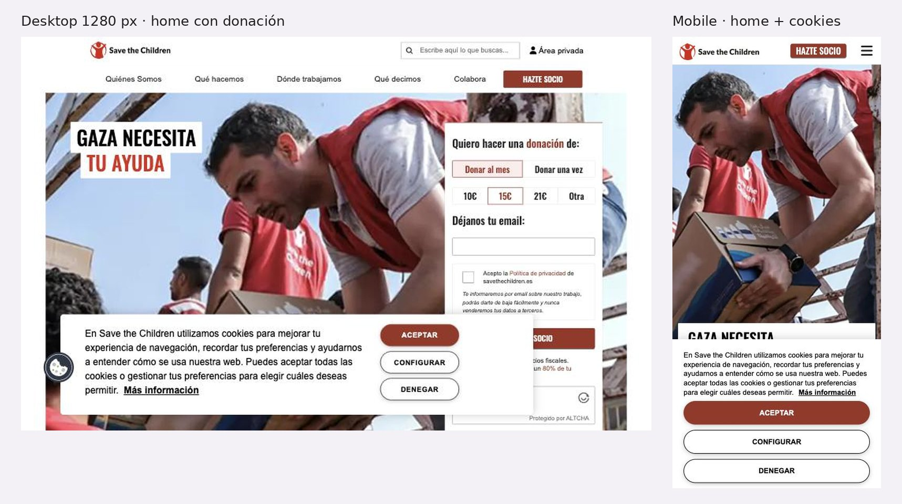

# 3.3.15 - Save the Children España

> Método: lectura de contenido con WebFetch (15 páginas, 2026-10-05). WebFetch devuelve un resumen del HTML, no la página renderizada: menús desplegables, estados interactivos y detalles visuales pueden no aparecer completos. Se suman datos de una observación propia en el navegador del celular (2026-10-05), citada como [O]. Lo que no se pudo confirmar se indica como "No verificable". Referencias entre corchetes [n] = número en la sección Fuentes.

## Información general
- **Organización:** Fundación Save the Children España, parte del movimiento global Save the Children. CIF G79362497, inscripta con el n.º 162 en el Registro de Fundaciones [12]. H1 de la home: "Save the Children | ONG por la Infancia" [1].
- **Tipo: Indirect competitor.** Justificación según las definiciones del brief: ofrece un producto similar al de RPI —contenidos de prevención de violencia online para familias ("Violencia Viral: los 9 tipos de violencia online", curso "Antivirus contra la Violencia", "Escuela de madres y padres"), publicaciones e incidencia, y secciones para donantes, empresas y prensa— pero para **otro mercado** (España) [1][3][5][6]. Igual que RPI, **no atiende casos individuales**: "desde Save the Children no tenemos capacidad para atención de casos concretos" y deriva a 091, 112, 010 y 900 018 018 [7]. La diferencia es de escala y agenda (emergencias, pobreza, educación, salud en más de 100 países) (HECHO [1][7][13]; clasificación = INFERENCIA).
- **Ubicación:** España (sede central y contactos de prensa en Andalucía, Cataluña, Comunidad Valenciana y País Vasco) [14]. "Llevamos 30 años en España" [11].
- **Oferta:** programas en España y en el mundo (Emergencias y ayuda humanitaria, Pobreza infantil, Educación, Salud y nutrición, Derechos de la infancia) [1]; "Escuela de madres y padres" con cursos online y guías [3]; publicaciones e incidencia política ("Qué decimos") [1][6]; socios, donaciones, voluntariado, herencias, grandes donaciones, empresas, centros educativos y peticiones [1][8].
- **Website:** https://www.savethechildren.es [1].
- **Tamaño / alcance (Memoria 2025) [13]:** 37,8 millones de NNyA ayudados directamente en el mundo; 107 países; 113 emergencias; 15.021 NNyA acompañados en España; ingresos 65.391.351 € y gastos 65.362.527 €; más de 167.000 socios; más de 350 voluntarios. Ver inconsistencias en Contenido.
- **Target audience:** socios y donantes (individuales y grandes donantes), empresas, centros educativos, madres y padres, personal educativo, voluntarios, periodistas, decisores políticos [1][3][8][11][14].
- **Unique value proposition:** INFERENCIA: marca global con más de 100 años ("Desde hace más de 100 años" [11]) que combina ayuda humanitaria con incidencia y datos propios sobre infancia en España ("Nuestra voz es libre", H2 de la home [1]).
- **Otros datos de posicionamiento:** banners de emergencia en la home ("GAza necesita tu ayuda", "Emergencia en Nepal") [1][O]; Saveflix y "Kilómetros de Solidaridad" para colegios [1]; sello de la Coordinadora de ONG vigente hasta 2028, auditoría de Mazars [12].

## Arquitectura y navegación
- **Menú principal tal cual (extracción) [1]:**
  - **Quiénes Somos:** Nuestro equipo, Embajadores, Transparencia y buen gobierno, Código ético y Salvaguarda, Únete al equipo.
  - **Qué hacemos:** Emergencias y ayuda humanitaria, Pobreza infantil, Educación, Salud y nutrición, Derechos de la infancia, Escuela de madres y padres.
  - **Dónde trabajamos:** En España, En el mundo.
  - **Qué decimos:** Actualidad, Nuestras propuestas, Publicaciones, Prensa.
  - **Colabora:** Hazte socio, Haz una donación, Retos solidarios, Hazte voluntario, Testamento solidario, Grandes donaciones, Empresas, Centros educativos, Firma nuestras peticiones.
- **Header mobile [O]:** "HAZTE SOCIO" fijo en el header; "Área privada" (va a /user/login) [1][O].
- **Profundidad:** home → Qué hacemos → tema → página/curso = 3 niveles; Escuela tiene subrutas /escuela/cursos/ y /escuela/guia/ [3][4].
- **¿Organiza por audiencia?** **No en el menú**, que es institucional y temático [1]. Las audiencias aparecen en segundo nivel: "Escuela de madres y padres" (familias y "personal educativo") dentro de Qué hacemos [3]; "Empresas", "Grandes donaciones" y "Centros educativos" dentro de Colabora [1]; "Prensa" dentro de Qué decimos [1].
- **Buscador:** No verificable con la extracción.
- **Footer [1]:** Colabora (Haz una donación, Centros educativos, Empresas, Testamento solidario, Desgrava tus Donaciones) · Save the Children (Transparencia y buen gobierno, Canal de denuncias, Preguntas Frecuentes, Sala de prensa, Únete al equipo) · legales (Condiciones de uso y política de privacidad, Política de Cookies, Normas de convivencia en redes sociales, Accesibilidad Web, Contacta con nuestro equipo). Teléfono gratuito 900 37 37 15 (lunes a viernes, 9–21 h) y colabora@savethechildren.org [1].
- **Selector de idioma:** no se encontró en la home [1]. La ruta /en existe pero muestra el menú y los títulos en español ("Quiénes Somos", "GAza necesita tu ayuda") [2].
- **Banner de cookies:** "Aceptar", "Configurar" y "Denegar" [O].

## User flows clave
1. **Pedir ayuda / derivación — escondida en el FAQ.** No hay sección "pedir ayuda" en el menú [1]. La única derivación encontrada está en Preguntas Frecuentes → "¿Cómo puedo recibir ayuda de Save the Children?": aclara que no atienden casos concretos, que las familias con ayuda económica "vienen derivadas de Servicios Sociales" y da Policía Nacional 091, Emergencias 112, Servicios Sociales 010 y "Teléfono de denuncia de Acoso Escolar: 900 018 018" (este último es la línea que gestiona ANAR, ver 3.3.14) [7]. Fricciones: la página "Violencia Viral" (enlazada desde la home) no menciona líneas de ayuda ni cómo pedir que se borren imágenes; solo ofrece el 900 37 37 15 y colabora@ [5]. INFERENCIA: ese número es el de socios/colaboración (lun–vie 9–21 h) y puede leerse como línea de ayuda. La Escuela tampoco indica "qué hacer si un niño cuenta un abuso" [3].
2. **Hacerse socio / donar.** "HAZTE SOCIO" fijo en el header [O] → /colaborar-ong/hazte-socio: "Donar al mes" o "Cantidad puntual"; mensuales 9, 10, 14, 15, 20, 21 € u "Otra cantidad"; solo pide email y aceptar privacidad en el primer paso [9]. Donación (/donacion-ong/donacion): mensual 9 / 14 / 20 € y única 50 / 70 / 120 € [10]. Impacto por monto: "Proporciona a una familia desplazada productos alimenticios básicos para todo un mes" (9 €/mes), "Enviar 10 mantas para niños y niñas desplazados" (60 €) [9][10]. Bizum 13132, teléfono y transferencia [10]. Deducción: "Podrás desgravarte hasta un 80% de tu donación" [1][9]; calculadora "Desgrava tus Donaciones" en el footer [1]. Gestión del socio: "Área privada" [1][8].
3. **Empresas.** /empresas: "Ya trabajamos junto a más de 350 empresas" (sin año), aliados nombrados (UNIQLO, El Corte Inglés, CaixaBank, Atlético de Madrid), "Colaboraciones a medida", "Alianzas estratégicas", lenguaje ESG/RSC ("alineada con las políticas de RSC y ESG"), "Descubre nuestro trabajo" (memoria de alianzas), contacto alianzas@ y formulario "Escríbenos" [11].
4. **Recursos para familias (por edad).** "Escuela de madres y padres" (/escuela) dirigida a "Madres, padres y personal educativo", con 6 recursos bajo "CURSOS PARA MADRES Y PADRES:": "Aprender a Educar" (PDF + 8 videos), "Cómo Hablar de Sexo con tus Hijos", "Bullying y Ciberbullying", "¿Cómo te ha ido el día?" (guía), "Coeducar en Familia", "Antivirus contra la Violencia" [3]. **No hay organización por edad** (0–3, 3–6, primaria, adolescencia) en las páginas consultadas: se ordena por tema [3]; la guía "¿Cómo te ha ido el día?" habla de "la infancia y la adolescencia" sin franjas explícitas [4]. Recursos por edad: No verificable dentro de los cursos (no se abrieron sus módulos). La guía se descarga gratis "sin necesidad de registro" ("Descarga gratis el PDF de la guía") [4]; registro en los cursos: No verificable [3].
5. **Prensa.** Footer → Sala de prensa (también en Qué decimos → Prensa) [1]: notas en orden cronológico (la más reciente del 1 de octubre de 2026), contacto general prensa@savethechildren.org, responsable de comunicación con teléfono y contactos por región (Andalucía, Cataluña y Comunidad Valenciana, País Vasco), registro "Soy periodista y quiero recibir las notas de prensa", archivo de notas [14]. Kit o banco de imágenes: No verificable (la extracción solo lo "implica") [14].
6. **Impacto / memoria.** Home → "Memoria Anual: nuestro trabajo en 2025" → /memoria-2025: memoria **web** por secciones (Emergencias, en el mundo, en España, incidencia) con PDF descargable al final, cifras 2025 y testimonios, y formulario de donación integrado [1][13]. Transparencia: memorias 2021–2025 (2025 y 2024 en web; 2021–2023 en PDF), cuentas auditadas, presupuestos, financiamiento público, retribuciones del equipo [12].
7. **Público internacional.** No hay selector de idioma ni contenido en inglés: /en devuelve el sitio en español [1][2]; la Memoria 2025 no menciona versión en inglés [13]; Publicaciones no indica títulos en inglés [6]. INFERENCIA: el público internacional se deriva implícitamente a los sitios de otros países del movimiento; no hay enlace explícito en lo consultado.

## Contenido
- **Claridad:** alta en donación y transparencia (desglose de cada 100 €) [10][12]; muy clara la respuesta del FAQ sobre que no atienden casos [7]. Débil en la página Violencia Viral: define 9 tipos pero no dice qué hacer ni a quién llamar [5].
- **Tono:** emotivo y de urgencia en emergencias ("GAza necesita tu ayuda", "Haz ahora algo extraordinario") [1][9]; de incidencia ("Nuestra voz es libre") [1]; corporativo-ESG en Empresas [11]; práctico en la Escuela ("¿Cómo actuar ante el acoso y el ciberacoso? ¿Cómo hablar de sexualidad con tus hijos?") [1].
- **Organización:** institucional y temática; públicos en segundo nivel [1]. Publicaciones con filtros por tema (más de 200 categorías) y por lugar, sin filtro por público ni año en la extracción [6].
- **Cantidad de información:** alta; la home tiene 12 H2 que mezclan emergencias, herencias, Saveflix, memoria, violencia online y Escuela [1].
- **CTAs (textuales):** "HAZTE SOCIO" [O], "Quiero ayudar", "Descubre más", "Quiero más información" [1]; "Haz ahora algo extraordinario" [9]; "Donar al mes", "Donar una vez", "Cantidad puntual", "Otra cantidad" [9][10]; "Escríbenos", "Descubre nuestro trabajo" [11]; "Soy periodista y quiero recibir las notas de prensa" [14]; "Descarga gratis el PDF de la guía" [4]; "Área privada" [1].
- **Impacto / transparencia:** memoria web 2025 con cifras de resultado [13]; desglose por cada 100 € [12]; auditoría externa (Mazars), Consejo de Transparencia y Buen Gobierno, sello Coordinadora de ONG hasta 2028 [12]. **Inconsistencias (HECHO, citadas tal cual):**
  - Destino de cada 100 €: "67 €" a programas, "26 €" a captación y "7 €" a gestión "en 2025" (Transparencia [12]) frente a "74" / "19" / "7" sin año (FAQ, Hazte socio, Donación [7][9][10]).
  - Países: "113 países" (home y Hazte socio) [1][9], "115 países" (Empresas) [11], "107 países" (Memoria 2025) [13].
  - NNyA alcanzados: "116,6 millones de niños y niñas en 113 países" sin año [9]; "más de 113,6 millones" en 2024 [8]; "37,8 millones" ayudados directamente en 2025 [13]. Probablemente miden cosas distintas (alcance total vs. directo), pero no se aclara (INFERENCIA).
  - España: "más de 10.000 niños y niñas" (home, sin año) [1] frente a "15.021" en 2025 [13].
  - La home cita "7 de cada 10 menores han sufrido violencia online" y "casi el 40%" de ciberacoso sin año [1]; la página enlazada atribuye las cifras a un estudio de 2019 [5].
- **Presencia en medios / newsroom:** sala de prensa completa con notas al día, contactos por región y alta de periodistas [14]; se llega por el footer y por "Qué decimos" [1]. No se encontró sección "en los medios" [14].

## Idiomas y accesibilidad (lo verificable desde el contenido)
- **Idiomas:** solo español; /en no traduce [1][2].
- **Accesibilidad:** declaración en el footer ("Accesibilidad Web"): "parcialmente conformes con la normativa WCAG 2.1 AA", actualizada en enero de 2026, con documentos antiguos como excepción y formulario para reportar problemas [15]. Banner de cookies con opción "Denegar" al mismo nivel que "Aceptar" [O]. Guía descargable sin registro [4].
- **No verificable:** contraste, foco de teclado, skip link, texto alternativo, subtítulos de los videos de los cursos.

## First impressions (capturas propias, 2026-10-05)
- **Primera impresión (OBSERVACIÓN):** en desktop, el hero "GAZA NECESITA TU AYUDA" trae un formulario de donación integrado: "Donar al mes" / "Donar una vez", montos de 10 €, 15 € y 21 € u "Otra", email y casilla de privacidad, con el mensaje del 80% deducible. "HAZTE SOCIO" queda fijo en el menú. El banner de cookies ("Aceptar", "Configurar", "Denegar") tapa la mitad de la pantalla. En mobile, una foto ocupa toda la primera pantalla y el título queda debajo de las cookies.
- **Claridad de la propuesta:** clara como ONG de emergencias y socios; la violencia online no aparece en la primera pantalla.
- **Jerarquía visual:** donar primero, en el propio hero.
- **Desktop — Good.** + Donación en la primera pantalla con frecuencia y montos; buscador. − Las cookies tapan el formulario.
- **Mobile — Okay.** + "HAZTE SOCIO" fijo; skip link. − La foto ocupa la pantalla y el título queda abajo.

## Visual design
- **Branding / identidad — Good.** + Rojo, tipografía condensada y fotos documentales, consistentes en todo el sitio.
- **Imágenes:** fotos documentales con caras (emergencias).
- **Coherencia entre páginas:** alta.
- **Relación diseño–audiencia:** donantes primero; familias y prensa en páginas propias.

## Verificación técnica (JavaScript sobre el DOM, 2026-10-05)
| Chequeo | Resultado |
| --- | --- |
| `lang` | `es` |
| `hreflang` | `es` (solo) |
| Skip link | Sí |
| Imágenes sin `alt` / con `alt` vacío (home) | 0 / 0 de 15 |
| H1 en la home | Ninguno |
| Enlaces `tel:` | 1 (900 37 37 15, atención a socios) |
| Salida rápida | No |
| Zoom bloqueado | No |

## Ratings finales
| Dimensión | Rating | Por qué |
| --- | --- | --- |
| Desktop | Good | Donación integrada en el hero |
| Mobile | Okay | Foto que empuja el contenido; cookies |
| Navegación | Okay | Menú institucional con secciones por público |
| User flow | Good | Donar, hacerse socio y prensa en pocos pasos |
| Accesibilidad | Okay | Skip link y `alt` completos; sin H1 |
| Diseño visual | Good | Sistema de marca fuerte |
| Contenido | Good | Memoria 2025 y transparencia; cifras que no coinciden |

## Lentes del objetivo del audit
| Lente | ¿Lo resuelve? | Evidencia |
| --- | --- | --- |
| Navegación por audiencia | Parcial | Menú institucional; Escuela de madres y padres, Empresas, Grandes donaciones, Centros educativos y Prensa en 2º nivel [1][3] |
| Pedir ayuda / derivación | Parcial | Aclara que no atiende casos y deriva a 091/112/010/900 018 018, pero solo dentro del FAQ; Violencia Viral no deriva [5][7] |
| Impacto y credibilidad | Sí | Memoria web 2025 con cifras, memorias 2021–2025, cuentas auditadas, desglose por 100 €; cifras inconsistentes entre páginas [1][9][12][13] |
| Prensa | Sí | Sala de prensa con notas al 1/10/2026, contactos por región y alta de periodistas [14] |
| Internacional | No | Sin selector; /en muestra el sitio en español [1][2] |

## Qué significa → qué decisión podría afectar
- Una organización que, como RPI, no atiende casos lo dice con claridad y da los números oficiales, pero lo esconde en el FAQ → **afecta** "Necesito ayuda": el mensaje "no atendemos casos, llamá a…" tiene que estar arriba y en cada página de violencia online (lente 2; US-03, US-01).
- La memoria anual en formato web por secciones, con PDF opcional y donación al final, convierte el informe en una página para donantes → **afecta** la sección de impacto de RPI (lente 3; US-15, US-32).
- Cifras distintas para el mismo dato en distintas páginas restan credibilidad → **afecta** la regla de una sola fuente de datos con año para impacto (lente 3; US-15, US-33).
- Sala de prensa con contactos por región y alta de periodistas → **afecta** la sala de prensa de RPI (lente 3; US-31).
- La Escuela de madres y padres organiza por tema, no por edad → **afecta** ReConectate: RPI puede diferenciarse con filtros por edad y público (lente 1; US-05, US-09).
- Un "/en" que no traduce es peor que no tenerlo → **afecta** la estrategia de idiomas (lente 4; US-21, US-22).

## Evidencia
Capturas: home desktop (1280 px) con el formulario de donación y home mobile con cookies. Archivos: `evidencia/capturas/stc_*.jpg` (hoja resumen: `evidencia/stc_evidencia.jpg`).

## Ratings preliminares (solo contenido, antes de las capturas) (Needs work / Okay / Good / Outstanding, con + y −)
- **Content: Good.** + Memoria 2025 web con cifras de resultado y PDF [13]; + desglose de cada 100 € y documentación completa [12]; + impacto por monto en la donación [9][10]; + FAQ honesto sobre que no atienden casos [7]. − Cifras contradictorias entre páginas (67 vs. 74 €; 107/113/115 países; 10.000 vs. 15.021 en España) [1][9][11][12][13]; − cifras de violencia online sin año en la home (2019 en la fuente) [1][5].
- **Interaction / Navigation: Okay.** + Menú de 5 ítems con submenús claros; "HAZTE SOCIO" fijo; "Área privada" para socios [1][O]; + footer completo con transparencia, prensa, FAQ y accesibilidad [1]. − Sin navegación por audiencia; familias y prensa en 2º nivel [1]; − sin selector de idioma y /en roto [2].
- **User flow: Good (donar, socio, prensa) / Needs work (pedir ayuda).** + Socio en pocos pasos (email primero) con montos e impacto [9]; + empresas con aliados y contacto [11]; + prensa con contactos por región [14]. − Derivación a ayuda solo en el FAQ [7]; − Violencia Viral sin "qué hacer" ni líneas [5]; − recursos para familias sin organización por edad [3].
- **Accessibility (preliminar): Okay.** + Declaración de accesibilidad (WCAG 2.1 AA parcial, enero 2026) con canal de reporte [15]; + guía sin registro [4]; + "Denegar" cookies al mismo nivel [O]. − Solo español [1][2]. Contraste, teclado y lector de pantalla: No verificable.

## Fortalezas
- Memoria anual 2025 como página web navegable, con PDF y donación integrada [13].
- Transparencia completa: memorias 2021–2025, cuentas auditadas (Mazars), presupuestos, financiamiento público, retribuciones y desglose por 100 € [12].
- Alta de socio corta (email primero) con montos e impacto por monto; calculadora de deducción [1][9].
- Sala de prensa al día, con contactos por región y registro de periodistas [14].
- Empresas con aliados nombrados y lenguaje ESG/RSC [11].
- FAQ que aclara que no atienden casos y da números oficiales [7].
- Declaración de accesibilidad pública [15].

## Debilidades
- Pedir ayuda solo en el FAQ; las páginas de violencia online no derivan [5][7].
- Cifras de impacto inconsistentes entre páginas y datos sin año en la home [1][5][9][11][12][13].
- Sin selector de idioma; /en muestra el sitio en español [1][2].
- Recursos para familias por tema, sin franjas de edad [3][4].
- Menú institucional; audiencias en segundo nivel [1].
- El teléfono 900 37 37 15 (socios) aparece en páginas de violencia online y podría confundirse con una línea de ayuda (INFERENCIA [5]).

## Patrones o ideas relevantes para Red por la Infancia
1. **Mensaje "no atendemos casos concretos" + números oficiales** → lente (2). Es el mismo modelo de RPI (derivar); la mejora es sacarlo del FAQ y ponerlo en "Necesito ayuda" y en cada recurso de violencia digital (US-03, US-01, US-02). (HECHO [7]; aplicabilidad = INFERENCIA)
2. **Memoria anual web por secciones con PDF opcional** → lente (3); modelo para el impacto de RPI por programa (Bajalo Ya!, ReConectate, Campus) (US-15, US-32, US-33). (HECHO [13])
3. **Desglose "de cada 100 €"** → lente (3); una cifra simple de destino de fondos para Diego; con una sola fuente y año para evitar las inconsistencias vistas (US-15). (HECHO [12]; antipatrón OBSERVACIÓN [7][9][10])
4. **Sala de prensa con notas fechadas, contactos por región y alta de periodistas** → lente (3); modelo para US-31 (contacto directo y voceros) y US-32. (HECHO [14])
5. **Página de empresas con aliados nombrados, lenguaje ESG/RSC y contacto específico** → lente (3) y (1) (US-16). (HECHO [11])
6. **Socio en un paso inicial (email) con impacto por monto y botón fijo en el header** → lente (3) y (5); referencia para "Quiero Colaborar" siempre visible (US-14). (HECHO [9]; OBSERVACIÓN [O])
7. **Antipatrón: recursos para familias sin franjas de edad** → lente (1); RPI puede diferenciarse con ReConectate filtrable por edad y público (US-05, US-09, US-27). (HECHO [3][4])
8. **Antipatrón: página de violencia online sin "qué hacer" ni derivación** → lente (2); cada recurso de RPI debería cerrar con "si esto te pasa: Bajalo Ya! / 137 / 911" (US-03, US-11, US-28). (HECHO [5])
9. **Antipatrón: ruta /en sin traducción y cifras sin año** → lentes (4) y (3); si RPI publica inglés, que sea real aunque sea en pocas páginas (US-21, US-22, US-23). (HECHO [1][2][5])
10. **Declaración de accesibilidad con canal de reporte** → lentes (5) y credibilidad; práctica simple de adoptar. (HECHO [15])

## Fuentes
Consultadas el 2026-10-05 con WebFetch.
1. https://www.savethechildren.es — home (consultada tres veces: estructura, URLs y bloques)
2. https://www.savethechildren.es/en — ruta en inglés (muestra contenido en español; consultada dos veces)
3. https://www.savethechildren.es/escuela-de-madres-y-padres — Escuela de madres y padres (consultada dos veces)
4. https://www.savethechildren.es/escuela/guia/salud-mental-emocional-ninos-ninas-adolescentes — guía "¿Cómo te ha ido el día?"
5. https://www.savethechildren.es/actualidad/violencia-viral-9-tipos-violencia-online — Violencia Viral
6. https://www.savethechildren.es/publicaciones — Publicaciones
7. https://www.savethechildren.es/preguntas-frecuentes — Preguntas Frecuentes (consultada dos veces)
8. https://www.savethechildren.es/colaborar-ong — Colabora
9. https://www.savethechildren.es/colaborar-ong/hazte-socio — Hazte socio
10. https://www.savethechildren.es/donacion-ong/donacion — Haz una donación
11. https://www.savethechildren.es/empresas — Empresas
12. https://www.savethechildren.es/quienes-somos/transparencia-y-buen-gobierno — Transparencia y buen gobierno (consultada dos veces)
13. https://www.savethechildren.es/memoria-2025 — Memoria Anual 2025
14. https://www.savethechildren.es/prensa — Sala de prensa
15. https://www.savethechildren.es/accesibilidad-web — Accesibilidad Web
- [O] Observación propia en el navegador (celular, 2026-10-05): "HAZTE SOCIO" fijo en el header; menú QUIÉNES SOMOS, QUÉ HACEMOS, DÓNDE TRABAJAMOS, QUÉ DECIMOS, COLABORA; "Área privada"; emergencias "Gaza necesita tu ayuda" y "Emergencia en Nepal"; "Memoria anual: nuestro trabajo en 2025"; mensaje del "80% de tu donación"; banner de cookies "Aceptar", "Configurar", "Denegar".
- No accesibles: ninguna de las URLs intentadas falló. WebSearch no estuvo disponible (bloqueado por la organización), así que las páginas de la Escuela y la memoria se ubicaron desde enlaces de la home.
- Nota: nombres, teléfonos y emails personales del equipo de prensa vistos en [14] se omiten a propósito.

## Capturas

