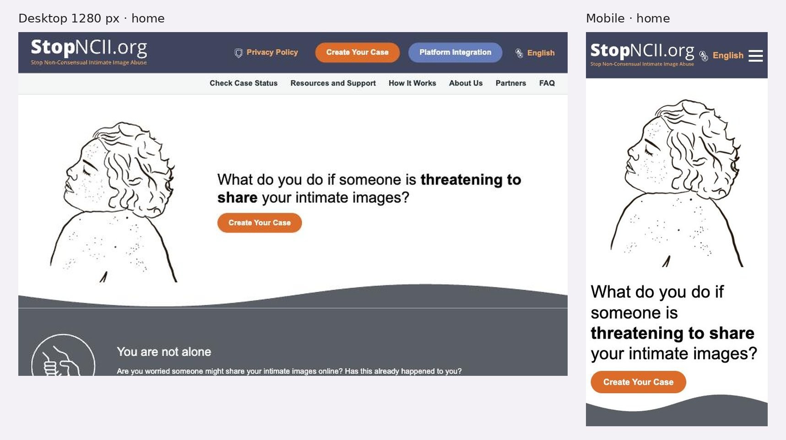

# 3.3.16 - StopNCII.org

> Método: lectura de contenido con WebFetch (15 páginas leídas + 2 URL no accesibles, 2026-10-05). WebFetch devuelve un resumen del HTML, no la página renderizada: menús desplegables, estados interactivos y detalles visuales pueden no aparecer completos. Se suman datos de observación propia en el navegador del celular (2026-10-05), marcados como tales. Lo que no se pudo confirmar se indica como "No verificable". Referencias entre corchetes [n] = número en la sección Fuentes.

## Información general
- **Organización:** StopNCII.org, herramienta gratuita para frenar la difusión no consentida de imágenes íntimas (NCII) de personas adultas. "StopNCII.org is operated by the Revenge Porn Helpline which is part of SWGfL" [1][3]. SWGfL se presenta como "an international charity that believes that everyone should benefit from technology, free from harm" [3]. Creada por SWGfL junto con Meta en 2021 ("SWGfL partnered with Meta to create StopNCII") [14].
- **Tipo: Indirect competitor.** Justificación según las definiciones del brief: ofrece un **producto muy similar** a Bajalo Ya! (pedir que se quiten imágenes íntimas de plataformas, sin enviar la imagen, mediante un hash) pero para **otra audiencia y otro mercado**: personas que tenían 18 años o más cuando se tomó la imagen ("You are over 18 years old in the images") y alcance mundial, no NNyA en Argentina [7][4]. Para menores de 18 deriva a Take It Down (NCMEC), a la IWF y a Report Remove de Childline [4][5][7]. Es además el destino al que Take It Down deriva a quienes tenían 18 o más (ver auditoría NCMEC), por lo que funciona como la "otra mitad" del flujo de Bajalo Ya! (HECHO [4][7]; clasificación = INFERENCIA).
- **Ubicación:** Exeter, Reino Unido (responsable de datos: "South West Grid for Learning Trust Ltd: Belvedere House, Woodwater Park, Pynes Hill, Exeter, EX2 5WS") [10]. Alcance global: "No, you can be anywhere in the world" [4].
- **Oferta:** creación de un caso con hash generado en el propio dispositivo [2][7]; seguimiento o retiro del caso con número de caso y contraseña [2][9]; lista de plataformas participantes [6]; recursos por plataforma para reportar NCII y derivaciones para menores de 18 [5]; integración para empresas tecnológicas ("Platform Integration") [8]; red de ONG aliadas por región [13]. La Revenge Porn Helpline (sitio aparte) ofrece asesoramiento a adultos en el Reino Unido [15].
- **Website:** https://stopncii.org (+ https://revengepornhelpline.org.uk como servicio de ayuda asociado) [1][15].
- **Tamaño o alcance:** HECHO: "over 300,000 individual non-consensual intimate images" quitadas y "over 90% removal rate", cifras atribuidas a la Revenge Porn Helpline (no a StopNCII) y **sin año** [1][3]. Red de ONG: la extracción reportó 99 organizaciones en 5 regiones [13] (ver inconsistencia en Contenido). 20 plataformas en Industry Partners [6]. No se encontraron cifras de casos o hashes de StopNCII con año.
- **Target audience:** personas adultas víctimas o en riesgo de difusión de imágenes íntimas ("What do you do if someone is threatening to share your intimate images?") [1]; plataformas tecnológicas que quieren integrar el banco de hashes [8]; ONG y organismos que acompañan a víctimas [13].
- **Unique value proposition:** INFERENCIA: proteger imágenes íntimas en muchas plataformas a la vez sin que la imagen salga del dispositivo ("Your content will not be shared, it will remain on your device") [2], con alcance mundial y en más de 30 idiomas [1].
- **Otros datos de posicionamiento:** página de apoyos con Meta ("supported StopNCII.org since the beginning"), Microsoft (PhotoDNA en 2024), donaciones de Discord (marzo 2025), Yubo (2025), Vivastreet, Byborg y RedGifs (2024); reconocimiento de UNODC y colaboración con NCMEC [14]. FAQ: "Is StopNCII.org a government initiative?" [4].

## Arquitectura y navegación
- **Menú principal tal cual** (observación propia en el navegador, coincide con [1]): selector de idioma ("English", con ícono de traducción) · Check Case Status · Resources and Support · How It Works · About Us · Partners · FAQ · Privacy Policy · Create Your Case · Platform Integration.
- **Partners** tiene subpáginas: Industry Partners, Global Network of Partners, Expert Partners y Supporters [8][13][14].
- **Profundidad:** baja, 2 niveles (menú > página), salvo Partners (3 niveles) y el flujo de creación de caso (paso a paso) [1][7][8] (OBSERVACIÓN).
- **¿Organiza por audiencia?** Parcial. El menú mezcla la tarea de la víctima (Create Your Case, Check Case Status, How It Works) con la de las empresas (Platform Integration) en el mismo nivel [1]. La home tiene un bloque "Who is StopNCII.org for?" (observación propia en el navegador [1]). Para menores de 18, la segmentación por edad aparece en el FAQ, en Resources and Support ("Help for people under 18 years of age") y en el primer paso del caso [4][5][7].
- **Buscador:** No verificable (la extracción no lo mencionó) [1].
- **Footer:** "Copyright 2026 StopNCII.org" y la frase sobre el operador [1]. Privacy Policy, Resources and Support y FAQ en el footer de Check Case Status [9].
- **Accesos persistentes:** "Create Your Case" y "Check Case Status" se repiten en todas las páginas leídas [1][2][5][9]. Sin teléfono, sin botón de donar y sin salida rápida (observación propia en el navegador; HECHO [1][2][4]).

## User flows clave
1. **Pedir que se quiten imágenes (crear un caso).**
   - Pasos: Home > "Create Your Case" > preguntas de elegibilidad (edad en la imagen, quién aparece, si se consiente la publicación) > preguntas sobre el contenido (lugar, ropa, acto sexual, si ya se compartió) > selección de imágenes o videos (máximo 20) > contraseña (mínimo 10 caracteres) > revisión y consentimiento [7]. La extracción mostró un indicador de progreso ("7/10") [7].
   - El proceso se explica antes en 6 pasos en How It Works: elegir la imagen en el dispositivo > se genera el hash > se recibe un número de caso > las plataformas buscan coincidencias > StopNCII sigue buscando periódicamente > con el número de caso se puede consultar o retirar [2].
   - Fricciones: la contraseña no se recupera ("Unfortunately, this is not recoverable in any way") [4]; muchas preguntas sobre el contenido íntimo antes de subir (OBSERVACIÓN [7]); solo funciona en plataformas participantes y no en servicios cifrados [2][4].
2. **Menores de 18 (derivación).** Si la persona tenía menos de 18 en la imagen, el flujo se corta: "If you are under 18 in the content, please contact the National Center for Missing and Exploited Children or Internet Watch Foundation" [7]. El FAQ responde "I'm under 18, why can't I use StopNCII.org?" y deriva a Take It Down [4]. Resources and Support suma NCMEC, IWF, "Childline – Report Remove tool", CEOP y Bloom by Chayn [5]. Es una derivación clara, pero en tres lugares con listas distintas (OBSERVACIÓN).
3. **Consultar o retirar un caso.** Check Case Status pide "Case Number" y "Password" [9]. Retiro: "You can withdraw your case at any time... Clicking Withdraw will remove the whole case" [4].
4. **Pedir apoyo humano.** No hay teléfono ni chat en stopncii.org [1][4]. El FAQ ofrece email ("stopncii@swgfl.org.uk") [4]. La Revenge Porn Helpline atiende a "adults (aged 18+)" y no puede asistir a menores ni a personas fuera del Reino Unido [15]; la extracción indica contacto por email ("help@revengepornhelpline.org.uk"). Teléfono de la Helpline: No verificable (la extracción no lo mostró) [15]. El único teléfono visto en StopNCII es el de privacidad de SWGfL, "+44 (0)345 601 3203", dentro de la Privacy Policy [10].
5. **Donar.** No existe flujo de donación en stopncii.org (observación propia en el navegador; HECHO [1]). Los apoyos económicos se informan en Supporters, pero sin CTA para donar [14].
6. **Empresas / plataformas.** "Platform Integration" > "How Do You Want to Partner with StopNCII.org?" con tres caminos: "Approved Participants", "Programme Partners" y "Other Partnership Pathways" [8]. Se menciona una tabla comparativa de beneficios cuyo detalle no apareció en la extracción [8]. Contacto específico para empresas: No verificable [8].
7. **Prensa.** No hay sección de prensa en el menú [1]; /news y /contact devolvieron 404 [16][17]. Flujo para periodistas: No verificable.
8. **Público internacional / otros idiomas.** Selector de idioma en el header [1]; las versiones usan `?lang=` (p. ej. `?lang=es-mx`) [11]. La versión en español traduce menú, hero y CTA ("¿Qué hacer si alguien te amenaza con compartir tus imágenes íntimas?", "Crea tu caso") [11] y el FAQ ("No, puedes estar en cualquier parte del mundo") [12]; quedan en inglés algunos enlaces de navegación ("Go back to the homepage") y el copyright [12]. La red de ONG incluye 3 organizaciones argentinas: Faro Digital, Defensoría del Pueblo de la Ciudad de Buenos Aires y Defensoría del Pueblo de la provincia de Santa Fe [13].

## Contenido
- **Claridad:** alta. How It Works explica el hash en 6 pasos ("a digital fingerprint") [2]; el FAQ tiene 43 preguntas en 6 categorías, incluidas las limitaciones ("cannot remove images from the whole internet, only the participating platforms") [2][4].
- **Tono:** empático y directo, centrado en la persona: "You are not alone", "We are here to help" [1]; tranquilizador sobre privacidad: "Your images will never leave your device and they will never be saved by us" [4]. Sin tono alarmista.
- **Organización:** home con estructura problema > apoyo > cómo funciona > qué es > privacidad > para quién > más ayuda ("You are not alone", "How does StopNCII Work?", "What is StopNCII.org?", "We protect your privacy", "Who is StopNCII.org for?", "Need More?") (observación propia en el navegador [1]).
- **Cantidad de información:** acotada a un solo servicio; la profundidad está en el FAQ [4].
- **CTAs (textuales):** "Create Your Case", "Check Case Status", "Platform Integration", "Join StopNCII.org"; en español "Crea tu caso" [1][6][8][11].
- **Impacto / transparencia:** solo dos cifras de la Revenge Porn Helpline ("over 90% removal rate", "over 300,000" imágenes) sin año [1][3]; página Supporters con apoyos fechados (2021, 2024, 2025) [14]; lista pública de 20 plataformas [6]. No hay reporte de impacto de StopNCII ni cifras de casos con año (No verificable).
- **Presencia en medios / newsroom:** no encontrada. /news y /contact devolvieron 404 [16][17]; menú sin prensa [1].
- **Inconsistencias:** (a) cantidad de idiomas: la extracción del selector listó 34 nombres en la home [1], pero distintos resúmenes dicen "32" [1][10], "33" [2], "28" [9], "29+" [4] y "24+" [5]; conteo exacto a verificar en captura. (b) Red de ONG: la extracción dio 99 en total, pero sus subtotales por región no coinciden con los nombres listados [13]; conteo a verificar.

## Idiomas y accesibilidad (lo verificable desde el contenido)
- **Idiomas:** selector con más de 30 idiomas, entre ellos español, portugués, francés, árabe, hindi, urdu, bengalí, jemer, coreano, chino simplificado, chino tradicional (Taiwán y Hong Kong), kurdo, albanés, bosnio, serbio, montenegrino, macedonio, pidgin nigeriano (Naijá) e igbo [1]. Cada idioma aparece escrito en su propia lengua [1]. Versión en español casi completa, con restos en inglés [11][12].
- **Accesibilidad (señales en el contenido):** no se encontró declaración de accesibilidad ni skip link en las extracciones [1]; textos reales (no dentro de imágenes) en home, How It Works y FAQ [1][2][4]. Sin salida rápida pese a ser un servicio para víctimas (observación propia en el navegador). Requiere prueba con lector de pantalla y contraste.

## First impressions (capturas propias, 2026-10-05)
- **Primera impresión (OBSERVACIÓN):** ilustración de línea de una mujer con los ojos cerrados y la pregunta "What do you do if someone is **threatening to share** your intimate images?" con un solo botón, "Create Your Case". En el header: "Privacy Policy", "Create Your Case", "Platform Integration" y el selector "English". Debajo: "You are not alone".
- **Claridad de la propuesta:** muy clara: arranca por la situación de la persona, no por la organización.
- **Jerarquía visual:** una acción principal; el resto en un menú secundario.
- **Desktop — Good.** + Una sola acción principal y selector de idioma visible. − "Platform Integration", para empresas, tiene el mismo peso visual que la acción de las víctimas.
- **Mobile — Good.** + Ilustración, pregunta y botón en la primera pantalla; selector de idioma visible. − Sin salida rápida.

## Visual design
- **Branding / identidad — Good.** + Gris azulado y naranja, ilustración de línea.
- **Imágenes:** ilustraciones, sin fotos de víctimas.
- **Coherencia entre páginas:** alta.
- **Relación diseño–audiencia:** pensado para quien está en crisis: pregunta directa, tono "You are not alone" (OBSERVACIÓN).

## Verificación técnica (JavaScript sobre el DOM, 2026-10-05)
| Chequeo | Resultado |
| --- | --- |
| `lang` | `en-gb` |
| Skip link | No |
| Imágenes sin `alt` / con `alt` vacío | 0 / 5 de 6 |
| H1 | 1 (la pregunta del hero) |
| Enlaces `tel:` | 0 |
| Salida rápida | No |
| Zoom bloqueado | No |
| Selector de idioma | Visible en el header en desktop y mobile; la extracción listó 34 idiomas, el conteo exacto no se verificó |

## Ratings finales
| Dimensión | Rating | Por qué |
| --- | --- | --- |
| Desktop | Good | Una acción principal y el idioma a la vista |
| Mobile | Good | Pregunta y acción en la primera pantalla |
| Navegación | Okay | Por tarea; víctimas y empresas al mismo nivel |
| User flow | Good | Edad al inicio del formulario (paso 2) y derivación clara para menores |
| Accesibilidad | Okay | H1 correcto y selector de idioma; `alt` vacíos y sin skip link |
| Diseño visual | Good | Ilustrado y sereno |
| Contenido | Good | Explica el hash y la privacidad; cifras sin año |

## Lentes del objetivo del audit
| Lente | ¿Lo resuelve? | Evidencia |
| --- | --- | --- |
| Navegación por audiencia | Parcial | Menú por tarea; víctimas y empresas en el mismo nivel; "Who is StopNCII.org for?" en la home; corte por edad en el flujo [1][7][8] |
| Pedir ayuda / derivación | Parcial | Derivación clara para menores de 18 (Take It Down, IWF, Report Remove) y recursos por plataforma; sin teléfono ni salida rápida; apoyo humano solo por email [4][5][7] |
| Impacto y credibilidad | Parcial | Cifras de la Helpline sin año; lista pública de plataformas y apoyos fechados; sin reporte de impacto [1][3][6][14] |
| Prensa | No | Sin sección de prensa; /news y /contact 404 [16][17] |
| Internacional | Sí | Más de 30 idiomas con selector en el header, `?lang=`, "you can be anywhere in the world", red de ONG por región con 3 aliadas argentinas [1][4][11][13] |
## Qué significa → qué decisión podría afectar
- Bajalo Ya! necesita las dos derivaciones por edad: Take It Down para menores de 18 y StopNCII para 18 o más, preguntadas al inicio, como hace StopNCII → **afecta** el flujo de Bajalo Ya! (lente 2; US-03, US-11).
- Selector de idioma visible en el header y versiones completas por idioma con `?lang=` → **afecta** la estrategia de idiomas de RPI (lente 4; US-21, US-25, US-26).
- La red de ONG por región incluye a Faro Digital y a dos Defensorías argentinas → **afecta** las alianzas internacionales de RPI: es una red a la que la fundación podría sumarse y un ejemplo de página "aliados por país" (lentes 3 y 4; US-24).
- Un servicio para víctimas sin salida rápida ni teléfono deja sola a la persona después del hash → **afecta** la regla de RPI: toda página sensible lleva salida rápida y deriva a una línea humana (lente 2; US-01, US-02, US-13).
- Cifras sin año y sin sala de prensa limitan la credibilidad frente a financiadores → **afecta** la sección de impacto de RPI (lente 3; US-15, US-31, US-32).

## Evidencia
Capturas: home desktop (1280 px) y home mobile. Archivos: `evidencia/capturas/stopncii_*.jpg` (hoja resumen: `evidencia/stopncii_evidencia.jpg`).

## Ratings preliminares (solo contenido, antes de las capturas) (Needs work / Okay / Good / Outstanding, con + y −)
- **Content: Good.** + Proceso del hash en 6 pasos y FAQ de 43 preguntas que reconoce límites [2][4]; + tono empático ("You are not alone") y foco en privacidad [1][4]. − Cifras de impacto sin año y atribuidas a otro servicio [1][3]; − conteos de idiomas y de aliados inconsistentes entre páginas [1][2][4][13].
- **Interaction / Navigation: Okay.** + Menú corto con las dos tareas principales siempre visibles ("Create Your Case", "Check Case Status") [1][9]; + selector de idioma en el header [1]. − Mezcla tareas de víctimas y de empresas en el mismo menú (Platform Integration) [1]; − Privacy Policy en el menú principal ocupa lugar de una tarea [1]; − sin buscador verificable.
- **User flow: Good.** + Elegibilidad por edad y consentimiento al inicio (pasos 1 y 2; una verificación posterior ubicó la edad en el paso 2), con derivación inmediata para menores de 18 [7]; + consulta y retiro del caso en cualquier momento [2][4][9]; + camino para empresas con tres opciones [8]. − Contraseña no recuperable [4]; − apoyo humano solo por email [4]; − sin flujo de prensa ni de donación [16][17].
- **Accessibility (preliminar): Okay.** + Más de 30 idiomas, cada uno con su nombre nativo [1]; + texto real, no en imágenes [1][2]. − Sin declaración de accesibilidad ni salida rápida [1]; − restos de inglés en la versión en español [12]. Requiere prueba con lector de pantalla y contraste.

## Fortalezas
- Privacidad por diseño explicada en lenguaje simple: la imagen no sale del dispositivo [2][4][10].
- Elegibilidad por edad al inicio del flujo, con derivación a Take It Down, IWF y Report Remove [4][5][7].
- Más de 30 idiomas con selector visible y traducción del contenido principal [1][11][12].
- FAQ completo y honesto sobre límites (plataformas cifradas, solo plataformas participantes) [2][4].
- Transparencia sobre plataformas participantes, red de ONG por región y apoyos fechados [6][13][14].
- Recursos por plataforma (Discord, Facebook, Instagram, TikTok, WhatsApp, YouTube, etc.) para reportar fuera de la herramienta [5].

## Debilidades
- Sin teléfono, chat ni salida rápida; el apoyo humano es por email o en otro sitio [1][4][15].
- Contraseña no recuperable: si se pierde, se pierde el caso [4].
- Impacto con dos cifras sin año, sin reporte propio [1][3].
- Sin sala de prensa ni contacto; /news y /contact 404 [16][17].
- Menú que mezcla víctimas, empresas y Privacy Policy [1].
- Conteos inconsistentes de idiomas y de aliados [1][2][4][13].

## Patrones o ideas relevantes para Red por la Infancia
1. **Pregunta de edad al inicio, con derivación inmediata** ("over 18 in the images" / menores → NCMEC o IWF) → lente 2. Aplicable a Bajalo Ya!: preguntar la edad en la imagen y derivar a StopNCII si era 18 o más (US-03, US-11). (HECHO [7]; aplicabilidad = INFERENCIA)
2. **Explicar el proceso en pasos numerados antes del formulario** (6 pasos con "digital fingerprint") y una frase de privacidad corta y visible → lente 2; ayuda a Camila a animarse (US-12). (HECHO [2])
3. **Selector de idioma en el header con nombres nativos y versiones completas** (`?lang=`) → lente 4 (US-21, US-25, US-26). Priorizar Bajalo Ya! como primera página traducida. (HECHO [1][11])
4. **Página de aliados por región**, con organizaciones argentinas ya presentes (Faro Digital, Defensorías de CABA y Santa Fe) → lentes 3 y 4 (US-24). RPI podría pedir sumarse a la red y mostrar sus propias alianzas por país. (HECHO [13]; INFERENCIA)
5. **Lista pública de plataformas participantes y FAQ que reconoce límites** → lente 3 (credibilidad) y 2 (expectativas realistas) (US-11, US-15). (HECHO [4][6])
6. **Recursos por plataforma** ("Report NCII to other platforms") para cuando la herramienta no alcanza → lente 2 (US-04, US-11). (HECHO [5])
7. **Antipatrones a evitar:** servicio sensible sin salida rápida ni teléfono; contraseña no recuperable sin alternativa; cifras sin año; secciones de prensa inexistentes; menú que mezcla víctimas y empresas → lentes 1, 2 y 3 (US-01, US-13, US-15, US-31). (OBSERVACIÓN [1][4][16][17])

## Fuentes
Consultadas el 2026-10-05 con WebFetch, salvo donde se indica.
1. https://stopncii.org — home (+ observación propia en el navegador del celular, 2026-10-05: header, menú, hero, encabezados, ausencia de `tel:`, donar y salida rápida)
2. https://stopncii.org/how-it-works — How It Works
3. https://stopncii.org/about-us — About Us
4. https://stopncii.org/faq — FAQ
5. https://stopncii.org/resources-and-support — Resources and Support
6. https://stopncii.org/partners/industry-partners — Industry Partners
7. https://stopncii.org/create-your-case — Create Your Case (preguntas de elegibilidad; no se completó ni se subió ninguna imagen)
8. https://stopncii.org/partners/join — Platform Integration
9. https://stopncii.org/check-case-status — Check Case Status
10. https://stopncii.org/privacy-policy — Privacy Policy (actualizada "January 2026")
11. https://stopncii.org/?lang=es-mx — home en español
12. https://stopncii.org/faq?lang=es-mx — FAQ en español
13. https://stopncii.org/partners/global-network-of-partners — Global Network of Partners
14. https://stopncii.org/partners/supporters — Supporters
15. https://revengepornhelpline.org.uk — Revenge Porn Helpline (servicio asociado; teléfono no visible en la extracción)
16. https://stopncii.org/contact — no accesible (404)
17. https://stopncii.org/news — no accesible (404)

## Capturas

