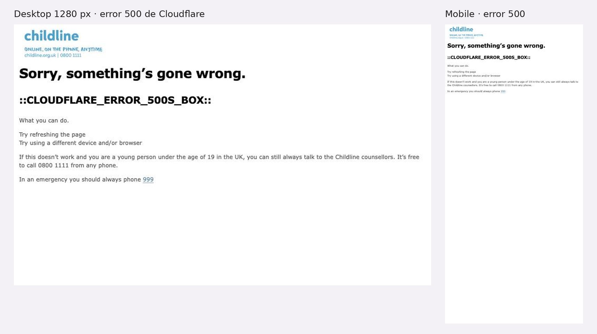

# 3.3.17 - Childline (NSPCC)

> Método: lectura de contenido con WebFetch (17 páginas, 2026-10-05: 14 de childline.org.uk y 3 de nspcc.org.uk). WebFetch devuelve un resumen del HTML, no la página renderizada: menús desplegables, estados interactivos y detalles visuales pueden no aparecer completos. **Desde el navegador propio el sitio no cargó:** childline.org.uk devolvió un error de Cloudflare (500) en mobile y desktop, y nspcc.org.uk bloqueó el acceso (observación propia en el navegador, 2026-10-05). Con WebFetch las páginas sí cargaron. Lo que no se pudo confirmar se indica como "No verificable". Referencias entre corchetes [n] = número en la sección Fuentes.

## Información general
- **Organización:** Childline, servicio gratuito y confidencial de escucha y consejería para chicas, chicos y jóvenes del Reino Unido: "a free, private and confidential service where you can talk about anything" [8]. Fundado en 1986 por Esther Rantzen; desde 2006 es parte de la NSPCC [8]. Footer: "Childline is a service provided by NSPCC Weston House, 42 Curtain Road, London EC2A 3NH. Registered charity numbers 216401 and SC037717" [1].
- **Tipo: Indirect competitor.** Justificación según las definiciones del brief: ofrece **productos similares** a los de Red por la Infancia —contenido para NNyA por edad y tema, guía para pedir ayuda y Report Remove para quitar imágenes íntimas de menores de 18 junto con la Internet Watch Foundation (≈ Bajalo Ya!)— pero para **otro mercado** (Reino Unido; "service not available internationally") [3][5]. A diferencia de RPI, **sí brinda asistencia directa** (consejería 24 h por teléfono, chat y mensajes) [3], por lo que su oferta excede la de la fundación (HECHO [3][5][8]; clasificación = INFERENCIA).
- **Ubicación:** Londres (sede de la NSPCC) y "12 counseling bases across England, Northern Ireland, Scotland, and Wales" [1][8]. Atiende en el Reino Unido, Islas del Canal y Guernsey [3].
- **Oferta:** teléfono 0800 1111 24 h [3]; "1-2-1 counsellor chat" [10]; mensajes desde la cuenta "Your Locker" [11]; consejería en lengua de señas británica (BSL) por SignVideo y en galés [3]; Report Remove con IWF [5]; Info and advice por tema [1]; Toolbox (juegos, Calm zone, Coping Kit, Art Box) [7]; Ask Sam (consultorio con respuestas públicas) [12]; sitio para menores de 12 [4]. Para adultos, la NSPCC tiene su propia línea: "0808 800 5000" [15].
- **Website:** https://www.childline.org.uk (+ https://mylocker.childline.org.uk para la cuenta y https://www.nspcc.org.uk como sitio institucional) [1][11][15].
- **Tamaño o alcance (NSPCC):** "almost 190,000 Childline counselling sessions" en 2023/24; "£85.5 million on helping children" en 2023/24; ingresos totales de £124,7 millones en 2023/24 [16]. La home de la NSPCC dice "a child contacts Childline every 45 seconds", sin año [15]. Edad: "anyone under 19 in the UK" [8].
- **Target audience:** chicas, chicos y jóvenes menores de 19, con un sitio aparte para menores de 12 [4][8]; chicos sordos o con hipoacusia (Deaf Zone, BSL) [1][3]; hablantes de galés [14]. Los adultos se derivan a la NSPCC [15].
- **Unique value proposition:** INFERENCIA: un lugar seguro y gratuito para hablar "about anything", con varias formas de contacto y herramientas para cuidar la privacidad del chico ("Hide page", "Cover your tracks") [1][2][8].
- **Otros datos de posicionamiento:** "Confidentiality promise" en el menú y en el footer [1][9]; redes sociales propias (Facebook, Instagram, TikTok) [1]; costo por acción en la NSPCC ("£4 covers one Childline counselling call") [16].

## Arquitectura y navegación
- **Menú principal tal cual** [1]:
  - **About us:** About Childline · Contacting Childline · Confidentiality promise · Cover your tracks · Childline for under 12s
  - **Info and advice:** Bullying, abuse, safety and the law · You and your body · Deaf Zone · Your feelings · Friends, relationships and sex · Cyngor yn Gymraeg · Home and families · School, college and work
  - **Get support:** Send a message to Childline · 1-2-1 counsellor chat · Ask Sam · Sign to Childline · Childline Cymru
  - **Toolbox:** Videos · Mental health first aid kit · Art Box · Coping Kit · Games · Calm zone
  - **Get involved:** Real life stories · Childline on social media · Sharing your story with Childline
  - **Cuenta:** "Your Locker Sign in" / "Your Locker Sign up" [1]
- **Profundidad:** 3 niveles (menú > sección > tema), por ejemplo Info and advice > Bullying, abuse, safety and the law > Sexting and nudes / Report Remove [5][6] (OBSERVACIÓN).
- **¿Organiza por audiencia?** Sí, por **edad**: un sitio aparte para menores de 12 con menos páginas, textos más simples e ilustraciones ("easier to use as there are fewer pages") y un enlace de vuelta ("Take me to Childline for over 12s") [4]. También por necesidad de acceso (Deaf Zone, Sign to Childline, galés) [1][3]. Dentro del sitio principal, el contenido se ordena por **tema de la vida del chico** (cuerpo, sentimientos, familia, escuela) [1].
- **Buscador:** "Site search" [1].
- **Footer:** Accessibility · Cookies · Confidentiality promise · Terms and Conditions · Privacy policy · Sitemap · Feedback, más redes y datos de la NSPCC [1].
- **Accesos persistentes:** botón "Hide page" ("Leave the site quickly") en todas las páginas leídas [1][2][3][4]; teléfono 0800 1111 como enlace `tel:` [1]. La posición del botón no es clara en las extracciones: Cover your tracks dice que está "at the top or right side of the screen" [2] y la extracción de la home lo ubicó en la zona del footer [1]; a verificar en captura.
- **Adultos:** el sitio no tiene una entrada para madres, padres o docentes; la home solo nombra a la NSPCC en el footer, sin enlace a recursos para adultos [1].

## User flows clave
1. **Pedir ayuda (contactar a Childline).**
   - Pasos: Home > "Need to talk?" o Get support > Contacting Childline, con todas las vías en una página: teléfono "available 24 hours a day and 7 days a week", 1-2-1 chat, mensajes ("we'll usually reply within a day"), BSL por SignVideo (lunes a viernes 8 a 20 h, sábados 8 a 13 h) y galés [1][3].
   - Explica costo y privacidad: "free from most landlines and mobiles in the UK, and your calls won't show up on your phone bill" [3].
   - Emergencia: "In an emergency you should always call 999" [3][10]. En la página de error de Cloudflare también aparecían el 0800 1111 y "In an emergency you should always phone 999" con enlace `tel:999` (observación propia en el navegador). En la home, la extracción no encontró la frase ni el `tel:999` [1].
   - Chat y mensajes requieren cuenta en "Your Locker"; el chat tiene espera ("Wait for counsellor availability") y la propia página dice que el teléfono es "usually the fastest way" [10][11]. Fricción: crear cuenta antes de hablar (INFERENCIA). Requisitos del registro: No verificable (no se abrió mylocker.childline.org.uk) [11].
   - Inconsistencia menor: la home promete respuesta a mensajes "within 24 hours" [1] y la página de mensajes dice "within a day, but sometimes this can take a little longer" con horario "8am-8pm every day" [11].
2. **Salir rápido y cuidar la privacidad.** "Hide page" lleva a Google: "you'll be taken to Google" [2]. La página Cover your tracks explica, por navegador, cómo borrar el historial (Chrome, Safari, Firefox, Edge, Internet Explorer 11), cómo usar la navegación privada, cómo borrar la llamada del registro en iPhone y Android, y qué hacer si hay software de monitoreo (usar otro teléfono, una computadora de la escuela o de la biblioteca) [2]. Cover your tracks está en el menú About us [1].
3. **Quitar un nude (Report Remove con IWF).**
   - Pasos: Report Remove > "Start your report" > cuenta de Childline > verificación de edad opcional con Yoti (13 años o más) > el reporte va a la IWF > novedades en el "Childline locker" [5].
   - Elegibilidad: menores de 18 en el Reino Unido; no cubre plataformas cifradas como WhatsApp [5]. Con documento, la IWF puede quitar la imagen "from all sites"; sin documento, "from most sites" [5].
   - Plazos explicados: "IWF will read all reports within two working days, from Monday to Friday"; 2 a 3 horas en sitios del Reino Unido y posiblemente semanas en servidores de otros países [5].
   - Tono: "But it's not your fault", "the police are there to protect you, not to get you into trouble", "Most of the time, nobody will know that you've made a report" [5].
   - Se llega también desde Sexting and nudes, que explica la ley ("When you're under 18 it's against the law to send nudes...") y aclara "it's unlikely the police would want to prosecute either of you" en una relación entre menores [6].
4. **Contenido por edad (menores de 12).** About us > Childline for under 12s, o el bloque "Under 12?" de la home ("Get advice, play games and visit the Buddy Zone!") [1][4]. Secciones: Info and Advice, Calm Zone, Games, Buddy Zone; mismas vías de contacto y mismo "Hide page" [4].
5. **Toolbox.** Coping Kit, Build Your Happy Place, Mental Health First Aid Kit, Conversation Starter (plantilla descargable para empezar una conversación), Art Box, juegos (Blast Block, Wall of Expression, Link Grid, Balloon), videos y Calm zone [7]. Según la extracción, ninguna herramienta exige cuenta [7].
6. **Donar.** No hay botón de donación en childline.org.uk [1] (INFERENCIA: decisión coherente con un sitio para chicos). La donación y la transparencia están en la NSPCC ("Support us"), con costo por acción ("£3 funds the school safety program for one child", "£4 covers one Childline counselling call") [15][16].
7. **Prensa.** No hay prensa en childline.org.uk [1]. En la NSPCC, "News and features" ordenado por año (2024, 2025, 2026) y derivación al Press Office; teléfono de supporters "020 7825 2505" [17]. Contacto directo del Press Office: No verificable (la extracción no mostró email ni teléfono de prensa) [17].
8. **Público internacional / otros idiomas.** El servicio es solo para el Reino Unido [3]. Idiomas: inglés, galés en páginas seleccionadas (suicidio, autolesiones, salud mental, autocuidado, cómo contactar en galés) [14] y un botón "Translate" en la barra de accesibilidad: "remember that this is automatic so might not always be accurate" [13]. Cuántos idiomas ofrece esa traducción automática: No verificable [13].

## Contenido
- **Claridad:** alta. Las páginas de ayuda responden en orden qué es, cómo funciona, qué pasa después y cuánto tarda (Report Remove) [5]; Cover your tracks da pasos concretos por dispositivo [2].
- **Tono:** cercano, en segunda persona y sin juzgar: "You can talk to us about anything. No problem is too big or too small" [3]; "Nobody has the right to threaten, blackmail or try to manipulate you" [6]. Para menores de 12, frases cortas y lúdicas: "Play one of our games to have fun and take your mind off things" [4]. Sin tono alarmista.
- **Organización:** temas de la vida cotidiana del chico, no por tipo de violencia [1]. La confidencialidad se explica con sus excepciones en lenguaje simple (si la vida corre peligro, si lastima alguien "in a position of trust", por orden judicial) y con la promesa "we'll always try to talk to you about it first" [9].
- **Cantidad de información:** alta, pero repartida en secciones claras y con herramientas interactivas que bajan la carga de lectura [1][7] (OBSERVACIÓN).
- **CTAs (textuales):** "Call 0800 1111", "Speak to a counsellor", "Send a message", "Start your report", "Hide page", "Leave the site quickly", "Take me to Childline for over 12s", "Send a letter to Sam", "Your Locker Sign in", "Your Locker Sign up" [1][4][5][10][11][12].
- **Impacto / transparencia:** no en childline.org.uk [1]. En la NSPCC: cifras 2023/24 (190.000 sesiones, £85,5 millones en programas, "around 75p in every £1 we spend goes directly to helping children") e informes anuales 2021/22 a 2024/25 [16]. Inconsistencia: la página muestra cifras 2023/24 aunque ya lista el informe 2024/25 (OBSERVACIÓN [16]); "every 45 seconds" sin año [15].
- **Presencia en medios / newsroom:** en la NSPCC, noticias por año y Press Office [17]; la home de la NSPCC mostraba notas sobre Esther Rantzen [15].

## Idiomas y accesibilidad (lo verificable desde el contenido)
- **Idiomas:** inglés; galés en páginas seleccionadas y consejería en galés; traducción automática con aviso de que puede no ser exacta [13][14]. BSL para contactar [3].
- **Accesibilidad (señales en el contenido):** barra de accesibilidad con tamaño de texto (+/–), cambio de fuente, modo solo texto y traductor; sección "Screen readers and keyboard shortcuts" [13]. Límite reconocido: la barra no funciona en el chat ni en Your Locker [13]. No declara nivel WCAG ni contacto de accesibilidad [13]. Deaf Zone y video "Contacting Childline when you're d/Deaf" [1][13]. Sitio para menores de 12 con ilustraciones "based on primary school children's preferences" [4].

## First impressions (capturas propias, 2026-10-05)
- **No verificable con capturas.** childline.org.uk devolvió un error 500 de Cloudflare en tres intentos (desktop y mobile) y nspcc.org.uk bloqueó el acceso. Todo lo que dice esta auditoría sale de WebFetch.
- **Lo que sí se observó (OBSERVACIÓN):** incluso la página de error conserva el número ("If this doesn't work and you are a young person under the age of 19 in the UK, you can still always talk to the Childline counsellors. It's free to call 0800 1111 from any phone.") y la indicación "In an emergency you should always phone 999", con enlace `tel:999`. Es un patrón útil para RPI: la ayuda no depende de que el sitio funcione.
- **Desktop / Mobile:** No verificable.

## Visual design
- No verificable sin capturas. Las extracciones mencionan ilustraciones y un sitio aparte para menores de 12 (Buddy Zone) [4].

## Verificación técnica (JavaScript sobre el DOM, 2026-10-05)
| Chequeo | Resultado |
| --- | --- |
| Página de error (lo único que cargó) | Logo, 0800 1111 en texto y `tel:999` |
| Resto de los chequeos | No verificable (error 500 / bloqueo) |

## Ratings finales
| Dimensión | Rating | Por qué |
| --- | --- | --- |
| Desktop | No verificable | Error 500 de Cloudflare |
| Mobile | No verificable | Error 500 de Cloudflare |
| Navegación | Good (solo contenido) | Por necesidad y por edad |
| User flow | Good (solo contenido) | Todas las vías de contacto en una página; Hide page |
| Accesibilidad | Good (preliminar) | Hide page, BSL, galés; sin prueba en el navegador |
| Diseño visual | No verificable | Sin capturas |
| Contenido | Outstanding (solo contenido) | Tono, edad y Report Remove |

## Lentes del objetivo del audit
| Lente | ¿Lo resuelve? | Evidencia |
| --- | --- | --- |
| Navegación por audiencia | Sí | Sitio aparte para menores de 12 con vuelta al de mayores; Deaf Zone, BSL y galés; adultos derivados a la NSPCC [1][3][4][15] |
| Pedir ayuda / derivación | Sí | Todas las vías en una página, 24 h, `tel:`, "call 999" ante emergencia, "Hide page" en todas las páginas y Cover your tracks (pero Childline asiste directamente) [1][2][3] |
| Impacto y credibilidad | Parcial | Nada en Childline; en la NSPCC, cifras 2023/24, costo por acción e informes anuales 2021/22 a 2024/25 [1][16] |
| Prensa | Parcial | Solo en la NSPCC: noticias por año y Press Office sin contacto directo verificable [17] |
| Internacional | No | Servicio solo para el Reino Unido; galés parcial y traducción automática [3][13][14] |

## Qué significa → qué decisión podría afectar
- Un botón "Hide page" en todas las páginas, más una página que explica cómo borrar rastros en cada dispositivo → **afecta** el header de RPI y el contenido de Bajalo Ya! y ReConectate para adolescentes (lente 2; US-13, US-12).
- Una sola página con todas las vías de contacto, costo, privacidad ("won't show up on your phone bill") y "call 999" ante emergencia → **afecta** el diseño de "Necesito Ayuda": 911/137/102 con qué atiende cada uno, si es gratis y si queda registro (lente 2; US-01, US-02, US-03).
- Report Remove explica edad, plazos, alcance y "it's not your fault" en una sola página → **afecta** el texto y la estructura de Bajalo Ya! (lente 2; US-11, US-12, US-28).
- Sitio por edad (menores de 12) con menos páginas y textos simples → **afecta** la navegación por público de RPI y la relación ReConectate/Pantasaurus (lente 1; US-05, US-29, US-27).
- Separar el sitio para chicos (sin donar ni prensa) del sitio institucional (NSPCC, con impacto y prensa) → **afecta** la decisión de dónde ubicar donantes y prensa sin interrumpir rutas de ayuda (lentes 1 y 3; US-15, US-31, US-32).
- La traducción automática con aviso de precisión es una opción de bajo costo → **afecta** la estrategia de idiomas (lente 4; US-25, US-26).

## Evidencia
Capturas: solo la página de error 500 en desktop (1280 px) y en mobile. Archivos: `evidencia/capturas/childline_*.jpg` (hoja resumen: `evidencia/childline_evidencia.jpg`).

## Ratings preliminares (solo contenido, antes de las capturas) (Needs work / Okay / Good / Outstanding, con + y −)
- **Content: Outstanding.** + Tono cercano y sin culpa en todas las páginas sensibles ("it's not your fault") [5][6]; + procesos explicados con plazos y límites (Report Remove, confidencialidad) [5][9]; + contenido adaptado a menores de 12 [4]. − Cifras de impacto fuera del sitio y sin año en la home de la NSPCC [15][16]; − diferencias menores en tiempos de respuesta entre páginas [1][11].
- **Interaction / Navigation: Good.** + Menú por temas de la vida del chico, con buscador [1]; + "Hide page" en todas las páginas [1][2][4]; + sitio aparte para menores de 12 con camino de vuelta [4]. − Menú de 5 secciones con 5 a 8 ítems cada una (más de 30 enlaces) [1]; − sin entrada para adultos en el sitio de Childline [1]; − Cover your tracks está dentro de About us, no junto a Get support [1].
- **User flow: Good.** + Contacto en un paso con teléfono 24 h tocable [1][3]; + Report Remove con pasos, plazos y alcance claros [5]. − Chat, mensajes y Report Remove exigen cuenta en Your Locker [5][10][11]; − el chat tiene espera sin tiempo estimado [10]; − registro no verificado [11].
- **Accessibility (preliminar): Good.** + Barra de accesibilidad con tamaño de texto, modo solo texto y traductor [13]; + BSL y Deaf Zone [1][3]; + galés [14]. − La barra no funciona en chat ni en Your Locker [13]; − sin nivel WCAG declarado [13]; − el sitio no cargó en el navegador propio (Cloudflare 500), por lo que la experiencia real en el celular queda pendiente (observación propia en el navegador).

## Fortalezas
- "Hide page" persistente y página Cover your tracks con pasos por navegador y teléfono [1][2].
- Todas las vías de contacto en una página, con costo, horario, privacidad y "call 999" [3].
- Report Remove: proceso, elegibilidad, plazos y alcance explicados con tono desculpabilizante [5].
- Sitio por edad (menores de 12) con menos páginas, textos simples e ilustraciones [4].
- Confidencialidad explicada con sus excepciones en lenguaje claro [9].
- Toolbox con herramientas para regular emociones mientras se espera o en lugar de leer [7].
- Accesibilidad: barra de herramientas, BSL, Deaf Zone y galés [3][13][14].

## Debilidades
- Chat, mensajes y Report Remove requieren cuenta [5][10][11].
- Sin entrada para adultos ni enlace visible a la NSPCC desde la home [1].
- Impacto y prensa solo en la NSPCC; cifras 2023/24 aunque existe el informe 2024/25 [16][17].
- Servicio solo para el Reino Unido; sin versiones en otros idiomas además del galés parcial [3][14].
- El sitio no cargó desde un navegador real (Cloudflare 500) y la NSPCC bloqueó el acceso: un servicio de crisis que no carga es un riesgo, aunque la página de error mantenía 0800 1111 y 999 (observación propia en el navegador).

## Patrones o ideas relevantes para Red por la Infancia
1. **Botón "Hide page" en todas las páginas, que lleva a Google** → lente 2 (US-13). Aplicable al header de RPI, sobre todo en Bajalo Ya! y ReConectate adolescentes. (HECHO [1][2])
2. **Página "Cómo borrar tus rastros"** (historial, navegación privada, registro de llamadas, qué hacer si alguien controla el teléfono) → lente 2 (US-12, US-13). (HECHO [2])
3. **Una página con todas las vías de ayuda, su costo, horario y si quedan registradas**, más "en emergencia, llamá al 911" → lente 2 (US-01, US-02, US-03). Para RPI: 911, 137 y 102 con qué atiende cada uno. (HECHO [3]; aplicabilidad = INFERENCIA)
4. **Página de quitar imágenes con pasos, plazos y "no es tu culpa"** (Report Remove) → lente 2; modelo de texto para Bajalo Ya! junto con Take It Down y StopNCII (US-11, US-12). (HECHO [5][6])
5. **Sección por edad con menos páginas y textos más simples**, con enlace de vuelta → lente 1 (US-05, US-29). Pantasaurus y ReConectate pueden seguir esta lógica. (HECHO [4])
6. **Separar el sitio de ayuda del institucional:** sin donar ni prensa en las rutas de ayuda; impacto y prensa en el sitio de la NSPCC → lentes 1 y 3 (US-14, US-15, US-31). (HECHO [1][16][17]; INFERENCIA)
7. **Promesa de confidencialidad con excepciones explicadas** → lente 2; ayuda a que Camila se anime a escribir (US-12). (HECHO [9])
8. **Traducción automática con aviso de que puede no ser exacta** → lente 4 (US-25, US-26); opción de bajo costo para idiomas secundarios. (HECHO [13])
9. **Antipatrones a evitar:** exigir cuenta antes de pedir ayuda; dejar a los adultos sin entrada; protección anti-bots que bloquea a usuarios reales en un servicio de crisis → lentes 2 y 5 (US-01, US-04). (OBSERVACIÓN [10][11][1]; observación propia en el navegador)

## Fuentes
Consultadas el 2026-10-05 con WebFetch, salvo donde se indica. **Desde el navegador propio (celular y desktop), childline.org.uk devolvió un error de Cloudflare (500) y nspcc.org.uk bloqueó el acceso: no accesible (bloqueo) para capturas; el contenido se leyó solo con WebFetch.** No se abrió https://mylocker.childline.org.uk (registro de Your Locker): no verificable.
1. https://www.childline.org.uk — home
2. https://www.childline.org.uk/info-advice/bullying-abuse-safety/online-mobile-safety/cover-tracks/ — Cover your tracks
3. https://www.childline.org.uk/get-support/contacting-childline/ — Contacting Childline
4. https://www.childline.org.uk/get-support/u12-landing/ — Childline for under 12s
5. https://www.childline.org.uk/info-advice/bullying-abuse-safety/online-mobile-safety/remove-nude-image-shared-online/ — Report Remove
6. https://www.childline.org.uk/info-advice/bullying-abuse-safety/online-mobile-safety/sexting/ — Sexting and nudes
7. https://www.childline.org.uk/toolbox/ — Toolbox
8. https://www.childline.org.uk/about/about-childline/ — About Childline
9. https://www.childline.org.uk/about/confidentiality-promise/ — Confidentiality promise
10. https://www.childline.org.uk/get-support/1-2-1-counsellor-chat/ — 1-2-1 counsellor chat
11. https://www.childline.org.uk/get-support/contacting-childline/emailing-childline/ — Send a message to Childline
12. https://www.childline.org.uk/get-support/ask-sam/ — Ask Sam
13. https://www.childline.org.uk/legal/accessibility/ — Accessibility
14. https://www.childline.org.uk/info-advice/advice-in-welsh/ — Cyngor yn Gymraeg
15. https://www.nspcc.org.uk — NSPCC, home
16. https://www.nspcc.org.uk/about-us/annual-report/ — NSPCC, informes anuales y cómo se usa el dinero
17. https://www.nspcc.org.uk/about-us/news-opinion/ — NSPCC, News and features

## Capturas

