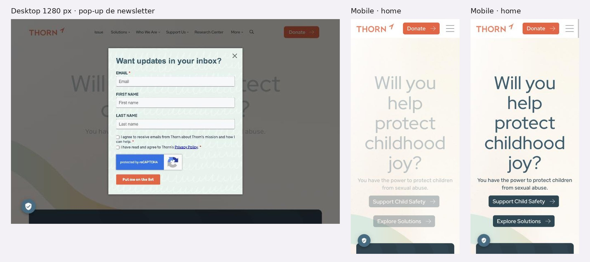

# 3.3.18 - Thorn

> Método: lectura de contenido con WebFetch (17 URLs intentadas, 16 leídas; resúmenes generados por la herramienta a partir del HTML) más observación propia en el navegador del celular. WebFetch no muestra la página renderizada: menús desplegables, estados interactivos y detalles visuales pueden no aparecer completos. Fecha de consulta: 2026-10-05. Referencias entre corchetes [n] = número en la sección Fuentes.

## Información general
- **Organización:** Thorn. Se presenta como "an innovative child safety nonprofit" que "create[s] cutting-edge technology, conduct[s] original research, and foster[s] collaborative partnerships that combat child sexual abuse at scale" [2]. Organización 501(c)(3), EIN 27-0943677 [3][6]. Cofundada por Ashton Kutcher y Demi Moore [2].
- **Tipo: Indirect competitor.** Justificación según el brief: por un lado ofrece un **producto similar para otra audiencia/mercado** (Thorn for Parents y NoFiltr ≈ ReConectate: prevención para familias y adolescentes, pero en inglés y para EE. UU.) [7][16]; por otro, un **producto distinto para una audiencia compartida**: tecnología de detección (Safer) e investigación, que compite por la atención de financiadores y aliados internacionales del ecosistema de protección infantil online, como Maya y Diego [4][14]. No compite por el mismo público argentino (HECHO [7][14][16]; clasificación = INFERENCIA).
- **Ubicación:** 222 Pacific Coast Highway, 10th Floor, El Segundo, California, EE. UU. [9][11]. Herramientas desplegadas en "40 countries" (2025) [3][4].
- **Oferta:** Safer (detección de CSAM y de texto de explotación para plataformas) y consultoría (políticas, prevención, "red teaming" de productos de IA) [14]; herramientas de identificación de víctimas para fuerzas de seguridad (Thorn Detect, clasificador de CSAM) [4][7]; investigación propia (Research Center) [10]; Thorn for Parents (guías de conversación por edad) [16]; NoFiltr (comunidad y prevención para adolescentes) [7]; The Thorn Pledge [1].
- **Website:** https://www.thorn.org (+ parents.thorn.org, nofiltr.org, info.thorn.org/donate, trust.thorn.org, tienda en bonfire.com) [1][16].
- **Tamaño / alcance:** 20.000+ donantes y 85+ empleados (sin año) [2]; 86 empresas tecnológicas usan sus productos y 1.046 agencias usan sus herramientas de identificación de víctimas (2025) [4]; en 2025: 5.303.413 archivos de CSAM sospechado detectados, 1.369.024 instancias de explotación sospechada identificadas, 415,3 mil millones de archivos procesados por clientes [4]. Acumulado: "13,100,000+ files of suspected sexual abuse material flagged" y "1.4 trillion total files processed" (desde 2019, según la página para plataformas) [1][14].
- **Target audience:** plataformas tecnológicas (clientes de Safer) [14]; fuerzas de seguridad y ONG de identificación de víctimas [7]; padres y cuidadores [16]; adolescentes [7]; donantes individuales y mensuales [8][15]; investigadores y sector de políticas públicas [10]; prensa [5].
- **Unique value proposition:** organización sin fines de lucro que construye tecnología de detección a escala y la financia en parte con ingresos propios (venta a plataformas), apoyada en investigación original con jóvenes (HECHO [4][10][14]; formulación = INFERENCIA). Claim de home: "At Thorn, we're building a safer world for all kids." [1]
- **Otros datos de posicionamiento:** modelo de financiamiento declarado por área en el informe 2025 (Research & Insights y Technical Innovation 100% filantrópico; Child Victim Identification 34% filantrópico / 66% ingresos propios; Platform Safety 100% ingresos propios) [4]; "$18 million" de reinversión del TED Audacious Project (sin año en la extracción) [2]; Trust Center propio [1]; integra el Global Policy Board de WeProtect Global Alliance (fuente: auditoría 3.3.19).

## Arquitectura y navegación
- **Menú principal (6 ítems) [1]:** Issue · Solutions · Who We Are · Support Us · Research Center · More. Botón "Donate" fijo en el header (OBSERVACIÓN propia en el navegador [18]).
  - **Solutions:** For Platforms, For Victim Identification, For Parents, For Youth, All Solutions [1].
  - **Who We Are:** Our Impact, Who We Are [1].
  - **Support Us:** Donate, Builders Program, More Ways to Give, Store, Support Us [1].
  - **More:** Contact Us, Blog, Work For Thorn, Newsroom, Privacy Policy, Accessibility [1].
- **Profundidad:** 2–3 niveles en thorn.org (menú > sección > informe/artículo) y salto a subsitios con navegación propia (parents.thorn.org, nofiltr.org, info.thorn.org/donate) (OBSERVACIÓN [1][16]).
- **¿Organiza por audiencia?** **Parcial.** "Solutions" es un submenú por audiencia ("For Platforms", "For Parents", "For Youth", "For Victim Identification") [1][7], pero el primer nivel es institucional (Issue, Who We Are, Support Us). Las soluciones para familias y adolescentes viven en otros dominios [7][16].
- **Buscador:** Sí (HECHO [1]; OBSERVACIÓN propia [18]).
- **Footer:** Issue, Solutions, Who We Are, Support Us, Research Center, Blog, Work for Thorn, Newsroom, Contact Us, Donate, FAQs, Trust Center, Sitemap, Privacy Policy, Accessibility [1].
- **Accesos persistentes:** "Donate" en el header [18]; "Donate Now" aparece dos veces en la home [1]. No hay acceso persistente a ayuda o reporte en la home (OBSERVACIÓN [1]).
- **Selector de idioma:** no existe (HECHO [1]; sin hreflang según observación propia [18]). https://www.thorn.org/es/ devuelve 404 [17].

## User flows clave
1. **Entender en pocos segundos quién es Thorn (modelo para "Who we are").**
   - Home: pregunta-hero emocional ("Will you help protect childhood joy?") con dos CTAs, "Support Child Safety" y "Explore Solutions" [1][18], y debajo una frase de identidad: "At Thorn, we're building a safer world for all kids." [1].
   - Secuencia narrativa de la home: problema ("The internet makes it easier to harm kids") → propuesta ("Let's transform how the world protects children") → "Why Thorn?" → meta ("One bold goal drives our work") → cuatro pilares escritos como acciones en primera persona ("We help find children faster", "We reduce the spread of CSAM", "We conduct novel research", "We build cutting-edge detection tools and safety technologies") → tres cifras acumuladas [1].
   - Who We Are repite el esquema: título ("We're transforming how the world protects kids"), una oración de definición, meta ("to create a world where every child can simply be a kid"), los mismos cuatro pilares, cifras y liderazgo [2].
   - Fricción: no hay un resumen institucional descargable (fact sheet o PDF) en Who We Are; solo hay kit de logos y retrato/biografía de la dirección en Newsroom [2][5]. No verificable si existe en otra URL.
2. **Pedir ayuda / derivación.**
   - Thorn no asiste directamente: Contact Us y FAQs derivan a NCMEC (1-800-THE-LOST y CyberTipline) para reportar CSAM y a NCMEC para sextorsión; FAQs suma la línea de texto "THORN" al 741741 [6][11]. Advertencia en Contact: "Please do not share or distribute child sexual abuse material (CSAM), even in an attempt to report it." [6].
   - Thorn for Parents tiene "Get Help Now" en el footer y un CTA "Visit our help page to find resources and information" [16]; la página de ayuda no se leyó (No verificable).
   - Fricción: la derivación está en Contact y FAQs (bajo "More" y el footer), no en el primer nivel ni en la home [1][6][11]. Todo está pensado para EE. UU.; no hay alternativas para otros países (OBSERVACIÓN [6][11]).
3. **Donar.** Header "Donate" > info.thorn.org/donate (dominio aparte) [1]. Builders Program: donación mensual con beneficios (regalo de bienvenida, webinars, reportes de impacto trimestrales y anual, 10% en la tienda) y gestión autónoma ("Pause, cancel, change your gift amount, or edit your payment method any time") [15]. More Ways to Give: legados, DAF, acciones, cripto, matching, plataformas de giving corporativo (Benevity, YourCause, Bright Funds, CyberGrants), recaudaciones propias [9]. Fricción para donantes fuera de EE. UU.: no se mencionan opciones internacionales ni otras monedas, y el regalo de Builders solo se envía al territorio continental de EE. UU. [9][15].
4. **Sumarse como aliado / partner (US-24).**
   - **Empresas tecnológicas:** For Platforms presenta Safer, consultoría y logos de clientes (Quora, Patreon, Slack, Vimeo, GIPHY, entre otros) con CTA de contacto comercial ("Let's Connect") [7][14]. Es una relación de cliente, no de alianza.
   - **Donantes grandes:** "I am interested in donating a larger gift" → formulario de contacto [11]; email giving@wearethorn.org [9].
   - **ONG u organizaciones aliadas de otros países:** no se encontró una ruta (ni página, ni categoría en el contacto, ni FAQ). FAQ aclara que Thorn "is not a grantmaking organization" [11]. Flujo para aliados: **No verificable / inexistente** en las páginas leídas [1][6][11].
5. **Impacto e informes (lente 3).** Who We Are > Our Impact: cifras acumuladas, resultados 2025 y archivo de informes anuales 2017–2024 [3]. Informe 2025 como página web (no PDF) con navegación rápida en cinco secciones (Research & Insights, Technical Innovation, Child Victim Identification, Platform Safety, Thorn in Action), carta de la CEO ("In the pursuit of child safety, there is no substitute for bold action.") y modelo de financiamiento por área [4]. CTA desde la home: "See the 2025 Impact" [1].
6. **Investigación.** Research Center por tema (CSAM; Sexting and nonconsensual sharing; Grooming and sextortion; Disclosure and reporting), biblioteca, lista de distribución para investigadores y tableros de encuestas "Coming Soon" [10]. Último informe: "Youth Perspectives on Online Safety, 2025" (julio 2026) [10].
7. **Prensa.** More > Newsroom: comunicados fechados (el último, 28/07/2026), menciones en medios con fecha (NBC News y Bloomberg 27/08/2026; Associated Press, Education Week y Yahoo Finance 19/08/2026), kit con variantes de logo y retrato/biografía de la dirección, email pr@wearethorn.org [5].
8. **Público internacional.** Solo inglés: sin selector ni versión /es/ [1][17]; parents.thorn.org también en inglés [16]. Lo internacional aparece como alcance y no como experiencia: herramientas en 40 países, detección en español lanzada en 2025, estudio con "more than 30 practitioners across 8 countries" [3][4][10]. FAQs no responde preguntas de público internacional [11].

## Contenido
- **Claridad:** alta en la presentación institucional: una oración de identidad, una meta y cuatro pilares formulados como verbos ("We help…", "We reduce…", "We conduct…", "We build…") [1][2]. El informe 2025 separa áreas y dice cómo se financia cada una [4].
- **Tono:** emocional y en segunda persona en el hero ("Will you help protect childhood joy?") [1]; afirmativo y de ambición en lo institucional ("One bold goal drives our work", "We're transforming how the world protects kids") [1][2]; sin juicio hacia familias ("judgment-free dialogues with your children are the first step in prevention") [7].
- **Organización:** la home sigue un arco problema → solución → por qué nosotros → pruebas → acción [1]. Issue estructura el problema por temas (Grooming, Sextortion, AI-Generated CSAM, Sexting & Non-Consensual Intimate Imagery) con cifras [12].
- **Cantidad de información:** media en la home; alta en Issue, Research e informe 2025 [4][10][12].
- **CTAs (textuales):** "Donate", "Support Child Safety", "Explore Solutions", "Learn more about the issue", "Explore Our Impact", "Donate Now", "Read Article", "Read the Report", "See the 2025 Impact", "Get the Guide", "More on Who We Are", "Read the Full Pledge" [1]; "See Tech That Protects", "Visit Thorn for Parents", "Explore NoFiltr", "Let's Connect" [7]; "Support the Cause", "Sign Up Today", "Start Learning", "Resources for Parents", "Resources for Teens", "Shop Now" [8]; "Become a Builder" [15]; "Browse our research library", "Join our research distribution list", "Help fund industry-changing research" [10]; "Donate Today" [4].
- **Impacto / transparencia:** informe 2025 web + archivo 2017–2024 [3][4]; cifras de resultado (no solo del problema) con año [4]; reparto filantrópico/ingresos propios por área [4]; EIN visible en varias páginas [3][6][9]; Trust Center [1]. No se encontraron sellos de calificadoras (Charity Navigator u otros) en las páginas leídas [3][8] ni estados financieros (990, auditoría) en Our Impact [3] (No verificable si están en el Trust Center).
- **Inconsistencias:** Who We Are dice "6+ million suspected CSAM files detected on the open web (to date)" mientras la home dice "13,100,000+ files … flagged" [1][2]; pueden ser métricas distintas, pero el visitante no lo puede saber (OBSERVACIÓN). Las cifras de Who We Are (20.000+ donantes, 85+ empleados) no tienen año [2]. La dirección figura como "222 Pacific Coast Highway" [9] y "222 N. Pacific Coast Highway" [13].
- **Presencia en medios / newsroom:** fuerte: comunicados fechados, cobertura reciente en medios nacionales con fecha y kit de prensa [5]. Las investigaciones alimentan los titulares de los comunicados ("1 in 3 Boys Age 9-12…", "1 in 4 Young People…") [5]. Newsroom está bajo "More", no en el primer nivel [1].

## Idiomas y accesibilidad (lo verificable desde el contenido)
- **Idiomas:** solo inglés en thorn.org y parents.thorn.org [1][16]; /es/ da 404 [17]; sin hreflang (observación propia [18]). La única mención a otro idioma es la capacidad de detección en español de su tecnología [4].
- **Accesibilidad (señales en el contenido):** declaración de accesibilidad en el footer, con objetivo WCAG 2.1 nivel AA, última modificación 6 de marzo de 2024 y contacto solo por correo postal [13]. Discussion guides por edad ("Ages 7-9", "Ages 10-12") en Thorn for Parents [16]. Contraste, teclado, lectores de pantalla y texto alternativo: No verificable con el contenido extraído.

## First impressions (capturas propias, 2026-10-05)
- **Primera impresión (OBSERVACIÓN):** en desktop, al entrar aparece un pop-up de newsletter ("Want updates in your inbox?", con email, nombre, apellido, dos casillas y captcha) que tapa el hero. En mobile no apareció en nuestra carga: se ve el titular "Will you help protect childhood joy?", la bajada "You have the power to protect children from sexual abuse." y dos botones, "Support Child Safety" y "Explore Solutions"; "Donate" queda fijo en el header.
- **Claridad de la propuesta:** clara, pero en forma de pregunta al donante; quiénes son llega más abajo.
- **Jerarquía visual:** donar arriba y fijo; soluciones como segunda acción.
- **Desktop — Okay.** + Menú claro (Issue, Solutions, Who We Are, Support Us, Research Center, More) y Donate destacado. − Pop-up de newsletter al entrar.
- **Mobile — Good.** + Titular, bajada y dos acciones en la primera pantalla; Donate fijo; skip link. − El titular ocupa casi toda la pantalla.

## Visual design
- **Branding / identidad — Good.** + Paleta cálida (naranja, crema, azul petróleo) y tipografía amplia.
- **Imágenes:** formas abstractas e ilustraciones; no muestra víctimas.
- **Coherencia entre páginas:** alta.
- **Relación diseño–audiencia:** donantes y empresas tecnológicas; los recursos para familias tienen su propio estilo (INFERENCIA).

## Verificación técnica (JavaScript sobre el DOM, 2026-10-05)
| Chequeo | Resultado |
| --- | --- |
| `lang` | `en-US` |
| Skip link | Sí |
| Imágenes sin `alt` / con `alt` vacío (home) | 0 / 13 de 18 |
| H1 | 1 ("Will you help protect childhood joy?") |
| Enlaces `tel:` (home) | 0 |
| Pop-up al entrar | Newsletter en desktop; no apareció en mobile |
| Zoom bloqueado | No |

## Ratings finales
| Dimensión | Rating | Por qué |
| --- | --- | --- |
| Desktop | Okay | Menú claro; pop-up de newsletter al entrar |
| Mobile | Good | Primera pantalla limpia con dos acciones |
| Navegación | Okay | Soluciones por público; prensa escondida en "More" |
| User flow | Good | Donar, impacto y prensa resueltos; sin camino para aliados |
| Accesibilidad | Okay | Skip link y H1 único; `alt` vacíos |
| Diseño visual | Good | Marca cálida y consistente |
| Contenido | Good | Who we are en capas; cifras que no coinciden |

## Lentes del objetivo del audit
| Lente | ¿Lo resuelve? | Evidencia |
| --- | --- | --- |
| Navegación por audiencia | Parcial | Submenú "Solutions" por público (Platforms, Victim Identification, Parents, Youth); primer nivel institucional y subsitios separados [1][7][16] |
| Pedir ayuda / derivación | Parcial | Deriva a NCMEC (1-800-THE-LOST, CyberTipline) y a 741741 desde Contact y FAQs, fuera del primer nivel; solo para EE. UU. [6][11] |
| Impacto y credibilidad | Sí | Informe 2025 web con cifras del año y financiamiento por área + archivo 2017–2024; EIN visible; sin sellos de calificadoras [3][4] |
| Prensa | Sí | Newsroom con comunicados fechados, cobertura en medios con fecha, kit y email de prensa; ubicado en "More" [1][5] |
| Internacional | No | Solo inglés, /es/ 404, sin opciones para donantes ni aliados de otros países; alcance en 40 países comunicado solo como cifra [1][4][9][17] |

## Qué significa → qué decisión podría afectar
- Una presentación en tres capas (frase de identidad + meta + cuatro pilares como verbos + tres cifras) permite entender a Thorn en segundos → **afecta** el contenido y la estructura de la página "Who we are" en inglés de RPI (lente 4; US-22, US-23).
- Contar el modelo de financiamiento por área en el informe de impacto da credibilidad ante financiadores internacionales → **afecta** la sección de impacto (lente 3; US-15, US-32).
- La ausencia de una ruta para ONG aliadas muestra que el camino para aliados no es obvio ni siquiera en organizaciones grandes; RPI puede diferenciarse con un contacto claro para alianzas → **afecta** la página de alianzas y el contacto internacional (lente 4; US-24).
- Una newsroom alimentada por investigación propia (cada informe genera un comunicado con un dato titular) es el estándar para conseguir notas → **afecta** la sala de prensa (lente 3; US-31, US-32).
- Que una organización con alcance en 40 países sea solo en inglés confirma que el inglés es el idioma de trabajo del ecosistema internacional → **afecta** la prioridad de idiomas: inglés primero para las páginas institucionales (lente 4; US-21, US-22, US-25).

## Evidencia
Capturas: home desktop (1280 px) con el pop-up de newsletter y dos capturas de la home mobile. Archivos: `evidencia/capturas/thorn_*.jpg` (hoja resumen: `evidencia/thorn_evidencia.jpg`).

## Ratings preliminares (solo contenido, antes de las capturas) (Needs work / Okay / Good / Outstanding, con + y −)
- **Content: Good.** + Identidad explicada en una oración, una meta y cuatro pilares como acciones [1][2]; + impacto 2025 con cifras de resultado y modelo de financiamiento por área [4]; + investigación propia que alimenta prensa [5][10]. − Cifras sin año en Who We Are y métricas acumuladas que no coinciden entre home y Who We Are [1][2]; − sin resumen institucional descargable [2].
- **Interaction / Navigation: Okay.** + Menú corto, submenú "Solutions" por audiencia, buscador y footer completo [1]. − Primer nivel institucional; Newsroom y Contact escondidos en "More" [1]; − productos para familias, adolescentes y donación en dominios distintos [1][16].
- **User flow: Good (donar, impacto, prensa) / Needs work (aliados).** + Donación mensual con beneficios y autogestión [15]; + múltiples formas de dar [9]; + informe de impacto navegable [4]; + prensa con contacto y kit [5]. − Sin ruta para ONG aliadas ni donantes internacionales [9][11]; − derivación a ayuda fuera del primer nivel [6][11].
- **Accessibility (preliminar): Okay.** + Declaración WCAG 2.1 AA [13]; guías por edad [16]. − Declaración de 2024 con contacto solo postal [13]; − solo inglés [1][17]. Contraste, teclado y lector de pantalla: No verificable sin capturas.

## Fortalezas
- Presentación institucional muy rápida de leer: frase de identidad, meta y cuatro pilares en primera persona [1][2].
- Informe de impacto 2025 como página web con navegación por áreas, carta de la CEO y financiamiento por área; archivo de informes desde 2017 [3][4].
- Newsroom completa: comunicados fechados, cobertura en medios con fecha, kit y email de prensa [5].
- Research Center por tema, con lista de distribución para investigadores [10].
- Donación mensual (Builders) con beneficios claros y gestión autónoma; 10+ formas de dar [9][15].
- Derivación explícita a NCMEC y advertencia de no compartir CSAM [6][11].
- Declaración de accesibilidad con estándar declarado [13].

## Debilidades
- Solo inglés; /es/ 404; sin atención explícita a públicos de otros países pese a operar en 40 [1][4][17].
- Sin ruta para organizaciones aliadas o socias; las alianzas aparecen solo como venta a plataformas o donación grande [11][14].
- Derivación a ayuda escondida en Contact y FAQs, pensada solo para EE. UU. [6][11].
- Cifras sin año y métricas acumuladas que no coinciden entre páginas [1][2].
- Ecosistema fragmentado en subdominios (parents, nofiltr, info, trust, bonfire) [1][16].
- Sin sellos de calificadoras ni estados financieros en Our Impact [3].
- Declaración de accesibilidad de 2024 con contacto solo postal [13].

## Patrones o ideas relevantes para Red por la Infancia
1. **"Who we are" en tres capas: una oración de identidad + una meta + 3–4 pilares escritos como verbos + 3 cifras con año** → lente 4 y lente 3; modelo directo para la página institucional en inglés (US-22) y para el resumen descargable (US-23). Para RPI, los pilares podrían ser "We prevent…", "We help remove…" (Bajalo Ya!), "We train…" (Campus), "We refer…" (derivación a líneas oficiales). (HECHO [1][2]; aplicación = INFERENCIA)
2. **Home con arco problema → solución → por qué nosotros → pruebas → acción** → lente 3; ordena la home de RPI para donantes y aliados sin tapar la ruta de ayuda (US-15, US-22). (OBSERVACIÓN [1])
3. **Informe de impacto web con secciones por programa y fuente de financiamiento por área** → lente 3; adaptable a escala de RPI: una sección por programa (Bajalo Ya!, ReConectate, Pantasaurus, Campus) con 2–3 cifras del año (US-15, US-32, US-33). (HECHO [4])
4. **Investigación propia → comunicado con dato titular → cobertura con fecha en Newsroom** → lente 3; modelo para la sala de prensa (US-31, US-32) y para el repositorio de publicaciones (US-17). (HECHO [5][10])
5. **Derivación con advertencia de seguridad ("do not share … CSAM, even in an attempt to report it")** → lente 2; aplicable a Bajalo Ya! y a "Necesito ayuda", con las líneas argentinas (US-03, US-12). (HECHO [6])
6. **Gap a ocupar: ruta clara para aliados** → lente 4; Thorn no la tiene. RPI puede ofrecer una página "Partner with us" en inglés con contacto específico de alianzas y prensa internacional (US-24). (HECHO [11]; INFERENCIA)
7. **Antipatrones a evitar:** cifras sin año, métricas acumuladas que no coinciden entre páginas, prensa y contacto escondidos en "More", y un sitio solo en un idioma pese al alcance internacional → lentes 1, 3 y 4 (US-21, US-31). (OBSERVACIÓN [1][2][17])

## Fuentes
Consultadas el 2026-10-05 con WebFetch, salvo [18].
1. https://www.thorn.org — home
2. https://www.thorn.org/about/ — Who We Are
3. https://www.thorn.org/about/our-impact/ — Our Impact
4. https://www.thorn.org/about/our-impact/2025-impact-report/ — Impact Report 2025
5. https://www.thorn.org/newsroom/ — Newsroom
6. https://www.thorn.org/contact/ — Contact Us
7. https://www.thorn.org/solutions/ — Solutions
8. https://www.thorn.org/support/ — Support Us
9. https://www.thorn.org/support/more-ways-to-give/ — More Ways to Give
10. https://www.thorn.org/research/ — Research Center
11. https://www.thorn.org/faqs/ — FAQs
12. https://www.thorn.org/issue/ — Issue
13. https://www.thorn.org/accessibility/ — declaración de accesibilidad
14. https://www.thorn.org/solutions/for-platforms/ — For Platforms (Safer)
15. https://www.thorn.org/support/builders-program/ — Builders Program
16. https://parents.thorn.org/ — Thorn for Parents
17. https://www.thorn.org/es/ — no accesible (404)
18. Observación propia en el navegador del celular, 2026-10-05 (header con "Donate", hero y CTAs, encabezados de la home, solo inglés sin hreflang, buscador y "Contact Us")

## Capturas

