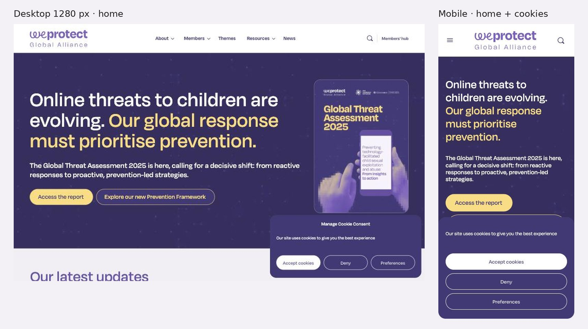

# 3.3.19 - WeProtect Global Alliance

> Método: lectura de contenido con WebFetch (17 URLs; resúmenes generados por la herramienta a partir del HTML) más observación propia en el navegador del celular. WebFetch no muestra la página renderizada: los contadores animados de la home salieron en "0" y las páginas Global Threat Assessment 2025 y Publications devolvieron solo metadatos o estilos, por lo que su contenido queda como "No verificable". Fecha de consulta: 2026-10-05. Referencias entre corchetes [n] = número en la sección Fuentes.

## Información general
- **Organización:** WeProtect Global Alliance. Se presenta como "a global movement dedicated to ending the sexual exploitation and abuse of children online" [2] y como "The Alliance brings together experts from government, the private sector and civil society to protect children from sexual exploitation and abuse online." [10][13]. Creada en 2014 por el Gobierno del Reino Unido; en mayo de 2016 "WePROTECT merged with the Global Alliance Against Child Sexual Abuse Online"; independiente desde abril de 2020 [13].
- **Tipo: Indirect competitor.** Justificación según el brief: ofrece un **producto distinto** (una alianza de membresía que convoca, produce marcos de política e investigación global; no hace prevención directa con familias ni derivación) para una **audiencia compartida**: aliados internacionales como Maya y los mismos financiadores internacionales del sector (Oak Foundation, Children's Investment Fund Foundation, Porticus, Unión Europea, entre otros) [4][7]. Además, RPI es miembro: "Fundacion Red por la Infancia" figura en el directorio de miembros, con fecha 7 de julio de 2025 [5] (confirmado en una segunda lectura). Es a la vez ecosistema propio y competencia por financiamiento y visibilidad internacional (HECHO [4][5][7]; clasificación = INFERENCIA).
- **Ubicación:** 16 Upper Woburn Place, Londres, Reino Unido [10]. Publica formularios ANBI junto con sus informes anuales [11]; INFERENCIA: ANBI es un estatus fiscal neerlandés, por lo que la entidad podría estar registrada en Países Bajos (No verificable con las páginas leídas).
- **Oferta:** membresía de la alianza (gobiernos, sociedad civil, sector privado, organismos intergubernamentales) [4][14]; Global Threat Assessment (2025 la más reciente) [1][8]; Model National Response y Prevention Framework [1][15]; Global Summits y eventos para miembros [1][2]; Members' Hub con directorio, foro cerrado y biblioteca [14]; recursos de participación de niñas, niños y sobrevivientes [17].
- **Website:** https://www.weprotect.org (Members' Hub con login en /welogin) [1].
- **Tamaño / alcance:** "over 350 member organisations" [1][14]; más de 150 logos de organizaciones de sociedad civil en la página Civil society (conteo de la extracción) [6]. Los contadores de la home por sector (gobiernos, empresas, sociedad civil, organismos intergubernamentales) salieron en "0" por ser animados: **No verificable** [1]. La página del directorio muestra "Total members: 0" aunque lista cientos de organizaciones [5] (OBSERVACIÓN; confirmar en captura).
- **Target audience:** gobiernos, organizaciones de sociedad civil con foco en protección infantil, empresas tecnológicas y financieras, organismos intergubernamentales [4]; donantes institucionales [7]; prensa [10]. No se dirige a familias, adolescentes ni víctimas en busca de ayuda [10][17].
- **Unique value proposition:** ser la red multisectorial global que fija el marco común (Model National Response, Global Threat Assessment) y reúne a gobiernos, empresas y ONG en un mismo espacio (HECHO [2][13][15]; formulación = INFERENCIA). Claim de home: "Online threats to children are evolving. Our global response must prioritise prevention." [1]
- **Otros datos de posicionamiento:** Global Policy Board con representantes de gobiernos (EE. UU., Emiratos Árabes Unidos), empresas (Snap, Google), sociedad civil (ECPAT International, INHOPE, Thorn), organismos intergubernamentales (Comisión Europea, UNICEF) y fundaciones (CIFF) [11]; estrategia 2026–2028 [3]; certificación de equivalencia a "U.S. public charity" (NGOsource) para donantes de EE. UU. [7].

## Arquitectura y navegación
- **Menú principal [1][18]:** Home · About · Members · Themes · Resources · News, más "MEMBERS' HUB" y "Log In" (observación propia en el navegador [18]).
  - **About:** Strategy and impact, Governance, Donors, History, People, Work with us [1].
  - **Members:** Member directory, Membership information, Member engagement, Governments, Civil society, Private sector, Intergovernmental orgs [1].
  - **Resources:** Frameworks, Publications, Library, Global Summits, Member events, Case studies, Children and survivors (y Campaigns en un menú secundario) [1].
- **Profundidad:** 2–3 niveles en el sitio público (menú > sección > recurso), más un área privada (Members' Hub) con directorio, foro y biblioteca [1][14].
- **¿Organiza por audiencia?** **Parcial.** El submenú Members segmenta por **sector** (Governments, Civil society, Private sector, Intergovernmental orgs), que son sus audiencias reales [1]. El primer nivel es institucional y temático [1].
- **Buscador:** Sí (HECHO [1][12]).
- **Footer:** mínimo: Privacy, Cookies, Terms, Contact, "© WeProtect Global Alliance - 2026", redes (Facebook, LinkedIn, X/Twitter, YouTube) [1].
- **Accesos persistentes:** "Explore alliance membership" y "Subscribe to our newsletter" se repiten al pie de casi todas las páginas [1][3][5][9][15]. Banner de cookies con "Accept cookies", "Deny" y "Preferences" (observación propia [18]).
- **Selector de idioma:** no existe [1]. https://www.weprotect.org/es/ no devuelve una versión en español: abre una página en inglés ("Estimates of childhood exposure to online sexual harms and their risk factors") [16].

## User flows clave
1. **Entender en pocos segundos quién es WeProtect (modelo para "Who we are").**
   - Home: el hero no dice quién es la organización, sino su postura ("Online threats to children are evolving. Our global response must prioritise prevention.") y lleva a su producto principal con "Access the report" (Global Threat Assessment 2025) [1][18].
   - About resuelve la identidad en cuatro piezas: definición en una oración ("a global movement dedicated to ending…"), visión ("A digital world free of child sexual exploitation and abuse."), misión y tres valores (Empowerment, Accountability, Respect), más el dato de 350+ miembros [2].
   - History cuenta el origen en una línea de tiempo (2012, 2013, 2014, 2015, 2016, 2018, 2020, 2022, 2023) [13].
   - Fricción: la definición en una oración está en About, no en la home; quien entra por la home ve primero una postura y un informe (OBSERVACIÓN [1][2]). No se encontró un resumen institucional descargable (fact sheet); sí el Annual Report 2024 en PDF [3].
2. **Sumarse como miembro / aliado (US-24).**
   - Pasos: Members > Membership information (o "Explore alliance membership" desde cualquier página) > leer criterios > descargar el formulario ("WPGA-membership-application-form.docx") > completarlo > enviarlo por email a la Secretaría [4].
   - **Quién puede:** estados miembro de la ONU, organizaciones internacionales y regionales, "A civil society organisation with a child protection focus", empresas tecnológicas e instituciones financieras, que operen a nivel nacional y/o internacional [4].
   - **Qué ofrece:** "Exclusive access to a global network", "A voice in global strategy", "High-profile commitment", "Invitations to premier events", "Access to shared knowledge", "Access to expert analysis and advice" [4].
   - **Qué pide:** designar un contacto senior y uno operativo en el primer mes; registrarse en el Members' Hub en el primer mes; "Make a public statement to announce membership of the Alliance within the first year"; participar en eventos y cumbres; implementar el Model National Response y la Global Strategic Response; contribuir a los Global Threat Assessments e informar avances "at least once every two years"; asegurar la participación de víctimas/sobrevivientes y de NNyA; los gobiernos deben firmar y ratificar el Convenio de Lanzarote [4].
   - **Plazo:** "We aim to review and provide an outcome of your application within two months." [4]. No se mencionan cuotas [4].
   - Después del ingreso: grupos de referencia por sector que se reúnen "at least twice" al año, grupos de trabajo intersectoriales, foro cerrado y directorio para contactar a otros miembros [6][14].
   - Fricciones: formulario en Word enviado por email, sin formulario web ni confirmación automática (OBSERVACIÓN [4]); la dirección de email aparece ofuscada en el código [4].
3. **Financiar (donantes institucionales).** About > Donors: logos de 8 financiadores (Oak Foundation, Children's Investment Fund Foundation, European Union, Ignite Philanthropy, Interfaith Alliance for Safer Communities, un donante individual, Porticus, Together for Girls); contacto por info@weprotectga.org; beneficios para donantes (actualizaciones, invitaciones a eventos y roundtables) [7]. No muestra montos ni botón de donación [7]. Fricción: la certificación NGOsource para donantes de EE. UU. figura vigente "through December 31, 2025", ya vencida a octubre de 2026 (OBSERVACIÓN [7]).
4. **Impacto y rendición de cuentas (lente 3).** Strategy and impact: estrategia 2026–2028 con tres pilares (Convening, Knowledge sharing, Impact) y tres habilitadores (Participation, Communication, Corporate), y el Annual Report 2024 en PDF [3]. Governance: informes anuales y formularios ANBI 2023, 2024 y 2025, actas del Board (hasta diciembre de 2025) y políticas de safeguarding, whistleblowing y código de conducta; "Last Updated: 26 June 2026" [11]. Inconsistencia: Strategy and impact ofrece el informe 2024 mientras Governance ya lista el de 2025 [3][11].
5. **Informes globales.** Global Threat Assessment 2025: publicado el 18/11/2025 [8]. Cifras, formatos e idiomas del informe: **No verificable** (WebFetch solo devolvió metadatos) [8]. Model National Response: PDF en árabe, inglés, francés, portugués y español, más guía interactiva de implementación, herramienta de autoevaluación y Maturity Model (2022) [15]. Publications: **No verificable** (contenido no extraíble) [12].
6. **Prensa.** News con filtros (Blog, Media, News, Press release, Statement, Summit) y novedades fechadas (la última, 23/09/2026) [9]. Contacto de prensa media@weprotectga.org en Contact [10]. No se vio kit de prensa ni menciones en medios [9][10].
7. **Pedir ayuda / derivación.** No existe: Contact y Children and survivors no mencionan líneas de ayuda ni enlaces de reporte [10][17]. INFERENCIA: es coherente con su rol de alianza, pero quien llega buscando ayuda no tiene salida.
8. **Público internacional.** Todo el sitio es en inglés, sin selector [1][16], aunque su público es global. Las traducciones se concentran en el producto que usan los países: Model National Response en 5 idiomas [15].

## Contenido
- **Claridad:** alta en Membership information (criterios, beneficios, obligaciones y plazo en una sola página) [4] y en About (definición, visión, misión, valores) [2]. Media en la home: el hero es una postura y no una presentación [1].
- **Tono:** institucional, de política pública y en plural colectivo ("Our global response must prioritise prevention", "Join us in our mission…", "Ready to join forces for a safer digital future?") [1][2][4].
- **Organización:** home por bloques de producto y comunidad: "Our latest updates" → "Solutions are possible" (con "Building knowledge to drive change", "Practical tools to guide country responses", "Supporting children and survivors", "Bringing together changemakers") → "Alliance members" → "Global Summit 2024" → "Our key products" [1].
- **Cantidad de información:** media en las páginas públicas; gran parte del valor (biblioteca, directorio, foro) queda detrás del login [14].
- **CTAs (textuales):** "Access the report", "Explore our new Prevention Framework", "View resources", "Strategic response", "Child participation", "See our events", "More about our members", "Explore alliance membership", "Subscribe to our newsletter" [1]; "Apply to become a member", "Download the application form at the bottom of this page" [4]; "Access the Members' hub", "See the full library" [14]; "Download", "Interactive implementation guide", "Contact us" [15].
- **Impacto / transparencia:** fuerte en gobernanza (informes anuales 2023–2025, actas, políticas, lista de financiadores) [7][11]; débil en cifras de resultados en las páginas públicas: la estrategia describe pilares y no resultados medidos [3]. La cifra de miembros es la única constante (350+) [1][14].
- **Contenido desactualizado:** la home muestra "Global Summit 2024" (4–5 de diciembre de 2024, Abu Dhabi) en octubre de 2026 [1][2][18]; certificación NGOsource vencida el 31/12/2025 [7]; Strategy and impact enlaza al informe 2024 y no al 2025 [3][11].
- **Presencia en medios / newsroom:** News mezcla blog, comunicados y declaraciones con filtros por tipo [9]; email de prensa en Contact [10]. Sin kit, sin menciones en medios, sin voceros identificados para prensa (OBSERVACIÓN [9][10]).

## Idiomas y accesibilidad (lo verificable desde el contenido)
- **Idiomas:** sitio solo en inglés, sin selector; /es/ no es una versión en español [1][16]. Model National Response en árabe, inglés, francés, portugués y español [15]. Idiomas del Global Threat Assessment 2025: No verificable [8].
- **Accesibilidad (señales en el contenido):** no se encontró declaración de accesibilidad en el footer (solo Privacy, Cookies, Terms, Contact) [1]. El formulario de contacto limita el mensaje a 500 caracteres y exige aceptar GDPR [10]. Contadores animados que, sin JavaScript, muestran "0" [1] (INFERENCIA: posible problema para lectores de pantalla; verificar en DOM). Contraste, teclado y texto alternativo: No verificable.

## First impressions (capturas propias, 2026-10-05)
- **Primera impresión (OBSERVACIÓN):** hero violeta con "Online threats to children are evolving. Our global response must prioritise prevention.", la bajada sobre el Global Threat Assessment 2025 y dos botones, "Access the report" y "Explore our new Prevention Framework", junto a la tapa del informe. Menú: About, Members, Themes, Resources, News, buscador y "Members' hub". Banner de cookies con "Accept cookies", "Deny" y "Preferences", que en mobile tapa media pantalla.
- **Claridad de la propuesta:** abre con una postura y un informe; quiénes son queda en About.
- **Jerarquía visual:** el informe primero; la membresía, más abajo ("Explore alliance membership").
- **Desktop — Good.** + Menú corto y buscador; acciones claras. − No dice quiénes son en la primera pantalla.
- **Mobile — Okay.** + Titular legible. − Cookies que tapan la mitad; todo el menú detrás de la hamburguesa.

## Visual design
- **Branding / identidad — Good.** + Violeta y amarillo, tipografía redondeada, consistente.
- **Imágenes:** tapas de informes e ilustraciones; no muestra víctimas.
- **Coherencia entre páginas:** alta.
- **Relación diseño–audiencia:** gobiernos, empresas y organizaciones; tono de política pública.

## Verificación técnica (JavaScript sobre el DOM, 2026-10-05)
| Chequeo | Resultado |
| --- | --- |
| `lang` | `en-GB` |
| Skip link | No |
| Imágenes sin `alt` / con `alt` vacío (home) | 0 / 3 de 14 |
| H1 | 2 ("WeProtect Global Alliance" y el titular) |
| Enlaces `tel:` | 0 |
| Buscador | Sí |
| Zoom bloqueado | No |
| Contenido vencido en la home | Bloque "Global Summit 2024" (octubre de 2026) |

## Ratings finales
| Dimensión | Rating | Por qué |
| --- | --- | --- |
| Desktop | Good | Claro, con informe y acciones |
| Mobile | Okay | Legible; cookies que tapan media pantalla |
| Navegación | Okay | Members por sector; público general sin entrada |
| User flow | Good (membresía) / Needs work (ayuda) | Membresía explicada paso a paso; formulario .docx |
| Accesibilidad | Okay | `alt` mayormente completos; dos H1 y sin skip link |
| Diseño visual | Good | Marca consistente |
| Contenido | Okay | Informes y gobernanza; contenido desactualizado |

## Lentes del objetivo del audit
| Lente | ¿Lo resuelve? | Evidencia |
| --- | --- | --- |
| Navegación por audiencia | Parcial | Submenú Members por sector (Governments, Civil society, Private sector, Intergovernmental orgs); primer nivel institucional [1] |
| Pedir ayuda / derivación | No | Sin líneas ni enlaces de reporte en Contact ni en Children and survivors [10][17] |
| Impacto y credibilidad | Parcial | Informes anuales 2023–2025, actas, políticas y financiadores con logo; pocas cifras de resultado y contenido desactualizado (Summit 2024, NGOsource 2025) [1][3][7][11] |
| Prensa | Parcial | News con filtro por tipo y email de prensa; sin kit ni menciones en medios [9][10] |
| Internacional | Parcial | Sitio solo en inglés; Model National Response en 5 idiomas; proceso de membership abierto a organizaciones de cualquier país [4][15][16] |

## Qué significa → qué decisión podría afectar
- Una página de membresía con criterios, beneficios, obligaciones, pasos y plazo es el modelo más completo visto para el camino de aliados → **afecta** la página de alianzas de RPI y su contacto (lente 4; US-24, US-16).
- Separar la presentación institucional (About: una oración + visión + misión + valores) de la home de postura muestra el riesgo de que la home no diga quién es la organización → **afecta** la decisión de que la home de RPI diga en la primera pantalla qué hace y qué no hace (lente 4 y lente 2; US-03, US-22).
- Traducir solo el producto que usan los países (Model National Response en 5 idiomas) y dejar el sitio en inglés → **afecta** la estrategia de idiomas: inglés para lo institucional y traducción focalizada (lente 4; US-21, US-25, US-26).
- La transparencia por gobernanza (informes anuales, actas, políticas, lista de financiadores) da credibilidad ante financiadores institucionales → **afecta** la sección de impacto y transparencia (lente 3; US-15, US-32).
- RPI ya figura en el directorio de miembros: la membresía es un activo de credibilidad para mostrar en "Who we are" (lente 3 y 4; US-22, US-23). (HECHO [5]; uso = INFERENCIA)

## Evidencia
Capturas: home desktop (1280 px) y home mobile con cookies. Archivos: `evidencia/capturas/weprotect_*.jpg` (hoja resumen: `evidencia/weprotect_evidencia.jpg`).

## Ratings preliminares (solo contenido, antes de las capturas) (Needs work / Okay / Good / Outstanding, con + y −)
- **Content: Okay.** + About claro (definición, visión, misión, valores) e historia en línea de tiempo [2][13]; + membresía explicada de punta a punta [4]. − La home no dice quién es la organización [1]; − pocas cifras de resultado [3]; − contenido desactualizado (Summit 2024, NGOsource 2025, informe 2024 en Strategy) [1][3][7].
- **Interaction / Navigation: Okay.** + Menú corto con submenús claros y segmentación por sector en Members [1]; + "Explore alliance membership" persistente [1][3]. − Footer mínimo, sin accesos a prensa ni a donantes [1]; − buena parte del valor detrás del login [14]; − contadores y directorio con "0" en la extracción [1][5].
- **User flow: Good (membresía) / Needs work (ayuda).** + Membresía con criterios, beneficios, obligaciones, pasos y plazo de dos meses [4]; + ruta clara para donantes institucionales [7]. − Formulario .docx por email [4]; − ninguna salida para quien busca ayuda [10][17].
- **Accessibility (preliminar): Needs work.** + Model National Response en 5 idiomas [15]. − Sin declaración de accesibilidad visible [1]; − solo inglés en el sitio [1][16]; − contadores animados que sin JavaScript muestran "0" [1]. Contraste, teclado y lector de pantalla: No verificable sin capturas.

## Fortalezas
- Página de membresía completa: quién puede, qué gana, qué se compromete, pasos y plazo [4].
- About con identidad en cuatro piezas (definición, visión, misión, valores) e historia con fechas [2][13].
- Gobernanza transparente: informes anuales y formularios ANBI 2023–2025, actas del Board, políticas [11].
- Financiadores visibles con logo y contacto para nuevos donantes [7].
- Traducción focalizada del producto clave (Model National Response en 5 idiomas) [15].
- Segmentación por sector en Members y espacios por sector después del ingreso (reference groups) [1][14].
- News con filtro por tipo de contenido [9].

## Debilidades
- La home no presenta a la organización: el hero es una postura y un informe [1].
- Contenido desactualizado a octubre de 2026 (Global Summit 2024, NGOsource vencido, informe 2024 en Strategy) [1][3][7].
- Proceso de ingreso con formulario Word por email [4].
- Pocas cifras de resultado públicas [3].
- Sin derivación para quien busca ayuda [10][17].
- Solo inglés; /es/ no lleva a una versión en español [16].
- Prensa sin kit ni menciones en medios [9][10].
- Sin declaración de accesibilidad [1].

## Patrones o ideas relevantes para Red por la Infancia
1. **Página "Partner with us" con la estructura de Membership information: quién puede sumarse, qué gana, qué se compromete, pasos y plazo de respuesta** → lente 4; modelo directo para el camino de aliados de RPI (US-24) y para empresas (US-16), con un formulario web en vez de un .docx por email. (HECHO [4]; mejora = INFERENCIA)
2. **Identidad en cuatro piezas (una oración + visión + misión + valores) más historia con fechas** → lente 4; insumo para "Who we are" en inglés (US-22) y para el resumen descargable (US-23). A diferencia de WeProtect, RPI debería poner la oración de identidad en la home. (HECHO [1][2][13])
3. **Mostrar la membresía en redes internacionales como prueba de credibilidad** → lente 3 y 4; RPI figura en el directorio de WeProtect y puede mostrarlo en "Who we are" con el logo de la alianza (US-22, US-32). (HECHO [5]; INFERENCIA)
4. **Transparencia por gobernanza (informes anuales, políticas, financiadores con logo)** → lente 3; adaptable a escala de RPI: informe anual, lista de financiadores y política de protección (safeguarding) descargables (US-15, US-17, US-32). (HECHO [7][11])
5. **Traducción focalizada del producto que usan otros países** → lente 4; para RPI, traducir primero lo institucional y Bajalo Ya! (US-21, US-25, US-26). (HECHO [15]; INFERENCIA)
6. **Antipatrones a evitar:** eventos viejos en la home, certificaciones vencidas, informe del año anterior en una página y del actual en otra, contadores que sin JavaScript muestran "0" → lentes 3 y 5; refuerza la necesidad de que el equipo actualice impacto sin trabajo extra (US-19, US-33). (OBSERVACIÓN [1][3][7][11])

## Fuentes
Consultadas el 2026-10-05 con WebFetch, salvo [18].
1. https://www.weprotect.org — home (contadores animados extraídos como "0")
2. https://www.weprotect.org/about-us/ — About
3. https://www.weprotect.org/about-us/strategy-and-impact/ — Strategy and impact
4. https://www.weprotect.org/members/membership-information/ — Membership information
5. https://www.weprotect.org/members/member-directory/ — Member directory
6. https://www.weprotect.org/members/civil-society/ — Civil society
7. https://www.weprotect.org/about-us/our-donors/ — Our donors
8. https://www.weprotect.org/global-threat-assessment-25/ — Global Threat Assessment 2025 (contenido parcial: solo metadatos)
9. https://www.weprotect.org/news/ — News
10. https://www.weprotect.org/contact/ — Contact
11. https://www.weprotect.org/about-us/governance/ — Governance
12. https://www.weprotect.org/resources/publications/ — Publications (contenido no extraíble)
13. https://www.weprotect.org/about-us/history/ — History
14. https://www.weprotect.org/members/member-engagement/ — Member engagement
15. https://www.weprotect.org/resources/frameworks/model-national-response/ — Model National Response
16. https://www.weprotect.org/es/ — no hay versión en español (abre una página en inglés)
17. https://www.weprotect.org/resources/child-and-survivor-participation/ — Child and survivor participation
18. Observación propia en el navegador del celular, 2026-10-05 (menú con "MEMBERS' HUB" y "Log In", hero y "Access the report", bloques de la home incluido "Global Summit 2024", CTAs de membresía, banner de cookies)
- Nota: los nombres de personas que aparecen en Governance y Civil society se omiten a propósito; no hacen falta para la auditoría.

## Capturas

