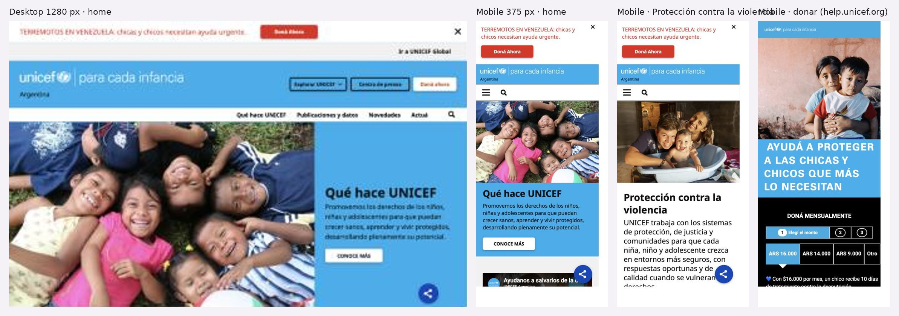

# 3.3.2 - UNICEF Argentina

> Método: lectura de contenido con WebFetch (14 páginas, 2026-10-05). WebFetch devuelve un resumen del HTML, no la página renderizada: menús desplegables, estados interactivos y detalles visuales pueden no aparecer completos. Lo que no se pudo confirmar se indica como "No verificable".

## Información general
- **Organización:** UNICEF Argentina, oficina de país del Fondo de las Naciones Unidas para la Infancia. Sede en Paraguay 733, CABA [F4].
- **Tipo: Direct competitor** (reclasificado). Justificación según las definiciones del brief: UNICEF Argentina ofrece un producto similar —contenidos y guías de prevención de violencias contra NNyA, incluida la violencia digital— a la **misma audiencia en el mismo mercado** (familias, cuidadores y equipos que trabajan con NNyA en Argentina, además de donantes, empresas y prensa) [F5][F14]. La diferencia es de escala y de agenda (también trabaja salud, nutrición y educación) y que no deriva a líneas de ayuda [F1][F2][F5].
  - *Iteración:* la primera lectura del contenido lo clasificó como indirecto por su agenda amplia. Al comparar con los otros cuatro, es el único que publica recursos de prevención de violencias para el mismo público argentino, y es el que compite por la misma atención de familias, docentes, donantes y periodistas. Por eso pasa a directo.
- **Ubicación:** Buenos Aires, alcance nacional [F4][F5].
- **Oferta:** programas en 4 áreas prioritarias [F2]; publicaciones, guías y un sistema de indicadores en Power BI [F8]; guías para periodistas y monitoreo de medios [F3]; donación mensual online, telefónica, presencial, por legado y por depósito [F6][F11]; alianzas corporativas [F10]; campañas y eventos [F7].
- **Website:** https://www.unicef.org/argentina (institucional) + https://help.unicef.org/argentina (donaciones) [F1][F6].
- **Tamaño o alcance:** HECHO: la meta en protección es llegar a 1,5 millones de NNyA hacia 2030 [F5]. Global: presencia en "190 países y territorios" [F9]. No se encontraron en las páginas consultadas cifras de presupuesto ni de donantes de Argentina.
- **Target audience:** donantes individuales (sobre todo mensuales), empresas, prensa, profesionales y organismos de protección/judiciales, familias y cuidadores, postulantes y proveedores [F1][F3][F5][F7][F10][F12].
- **Unique value proposition:** INFERENCIA: autoridad global de la ONU + evidencia propia sobre niñez en Argentina ("Promovemos los derechos de los niños, niñas y adolescentes" [F1]); la convierte en referencia de datos para medios y gobierno.
- **Otros datos de posicionamiento:** banner de emergencia internacional en la home ("Terremotos en Venezuela") vinculado a donación de emergencia [F1]; lema/hashtag "#Paracadainfancia" en páginas temáticas [F5]; denuncia de fraude/abuso en el footer [F1].

## Arquitectura y navegación
- **Menú principal (header) tal cual** [F1][F7]:
  - Ir a UNICEF Global (→ https://www.unicef.org/es) [F13]
  - Explorar UNICEF → Conocé UNICEF / Qué hace UNICEF / Trabajá con UNICEF / Contactate con UNICEF
  - Centro de prensa
  - Doná ahora (botón, → help.unicef.org/argentina/dona) [F11]
- OBSERVACIÓN: en el Centro de prensa la lectura del menú mostró además "Qué hace UNICEF", "Publicaciones y datos", "Novedades", "Actúa" [F3]; probablemente sean ítems de navegación secundaria o del footer. No verificable sin captura.
- **Profundidad:** home → sección (Qué hace) → área temática (p. ej. Protección contra la violencia) → proyecto / comunicado / publicación = 3–4 niveles [F2][F5].
- **Organización por audiencia:** **No.** El menú se organiza por institución (Conocé/Qué hace/Trabajá/Contacto) y por tema [F1][F2]. Las audiencias aparecen recién en segundo nivel: "Actúa" (8 formas de participar) [F7], Centro de prensa (periodistas) [F3], Alianzas corporativas (empresas) [F10] y Contacto segmentado ("Si sos donante… / Si sos periodista…") [F4].
- **Buscador:** sí, formulario de búsqueda con opción de limpiar y filtros mostrar/ocultar [F3][F5][F8].
- **Footer** [F1][F7]: bloques "UNICEF inicio" (Qué hace, Publicaciones, Novedades, Actúa), "Conocé UNICEF" (Centro de prensa, Trabajá, Contactate), "Campañas" (Eventos especiales, Acciones con empresas/Alianzas, Emergencias, Formas de donar, Aumentá tu donación, Solicitud de cese de donación), redes (Facebook, Instagram, X/Twitter, TikTok, YouTube, LinkedIn), legales (Contáctanos, Aviso legal, Denunciar fraude/abuso/irregularidades, Cookie settings).
- **Selector de idioma/país:** el sitio de Argentina no tiene selector de idioma; solo español [F1][F8]. El puente al resto del mundo es el link "Ir a UNICEF Global" [F1][F13]. El sitio global ofrece English, Français, Español, árabe y chino [F9][F13], y el acceso a oficinas de país está bajo "Dónde trabajamos" [F13]. No verificable la URL exacta que lleva desde el sitio global a Argentina.

## User flows clave
1. **Pedir ayuda / derivación — no existe.** HECHO: en la home, Protección contra la violencia y Contacto no aparecen 102, 137, 911 ni una sección "pedir ayuda" [F1][F4][F5]. Protección cita la "Línea Nacional de Asistencia" solo como fuente de un dato (60% de casos involucran a menores) sin número ni link [F5]. La guía "Cuando las pantallas hablan" dice orientar sobre "dónde solicitar apoyo y cómo realizar una denuncia", pero dentro del PDF; la página web no muestra líneas [F14]. Fricción: una persona en crisis tendría que descargar un PDF de 3 MB [F14]. INFERENCIA: es coherente con su rol (no es servicio de atención), pero deja un hueco.
2. **Donar — flujo maduro y omnipresente.** "Doná ahora" en header, footer, banners y páginas internas, con URLs UTM distintas por ubicación (header, footer, actúa, emergencia) [F11]. Pasos: botón → help.unicef.org/argentina/dona → formulario en 3 etapas (monto → pago → datos adicionales) [F6]. Montos sugeridos mensuales: ARS 16.000 / 14.000 / 9.000 / Otro [F6]. Pide nombre, email, tipo y número de documento, fecha de nacimiento, celular [F6]. Señales de confianza: "Este formulario es seguro", mención de CUIT/certificado AFIP, política de privacidad, centro de atención 0810-333-4455 (lun–vie 9–21 h) [F6]. Alternativas en "Formas de donar": teléfono, colaboradores en vía pública, en persona, testamento solidario, depósito bancario [F11-formas]. Post-donación: "Aumentá tu donación" y "Solicitud de cese de donación" en el footer [F11]. Fricciones: la página de donación es solo mensual [F6]; la donación única no se vio en ese flujo; no hay mensajes de "qué logra cada monto" detectados [F6]; el cambio de dominio (unicef.org → help.unicef.org) es otro sitio con otra navegación [F6].
3. **Voluntariado / empresas.** Voluntariado: no existe un programa visible en Argentina; "Trabajá con UNICEF" muestra empleos (ninguno abierto), 3 licitaciones/contrataciones con términos de referencia y una sección "Involucrate" que remite a otra página [F12]. Empresas: página "Alianzas corporativas" con proceso de 3 pasos y 4 tipos de alianza (inversión social, emergencias, marketing con causa, eventos como "Un Sol para los Chicos") y CTA "Escribinos ahora" (email) con contacto de un especialista [F10]. Fricciones: no se muestran empresas aliadas ni resultados alcanzados [F10]; el email está ofuscado por protección anti-spam [F10].
4. **Recursos / formación.** "Publicaciones y datos" agrupa por tema (Educación, Inclusión social y monitoreo, Salud, Protección de derechos y acceso a la justicia, Comunicación y movilización social, Informes anuales, Derechos del niño y empresas, Revistas UNI), con buscador y filtros [F8]. Incluye guías, módulos de formación, kits y un Sistema Integral de Indicadores en Power BI [F8]. Sobre violencia digital: "Convivencia Digital en la Adolescencia", "Investigar para proteger", "Kids Online Argentina" [F8] y la guía "Cuando las pantallas hablan" (familias, cuidadores y equipos) [F14]. Fricciones: la organización es por tema y no por público (familia/docente/adolescente) [F8]; el formato dominante es PDF [F8][F14]. No se detectó un campus o plataforma de cursos propia en las páginas consultadas, aunque una licitación busca desarrollar "campus virtuales" [F12].
5. **Prensa — flujo completo y diferencial.** Centro de prensa con comunicados ("Leer ahora", "Cargar más elementos"), 11 guías temáticas para periodistas (incluye abuso sexual infantil, acoso digital, suicidio, protección de datos), informes de monitoreo de medios (bimestrales y anuales, 2023–2025), posicionamientos, repositorio de imágenes/videos y contactos de prensa con teléfono +54 11 5789-9100 y horario lun–vie 9–17 h [F3].
6. **Contacto institucional.** Página única con dirección, teléfono general +54 11 5789-9100 y email; contacto separado para donantes (0810-333-4455) y para periodistas (redirige al Centro de prensa) [F4]. En la home no hay teléfono ni email visibles [F1].
7. **Público internacional.** El sitio de Argentina es solo en español [F1][F8]; el visitante extranjero debe ir a "Ir a UNICEF Global" (5 idiomas) [F13]. No se encontraron publicaciones de Argentina en inglés en la página de publicaciones [F8]. Las donaciones desde el sitio global van a help.unicef.org/global/donate o donate.unicef.org [F13], no al flujo argentino.

## Contenido
- **Claridad:** alta en lo institucional y temático; las páginas de área siguen la plantilla fija "Desafío → Solución → Proyectos destacados" [F5]. OBSERVACIÓN: patrón replicable y fácil de mantener.
- **Tono:** institucional, cercano, voseo argentino en CTAs ("Doná", "Conocé", "Informate", "Actuá") [F1][F7]. Citas: "cada niña, niño y adolescente crezca en entornos más seguros" [F5]; "Con tu donación podés salvar vidas" [F6].
- **Organización:** por institución y tema, no por audiencia [F1][F2]. Home: banner de emergencia → Qué hace → video → dato de impacto → Novedades (4) → Movilizate → Programas destacados [F1]. OBSERVACIÓN: la lectura mostró "Movilízate por los derechos" duplicado en la home [F1]; confirmar en captura.
- **Cantidad de información:** muy alta en Publicaciones y Prensa [F3][F8]; baja en Alianzas y Formas de donar (sin números) [F10][F11-formas].
- **CTAs (textuales):** "Doná ahora" / "Doná Ahora" (header, footer, emergencia, banner) [F1][F11]; "Conocé más" [F1][F2]; "Actúa" [F1]; "Visitá las publicaciones" [F2]; "Leé más" / "Volvé a Qué hace UNICEF" [F5]; "Informate" (×6), "Doná online ahora", "Conocé más formas de donar" [F7]; "Leer ahora", "Cargar más elementos" [F3]; "Escribinos ahora" [F10]; "Conocé a los colaboradores" [F11-formas]; "Informate y actuá" [F12].
- **Impacto / transparencia:** las cifras son mayormente de **problema**, no de **resultado**: "más de 13 millones de niñas y niños sufren desnutrición aguda grave" (home) [F1]; "Más de 5 millones viven en situación de pobreza" [F2]; en Protección: 59% sufrió castigo físico y/o agresiones verbales (72% con discapacidad), 10,5% de mujeres de 15–49 años sufrió violencia sexual en la infancia, 15.554 NNyA sin cuidados parentales (2020), meta de 1,5 millones protegidos a 2030 [F5]. Rendición de cuentas: "Informe de actividades de UNICEF en Argentina" anual e informes globales [F8]; indicadores en Power BI [F8]. Debilidad: Formas de donar y Alianzas no muestran destino de fondos ni resultados [F10][F11-formas]. Confianza en donación: CUIT/AFIP, formulario seguro [F6]; denuncia de fraude en footer [F1].
- **Presencia en medios / sala de prensa:** fuerte: Centro de prensa en el menú principal, guías para periodistas, monitoreo de cobertura mediática y contactos con nombre y horario [F3]. Las novedades de la home mezclan historias, guías y comunicados [F1].

## Idiomas y accesibilidad (lo verificable desde el contenido)
- **Idiomas:** Argentina solo en español (es_ES declarado) [F2]; sin selector [F1]. Global: 5 idiomas (EN, FR, ES, AR, ZH) [F9][F13].
- **Accesibilidad (HECHO desde el código leído):** skip link "Pasar al contenido principal" en todas las páginas de unicef.org/argentina [F1][F2][F3][F5] y en el flujo de donación [F6]; alt text en imágenes [F1][F3]; viewport responsive [F1][F2][F3]; jerarquía de encabezados [F3]. El sitio global tiene una sección "Accesibilidad" en el footer [F9][F13]; no se detectó una declaración equivalente en el sitio de Argentina [F12].
- **No verificable:** contraste, foco de teclado, lectores de pantalla, subtítulos de videos, accesibilidad de los PDF (formato dominante de recursos [F8][F14]).

## First impressions (capturas propias, 2026-10-05)
- **Primera impresión (OBSERVACIÓN):** marca global reconocible, foto de chicos y un banner de emergencia rojo arriba de todo ("Terremotos en Venezuela… Doná Ahora").
- **Claridad de la propuesta:** "Qué hace UNICEF" con una frase clara sobre derechos de NNyA; se entiende rápido qué es.
- **Jerarquía visual:** donar domina (banner de emergencia + "Doná ahora" en el header). Pedir ayuda no aparece.
- **Desktop — Good.** + Header con Explorar UNICEF, Centro de prensa y Doná ahora; menú secundario y buscador visibles. − El banner de emergencia empuja el contenido.
- **Mobile — Good.** + Menú hamburguesa y buscador siempre visibles, texto legible, CTA claro. − Banner de emergencia + logo + foto ocupan casi toda la primera pantalla.
- **Responsive design:** sin roturas visibles en 375 px.

## Visual design
- **Branding / identidad — Outstanding.** + Sistema global (celeste UNICEF, blanco, tipografía sans) aplicado igual en el sitio institucional y en el de donaciones. − El sitio de donaciones (help.unicef.org) tiene un estilo propio más agresivo (mayúsculas, fondo negro).
- **Imágenes:** fotografía documental de chicos y familias.
- **Coherencia entre páginas:** alta; las páginas temáticas usan la misma plantilla (Desafío / Solución).
- **Relación diseño–audiencia:** comunica autoridad y confianza a donantes, prensa y gobierno.

## Verificación técnica (JavaScript sobre el DOM, 2026-10-05)
| Chequeo | Resultado |
| --- | --- |
| `lang` del documento | `es` |
| Skip link | Sí |
| Imágenes con `alt=""` | 8 de 14 (decorativas en su mayoría) |
| Buscador | Sí |
| Enlaces `tel:` en home | 0 |
| Líneas de ayuda en "Protección contra la violencia" | No aparecen 102, 137 ni 911; la "Línea Nacional de Asistencia" se menciona solo como fuente de un dato |
| Donación | En la página de donar, cada monto dice qué financia: "Con $16.000 por mes, un chico recibe 10 días de tratamiento contra la desnutrición" (corrige la observación de WebFetch de que no había resultados por monto) |

## Ratings finales
| Dimensión | Rating | Por qué |
| --- | --- | --- |
| Desktop | Good | Clara y ordenada; el banner de emergencia compite con todo |
| Mobile | Good | Menú y buscador visibles, sin roturas |
| Navegación | Okay | Institucional; los públicos aparecen en 2º nivel |
| User flow | Good | Donar y prensa excelentes; pedir ayuda inexistente |
| Accesibilidad | Okay | Skip link, alt, encabezados; solo español y muchos PDF |
| Diseño visual | Outstanding | Sistema global consistente |
| Contenido | Good | Datos duros y recursos ricos; impacto como tamaño del problema |

## Lentes del objetivo del audit
| Lente | ¿Lo resuelve? | Evidencia |
| --- | --- | --- |
| Navegación por audiencia | Parcial | "Actuá" (formas de participar) y Contacto separan donantes y periodistas, en 2º nivel |
| Pedir ayuda / derivación | No | Sin líneas ni ruta de derivación |
| Impacto y credibilidad | Parcial | Impacto por monto donado; informe anual y tablero Power BI; cifras del problema más que de resultados |
| Prensa | Sí | Centro de prensa con guías para periodistas, monitoreo de medios y contactos |
| Internacional | Parcial | Sitio local solo en español; "Ir a UNICEF Global" (5 idiomas) |

## Qué significa → qué decisión podría afectar
- Traducir cada monto en un resultado concreto da confianza → **afecta** la sección para donantes (US-15, US-32).
- Un centro de prensa con guías temáticas y contactos es el estándar del sector → **afecta** la sala de prensa (US-31).
- Ni el referente del sector deriva a líneas de ayuda → **refuerza** el gap que RPI puede ocupar.

## Evidencia
Capturas: home desktop (1280 px), home mobile, "Protección contra la violencia" mobile y donación mobile. Archivos: `evidencia/capturas/unicef_*.jpg` (hoja resumen: `evidencia/unicef_evidencia.jpg`).

## Ratings preliminares (solo contenido, antes de las capturas) (Needs work / Okay / Good / Outstanding, con + y −)
- **Content: Good.** + Datos duros sobre violencia [F5], plantilla Desafío/Solución clara [F5], recursos ricos para prensa y profesionales [F3][F8]. − Impacto como problema más que como resultado; sin números en páginas de donación y empresas [F10][F11-formas]; recursos casi todos en PDF [F8][F14].
- **Interaction / Navigation: Okay.** + Menú corto, buscador con filtros, footer completo [F1][F3]. − Sin navegación por audiencia; las audiencias aparecen en segundo nivel [F1][F7]; el salto a help.unicef.org cambia de entorno [F6].
- **User flow: Good (donación y prensa) / Needs work (pedir ayuda).** + Donación persistente con 3 pasos y canales alternativos [F6][F11]; prensa con contactos, guías y monitoreo [F3]. − Ninguna ruta para pedir ayuda ni derivación a líneas [F1][F4][F5]; voluntariado inexistente [F12].
- **Accessibility (preliminar): Okay.** + Skip link, alt text, viewport, encabezados [F1][F3]. − Sin declaración de accesibilidad local; solo español; dependencia de PDFs. Contraste y teclado: No verificable.

## Fortalezas
- Donación siempre a un clic, con trazabilidad por ubicación (UTM) y flujo de 3 pasos con señales de seguridad [F6][F11].
- Gestión post-donación visible: aumentar o cancelar donación desde el footer [F11].
- Centro de prensa completo: guías temáticas, monitoreo de medios, contactos con horario [F3].
- Contacto segmentado por tipo de público [F4].
- Páginas temáticas con estructura fija y datos concretos [F5].
- Publicaciones con filtros temáticos y datos interactivos (Power BI) [F8].
- "Actúa" reúne 8 formas de participar en tarjetas [F7].

## Debilidades
- Nada para quien necesita ayuda: no hay líneas 102/137/911 ni derivación en las páginas consultadas [F1][F4][F5][F14].
- Arquitectura institucional/temática, no por audiencia [F1][F2].
- Solo español en el sitio local; el público internacional es enviado al sitio global [F1][F13].
- Impacto a donantes y empresas sin cifras de resultados ni destino de fondos [F10][F11-formas].
- Sin voluntariado; empleos vacíos [F12].
- Recursos para familias y docentes enterrados en Publicaciones y en PDF [F8][F14].

## Patrones o ideas relevantes para Red por la Infancia
1. **Botón de donación persistente con UTM por ubicación** — HECHO [F11]. Objetivo (3): permite medir qué ubicación convierte; aplicable al futuro "Doná".
2. **Contacto segmentado "Si sos donante… / Si sos periodista…"** — HECHO [F4]. Objetivo (1): microsegmentación por audiencia sin rehacer toda la navegación; extensible a "Si necesitás ayuda…".
3. **Centro de prensa en el menú principal con guías para periodistas y contactos con horario** — HECHO [F3]. Objetivo (3): cubre el faltante de prensa de RxI; una "guía para periodistas sobre violencia digital/grooming" sería un diferencial análogo.
4. **Plantilla de tema "Desafío → Solución → Proyectos" con 3–5 cifras** — HECHO [F5]. Objetivos (3) y mantenimiento: estructura simple y repetible para editores no técnicos (INFERENCIA).
5. **Gestión de donación en el footer (aumentar / cancelar)** — HECHO [F11]. Objetivo (3): da confianza y transparencia al donante recurrente.
6. **Hueco de mercado: ninguna derivación a ayuda en UNICEF Argentina** — OBSERVACIÓN [F1][F4][F5]. Objetivo (2): RxI puede diferenciarse con un "Necesito ayuda" visible en todo el sitio (líneas 102/137/911 + Bajalo Ya!), y UNICEF no lo cubre.
7. **El sitio local no traduce y delega en el global** — HECHO [F1][F13]. Objetivo (4): para RxI (31% fuera de Argentina) no hay un "sitio global" donde delegar; INFERENCIA: conviene al menos una página clave en inglés (quiénes somos, impacto, cómo apoyar) en lugar de copiar este modelo.
8. **"Actúa" como hub de participación con tarjetas** — HECHO [F7]. Objetivo (1): modelo para una sección "Sumate" que agrupe donantes, voluntarios, empresas y aliados.
9. **Riesgo a evitar: recursos de prevención solo en PDF** — OBSERVACIÓN [F8][F14]. Objetivos (1) y (5): en celular un PDF de 3 MB es fricción; INFERENCIA: RxI debería publicar recursos como páginas HTML con PDF opcional.

## Fuentes
(todas consultadas el 2026-10-05 con WebFetch)
- [F1] https://www.unicef.org/argentina (home; consultada dos veces: estructura y URLs)
- [F2] https://www.unicef.org/argentina/que-hace-unicef
- [F3] https://www.unicef.org/argentina/centro-de-prensa
- [F4] https://www.unicef.org/argentina/contactate-con-unicef
- [F5] https://www.unicef.org/argentina/proteccion-contra-la-violencia
- [F6] https://help.unicef.org/argentina/dona
- [F7] https://www.unicef.org/argentina/actua
- [F8] https://www.unicef.org/argentina/publicaciones-y-datos
- [F9] https://www.unicef.org/ (global, inglés)
- [F10] https://www.unicef.org/argentina/alianzas-corporativas
- [F11] https://www.unicef.org/argentina/actua (lista de URLs de CTAs y footer) y https://www.unicef.org/argentina/actua/doná-unicef-y-hacé-la-diferencia (Formas de donar, citada como [F11-formas])
- [F12] https://www.unicef.org/argentina/trabaja-con-unicef
- [F13] https://www.unicef.org/es (global, español)
- [F14] https://www.unicef.org/argentina/informes/guia-cuando-las-pantallas-hablan
- No accesibles: ninguna de las URLs intentadas falló.
- Nota: datos personales de contacto (nombres, emails, cuenta bancaria) vistos en [F3][F10][F11-formas] se omiten a propósito; no hacen falta para la auditoría.

## Capturas

