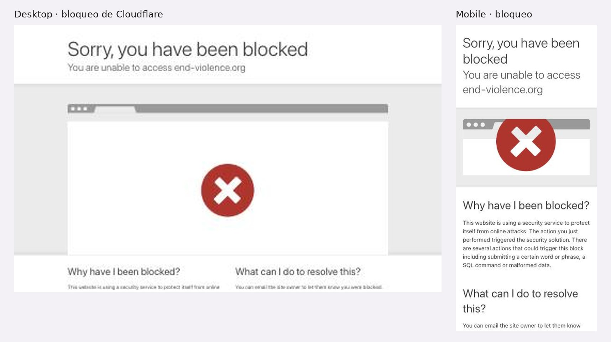

# 3.3.20 - End Violence Against Children

> Método: lectura de contenido con WebFetch (resúmenes generados por la herramienta a partir del HTML), única fuente disponible: desde el navegador el sitio bloquea con Cloudflare ("Sorry, you have been blocked") y desde la terminal el proxy rechaza la conexión (403). Se intentaron 29 URLs de www.end-violence.org y 1 subdominio: 13 devolvieron contenido y 17 no fueron accesibles (403 o DNS). Dos de las 13 devolvieron contenido ajeno a la organización (reseñas de apuestas deportivas) y otras cinco tienen insertada una frase sobre apuestas al comienzo; ver "Contenido". Lo que WebFetch recibe puede no ser lo mismo que ve una persona en el navegador; lo que no se pudo confirmar se indica como "No verificable". Fecha de consulta: 2026-10-05. Referencias entre corchetes [n] = número en la sección Fuentes.

## Información general
- **Organización:** Global Partnership to End Violence Against Children (End Violence), alianza global lanzada en julio de 2016 por Ban Ki-moon, con el Fund to End Violence Against Children como brazo financiador (HECHO [2][6]). Visión: "A world in which every child grows up free from violence" [1]; en Who We Are: "every child deserves to grow up free from violence" [2].
- **Tipo: Indirect competitor.** Justificación según el brief: es un **producto distinto** (alianza de gobiernos, agencias de la ONU, sociedad civil y donantes que financia programas, produce evidencia y acompaña planes nacionales) para una **audiencia que en parte comparte** con Red por la Infancia: aliados internacionales, financiadores e investigadoras (Maya, Diego, Dra. Ana) [2][4][6][11]. No compite por familias, docentes ni adolescentes, y no ofrece ayuda directa ni derivación [1][4][9]. Además es un posible **aliado o financiador** de RPI: su línea Safe Online financia trabajo contra la explotación sexual online [6][7] y Buenos Aires es "Pathfinding City" desde 2022 [5] (HECHO; clasificación = INFERENCIA).
- **Ubicación:** No verificable en las páginas leídas (Who We Are no menciona sede, secretaría ni organización anfitriona [2]; la página de contacto dio 403 [24]). La home leída menciona una búsqueda de Executive Director "hosted by UNICEF in New York City" con cierre en julio de 2017 [1]; no sirve como dato actual.
- **Oferta:** INSPIRE, "a set of seven evidence-based strategies for countries and communities", presentado como lanzado junto con la alianza en 2016 [3]; Pathfinding Countries y Pathfinding Cities (compromiso político + plan nacional o local) [4][5]; el Fund, con tres ventanas: Safe Online, Safe to Learn e In Crisis (cerrada en 2019) [6]; investigación Disrupting Harm en 13 países [9]; End Violence Lab con la University of Edinburgh (cursos INSPIRE, indicadores, guía para ciudades) [10]; Knowledge Platform [11].
- **Tamaño / alcance (con año):** el Fund "has raised over $83 million" desde 2016 y financió proyectos "in over 75 countries" (página con fecha más reciente: abril de 2023) [6]; "38 countries have joined the partnership as Pathfinders" (sin año) frente a "As of August 2019, 26 countries, one territory and two cities" [4]; 4 Pathfinding Cities, la última Buenos Aires el 25 de abril de 2022 [5]; socios: "over 450 partners" [2] vs. "our 750 partners" [11] (**inconsistencia**, ninguna con año).
- **Target audience:** gobiernos (pathfinders, endorsers de Safe to Learn) [4][8]; organizaciones que buscan financiamiento [6][7]; investigadores y profesionales [9][10][11]; donantes institucionales (UK Home Office, Japón, Tech Coalition) [2][6]. INFERENCIA: no habla a familias ni a NNyA.
- **Unique value proposition:** ser el punto de encuentro global que convierte la meta de los ODS (terminar con la violencia contra la niñez a 2030) en compromisos de países, con un marco técnico común (INSPIRE) y fondos propios (HECHO [2][3][4][6]; formulación = INFERENCIA).
- **Otros datos de posicionamiento:** INSPIRE se presenta como creado por "ten agencies", liderado por la OMS con CDC, PAHO, PEPFAR, Together for Girls, UNICEF, UNODC, USAID, el Banco Mundial y la propia alianza [3]. Safe to Learn muestra "Visit our new home" y un contacto en unicef.org, lo que indica que la iniciativa pasó a otro sitio [8].

## Arquitectura y navegación
- **Menú principal:** No verificable. WebFetch no extrajo menú en ninguna página leída; la home se leyó como una página larga de secciones sin navegación [1].
- **Secciones identificadas por URL** (no por menú): Who We Are, INSPIRE, Pathfinding Countries, Pathfinding Cities, The Fund, Safe Online, Safe to Learn, Disrupting Harm, End Violence Lab, Knowledge Platform [2]–[11].
- **Profundidad:** No verificable sin menú. Las páginas de iniciativas enlazan a otras ("Learn more about Pathfinding Cities", "Read more about Safe Online portfolio by exploring our Grantee Directory") [4][7].
- **¿Organiza por audiencia?** No en lo que se pudo leer: organiza por **iniciativa o programa** (INSPIRE, Pathfinding, Fund, Safe Online, Lab) (OBSERVACIÓN [3]–[10]). Las audiencias aparecen implícitas: gobiernos en Pathfinding, organizaciones en el Fund, investigadores en Knowledge y Lab.
- **Buscador, footer, selector de idioma:** No verificables; WebFetch no los detectó en la home [1].
- **Newsletter:** "Subscribe to our mailing list" en la home [1].
- **URLs esperables que no cargaron (403):** join, join-partnership, news, articles, stories, media, resources, grants, grantees, annual-report, contact-us, about, our-work, solutions-summit-series, /es y /fr [14]–[29]. No se puede saber si no existen o si el bloqueo las tapó.

## User flows clave
1. **Pedir ayuda / derivación — no aplica y no existe.** En las páginas leídas no hay líneas de ayuda ni derivación (OBSERVACIÓN [1]–[11]). Disrupting Harm sí documenta el problema: "On average, only 3% of OCSEA victims" contactaron una línea de ayuda o a la policía (datos 2020) [9]. INFERENCIA: es coherente con su rol de alianza, no de servicio.
2. **Sumarse como país (Pathfinder).** Pasos explícitos [4]: los líderes de gobierno hacen dos cosas, "Make a formal, public commitment to comprehensive action to end all forms of violence against children; and Request to become a pathfinder". En los 18 meses siguientes: "Appoint a senior government focal point", "Convene and support a multi-stakeholder group", "Collect, structure and analyse data on violence against children", "Develop an evidence-based and costed national action plan that sets commitments for three to five years, and a related resource mobilization plan" y "Consult with children and adhere to partnership standards on child participation". Fricción: no hay formulario ni email de contacto para pedirlo [4]. Argentina no aparece en la página como país pathfinder [4].
3. **Sumarse como ciudad (Pathfinding City).** Misma lógica a 12 meses: punto focal municipal, grupo multiactor, auditoría de datos, plan de intervención, consulta con NNyA [5]. Ciudades: Valenzuela (Filipinas, mayo 2019), São Paulo (octubre 2019), Pelotas (septiembre 2020), **Buenos Aires (25 de abril de 2022)** [5]. Texto sobre Buenos Aires: "End Violence will work with the city to create a diagnosis and assess the concrete measures to be taken and policies to be implemented" [5].
4. **Sumarse como organización socia.** No verificable: /join y /join-partnership dieron 403 [14][15]; /partners devolvió una página de apuestas deportivas sin relación con la organización [12]. No se encontró en las páginas leídas qué se le pide a una organización para ser socia.
5. **Pedir financiamiento (Fund).** Dos vías: "CALLS FOR PROPOSALS" e "INVITATIONS" a organizaciones identificadas por la conducción [6]. CTAs: "SEE OUR GRANTS", "CONTACT US", "Learn more about how you can apply" [6][7]. Ventanas activas según la página: Safe Online y Safe to Learn [6]; pero Safe to Learn ya remite a "our new home" (UNICEF) [8] (**inconsistencia**). Fricción: el directorio de grants dio 403 [21][22].
6. **Recursos / conocimiento.** Knowledge Platform: "a place to explore the latest evidence, research and data critical to ending all forms of violence against children", con "PARTNER RESOURCE HUBS" y "Learn more about the Knowledge Platform" [11]. Disrupting Harm publica informes por país, "Advocacy Brief" y visualizaciones ("EXPLORE THE DATA INSIGHTS HERE") [9]. El subdominio knowledge.end-violence.org no resolvió (DNS) [30]. Filtros y títulos con fecha: No verificables [11].
7. **Prensa.** No verificable: news, articles, stories y media dieron 403 [16]–[19]. La home leída muestra novedades de 2017 (convocatoria del Fund para seguridad online y búsqueda de Executive Director) [1].
8. **Público internacional / otros idiomas.** Todo lo leído está en inglés. /es y /fr dieron 403 [25][26]. La única señal multilingüe: informes de Disrupting Harm en inglés, portugués, jemer, malayo, bahasa indonesia, vietnamita, amhárico y tailandés [9]. No se encontró INSPIRE en otros idiomas en la página del sitio [3].

## Contenido
- **Claridad:** alta en las páginas de proceso. Pathfinding define en dos frases qué es un país pathfinder y lista 5 compromisos verificables [4]; INSPIRE se presenta en dos frases ("a set of seven evidence-based strategies…" / "a technical package and guidebook") y 7 títulos de estrategia [3].
- **Tono:** institucional, de política pública y evidencia; orientado a gobiernos y financiadores ("evidence-based", "costed national action plan", "resource mobilization plan") [3][4].
- **Organización:** por iniciativa. Who We Are usa una **línea de tiempo** con hitos fechados (septiembre 2015 a febrero 2019) [2]; el Fund cuenta su historia con montos y fechas (2016 a abril 2023) [6].
- **Cantidad de información:** media por página; alta en Disrupting Harm (13 países, datos por país) [9] y End Violence Lab (9 líneas de trabajo) [10].
- **CTAs (textuales):** "Subscribe to our mailing list" [1]; "Learn more about Pathfinding Cities" [4]; "Read more" [5]; "Learn More", "SEE OUR GRANTS", "CONTACT US" [6]; "Learn more about how you can apply", "Read more about Safe Online portfolio by exploring our Grantee Directory" [7]; "Visit our new home", "Read the investment case in full by clicking here" [8]; "Advocacy Brief", "EXPLORE THE DATA INSIGHTS HERE", "CLICK FOR MORE VISUAL INSIGHTS" [9]; "Explore the Knowledge Platform" [10]; "Learn more about the Knowledge Platform" [11].
- **Impacto / transparencia:**
  - Cifras del problema en la home, **sin año**: "Every five minutes, a child dies as a result of violence"; "An estimated 120 million girls and 73 million boys have been victims of sexual violence"; "Violence affects more than 1 billion children around the world every year"; costo social "up to US$7 trillion a year"; menos del 0,6% de USD 174.000 millones de AOD destinados a violencia (2015) [1]. Corrección a la lectura previa: la home dice "have been victims of sexual violence", no "have experienced"; y "dies as a result of violence" (HECHO según extracción [1]).
  - Cifras de resultado: Fund "over $83 million" desde 2016 y "over 75 countries" [6]; 38 pathfinders [4]; Disrupting Harm en 13 países [9]; Safe to Learn: "16 countries" que adhirieron y "14 partners" (mayo 2021) [8].
  - **Inconsistencias:** socios "over 450" [2] vs. "750" [11]; inversión en Disrupting Harm "$6.6 million" [6] vs. "$7 million" (2019) [7]; pathfinders 38 (sin fecha) vs. 26 + 1 territorio + 2 ciudades (agosto 2019) en la misma página [4]; INSPIRE "ten agencies" con nueve nombres más la OMS [3] (OBSERVACIÓN).
  - **Desactualización:** la home leída muestra contenidos de 2017 [1]; Who We Are termina en febrero de 2019 y se corta a mitad de frase [2]; la fecha más reciente en todo lo leído es abril de 2023 [6] (OBSERVACIÓN).
  - Informe anual: No verificable (/annual-report dio 403 [23]).
- **Integridad del sitio (OBSERVACIÓN según WebFetch):** /partners y /about-us devolvieron páginas completas de reseñas de apuestas ("Best Offshore Sportsbooks", "Welcome to OffshoreSportsbooks.us.org") [12][13], y las páginas de Pathfinding Cities, Fund, Knowledge Platform y End Violence Lab empiezan con una frase sobre apuestas ("…makes the best offshore sportsbooks a compelling option… in 2025") antes del contenido real [5][6][10][11]. INFERENCIA: parece contenido inyectado para buscadores (spam SEO) que se sirve a bots; No verificable si una persona lo ve en el navegador, porque el sitio bloquea el acceso. Para un donante o aliado que llegara a esas páginas, el daño a la credibilidad sería alto.
- **Presencia en medios / newsroom:** No verificable [16]–[19].

## Idiomas y accesibilidad (lo verificable desde el contenido)
- **Idiomas:** sitio en inglés en las 13 páginas leídas; /es y /fr no accesibles (403) [25][26]; sin selector de idioma detectado [1]. Informes de Disrupting Harm en 8 idiomas [9].
- **Accesibilidad:** No verificable. WebFetch no devolvió skip link, `lang`, `alt` ni declaración de accesibilidad en ninguna página. El bloqueo de Cloudflare a visitantes humanos es en sí una barrera de acceso (OBSERVACIÓN del usuario, no reproducible por WebFetch).

## First impressions (capturas propias, 2026-10-05)
- **No verificable con capturas.** end-violence.org bloqueó el acceso con Cloudflare ("Sorry, you have been blocked") en desktop y en mobile. Todo lo que dice esta auditoría sale de WebFetch.
- **Señal a confirmar:** según WebFetch, algunas páginas (/partners, /about-us) muestran contenido de apuestas deportivas ajeno a la organización. No se pudo ver en el navegador; antes de citarlo hay que confirmarlo con una persona que acceda al sitio.

## Visual design
- No verificable sin capturas.

## Verificación técnica (JavaScript sobre el DOM, 2026-10-05)
| Chequeo | Resultado |
| --- | --- |
| Acceso desde el navegador | Bloqueado por Cloudflare (desktop y mobile) |
| Chequeos de DOM | No verificable |

## Ratings finales
| Dimensión | Rating | Por qué |
| --- | --- | --- |
| Desktop | No verificable | Bloqueado |
| Mobile | No verificable | Bloqueado |
| Navegación | Needs work (solo contenido) | Por iniciativa; menú no extraído |
| User flow | Okay (solo contenido) | Pathfinding explica cómo sumarse; sin formulario |
| Accesibilidad | No verificable | Sin acceso al DOM |
| Diseño visual | No verificable | Sin capturas |
| Contenido | Okay (solo contenido) | Marco INSPIRE claro; cifras sin año y desactualizadas |

## Lentes del objetivo del audit
| Lente | ¿Lo resuelve? | Evidencia |
| --- | --- | --- |
| Navegación por audiencia | No verificable | Menú no extraído; lo leído se organiza por iniciativa, no por público [1]–[11] |
| Pedir ayuda / derivación | No | Sin líneas ni derivación en las páginas leídas (no es su rol) [1]–[11] |
| Impacto y credibilidad | Parcial | Montos y alcance del Fund, 38 pathfinders, Disrupting Harm en 13 países [4][6][9]; cifras sin año, inconsistentes, desactualizadas y páginas con contenido de apuestas [1][2][11][12][13] |
| Prensa | No verificable | news, media, stories y articles dieron 403 [16]–[19] |
| Internacional | Parcial | Proceso claro y público para que un país o ciudad se sume [4][5]; sitio solo en inglés, /es y /fr no accesibles [25][26]; informes en 8 idiomas [9] |

## Qué significa → qué decisión podría afectar
- Pathfinding explica en dos frases qué es y lista los compromisos concretos que pide → **afecta** cómo RPI explica quién es y qué propone a un aliado (lente 4; US-22, US-24): una página "Trabajemos juntos / Partner with us" que diga qué ofrece y qué pide.
- Buenos Aires es Pathfinding City desde 2022 [5] → **afecta** el relato institucional en inglés (lente 4; US-22, US-23): RPI puede ubicar su trabajo dentro de un compromiso que la alianza ya reconoce. Conviene confirmarlo fuera del sitio antes de citarlo.
- Las cifras sin año, las inconsistencias entre páginas y el contenido ajeno restan credibilidad justo frente a financiadores → **afecta** la sección de impacto: cada número con año y fuente única, y un responsable de mantenerla (lente 3; US-15, US-32, US-33).
- Una línea de tiempo con hitos fechados comunica trayectoria rápido → **afecta** "Quiénes somos" en español e inglés (lentes 3 y 4; US-22, US-32).
- INSPIRE da un vocabulario común con 7 estrategias → **afecta** el resumen institucional descargable: mapear los programas de RPI a las estrategias INSPIRE ayuda a que un aliado los entienda sin conocer Argentina (lente 4; US-23).

## Evidencia
Capturas: solo la página de bloqueo en desktop (1280 px) y en mobile. Archivos: `evidencia/capturas/endviolence_*.jpg` (hoja resumen: `evidencia/endviolence_evidencia.jpg`).

## Ratings preliminares (solo contenido, antes de las capturas) (Needs work / Okay / Good / Outstanding, con + y −)
- **Content: Okay.** + Procesos institucionales explicados con claridad y compromisos concretos (Pathfinding, INSPIRE) [3][4][5]; + historia con hitos y montos fechados [2][6]; + investigación con datos por país [9]. − Cifras de la home sin año [1]; − inconsistencias de socios, montos y pathfinders [2][4][6][7][11]; − contenido desactualizado (2017–2019; lo más reciente, abril 2023) [1][2][6]; − páginas con texto de apuestas [5][6][10]–[13].
- **Interaction / Navigation: Needs work.** + Páginas de iniciativa enlazadas entre sí ("Learn more", "Grantee Directory") [4][7]. − Menú no verificable; − 17 de 30 URLs no accesibles, incluidas join, news, media, contact-us y annual-report [14]–[30]; − /partners y /about-us muestran otro sitio [12][13]; − Safe to Learn ya vive en otro sitio [8].
- **User flow: Okay.** + Flujo país/ciudad con requisitos explícitos a 18 y 12 meses [4][5]; + dos vías claras para financiamiento [6]. − Sin formulario ni email para pedir ser pathfinder [4]; − flujo de socio organización no verificable [12][14][15]; − directorio de grants inaccesible [21][22].
- **Accessibility (preliminar): Needs work.** + Informes de Disrupting Harm en 8 idiomas [9]. − Sitio en inglés en todo lo leído; /es y /fr no accesibles [25][26]; − el bloqueo de Cloudflare impide el acceso a personas reales (reporte del usuario). Skip link, `lang`, `alt` y contraste: No verificables.

## Fortalezas
- Proceso público y concreto para que un país o una ciudad se sume: compromiso + pedido + 5 compromisos con plazo [4][5].
- INSPIRE explicado en dos frases, con las agencias que lo respaldan, lo que le da autoridad técnica [3].
- Historia institucional como línea de tiempo con fechas y montos [2][6].
- Montos acumulados del Fund y alcance en países [6].
- Investigación con datos por país, briefs de incidencia y traducciones a idiomas locales [9].
- Oferta de formación y herramientas para gobiernos y ciudades (End Violence Lab) [10].

## Debilidades
- Integridad del sitio comprometida según WebFetch: páginas enteras y párrafos de apuestas deportivas [5][6][10]–[13].
- Acceso bloqueado a personas (Cloudflare) y muchas URLs con 403 [14]–[29].
- Contenido desactualizado y cifras inconsistentes o sin año [1][2][4][6][7][11].
- Sin forma visible de contactar para sumarse como pathfinder [4]; flujo de socio no verificable [12][14][15].
- Solo inglés en lo leído; sin versión en español ni francés accesible [25][26].
- Prensa y reporte anual no verificables [16]–[19][23].

## Patrones o ideas relevantes para Red por la Infancia
1. **Página "qué pedimos / qué damos" para aliados**, al estilo Pathfinding: qué es la alianza en 2 frases, qué se compromete cada parte y en qué plazo → lente (4); US-22, US-24. (HECHO [4][5]; aplicabilidad = INFERENCIA)
2. **Mapear los programas de RPI a INSPIRE** (p. ej. Bajalo Ya! → "Response and support services"; ReConectate → "Parent and caregiver support" y "Education and life skills"; Campus → formación) en el resumen institucional en inglés → lente (4); US-22, US-23. (HECHO de las 7 estrategias [3]; mapeo = INFERENCIA)
3. **Línea de tiempo con hitos fechados** en "Quiénes somos", en español e inglés → lentes (3) y (4); US-22, US-32. (HECHO [2])
4. **Mencionar el contexto Buenos Aires Pathfinding City (2022)** en el relato internacional, después de verificarlo fuera del sitio → lente (4); US-22, US-24. (HECHO [5]; uso = INFERENCIA)
5. **Datos con año y fuente, una sola cifra por indicador en todo el sitio** → lente (3); US-15, US-32, US-33. Antipatrón observado: 450 vs. 750 socios, 6,6 vs. 7 millones [2][6][7][11].
6. **Traducir lo que se comparte entre países** (informes y briefs) aunque el sitio institucional esté en un idioma → lente (4); US-23, US-25, US-26. (HECHO [9])
7. **Antipatrones a evitar:** bloquear a visitantes con un firewall demasiado estricto; dejar URLs institucionales rotas o con contenido ajeno; no dar un contacto para sumarse → lentes (3) y (4); US-24, US-20 (medir y monitorear el sitio). (OBSERVACIÓN [4][12]–[29])

## Fuentes
Consultadas el 2026-10-05 con WebFetch. El acceso por terminal (curl) fue rechazado por el proxy (403) y el sitio bloquea el navegador del usuario con Cloudflare.
1. https://www.end-violence.org — home (WebFetch devolvió una página larga con contenidos de 2017)
2. https://www.end-violence.org/who-we-are — Who We Are
3. https://www.end-violence.org/inspire — INSPIRE
4. https://www.end-violence.org/pathfinding-countries — Pathfinding Countries
5. https://www.end-violence.org/pathfinding-cities — Pathfinding Cities (con frase de apuestas al inicio)
6. https://www.end-violence.org/fund — The Fund (con frase de apuestas al inicio)
7. https://www.end-violence.org/safe-online — Safe Online
8. https://www.end-violence.org/safe-to-learn — Safe to Learn
9. https://www.end-violence.org/disrupting-harm — Disrupting Harm
10. https://www.end-violence.org/end-violence-lab — End Violence Lab (con frase de apuestas al inicio)
11. https://www.end-violence.org/knowledge — Knowledge Platform (con frase de apuestas al inicio)
12. https://www.end-violence.org/partners — contenido ajeno (reseñas de apuestas deportivas)
13. https://www.end-violence.org/about-us — contenido ajeno ("Welcome to OffshoreSportsbooks.us.org")
14. https://www.end-violence.org/join — no accesible (403)
15. https://www.end-violence.org/join-partnership — no accesible (403)
16. https://www.end-violence.org/news — no accesible (403)
17. https://www.end-violence.org/articles — no accesible (403)
18. https://www.end-violence.org/stories — no accesible (403)
19. https://www.end-violence.org/media — no accesible (403)
20. https://www.end-violence.org/resources — no accesible (403)
21. https://www.end-violence.org/grants — no accesible (403)
22. https://www.end-violence.org/grantees — no accesible (403)
23. https://www.end-violence.org/annual-report — no accesible (403)
24. https://www.end-violence.org/contact-us — no accesible (403)
25. https://www.end-violence.org/es — no accesible (403)
26. https://www.end-violence.org/fr — no accesible (403)
27. https://www.end-violence.org/about — no accesible (403)
28. https://www.end-violence.org/our-work — no accesible (403)
29. https://www.end-violence.org/solutions-summit-series — no accesible (403)
30. https://knowledge.end-violence.org — no accesible (el dominio no resolvió)

## Capturas

