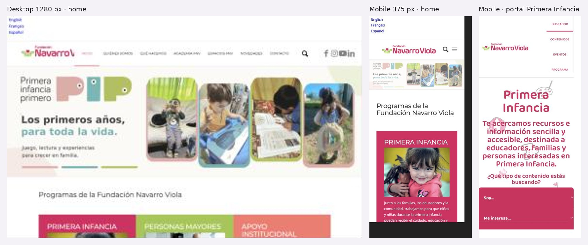

# 3.3.3 - Fundación Navarro Viola

## Información general
- **Organización:** Fundación Navarro Viola (FNV). Fundada el 6 de septiembre de 1973 por las hermanas María del Carmen, Sara y Marta Navarro Viola de Herrera Vegas. [F2]
- **Tipo: Indirect competitor.** Justificación: comparte parte de la audiencia de Red por la Infancia (familias, educadores, organizaciones sociales, financiadores del ámbito de la niñez en Argentina) pero ofrece un producto distinto: promoción del desarrollo integral en la primera infancia (0 a 5 años) y programas para personas mayores, no prevención de violencias contra NNyA ni derivación a líneas de ayuda [F1][F3][F4]. Según la definición del brief, es "un producto distinto a la misma audiencia" (parcialmente). INFERENCIA: es un referente útil sobre todo para arquitectura multi-programa, recursos filtrados por público y apoyo a organizaciones.
- **Ubicación:** Av. Pres. Manuel Quintana 174, C1014 ACO, Buenos Aires, Argentina. [F7]
- **Oferta (verificada en el sitio):**
  - **Ejecuta programas propios** (no es solo donante): Programa Primera Infancia (PIP – Primera Infancia Primero, Buen inicio en educación, Crianza en familia, Buscador de recursos) y Programa Personas Mayores (Agenda Cultural, Voluntariado +60, Club de Ajedrez, Mayores en movimiento, Información y conocimiento, Mirar en grande, Vivir con Bienestar, Puente entre generaciones, Recursos). [F1][F3][F4]
  - **Premios a organizaciones:** Premio Bienal (desde 1975; XXIII edición 2025-2026, ganadores anunciados en octubre de 2025) y Premio Abanderados. El sitio no informa montos. [F5][F6]
  - **Espacios FNV / Coworking Social** para organizaciones, con sistema de créditos y registro por Google Forms. [F6][F1]
  - **Formación y recursos:** Academia FNV (no accesible), página de Recursos con 60 materiales y un portal externo de recursos de primera infancia. [F10][F11]
  - **Generación de evidencia e incidencia en políticas públicas** (p. ej., Barómetro de la Deuda Social sobre personas mayores). [F3][F4][F10]
  - HECHO: no se encontró oferta de donaciones individuales, becas ni subsidios con convocatoria abierta en las páginas consultadas. [F5][F6][F9]
- **Website:** https://fnv.org.ar (más subdominio https://primerainfancia.fnv.org.ar). [F1][F11]
- **Tamaño o alcance:** PIP acompañó a "más de 5.700 familias" desde 2017, en varios municipios argentinos con gobiernos locales [F12]. Equipo publicado: consejo de 4 personas y equipo de unas 11 personas [F2]. Premio Bienal: 23 ediciones desde 1975 [F5]. Novedades: 37 páginas de notas [F8]. No hay otros números consolidados.
- **Target audience:** familias con niñas y niños de 0 a 5 años en contextos de vulnerabilidad; educadores y comunidades educativas; personas mayores en situación de vulnerabilidad y voluntarios mayores de 60; organizaciones de la sociedad civil; municipios (para implementar PIP). [F3][F4][F9][F11][F12]
- **Unique value proposition:** "Promovemos el desarrollo integral de la primera infancia y transformamos la realidad de las personas mayores" (meta descripción) [F1]. INFERENCIA: su diferencial es la combinación de 50 años de trayectoria, programas propios basados en evidencia y un premio histórico a organizaciones.
- **Otros datos de posicionamiento:** se presenta como fundación independiente que "impulsa y desarrolla programas" [F2]; trayectoria del Premio Bienal como sello de legado ("Un legado en acción") [F5]; incidencia en políticas públicas [F3][F4].

## Arquitectura y navegación
- **Menú principal (tal cual):** Inicio · Quiénes somos · Qué hacemos · Academia FNV · Espacios FNV · Novedades · Contacto · Buscar. [F1]
- **Submenús:** [F1]
  - Qué hacemos → **Programa Primera Infancia** (PIP – Primera Infancia Primero; Buen inicio en educación; Crianza en familia; Buscador de recursos [enlace externo a primerainfancia.fnv.org.ar])
  - Qué hacemos → **Programa Personas Mayores** (Agenda Cultural; Voluntariado +60; Club de Ajedrez; Recursos personas mayores; Mayores en movimiento; Información y conocimiento; Mirar en grande; Vivir con Bienestar; Puente entre generaciones)
  - Qué hacemos → **Apoyo institucional** (Premio Bienal; Espacios FNV; Premio Abanderados)
  - Academia FNV → Recursos
- **Profundidad:** hasta 3 niveles (Qué hacemos > Programa > Subprograma). OBSERVACIÓN: el submenú de Personas Mayores tiene 9 ítems, lo que lo hace largo. [F1]
- **Organización:** por **programa** (línea temática), no por audiencia. OBSERVACIÓN: "Espacios FNV" aparece duplicado (menú principal y dentro de Apoyo institucional). [F1]
- **Excepción por audiencia:** el portal externo de primera infancia sí filtra por perfil (Educador, Familia, Interesado), además de temática y tipo de contenido. [F11]
- **Buscador:** sí, en el menú principal (búsqueda nativa ?s=). La página de Recursos tiene filtros por categoría con contadores. [F1][F10]
- **Footer:** enlaces a Quiénes somos, Qué hacemos, Primera infancia, Personas mayores, Apoyo institucional; íconos de redes (Facebook, YouTube, LinkedIn, Instagram); copyright © 2024; crédito "Enfold Theme by Kriesi"; botón "Desplazarse hacia arriba". Sin dirección, email ni teléfono en el footer. [F1]
- OBSERVACIÓN: un bloque del Coworking Social (CTA "REGISTRATE" / "INSCRIBITE AHORA") se repite en casi todas las páginas consultadas, incluso en Contacto y Novedades. [F1][F2][F3][F4][F7][F8][F10]

## User flows clave
- **Pedir ayuda / derivación:** **No existe.** No hay canal de ayuda ni derivación a líneas oficiales ni en el sitio ni en el portal de primera infancia. [F3][F11] No aplica de forma estricta (la FNV no brinda asistencia), pero es una diferencia clave con Red por la Infancia.
- **Donar:** **No existe** un flujo de donación en las páginas consultadas. [F9] INFERENCIA: coherente con su modelo de fundación patrimonial que financia y ejecuta.
- **Voluntariado / empresas:** Voluntariado +60: Home > Qué hacemos > Personas Mayores > Voluntariado +60 (3 clics) → reunión informativa (2 convocatorias al año) → preinscripción → conformación de grupos → capacitación; email voluntarios@fnv.org.ar y enlace a "Convocatoria Voluntariado". Fricción: solo para mayores de 60, sin opción para otras edades ni voluntariado corporativo. [F9] **Empresas:** no existe un flujo para empresas. [F9]
- **Organizaciones / municipios (flujo adicional relevante):** municipios pueden postularse a PIP con un Google Form desde la página del programa [F12]; organizaciones pueden registrarse al Coworking Social por Google Form [F6]. Premio Bienal: sin convocatoria abierta visible ni bases de postulación en la página consultada [F5]. Fricción: formularios externos (Google Forms) y ausencia de información sobre montos y requisitos. [F5][F6]
- **Recursos / formación:** dos entradas: (1) Recursos en fnv.org.ar, 60 materiales con filtros (Boletines temáticos 10, Informes 10, Libros 11, Personas Mayores 34, Primera Infancia 26, Videos 8) [F10]; (2) portal externo de primera infancia con filtros por perfil, temática y tipo, más "Eventos e Inscripciones" [F11]. Fricción: los recursos están repartidos entre dos sitios y Academia FNV (no accesible en esta auditoría). OBSERVACIÓN: los materiales se descargan como PDF. [F10]
- **Prensa:** **No existe** sección de prensa, kit de prensa ni contacto para medios. Novedades es un blog institucional (8 notas por página, 37 páginas, sin filtros). [F8]
- **Contacto institucional:** Home > Contacto (1 clic). Formulario con Nombre*, Correo*, Teléfono (opcional), casilla de suscripción a boletín y pregunta matemática anti-spam; mapa de Google; dirección. Fricción: sin email ni teléfono públicos, sin campo de motivo y sin contactos diferenciados por público. [F7]
- **Público internacional:** solo una **presentación institucional en PDF** en español, inglés y francés, visible en varias páginas [F1][F10]. El sitio y el portal de primera infancia están solo en español [F11]. Fricción: no hay versión web traducida ni página para aliados internacionales.

## Contenido
- **Claridad:** OBSERVACIÓN: la misión y los objetivos de cada programa se expresan en frases claras y cortas [F2][F3][F4]. La página de Apoyo institucional y la del Premio Bienal no explican montos, requisitos ni calendario. [F5][F6]
- **Tono:** institucional, cálido y en primera persona del plural. Citas: "Los primeros años de vida son fundamentales para el desarrollo de las personas" [F12]; "la experiencia, el tiempo y el compromiso de las personas mayores" [F9].
- **Organización:** por programa con tarjetas "Entrar" en la home y "Ver más" en cada programa. [F1][F3][F4]
- **Cantidad de información:** abundante en programas (12 subprogramas/proyectos) y en recursos (60) [F1][F10]; escasa en datos cuantitativos y transparencia [F2].
- **CTAs (lista textual):** "Entrar" (x3, home) [F1]; "Ver más" (subprogramas) [F3][F4]; "REGISTRATE" e "INSCRIBITE AHORA" (Coworking Social) [F1][F6]; formulario de postulación de municipios a PIP [F12]; "Convocatoria Voluntariado +60" [F9]; "Buscar" [F1]; "Desplazarse hacia arriba" [F1].
- **Impacto / transparencia:** único número destacado: "más de 5.700 familias" acompañadas por PIP desde 2017, más un mapa de municipios [F12]. El Premio Bienal habla de "miles de personas" sin cifras [F5]. Voluntariado +60 reporta resultados cualitativos (bienestar, propósito, vínculos) [F9]. Quiénes somos muestra consejo y equipo con nombres, pero sin memorias, balances ni informes anuales [F2]. INFERENCIA: la credibilidad se apoya en trayectoria y equipo, no en datos.
- **Presencia en medios:** no se muestra (sin sección de prensa ni "nos mencionan"). Redes: Facebook, Instagram, YouTube, LinkedIn y Twitter/X @F_NavarroViola. [F1][F8]

## Idiomas y accesibilidad (lo verificable desde el contenido)
- **Idiomas:** sitio en español. Presentación institucional descargable en español, inglés y francés (PDF). Portal de primera infancia solo en español. [F1][F10][F11]
- **Accesibilidad (verificable desde el contenido):**
  - Hay textos alternativos, pero poco descriptivos (p. ej., "img_pi", "img_PM", "img_hogar"). [F1]
  - Meta viewport configurado. [F1]
  - Formulario de contacto con labels y campos obligatorios marcados con asterisco; anti-spam con pregunta matemática (más accesible que un CAPTCHA de imágenes). [F7]
  - El portal de primera infancia tiene enlace "Ir al contenido" (skip link); en fnv.org.ar no se detectó. [F11][F1]
  - No hay declaración de accesibilidad. [F1][F2]
  - Recursos en PDF; no fue posible verificar si son accesibles. [F10]

## First impressions (capturas propias, 2026-10-05)
- **Primera impresión (OBSERVACIÓN):** arriba de todo aparecen tres links sin estilo ("English / Français / Español") que parecen un selector de idioma roto; debajo, un banner del programa PIP con texto dentro de la imagen.
- **Claridad de la propuesta:** se entiende que trabaja en primera infancia y personas mayores, por programa.
- **Jerarquía visual:** no hay un CTA principal; los tres bloques de programa compiten por igual.
- **Desktop — Okay.** + Menú de 7 ítems con buscador y redes. − El logo aparece cortado ("NavarroV") a 1280 px; texto dentro de imágenes; links de idioma sin estilo.
- **Mobile — Okay.** + Responsive y legible en el sitio principal. − Los links de idioma ocupan la primera pantalla; en el portal Primera Infancia el menú se apila verticalmente al lado del logo y los dibujos decorativos se superponen al título.
- **Responsive design:** el sitio principal se adapta; el portal tiene problemas de layout en 375 px.

## Visual design
- **Branding / identidad — Okay.** + Paleta rosa y verde, lúdica y coherente con primera infancia. − Dos sitios (principal y portal) con estilos distintos; logo cortado.
- **Imágenes:** fotos de chicos en actividades; banners con texto incrustado.
- **Coherencia entre páginas:** media; el bloque de Coworking se repite en casi todas las páginas.
- **Relación diseño–audiencia:** cercano para familias y educadores.

## Verificación técnica (JavaScript sobre el DOM, 2026-10-05)
| Chequeo | Resultado |
| --- | --- |
| `lang` del documento | `es` |
| Skip link (sitio principal) | No |
| H1 en la home | Ninguno |
| Imágenes con `alt=""` | 13 de 14 |
| Links "English / Français / Español" | No cambian el idioma: descargan la presentación institucional 2025 en PDF (EN, FR, ES) |
| Copyright | "© Copyright - Fundación Navarro Viola 2024" (desactualizado, igual que RPI) |
| Portal Primera Infancia | Buscador "¿Qué tipo de contenido estás buscando?" con dos filtros: **"Soy…"** y **"Me interesa…"** |

## Ratings finales
| Dimensión | Rating | Por qué |
| --- | --- | --- |
| Desktop | Okay | Ordenado, pero con logo cortado y texto en imágenes |
| Mobile | Okay | Principal correcto; portal con superposiciones |
| Navegación | Okay | Por programa, con buscador; el portal sí filtra por perfil |
| User flow | Needs work | Sin flujos de donación, prensa ni empresas; contacto genérico |
| Accesibilidad | Needs work | Sin H1, 13 de 14 imágenes sin descripción, sin skip link |
| Diseño visual | Okay | Paleta coherente; dos sistemas visuales |
| Contenido | Okay | Programas claros; casi sin impacto en números |

## Lentes del objetivo del audit
| Lente | ¿Lo resuelve? | Evidencia |
| --- | --- | --- |
| Navegación por audiencia | Parcial | El portal filtra por "Soy…" (Educador, Familia, Interesado); el sitio principal no |
| Pedir ayuda / derivación | No | Sin canal de ayuda |
| Impacto y credibilidad | Parcial | Una cifra ("más de 5.700 familias" desde 2017) y 50 años de trayectoria |
| Prensa | No | Blog de novedades, sin kit ni contacto |
| Internacional | Parcial | Presentación institucional en PDF en inglés y francés |

## Qué significa → qué decisión podría afectar
- "Soy… / Me interesa…" es el patrón más cercano a la navegación por audiencia que pidió la directora → **afecta** la arquitectura de información (US-29).
- Un resumen institucional en inglés descargable es viable y barato, pero presentado como "selector de idioma" confunde → **afecta** cómo se ofrece el kit en inglés (US-23).
- El copyright 2024 aparece también acá: es un error común que resta credibilidad.

## Evidencia
Capturas: home desktop (1280 px), home mobile y portal Primera Infancia mobile. Archivos: `evidencia/capturas/fnv_*.jpg` (hoja resumen: `evidencia/fnv_evidencia.jpg`).

## Ratings preliminares (solo contenido, antes de las capturas) (Needs work / Okay / Good / Outstanding, con + y −)
- **Content: Okay.** + Misión y programas claros, tono cercano, 60 recursos categorizados, blog activo (última nota 29/09/2026) [F2][F8][F10]. − Casi sin números de impacto (solo 5.700 familias de PIP), sin memorias ni balances, Premio Bienal sin montos ni bases, el bloque de Coworking se repite en todas las páginas y genera ruido [F5][F12][F2].
- **Interaction / Navigation: Okay.** + Menú simple de 7 ítems con buscador; Recursos con filtros y contadores; el portal externo filtra por perfil de usuario [F1][F10][F11]. − Organización por programa y no por audiencia; submenú de 9 ítems en Personas Mayores; "Espacios FNV" duplicado; recursos repartidos entre dos sitios [F1][F11].
- **User flow: Needs work.** + Voluntariado +60 tiene pasos explicados y email directo; los municipios tienen un formulario directo para PIP [F9][F12]. − No hay flujos de donación, prensa, empresas ni público internacional; contacto sin email ni teléfono, ni segmentación; formularios externos en Google Forms [F7][F8][F9].
- **Accessibility (preliminar, limitado a lo verificable): Needs work.** + Labels en formularios, viewport, skip link en el portal de primera infancia [F7][F1][F11]. − Alt text poco descriptivo, sin skip link detectado en el sitio principal, sin declaración de accesibilidad, contenido clave en PDF [F1][F10]. No verificable: contraste, navegación por teclado, lectores de pantalla.

## Fortalezas
- Portal de recursos de primera infancia con **filtro por perfil** (Educador / Familia / Interesado), además de temática y tipo. [F11]
- Página de Recursos con categorías y contadores visibles. [F10]
- Flujo de Voluntariado +60 explicado paso a paso, con email dedicado. [F9]
- CTA específico para un público institucional (municipios → PIP). [F12]
- Transparencia del equipo: consejo y equipo con nombres y funciones. [F2]
- Contenido actualizado con frecuencia (notas semanales o quincenales en 2026). [F8]
- Presentación institucional en 3 idiomas como recurso mínimo para aliados internacionales. [F1]

## Debilidades
- Arquitectura por programa, no por audiencia, en el sitio principal. [F1]
- Casi sin datos de impacto ni documentos de transparencia (memorias, balances). [F2][F12]
- Sin sección de prensa ni presencia en medios. [F8]
- Sin flujo de donación ni de alianzas con empresas. [F9]
- Contacto genérico sin email ni teléfono y sin segmentación por motivo. [F7]
- Contenido internacional limitado a un PDF. [F1]
- Ecosistema fragmentado (sitio principal + subdominio + Academia + formularios de Google). [F1][F11][F12]
- Bloque promocional del Coworking repetido en todas las páginas. [F1][F7][F8]

## Patrones o ideas relevantes para Red por la Infancia (relacioná cada una con el objetivo del audit; marcá HECHO / OBSERVACIÓN / INFERENCIA)
1. **(Objetivo 1: navegación por audiencia)** HECHO: el portal de primera infancia filtra recursos por perfil (Educador / Familia / Interesado) [F11]. INFERENCIA: Red por la Infancia podría aplicar un filtro por público dentro de su biblioteca de recursos y Campus, además de una navegación por audiencia en el menú.
2. **(Objetivo 1)** OBSERVACIÓN: organizar el menú por programa obliga a quien llega a conocer la estructura interna (p. ej., un docente debe saber que "Buen inicio en educación" está dentro de "Qué hacemos > Primera Infancia") [F1]. INFERENCIA: es un antipatrón para el problema que busca resolver Red por la Infancia.
3. **(Objetivo 1)** HECHO: la página de Recursos muestra categorías con contadores ("Libros 11", "Videos 8") [F10]. INFERENCIA: es un patrón simple y fácil de mantener para una sección de recursos.
4. **(Objetivo 2: pedir ayuda/derivar)** HECHO: no hay ningún canal de ayuda ni derivación, ni siquiera en el portal dirigido a familias [F3][F11]. INFERENCIA: no aporta un patrón; confirma que un acceso visible a "Necesito ayuda" sería un diferencial para Red por la Infancia.
5. **(Objetivo 3: impacto y credibilidad)** HECHO: el único número de impacto aparece en la página de PIP ("más de 5.700 familias" desde 2017, con mapa de municipios) [F12]; la credibilidad se apoya en trayectoria (50 años del Premio Bienal) y en la lista de equipo y consejo [F2][F5]. INFERENCIA: Red por la Infancia puede superar este estándar con una franja de cifras en la home y una página de transparencia.
6. **(Objetivo 3)** HECHO: CTA dirigido a un financiador/aliado institucional específico (municipios que quieren implementar PIP) [F12]. INFERENCIA: un CTA por tipo de aliado (empresa, fundación, gobierno) puede ser más efectivo que un "Doná" genérico.
7. **(Objetivo 3)** HECHO: no hay sección de prensa [F8]. INFERENCIA: una sala de prensa en Red por la Infancia sería diferencial frente a este competidor.
8. **(Objetivo 4: internacional)** HECHO: presentación institucional en PDF en ES/EN/FR [F1]. INFERENCIA: es una solución mínima y barata como primer paso, pero insuficiente para el 31% de usuarios fuera de Argentina; una landing web en inglés sería mejor (indexable y accesible).
9. **(Objetivo 5: celular)** OBSERVACIÓN: meta viewport configurado y menú adaptable, según el contenido [F1][F4]; el bloque de Coworking repetido y el submenú de 9 ítems probablemente alarguen la experiencia en mobile (INFERENCIA, verificar con capturas).
10. **(Mantenibilidad)** OBSERVACIÓN: el ecosistema usa WordPress (tema Enfold), un subdominio con Elementor y formularios de Google [F1][F11]. INFERENCIA: la fragmentación muestra el riesgo de sumar herramientas sueltas (relevante para la integración del Campus).

## Fuentes
Consultadas el 2026-10-05 con WebFetch.
- [F1] https://fnv.org.ar (home)
- [F2] https://fnv.org.ar/quienessomos/
- [F3] https://fnv.org.ar/primera-infancia/
- [F4] https://fnv.org.ar/personasmayores/
- [F5] https://fnv.org.ar/acompanamiento-organizaciones-sociales/premiobienal/
- [F6] https://fnv.org.ar/acompanamiento-organizaciones-sociales/
- [F7] https://fnv.org.ar/contacto/
- [F8] https://fnv.org.ar/novedades/
- [F9] https://fnv.org.ar/voluntariado/
- [F10] https://fnv.org.ar/recursos/
- [F11] https://primerainfancia.fnv.org.ar
- [F12] https://fnv.org.ar/pip/
- No accesible: https://fnv.org.ar/academiafnv/ (WebFetch rechazado por límite de tasa, HTTP 429)

## Capturas

