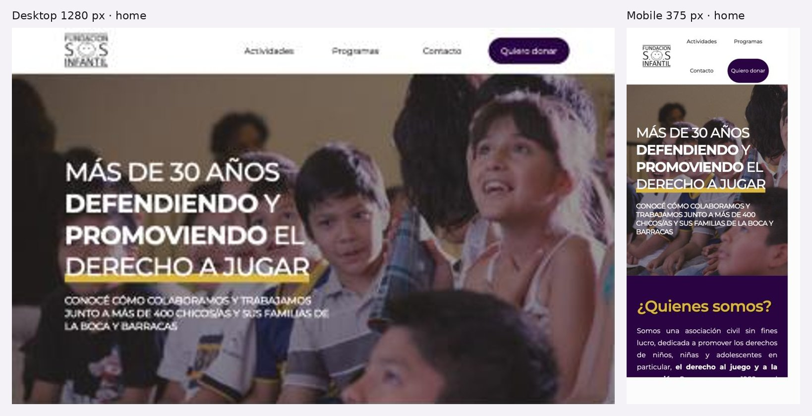

# 3.3.4 - Fundación S.O.S. Infantil

## Información general
- **Organización:** Fundación S.O.S. Infantil. Se presenta como "asociación civil sin fines de lucro" (HECHO, [1]).
- **Tipo:** **Indirect competitor.** Comparte el campo (derechos de niñas, niños y adolescentes en Argentina) y una parte de los públicos (donantes y padrinos, familias), pero su producto es distinto: talleres recreativos, deportivos y culturales presenciales para chicos de La Boca y Barracas, con foco en el derecho al juego. No trabaja la prevención de violencias, no tiene recursos para familias ni docentes sobre esos temas y no deriva a líneas de ayuda (HECHO: no aparecen menciones a 102, 137 ni 911, [1]). Encaja en "producto distinto para una audiencia parcialmente compartida" (INFERENCIA según las definiciones del brief).
- **Ubicación:** Ciudad de Buenos Aires, barrios de La Boca y Barracas. La meta descripción dice: "más de 400 chicos/as y sus familias de la Boca y Barracas" (HECHO, [1]). Según el sitio, la organización empezó en 1989 en el Gran Buenos Aires (HECHO, [1]). El sitio no publica una dirección física (HECHO, [1]).
- **Oferta:** Taller de arte, taller de murga, taller deportivo, Taller de sueños, "Boca quiere a La Boca" (alimentación, lectura, ropa), WikiPlay (plataforma web externa), "Mano a Mano por los chicos" (ciclo de charlas contra la violencia en el fútbol), viajes solidarios, "Te doy lo que sé" (capacitaciones en provincias), "Subite un chico A Cococho" (padrinazgo) y un ciclo de webinars sobre derechos, niñez y deporte (HECHO, [1]).
- **Website:** https://sosinfantil.org.ar. Es un sitio de una sola página (one-page) con anclas internas (HECHO, [1]).
- **Tamaño o alcance:** más de 30 años de trayectoria. Más de 400 chicos/as y sus familias. Taller de arte: 50 chicos de 6 a 13 años. Murga: 45 chicos de 5 a 16 años. Taller deportivo: 280 chicos de 4 a 17 años. "400 sueños" cumplidos. "Más de 8 provincias y 14 ciudades" visitadas. "Más de 1500 chicos" capacitados. "Alrededor de 500 referentes sociales" (HECHO, [1]). Ninguno de estos números tiene fecha de corte ni fuente (OBSERVACIÓN, [1]).
- **Target audience:** chicos de 4 a 17 años y sus familias del barrio, potenciales donantes y padrinos, y un público general cercano al fútbol (HECHO e INFERENCIA, [1]). El sitio no segmenta sus contenidos por público.
- **Unique value proposition:** "Más de 30 años DEFENDIENDO y PROMOVIENDO el DERECHO A JUGAR" (H1, HECHO, [1]). El deporte y el juego son la puerta de entrada, con un vínculo histórico con el Club Atlético Boca Juniors: el programa "Los Chicos Xeneizes" nació en 1999 (HECHO, [1]).
- **Otros datos de posicionamiento:** el sitio menciona como aliados al Club Atlético Boca Juniors, el Club Atlético River Plate, el Banco Santander, el Mecenazgo del Gobierno de la Ciudad de Buenos Aires, el Ministerio de Desarrollo Social de la Nación y la Secretaría de Deportes de la Nación. Las menciones están en texto, no como logos (HECHO, [1]). También aparecen figuras del deporte y los medios en las charlas, como Diego Latorre y Mariano Iudica (HECHO, [1]). El nombre "S.O.S." puede sugerir un servicio de emergencia que la organización no ofrece (INFERENCIA).

## Arquitectura y navegación
- **Menú principal (tal cual):** "Actividades" (#actividades) · "Programas" (#programas) · "Contacto" (#contacto) · "Quiero donar" (#donar) (HECHO, [1]).
- **Submenús:** no tiene (HECHO, [1]). Según la lectura del contenido, no hay menú hamburguesa (OBSERVACIÓN, [1]; conviene confirmarlo con capturas mobile).
- **Profundidad:** un solo nivel. Todo está en la home, que se recorre con scroll y anclas. El orden de las secciones es: ¿Quiénes somos? → Nuestras Actividades / Programas → Equipo → Contacto → Quiero donar (HECHO, [1]). La única página interna que encontré (/infanciayderechos/) devuelve error 404 [2][3].
- **Organización por audiencia:** no existe. El menú se organiza por tipo de contenido (actividades y programas) más dos acciones (contactar y donar) (HECHO, [1]). "Quiero donar" es el único ítem orientado a un público, el donante (OBSERVACIÓN).
- **Buscador:** no tiene (HECHO, [1]).
- **Footer:** "© Fundación SOS Infantil" sin año, con links a Twitter (twitter.com/SOSinfantil), Instagram (instagram.com/sosinfantil) y Facebook (m.facebook.com/Fundacion-SOS-Infantil-115515878472689/). El link de Facebook apunta a la versión mobile (m.) (HECHO, [1]).
- **Anclas:** la herramienta de lectura no pudo confirmar que existan los IDs de destino de las anclas del menú (#actividades, #programas, etc.) ni de las galerías (#fotoseventos, #fotosviajes, #fotostedoyloquese). Su funcionamiento queda **no verificable** con WebFetch y conviene revisarlo en las capturas (OBSERVACIÓN, [1]).

## User flows clave
- **Pedir ayuda / derivación:** **no existe.** No hay sección de ayuda, líneas de asistencia (102, 137, 911) ni derivaciones (HECHO, [1]). Tampoco hay información sobre cómo inscribir a un chico en los talleres: no aparecen requisitos, horarios ni sede (HECHO, [1]). Fricción: una familia del barrio no tiene un camino visible para sumarse, salvo escribir al email genérico (INFERENCIA).
- **Donar:** el ítem "Quiero donar" del menú lleva por ancla a una sección con los datos de Mercado Pago: "ALIAS: sos.infantil / CVU: 0000003100092490977229" (HECHO, [1]). Los pasos son: clic en el menú → copiar alias o CVU → ir a la app de pagos. Fricciones: no hay botón de pago online, opción de donación mensual, montos sugeridos, explicación del destino del dinero ni comprobante o certificado para deducir impuestos. Tampoco se publican CUIT ni personería (HECHO de ausencia, [1]). El padrinazgo ("Subite un chico A Cococho") tiene un CTA, "¡Quiero ser padrino!", que lleva a #contacto, donde solo hay un email (HECHO, [1]).
- **Voluntariado / empresas:** **no existe un flujo.** Hay una lista de "Colaboradores voluntarios" con nombres de pila, pero no explica cómo sumarse (HECHO, [1]). No hay propuesta para empresas: los aliados se nombran pero no hay una invitación a serlo (HECHO, [1]).
- **Recursos / formación:** la descripción de "Te doy lo que sé" habla de capacitaciones, pero no hay materiales descargables (HECHO, [1]). El link "Ingresá en este link para enterarte de nuestros últimos webinars" lleva a /infanciayderechos/, que da **404** tanto en http como en https (HECHO, [1][2][3]). El link "Conocer más" lleva a WikiPlay (www.wikiplay.com.ar), cuyo dominio **no resuelve** (no accesible, [4][5]). Resultado: los dos caminos hacia recursos están rotos (HECHO).
- **Prensa:** **no existe.** No hay sección de prensa, kit, notas en medios ni contacto de prensa (HECHO, [1]).
- **Contacto institucional:** "Contacto" lleva por ancla a un único email, sosinfantil@gmail.com (una cuenta de Gmail, no de dominio propio). No hay teléfono, dirección ni formulario (HECHO, [1]). Fricción: un único canal para todos los públicos (INFERENCIA).
- **Público internacional:** **no existe.** El sitio está solo en español y no tiene selector de idioma (HECHO, [1]). Además, la única vía de donación (alias o CVU de Mercado Pago) solo sirve dentro de Argentina (INFERENCIA).

## Contenido
- **Claridad:** la misión se entiende rápido gracias al H1 y a "¿Quiénes somos?" (OBSERVACIÓN, [1]). La lista de diez actividades y programas mezcla talleres, campañas, plataformas y eventos sin jerarquía, y el menú separa "Actividades" de "Programas" aunque en la página aparecen integrados (OBSERVACIÓN, [1]).
- **Tono:** cálido, cercano y militante, con mayúsculas enfáticas y voseo. Citas: "Más de 30 años DEFENDIENDO y PROMOVIENDO el DERECHO A JUGAR" [1]; "dedicada a promover los derechos de niños, niñas y adolescentes" [1].
- **Organización:** narrativa lineal en una sola página. Es adecuada para un sitio chico, pero la página se vuelve larga, con muchas galerías y videos (OBSERVACIÓN, [1]).
- **Cantidad de información:** abundante sobre actividades y cifras por taller. Escasa sobre gobernanza, finanzas y modos de participar (OBSERVACIÓN, [1]).
- **CTAs (texto exacto):** "Actividades", "Programas", "Contacto", "Quiero donar" (menú); "Conocé a nuestro equipo"; "Conocer más" (WikiPlay, roto); "Ver más Imágenes" / "Ver más imagénes" (con una inconsistencia ortográfica); "¡Quiero ser padrino!"; "Ingresá en este link para enterarte de nuestros últimos webinars" (roto) (HECHO, [1]).
- **Impacto y transparencia:** hay cifras por programa (ver Información general), pero sin año de referencia ni metodología (HECHO y OBSERVACIÓN, [1]). Los videos anuales "Resumen 2021" a "Resumen 2025" están alojados como archivos propios (assets/videos/…mp4), no en YouTube (HECHO, [1]). Son la única señal de actualización reciente: el resumen más nuevo es de 2025 (HECHO, [1]). El sitio publica la comisión directiva con nombres y cargos (presidenta, vicepresidentas, secretaria, tesorera, vocales) (HECHO, [1]). No publica memorias, balances, CUIT ni personería jurídica (HECHO de ausencia, [1]).
- **Presencia en medios:** no hay notas de prensa ni logos de medios. La credibilidad se apoya en los clubes, empresas y organismos aliados y en figuras conocidas del fútbol (HECHO, [1]).
- **Contenido desactualizado o roto:** el copyright no tiene año. Los viajes solidarios que se mencionan son de 2012, 2015 y 2016. La página de webinars da 404 y el dominio de WikiPlay no resuelve (HECHO, [1][2][3][4][5]).

## Idiomas y accesibilidad (lo verificable desde el contenido)
- **Idiomas:** solo español (HECHO, [1]).
- **Texto alternativo:** en la lectura con WebFetch, la mayoría de las imágenes aparecen sin alt. El primer relevamiento contó 6 imágenes sin alt y el segundo indicó que solo una tiene alt ("Resumen 2025") (OBSERVACIÓN, [1]). Hace falta verificarlo con un inspector, porque la conversión a markdown puede perder atributos.
- **Atributo lang, skip links e IDs de anclas:** la herramienta indicó que no hay lang ni skip links, pero esto es **no verificable** con certeza por la misma limitación de la conversión (OBSERVACIÓN, [1]).
- **Encabezados:** hay dos H1 ("Más de 30 años…" y "Nuestras Actividades"), lo que sugiere una jerarquía de títulos irregular (OBSERVACIÓN, [1]).
- **Videos:** son mp4 propios. No hay mención a subtítulos ni transcripciones (OBSERVACIÓN, [1]).
- **Viewport:** la meta viewport es responsive (width=device-width) y el esquema de color es solo claro (HECHO, [1]). La experiencia mobile real queda para tus capturas.
- **Textos de links:** "Ingresá en este link…" y "Conocer más" son textos poco descriptivos fuera de contexto (OBSERVACIÓN, [1]).

## First impressions (capturas propias, 2026-10-05)
- **Primera impresión (OBSERVACIÓN):** foto de chicos oscurecida con un mensaje grande: "Más de 30 años defendiendo y promoviendo el derecho a jugar".
- **Claridad de la propuesta:** muy clara en una frase; se entiende qué hace y dónde (La Boca y Barracas).
- **Jerarquía visual:** "Quiero donar" es el único botón destacado.
- **Desktop — Okay.** + Mensaje principal claro, menú corto. − Página única genérica, poca información por sección.
- **Mobile — Okay.** + Sin scroll horizontal (ancho 375 = 375), "Quiero donar" visible. − El menú no colapsa: se parte en dos filas y ocupa el header.
- **Responsive design:** se adapta, pero sin patrón móvil (sin hamburguesa).

## Visual design
- **Branding / identidad — Okay.** + Violeta oscuro y amarillo, logo con caritas en la "O". − Plantilla genérica de una sola página.
- **Imágenes:** fotos reales de chicos en talleres.
- **Coherencia:** al ser una sola página, es coherente; los recursos externos (webinars, WikiPlay) están rotos.
- **Relación diseño–audiencia:** pensado para donantes cercanos al fútbol y al barrio.

## Verificación técnica (JavaScript sobre el DOM, 2026-10-05)
| Chequeo | Resultado |
| --- | --- |
| `lang` del documento | **`en`** en un sitio en español: los lectores de pantalla lo leen con pronunciación inglesa |
| H1 | 1 ("Nuestras Actividades"); el mensaje principal del hero no es un encabezado |
| Imágenes con `alt=""` | 29 de 30 |
| Skip link | No |
| Buscador | No |
| Enlaces `tel:` | 0 |
| Menú | 4 anclas (#actividades, #programas, #contacto, #donar) |

## Ratings finales
| Dimensión | Rating | Por qué |
| --- | --- | --- |
| Desktop | Okay | Claro pero mínimo |
| Mobile | Okay | Sin roturas, menú en dos filas |
| Navegación | Needs work | Una sola página, sin buscador ni públicos |
| User flow | Needs work | Donar solo con alias local; sin inscripción, voluntariado ni prensa |
| Accesibilidad | Needs work | `lang` incorrecto, 29 de 30 imágenes sin descripción |
| Diseño visual | Okay | Coherente pero genérico |
| Contenido | Okay | Muchas cifras sin fecha ni fuente; links rotos |

## Lentes del objetivo del audit
| Lente | ¿Lo resuelve? | Evidencia |
| --- | --- | --- |
| Navegación por audiencia | No | 4 anclas institucionales |
| Pedir ayuda / derivación | No | Sin líneas ni ruta, aunque el nombre "S.O.S." sugiere emergencia |
| Impacto y credibilidad | Parcial | Cifras por programa sin fecha; aliados mencionados en texto |
| Prensa | No | Sin sección |
| Internacional | No | Solo español; donación solo local |

## Qué significa → qué decisión podría afectar
- Cifras sin fecha ni fuente no generan confianza → **afecta** cómo se muestran los números de impacto (siempre con año y fuente, US-32).
- El `lang` incorrecto y los alt vacíos muestran que la accesibilidad básica no es estándar en el sector → **oportunidad** de diferenciación (US-01 criterio de teclado y lector).

## Evidencia
Capturas: home desktop (1280 px) y home mobile. Archivos: `evidencia/capturas/sos_*.jpg` (hoja resumen: `evidencia/sos_evidencia.jpg`).

## Ratings preliminares (solo contenido, antes de las capturas) (Needs work / Okay / Good / Outstanding, con + y −)
- **Content: Okay.**
  - (+) Misión clara.
  - (+) Muchas cifras concretas por programa.
  - (+) Tono cálido y coherente.
  - (+) Comisión directiva publicada.
  - (−) Las cifras no tienen fecha ni fuente.
  - (−) No hay transparencia financiera ni prensa.
  - (−) Los programas no tienen jerarquía.
  - (−) Hay contenido roto (webinars y WikiPlay).
- **Interaction / Navigation: Needs work.**
  - (+) El menú de 4 ítems es simple y "Quiero donar" está siempre visible.
  - (−) Arquitectura de una sola página, sin buscador y sin navegación por público.
  - (−) Dos links externos o internos rotos.
  - (−) No se pudo verificar que las anclas funcionen.
- **User flow: Needs work.**
  - (+) Para donar en Argentina alcanza con un clic hasta el alias.
  - (−) No hay flujos para inscribir a un chico, ser voluntario, empresa o prensa, ni para públicos internacionales.
  - (−) El padrinazgo termina en un email de Gmail.
  - (−) No hay pago online ni donación recurrente.
- **Accessibility (preliminar): Needs work.**
  - (+) Tiene viewport responsive.
  - (−) Las imágenes parecen no tener alt.
  - (−) Hay dos H1.
  - (−) Hay links poco descriptivos.
  - (−) Los videos no tienen subtítulos declarados.
  - Lang y skip links: no verificables con WebFetch.

## Fortalezas
- Una propuesta de valor memorable en el H1, centrada en un derecho concreto, el derecho a jugar [1].
- Cifras de alcance por programa: chicos atendidos y rangos de edad [1].
- "Quiero donar" como ítem fijo del menú y un dato de pago listo para copiar [1].
- Gobernanza visible: comisión directiva con nombres y cargos, y voluntarios reconocidos por nombre [1].
- Credibilidad prestada por aliados reconocibles: Boca Juniors, River Plate, Banco Santander y organismos públicos [1].
- Resúmenes anuales en video del período 2021 a 2025, que muestran continuidad [1].

## Debilidades
- No ofrece ni derivación ni ayuda, y tampoco explica cómo una familia accede a los talleres [1].
- El sitio es una sola página y no tiene páginas por público [1].
- Links rotos: los webinars dan 404 [2][3] y WikiPlay no resuelve [4][5].
- Solo está en español y los medios de donación solo sirven en Argentina [1].
- No hay prensa, memorias, balances ni CUIT [1].
- El contacto es un único email de Gmail, sin teléfono, dirección ni formulario [1].
- Hay señales de desactualización: copyright sin año y viajes que llegan solo hasta 2016 [1].

## Patrones o ideas relevantes para Red por la Infancia
1. **HECHO:** "Quiero donar" es un ítem permanente del menú principal [1]. **INFERENCIA:** dejar un CTA de acción siempre visible en el menú es un patrón directamente aplicable a "Necesito ayuda", el ítem que hoy solo encuentra el 4% de los usuarios (objetivo 2 del audit). Sirve también para donar (objetivo 3).
2. **HECHO:** las cifras se presentan por programa, con cantidad de chicos y rango de edad [1]. **OBSERVACIÓN:** no tienen año ni fuente. **INFERENCIA:** Red por la Infancia puede tomar el formato de "impacto en números por programa" y fecharlo, por ejemplo "datos 2025" (objetivo 3).
3. **HECHO:** la credibilidad se construye con aliados nombrados y con la comisión directiva publicada [1]. **INFERENCIA:** una franja de aliados y financiadores, con logos y no solo texto, más la gobernanza visible, refuerza la confianza de donantes y financiadores (objetivo 3).
4. **HECHO:** los videos de resumen anual 2021 a 2025 son su principal señal de actualidad [1]. **INFERENCIA:** un formato de "memoria anual" liviano (video o ficha) puede reemplazar a la sección de prensa o memoria mientras no exista, aunque conviene alojarlo en una plataforma con subtítulos (objetivos 3 y 5).
5. **HECHO:** los links a recursos (webinars y WikiPlay) están rotos [2][3][4][5]. **INFERENCIA:** es un antiejemplo para el Campus y para Bajalo Ya!. Conviene alojar los recursos dentro del dominio propio o monitorear los links externos, porque un recurso roto destruye la confianza (objetivos 1 y 3; también la "dificultad de mantener" que el brief señala).
6. **HECHO:** el sitio no tiene navegación por público, idiomas ni prensa [1]. **OBSERVACIÓN:** es un caso de referencia "mínimo" que confirma lo que Red por la Infancia ya identificó como problema. **INFERENCIA:** no aporta patrones para los objetivos 1 y 4.
7. **HECHO:** se dona con alias o CVU de Mercado Pago [1]. **INFERENCIA:** es simple para el público local, pero excluye al 31% de usuarios que está fuera de Argentina. Red por la Infancia necesita una alternativa internacional, como tarjeta, PayPal o una plataforma global (objetivo 4).
8. **INFERENCIA:** un nombre como "S.O.S." genera la expectativa de ayuda urgente que el sitio no atiende. Es una lección para Red por la Infancia: si un usuario llega buscando ayuda, el sitio tiene que derivarlo explícitamente aunque la organización no brinde asistencia directa (objetivo 2).

## Fuentes
Fecha de consulta: 2026-10-05.
1. https://sosinfantil.org.ar (home, sitio one-page; consultada con WebFetch en varias lecturas)
2. http://sosinfantil.org.ar/infanciayderechos/ (no accesible: 404)
3. https://sosinfantil.org.ar/infanciayderechos/ (no accesible: 404)
4. http://www.wikiplay.com.ar/ (no accesible: el dominio no resuelve)
5. https://wikiplay.com.ar/ (no accesible: el dominio no resuelve)
6. Redes enlazadas desde el footer, no consultadas: https://twitter.com/SOSinfantil, https://www.instagram.com/sosinfantil/, https://m.facebook.com/Fundacion-SOS-Infantil-115515878472689/

## Capturas

