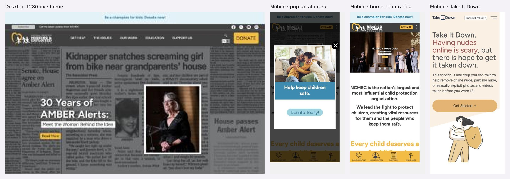

# 3.3.5 - NCMEC

> Método: lectura de contenido con WebFetch (resúmenes generados por la herramienta a partir del HTML). Las cifras y textos citados provienen de esos resúmenes; conviene contrastar los números clave al hacer las capturas. Fecha de consulta: 2026-10-05. Referencias entre corchetes [n] = número en la sección Fuentes.

## Información general
- **Organización:** National Center for Missing & Exploited Children (NCMEC). Se presenta como "the nation's largest and most influential child protection organization" [1]. Recibe financiamiento federal de la Office of Juvenile Justice and Delinquency Prevention (aviso en el footer) [1].
- **Tipo: Indirect competitor.** Justificación según el brief: ofrece productos muy parecidos a los de Red por la Infancia (Take It Down ≈ Bajalo Ya!; NetSmartz ≈ ReConectate/Pantasaurus; recursos para familias y docentes), pero a **otra audiencia/mercado** (Estados Unidos, con alcance global en Take It Down), no a Argentina. Además, a diferencia de Red por la Infancia, NCMEC **sí brinda asistencia directa** (línea 24 h, CyberTipline, apoyo a familias), por lo que su oferta excede la de la fundación (HECHO [1][3][4]; clasificación = INFERENCIA).
- **Ubicación:** Alexandria, Virginia, EE. UU. (dirección postal para donaciones: 333 John Carlyle Street, Suite 125) [9]; oficinas regionales en Florida, Nueva York y Texas mencionadas en el footer [1].
- **Oferta:** línea 24 h 1-800-843-5678 (1-800-THE-LOST) [1][3]; CyberTipline (sistema centralizado de reportes de explotación sexual infantil online) [4][14]; Take It Down (remoción de imágenes íntimas de menores de 18 por hash) [2]; búsqueda de afiches de chicos desaparecidos y AMBER Alerts [3]; apoyo a víctimas, sobrevivientes y familias (intervención en crisis, derivaciones a salud mental) [3][7]; educación preventiva NetSmartz y KidSmartz [1][6]; capacitación a profesionales [1][7]; Global Platform for Child Exploitation Policy [7].
- **Website:** https://www.missingkids.org (+ subdominios takeitdown.ncmec.org, report.cybertip.org, give.missingkids.org) [1][2][4][9].
- **Tamaño / alcance (Impact Report 2025) [7]:** 32.167 casos de desaparición apoyados (90% resueltos); 21,3 millones de reportes a CyberTipline en 2025 (225+ millones desde 1998); 138.184 contactos al call center; Take It Down: 130.000+ envíos, 273.000+ hashes, "36 languages"; 16,5 M visitantes web y 36,6 M páginas vistas en 2025; 93.249 descargas de recursos en 148 países.
- **Target audience:** familias de chicos desaparecidos; víctimas de explotación y trata; niñas, niños y adolescentes (sobre todo en sextorsión y Take It Down); padres y cuidadores; educadores; fuerzas de seguridad y profesionales legales; plataformas tecnológicas (proveedores de servicios electrónicos que reportan); donantes [1][3][4][5][6].
- **Unique value proposition:** ser el centro nacional de reportes e información de EE. UU. para chicos desaparecidos y explotados, con datos propios a escala (CyberTipline) y herramientas técnicas que no requieren compartir la imagen (hash) (HECHO [2][4][11]; formulación = INFERENCIA). Claim de home: "Every child deserves a safe childhood." [1]
- **Otros datos de posicionamiento:** sellos de calidad en Support Us (Candid Gold Seal, Charity Navigator Four Star, BBB Accredited Charity, Charity Watch Top Rated, Best in America) [8]; miembro fundador de INHOPE [14]; CFC #11822 [9].

## Arquitectura y navegación
- **Menú principal (5 ítems) [1]:** GET HELP · THE ISSUES · OUR WORK · EDUCATION · SUPPORT US. En la versión en español: AYUDA · INFÓRMATE · QUÉ HACEMOS · EDUCACIÓN · APÓYENOS [11].
  - **Get Help** (9 subsecciones según extracción): CyberTipline, recursos de explotación, búsqueda de chicos desaparecidos/afiches, AMBER Alerts, apoyo a víctimas/sobrevivientes/familias, entre otras [1][3].
  - **The Issues** (14 temas, desde autismo y "wandering" hasta sextorsión) [1].
  - **Our Work:** Our Impact, About Us, Disaster Preparedness & Response, Native, Indigenous & Tribal Communities, Case Resources, NCMEC Data, Publications, Global Platform for Child Exploitation Policy [7].
  - **Education:** capacitación profesional, NetSmartz, KidSmartz, Code Adam [1].
  - **Support Us:** Store, Events, Ways to Give, Volunteer, Corporate Partners, Program Partners [8].
- **Profundidad:** mínimo 3 niveles (menú > sección > página temática), más subsitios con navegación propia (NetSmartz, Take It Down, CyberTipline) (OBSERVACIÓN [1][2][4][6]).
- **¿Organiza por audiencia?** No en el menú principal: organiza por **tarea/situación** (Get Help, The Issues) e **institución** (Our Work, Support Us) [1][3]. La segmentación por audiencia aparece dentro de las páginas temáticas (p. ej., sextorsión: mensajes a adolescentes, hoja para padres, guías para educadores) [5]. En NetSmartz la audiencia se pide en el registro (Students con rangos de edad, Parents/Family, Professionals con subtipos, Others), no como navegación [6].
- **Take It Down (subsitio):** Get Started, Home, Resources and Support, About Us, Participants, FAQ + selector de idioma [2].
- **NetSmartz (subsitio):** Topics (Cyberbullying, Gaming, Generative AI, Livestreaming, Online Enticement, Sexting, Sextortion, Smartphones, Social Media), Videos, Resources, Into the Cloud, Blog [6].
- **Buscador:** No verificable con el contenido extraído (la extracción de la home no lo mencionó) [1]. Revisar en capturas.
- **Footer:** Blog, Media, Contact, Privacy Policy, Donor Privacy, Terms & Conditions, Careers, oficinas regionales, aviso de financiamiento federal [1].
- **Accesos persistentes:** línea 24 h, "Search Missing Posters", "Make a CyberTipline Report" y botón de donación aparecen en home, Get Help y Media [1][3][10].

## User flows clave
1. **Pedir ayuda / derivación y reporte.**
   - Pasos: Home > GET HELP (o accesos directos en home) > "Get Help Now", organizado por situación: "Is your child missing?", "Exploitation Resources", afiches, AMBER Alerts, "Victim, Survivor & Family Support" [3]. Teléfono 24 h como botón clickeable; instrucción "CALL 911 immediately" ante peligro [3].
   - Reporte: "Make a CyberTipline Report" > report.cybertip.org > "Report Incident"/"Get Started". El sitio dice que el formulario se completa "in just a few minutes", que la mayoría de los campos son opcionales y que quien reporta decide si comparte sus datos [4]. La extracción menciona un botón **Quick Exit** [4].
   - Fricciones: el sitio de ayuda mezcla dos problemas muy distintos (desaparición y explotación) en la misma página (OBSERVACIÓN [3]); no hay mención a personas que llaman desde fuera de EE. UU. [3]; la página institucional de CyberTipline muestra datos 2023 mientras el Impact Report ya publica 2025 (OBSERVACIÓN [7][14]).
2. **Quitar imágenes (Take It Down).**
   - Pasos: home NCMEC (enlace "Take It Down") o Get Help > Exploitation Resources o páginas de sextorsión ("Visit Take It Down") > takeitdown.ncmec.org > "Get Started" [1][3][5][2]. Proceso explicado en 5 pasos: elegir la imagen en el propio dispositivo > se genera un hash > solo el hash va a la lista de NCMEC > las plataformas participantes escanean > pueden limitar o quitar el contenido [2].
   - Criterio de elegibilidad claro: imágenes tomadas antes de los 18 (aunque la persona hoy sea adulta); si fue a los 18 o más, deriva a stopncii.org [2][13]. Funciona fuera de EE. UU. [13]. No requiere datos personales [13].
   - Advertencia destacada: no enviar, compartir ni descargar la imagen [2].
   - Fricciones/limitaciones explicitadas: no funciona en plataformas cifradas; al ser anónimo, no notifica si se encuentra la imagen; no garantiza que la imagen no aparezca en otros lugares [13]. Las plataformas participantes (lista de ~25–27 empresas, p. ej. Facebook, Instagram, TikTok, Snap Inc., YouTube, OnlyFans, Pornhub) están en una página aparte [12]. La página del flujo de envío (/process/) no fue accesible, por lo que las pantallas internas son **No verificables** [17].
3. **Donar.** Botón persistente "Be a champion for kids. Donate now!" [1][7][8] > Support Us > Ways to Give, con 13 modalidades (mensual —presentada como la "MOST EFFECTIVE way"—, única, en honor, cumpleaños, recaudación propia, legados, DAF, matching gifts, CFC, por correo, acciones, eventos, tienda) [9]. El pago ocurre en plataformas externas (give.missingkids.org y Classy) [9]. Fricción: Ways to Give no muestra ratings, estados financieros ni EIN; los sellos están en Support Us [8][9].
4. **Empresas / partners.** Support Us lista "Corporate Partners" y "Program Partners" [8], pero el texto extraído para Corporate Partners habla de comprar merchandising ("Wear the #HOPE heart") y no se ven nombres de empresas [8]. Las URL /supportus/corporatepartners y /supportus/corporate-partners devolvieron 404 [15][16]. Flujo para empresas: **No verificable** (no se encontró propuesta de alianza, niveles ni contacto específico). Para plataformas tecnológicas existe un rol distinto: reportar a CyberTipline como "electronic service providers" y sumarse a Take It Down [4][12].
5. **Recursos / formación por audiencia.** Education > NetSmartz: contenidos por **tema** (no por público), con videos, presentaciones, tip sheets, planes de clase, aventuras interactivas y guías de discusión; la audiencia se declara al **registrarse**, y el registro es obligatorio para descargar [6]. Las páginas temáticas (sextorsión) sí separan mensajes para adolescentes, padres y educadores, con guías descargables en inglés y español [5]. Fricción: el registro obligatorio es una barrera para docentes y familias (INFERENCIA).
6. **Prensa.** Footer > Media: hub con Blog, Media Resources (imágenes, videos, retratos de ejecutivos), Request an Interview, Stats and Facts (enlaza a Our Impact), Missing Anniversaries y NCMEC Branding (logos y guía); contacto media@ncmec.org [10]. No se vieron comunicados de prensa con fecha ni press kit descargable en la página [10]. Fricción: prensa está solo en el footer, no en el menú principal (OBSERVACIÓN [1][10]).
7. **Público internacional / otros idiomas.** El sitio principal ofrece EN/ES [1]; la versión en español traduce el menú pero deja elementos en inglés (popup de donación, blog, videos) [11]. Take It Down es el único producto realmente internacional: selector con más de 30 idiomas [2] y aclara en FAQ que no hace falta estar en EE. UU. [13]. No hay una sección para aliados internacionales en el menú; lo más cercano es "Global Platform for Child Exploitation Policy" en Our Work [7] y la membresía en INHOPE [14].

## Contenido
- **Claridad:** alta en las páginas de crisis y de herramientas: Take It Down explica el hash en 5 pasos y responde 17 preguntas frecuentes en lenguaje simple [2][13]; CyberTipline explica qué se puede reportar y qué pasa después [4][14]. Las páginas institucionales (Impact Report) son muy densas en cifras [7].
- **Tono:** empático y desculpabilizante con víctimas adolescentes: "The blackmailer is to blame, not you" [5]; directivo en instrucciones de seguridad: "Please do NOT send, share, or download any image or video" [2]. Institucional y de autoridad en la home ("the nation's largest and most influential...") [1].
- **Organización:** temas ("The Issues") con estructura repetible en sextorsión: Overview, What To Do, Resources, Red Flags, By the Numbers, What NCMEC is Doing About it [5]. Patrón útil y consistente (OBSERVACIÓN).
- **Cantidad de información:** muy alta; el sitio cubre desaparición, explotación, trata, autismo/"wandering", desastres, comunidades nativas, etc. [1][7]. Riesgo de sobrecarga para quien llega en crisis (INFERENCIA).
- **CTAs (textuales):** "Be a champion for kids. Donate now!", "Donate Today!", "DONATE", "Search Missing Posters", "Make a CyberTipline Report", "Report Child Sexual Exploitation", "Report Incident", "Get Started", "Visit Take It Down", "View Resources", "Learn more", "Download Report PDF", "Read the Full Story", "Request an Interview", "Create Fundraiser", "Watch Now", "Visit Now", "Make a Difference Today!"; en español: "Donar Ahora", "Comenzar", "Aprende Más" [1][2][4][5][6][7][8][9][10][11][14].
- **Impacto / transparencia:** Impact Report 2025 en página web con cifras grandes, porcentajes en círculos, tablas, gráficos de torta y relatos ("Read the Full Story"), más PDFs descargables de 2022 a 2025 [7]. Our Work incluye "NCMEC Data" y "Publications" [7]; CyberTipline tiene sección "By the Numbers" y enlace a datos detallados [14]; sextorsión también tiene "By the Numbers" [5]. Sellos de calificadoras en Support Us [8]. Inconsistencia: distintas páginas muestran cifras de distintos años (2023 en CyberTipline, 2025 en Impact) (OBSERVACIÓN [7][14]); la página de sextorsión muestra un dato "2024 (through October 5)" que parece desactualizado (OBSERVACIÓN [5]).
- **Presencia en medios / newsroom:** hub de Media con blog, recursos para periodistas, pedido de entrevistas y branding [10]; Impact Report reporta 376 M de impresiones en redes y 34 M de visualizaciones de video en 2025 [7]. No se encontraron menciones en medios ("as seen in") ni comunicados fechados en la página Media [10].

## Idiomas y accesibilidad (lo verificable desde el contenido)
- **Idiomas:** missingkids.org: inglés y español (traducción parcial: popup de donación, blog y videos quedan en inglés) [1][11]. CyberTipline: inglés y español [4]. NetSmartz: inglés y español [6]. **Take It Down:** la extracción del selector listó 38 idiomas (árabe, bengalí, chino simplificado, croata, danés, neerlandés, inglés, francés, alemán, griego, groenlandés, hindi, húngaro, islandés, indonesio, italiano, japonés, jemer, coreano, kurdo, malayalam, maratí, polaco, portugués, rumano, serbio, cingalés, esloveno, español, tagalo, tamil, tailandés, turco, ucraniano, urdu, vietnamita, sueco y finés), aunque el mismo resumen dice "34" [2], el FAQ "35+" [13] y el Impact Report "36 languages" [7]. Conteo exacto: a verificar en captura del selector.
- **Accesibilidad (señales en el contenido):** enlace "Skip to main content" en la home [1]; botón Quick Exit y soporte de navegación por teclado señalados en CyberTipline [4]; teléfono como enlace clickeable [3]; meta viewport en sextorsión [5]. NetSmartz: no se mencionan subtítulos ni transcripciones [6]. Take It Down: no se ve declaración de accesibilidad [2]. No se encontró declaración de accesibilidad en el footer de missingkids.org [1].

## First impressions (capturas propias, 2026-10-05)
- **Primera impresión (OBSERVACIÓN):** en mobile, al entrar aparece un pop-up de donación ("Help keep children safe. Donate Today!") que tapa toda la home. Detrás hay una barra amarilla fija abajo con 4 accesos: 24-Hour Hotline, Missing Posters, CyberTipline y AMBER Alert.
- **Claridad de la propuesta:** "the nation's largest and most influential child protection organization": clara, institucional.
- **Jerarquía visual:** donar arriba (franja + botón DONATE) y acciones de ayuda abajo (barra fija).
- **Desktop — Good.** + Menú de 5 ítems por tarea, botón DONATE destacado. − Hero de collage de diarios con mucho ruido visual.
- **Mobile — Good.** + Barra de acciones fija con la línea 24 h tocable; sin scroll horizontal. − El pop-up de donación al entrar interrumpe incluso a quien llega en crisis.
- **Take It Down:** primera pantalla con mensaje empático ("Having nudes online is scary, but there is hope…"), ilustraciones en lugar de fotos y selector de idioma visible en el header.

## Visual design
- **Branding / identidad — Good.** + Marca fuerte (gris oscuro y amarillo). − Cada producto (Take It Down, NetSmartz, CyberTipline) tiene su propia identidad.
- **Imágenes:** fotos institucionales en el sitio principal; **ilustraciones** en Take It Down (no expone a víctimas).
- **Coherencia entre páginas:** media por la fragmentación en subdominios.
- **Relación diseño–audiencia:** Take It Down está diseñado para adolescentes (tono cálido, ilustrado, sin juicio); el sitio principal, para adultos y donantes.

## Verificación técnica (JavaScript sobre el DOM, 2026-10-05)
| Chequeo | Resultado |
| --- | --- |
| `lang` | `en` (home) / `en-US` (Take It Down) |
| Skip link | Sí, en los dos |
| Imágenes sin atributo `alt` (home) | 7 de 30 |
| Enlaces `tel:` (home) | 3 (+1-800-843-5678) |
| H1 en la home | Ninguno |
| Idiomas en Take It Down | **38**, cada uno escrito en su propio idioma (p. ej. "Español (Spanish)", "Tagalog (Tagalog)") |
| Pop-up de donación | Aparece al cargar la home en mobile |

## Ratings finales
| Dimensión | Rating | Por qué |
| --- | --- | --- |
| Desktop | Good | Menú por tarea y acciones claras |
| Mobile | Good | Barra fija de acciones; pop-up de donación molesto |
| Navegación | Okay | Por tarea, no por audiencia; subsitios fragmentados |
| User flow | Good | Ayuda y reporte a 1–2 toques; Take It Down con elegibilidad y FAQ |
| Accesibilidad | Okay | Skip link, `tel:`, 38 idiomas en Take It Down; sin H1 en home ni declaración |
| Diseño visual | Good | Marca fuerte; Take It Down excelente para su público |
| Contenido | Good | Procesos complejos explicados simple; datos de años distintos |

## Lentes del objetivo del audit
| Lente | ¿Lo resuelve? | Evidencia |
| --- | --- | --- |
| Navegación por audiencia | Parcial | Por situación ("Is your child missing?"); audiencias dentro de cada tema |
| Pedir ayuda / derivación | Sí | Get Help por situación, teléfono tocable, "Call 911" si hay peligro, barra fija mobile (pero NCMEC asiste directamente) |
| Impacto y credibilidad | Sí | Impact Report 2025 web + PDFs 2022–2025 + sellos de calificadoras |
| Prensa | Parcial | Hub de prensa con contacto y kit, solo en el footer |
| Internacional | Parcial | Take It Down en 38 idiomas; sitio principal EN y ES parcial |

## Qué significa → qué decisión podría afectar
- Una barra fija de acciones críticas en mobile resuelve el "no encuentro dónde pedir ayuda" → **afecta** el header y la navegación mobile de RPI (US-01, US-02).
- Take It Down es el modelo directo para Bajalo Ya!: pasos, elegibilidad, FAQ honesta e idiomas → **afecta** el rediseño de Bajalo Ya! (US-11 a US-13, US-28).
- El pop-up de donación es un antipatrón para quien llega en crisis → **afecta** la regla: nada de interrupciones en rutas de ayuda.
- Traducir a muchos idiomas solo el servicio con demanda internacional → **afecta** la estrategia de idiomas (US-21, US-25).

## Evidencia
Capturas: home desktop (1280 px), pop-up mobile, home mobile con barra fija y Take It Down mobile. Archivos: `evidencia/capturas/ncmec_*.jpg` (hoja resumen: `evidencia/ncmec_evidencia.jpg`).

## Ratings preliminares (solo contenido, antes de las capturas) (Needs work / Okay / Good / Outstanding, con + y −)
- **Content: Good.** + Take It Down y CyberTipline explican procesos complejos (hash, qué pasa después del reporte) en lenguaje claro y con tono desculpabilizante [2][4][5][13]; + estructura temática repetible (Overview / What To Do / Red Flags / By the Numbers) [5]; + impacto cuantificado en profundidad [7]. − Volumen muy alto y temas dispares [1][7]; − cifras de distintos años en distintas páginas [5][7][14].
- **Interaction / Navigation: Okay.** + Menú corto (5 ítems) orientado a tareas, con accesos persistentes a línea 24 h, reporte y donación [1][3]; + subsitios con navegación simple (Take It Down) [2]. − No navega por audiencia; prensa y partners quedan relegados (footer o páginas poco desarrolladas) [1][8][10]; − varios dominios/subsitios con menús distintos (missingkids, takeitdown, cybertip, netsmartz, give) [1][2][4][6][9]; − 404 en URLs esperables de partners [15][16].
- **User flow: Good.** + Pedir ayuda y reportar: 1–2 clics desde la home, formulario con campos opcionales y anonimato opcional [1][3][4]; + Take It Down con elegibilidad clara, derivación a StopNCII para adultos y advertencias de seguridad [2][13]; + donación con 13 modalidades [9]. − Flujo para empresas no verificable [8][15][16]; − registro obligatorio en NetSmartz [6]; − pasos internos de Take It Down no verificables [17].
- **Accessibility (preliminar): Okay.** + Skip link, Quick Exit, teclado (según extracción), ES en sitio principal y 30+ idiomas en Take It Down [1][2][4]. − Sin declaración de accesibilidad visible; sin evidencia de subtítulos/transcripciones en NetSmartz; traducción al español parcial [1][6][11]. Requiere prueba con lector de pantalla y contraste (no verificable solo con contenido).

## Fortalezas
- Take It Down: propuesta de valor muy clara, privacidad por diseño (la imagen no sale del dispositivo), FAQ exhaustiva y honesta sobre límites, alcance internacional y multilingüe [2][12][13].
- Accesos persistentes a las acciones críticas (teléfono 24 h, reporte, búsqueda) en casi todas las páginas [1][3][10].
- Get Help organizado por situación ("Is your child missing?", "Exploitation Resources") [3].
- Impacto: reporte anual web + PDFs históricos 2022–2025, con cifras, gráficos y relatos [7]; sellos de calificadoras [8].
- Páginas temáticas con estructura repetible y recursos por público (adolescentes, padres, educadores) [5].
- Kit para prensa con contacto directo, recursos de marca y pedido de entrevistas [10].
- Quick Exit en el reporte [4].

## Debilidades
- Arquitectura por institución/tarea, no por audiencia; NetSmartz pide la audiencia recién en el registro [1][6].
- Ecosistema fragmentado en subdominios con navegaciones distintas [1][2][4][6][9].
- Traducción al español parcial; fuera de Take It Down no hay atención explícita a público internacional [3][11].
- Datos inconsistentes o desactualizados entre páginas [5][7][14].
- Flujo para empresas/partners débil o roto (404, texto de merchandising) [8][15][16].
- Prensa solo en el footer; sin comunicados fechados en la página Media [1][10].
- Sin declaración de accesibilidad visible [1][2].

## Patrones o ideas relevantes para Red por la Infancia
1. **Get Help organizado por situación, con teléfono clickeable y "llamá al 911 si hay peligro"** → objetivo (2) pedir ayuda/derivar. Aplicable a "Necesito Ayuda" con 911/137/102 como botones. (HECHO [3]; aplicabilidad = INFERENCIA)
2. **Accesos persistentes a las acciones críticas en todas las páginas** (ayuda, reporte, donar) → objetivo (2) y (3); ataca el problema de que solo el 4% llega a "Necesito Ayuda". (OBSERVACIÓN [1][3][10])
3. **Take It Down como referencia directa para Bajalo Ya!:** explicación del proceso en 5 pasos, criterio de edad explícito con derivación alternativa para mayores de 18 (StopNCII), advertencia "no envíes ni descargues la imagen", FAQ de 17 preguntas que reconoce límites, página pública de plataformas participantes → objetivo (2) y credibilidad (3). (HECHO [2][12][13])
4. **Multilingüismo focalizado:** traducir a muchos idiomas solo el servicio con demanda internacional (Take It Down) y dejar el sitio institucional en 2 idiomas → objetivo (4); estrategia realista para Bajalo Ya! (31% de usuarios fuera de Argentina). (HECHO [2][1]; INFERENCIA)
5. **Quick Exit y anonimato opcional en formularios sensibles** → objetivo (2) y seguridad de NNyA. (HECHO según extracción [4])
6. **Plantilla temática repetible** (Overview / Qué hacer / Señales de alerta / Datos / Qué hacemos / Recursos por público) → objetivo (1): permite segmentar por audiencia dentro de cada tema y facilita el mantenimiento. (OBSERVACIÓN [5])
7. **Reporte de impacto web + PDFs + sellos** → objetivo (3) para donantes y financiadores; adaptar a escala (pocos números clave por programa). (HECHO [7][8])
8. **Hub de prensa con contacto directo, kit de marca y pedido de entrevista** → objetivo (3) presencia en medios; resuelve "sin sección de prensa". Mejora posible: subirlo al menú y sumar comunicados fechados. (HECHO [10]; INFERENCIA)
9. **Antipatrones a evitar:** registro obligatorio para descargar recursos educativos (barrera para docentes y familias); traducción parcial que mezcla idiomas; datos de años distintos; links rotos de partners → objetivos (1), (3) y (4). (OBSERVACIÓN [6][11][14][15])
10. **Audiencia en el menú:** NCMEC no lo hace; Red por la Infancia puede diferenciarse con navegación por público (familias, docentes, adolescentes, prensa, donantes). (INFERENCIA [1][6])

## Fuentes
Consultadas el 2026-10-05 con WebFetch.
1. https://www.missingkids.org — home
2. https://takeitdown.ncmec.org — Take It Down, home
3. https://www.missingkids.org/gethelpnow — Get Help Now
4. https://report.cybertip.org — CyberTipline, formulario de reporte
5. https://www.missingkids.org/theissues/sextortion — The Issues: Sextortion
6. https://www.missingkids.org/netsmartz/home — NetSmartz
7. https://www.missingkids.org/ourwork/impact — Impact Report 2025
8. https://www.missingkids.org/supportus — Support Us
9. https://www.missingkids.org/supportus/waystogive — Ways to Give
10. https://www.missingkids.org/footer/media — Media
11. https://www.missingkids.org/es — versión en español
12. https://takeitdown.ncmec.org/participants/ — plataformas participantes
13. https://takeitdown.ncmec.org/faq/ — FAQ de Take It Down
14. https://www.missingkids.org/gethelpnow/cybertipline — CyberTipline (página institucional)
15. https://www.missingkids.org/supportus/corporatepartners — no accesible (404)
16. https://www.missingkids.org/supportus/corporate-partners — no accesible (404)
17. https://takeitdown.ncmec.org/process/ — no accesible (404)

## Capturas

