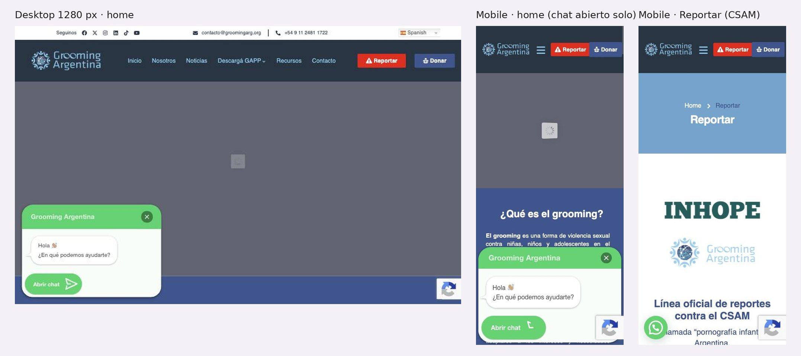

# 3.3.8 - Grooming Argentina

> Método: lectura de contenido con WebFetch (16 páginas, incluidas 2 externas: plataforma de donación y ficha de la app; 1 no accesible), 2026-10-05. WebFetch devuelve un resumen del HTML, no la página renderizada: menús desplegables, estados interactivos, textos dentro de imágenes y detalles visuales pueden no aparecer completos. Las cifras y textos citados provienen de esos resúmenes; conviene contrastar los números clave al hacer las capturas. [OBS] = observación propia en el navegador del celular (2026-10-05). Referencias entre corchetes [n] = número en la sección Fuentes.

## Información general
- **Organización:** Grooming Argentina, ONG que se presenta como "ONG Centrada en la Prevención, Concientización, y Erradicación del Grooming" (título de la página; la verificación del DOM no encontró ningún H1) [1] y como "Una organización pionera a nivel global en la prevención y el combate del grooming" [5]. Se constituyó institucionalmente en 2014, tras la incorporación del grooming al Código Penal [5]. Director ejecutivo: Hernán Navarro [5][13].
- **Tipo: Direct competitor (confirmado).** Justificación según las definiciones del brief: ofrece un **producto similar** —prevención de la violencia sexual contra NNyA en entornos digitales, guías para familias, capacitación a escuelas y fuerzas de seguridad, y un canal para reportar material de abuso sexual infantil en internet— a la **misma audiencia en el mismo mercado** (familias, docentes, adolescentes, organismos públicos y donantes en Argentina) [1][2][5][9][13]. Su canal "Reportar" es el equivalente argentino más cercano a Bajalo Ya! [2]. Diferencia clave: a diferencia de Red por la Infancia, **sí brinda asistencia directa** ("Asistencia: asistencia y acompañamiento especializado a niñas, niños y adolescentes víctimas" [1]; WhatsApp presentado como "24hs" / "24/7, 365 días" [9][12]; app GAPP [15]) (HECHO [1][2][5][9][12]; clasificación = INFERENCIA).
- **Ubicación:** sede en Venezuela 110, 1° piso, CABA; sedes en Jujuy (Senador Pérez N° 221) y Neuquén (Rivadavia 185, 1º piso) [1]. Coordina además la red regional Grooming LATAM (groominglatam.org) [7][8].
- **Oferta:** prevención, capacitación, detección y asistencia (las 4 líneas de "¿Qué es lo que hacemos?") [1]; formulario "Reportar" para CSAM, derivado a "autoridades policiales argentinas y a la red INHOPE" [2]; app GAPP (Android e iOS) [1][15]; WhatsApp +54 9 11 2481 1722 [1][10]; 5 recursos descargables (guías por plataforma e informe regional) [6]; capacitaciones a fuerzas de seguridad (p. ej., Jujuy, junio 2026) [13]; donación online [3][4].
- **Website:** https://groomingarg.org (+ donaronline.org para el pago y tiendas de apps para GAPP) [1][4][15].
- **Tamaño / alcance:** "+200 Proyectos Implementados", "+100.000 Seguidores en Redes Sociales" y "Desde 2014 luchando por la protección" en la home, **sin año de corte** para las cifras [1]. Informe Grooming LATAM 2024–2025: 28.360 encuestas anónimas a NNyA de 9 a 17 años [8]. Capacitación a "más de 700 efectivos" en Jujuy (junio 2026) [13]. App GAPP: "más de 5.000" descargas, 4,9 estrellas con 40 reseñas, última actualización 1 de agosto de 2025 (ficha de Google Play) [15]. No se encontraron cifras acumuladas de casos asistidos ni de reportes recibidos [1][5][13].
- **Target audience:** familias (guías por plataforma y "Mi hija o hijo sufrió violencia sexual en internet ¿Qué hago?") [9][12]; NNyA víctimas [1]; instituciones educativas, organismos públicos y fuerzas de seguridad (capacitación) [1][13]; personas que encuentran CSAM en internet [2]; donantes individuales [3]; empresas tecnológicas como aliadas (logos) [1].
- **Unique value proposition:** organización especializada solo en grooming y violencia sexual digital, con canal de reporte conectado a INHOPE, app propia y asistencia directa (HECHO [1][2][15]; formulación = INFERENCIA).
- **Otros datos de posicionamiento:** logos de Facebook, Instagram, WhatsApp, TikTok, Snapchat, Roblox, Uber, PFA, INHOPE y NCMEC en la home [1]; guía conjunta con Roblox ("Grooming Argentina y Roblox lanzan la guía de protección digital 2026") [9][11]; "Primera Campaña Nacional Contra el Grooming en el País" como sección de la home [OBS] (la extracción de WebFetch no recuperó su contenido [1]).

## Arquitectura y navegación
- **Menú principal (6 ítems) [1]:** Inicio · Nosotros · Noticias · Descargá GAPP (desplegable: Android / iOS, enlaces directos a las tiendas) · Recursos · Contacto.
- **Botones del header:** "Reportar" (→ /denunciarcsam/) y "Donar" (→ /donar/) [1]. En mobile se ven lado a lado, "Reportar" en rojo con ícono de alerta [OBS].
- **Encabezados de la home:** "¿Qué es el grooming?", "¿Qué es lo que hacemos?" (H3: Prevención, Capacitación, Detección, Asistencia), "Sedes de Grooming Argentina" (Buenos Aires, Jujuy, Neuquén), "Primera Campaña Nacional Contra el Grooming en el País", "Últimas Noticias", "Comunicate con Nosotros" [1][OBS]. CTAs de la home: "Conocenos" y "Reportar Aquí" [1].
- **Profundidad:** plana, 2 niveles (menú > página; Noticias > nota; Recursos > guía) [1][6][11].
- **¿Organiza por audiencia?** No. El menú es institucional (Nosotros, Noticias, Contacto) y de producto (GAPP, Recursos) [1]. No hay entradas para familias, docentes, adolescentes, empresas ni prensa (OBSERVACIÓN [1]).
- **Recursos:** 5 ítems sin filtros ni categorías: Guía LATAM, Informe Anual Grooming LATAM, Guía Twitter, Guía TikTok, Guía Roblox [6].
- **Buscador:** No verificable con el contenido extraído (no se mencionó en la home ni en Noticias) [1][11]. Revisar en capturas.
- **Footer:** Política de Privacidad, Procedimiento de quejas, datos de contacto, sedes y 6 redes (Facebook, X, Instagram, LinkedIn, TikTok, YouTube) [1][10].
- **Accesos persistentes:** "Reportar" y "Donar" en el header [1][OBS]; botón flotante de WhatsApp con el texto "Hola 👋🏽 ¿En qué podemos ayudarte?" [1][OBS].
- **Selector de idioma:** no hay [1]; /en/ devuelve 404 [16].

## User flows clave
1. **Pedir ayuda / reportar (botón "Reportar").**
   - Pasos: header "Reportar" o "Reportar Aquí" en la home > /denunciarcsam/, titulada "Línea oficial de reportes contra el CSAM" [1][2]. Se define como "canal exclusivo para reportar contenidos disponibles en Internet que involucren material de abuso sexual contra niñas, niños y adolescentes (CSAM)" [2].
   - Formulario: "¿Dónde viste el contenido?" (Sitio web, Correo electrónico, Redes sociales, Foros o grupos en línea, Juegos en línea, Otras plataformas en línea), "URL (LINK) / Dirección completa", "Descripción" y correo **opcional** en "Datos de contacto" [2].
   - Qué pasa después: los reportes se derivan a "autoridades policiales argentinas y a la red INHOPE"; aclara "En ningún caso estos reportes tienen carácter de denuncia" y cita la Ley 25.326 de datos personales [2].
   - Qué **no** se reporta ahí: grooming, "contacto indebido o perfiles sospechosos" y otras violencias sin contenido sexual explícito; para eso remite a la app GAPP o a "contactar autoridades", **sin nombrar líneas oficiales** (911, 137, 102, 145) ni dar teléfonos tocables para ellas [2].
   - Fricciones: el botón más visible del sitio se llama "Reportar", pero no sirve para el caso que da nombre a la organización (grooming); quien llega con un caso de grooming debe descargar una app o buscar a qué autoridad ir (INFERENCIA [1][2]). La home no tiene enlaces `tel:` [OBS] ni menciona líneas oficiales [1].
2. **Pedir ayuda / asistencia directa (WhatsApp y GAPP).**
   - WhatsApp +54 9 11 2481 1722 en home, contacto y footer, más botón flotante [1][10][OBS]. La disponibilidad "24hs" / "24/7, 365 días" aparece en la guía Roblox y en la nota "¿Qué hago?" [9][12], no en la home [1] (OBSERVACIÓN: el dato más útil para quien está en crisis no está donde se llega primero).
   - App GAPP: en el menú ("Descargá GAPP") enlaza directo a Google Play y App Store [1]. La ficha describe una herramienta de prevención que permite reportar casos y acceder a información; los testimonios mencionan "hablar con alguien o denunciar" [15]. El contacto de soporte de la ficha es un teléfono distinto (+54 9 11 3071 1004) y un correo personal de Gmail (OBSERVACIÓN [15]). Funcionamiento interno de la app: **No verificable** (no se instaló).
   - Guía para familias: la nota "Mi hija o hijo sufrió violencia sexual en internet ¿Qué hago?" (8 de julio de 2026) promete "una guía clara sobre los pasos a seguir", pero los pasos están **dentro de imágenes** y no son legibles como texto [12]. Los pasos y las derivaciones que incluyen: **No verificable**.
3. **Donar.** Header "Donar" > /donar/ (página puente sin montos, opciones ni datos de transparencia) > donaronline.org: "¡Formá parte de la lucha contra el #Grooming en nuestro país!" [3][4]. Monto libre en pesos (ARS $), pago con tarjeta de crédito o débito vía Donar Online y Mercado Pago, botón "Donar a Grooming Argentina" [4]. Opción mensual: No verificable (no aparece en la extracción) [4]. Sin deducción impositiva, CUIT, balances ni opción en otra moneda [3][4]. Fricciones: 3 pasos y salida a un dominio externo para una página que no aporta información [3][4]; donantes del exterior sin vía visible (INFERENCIA [4]).
4. **Empresas / alianzas.** No hay página para empresas ni propuesta de alianza [1][5]. La credibilidad corporativa se muestra con logos (Facebook, Instagram, WhatsApp, TikTok, Snapchat, Roblox, Uber, etc.) [1] y con la guía conjunta con Roblox [11]. Nosotros menciona articulación con "empresas de tecnología" sin detalle [5]. Flujo para empresas: **No verificable** (solo el formulario general de contacto [10]).
5. **Recursos por audiencia.** Recursos ofrece 5 PDFs sin filtros ni indicación de público o edad en el listado [6]. Al abrirlos: guía Roblox y guía de plataformas para "familias y comunidades argentinas" (2026), descarga libre, con WhatsApp, correo y QR de GAPP [9]; Guía regional 2026 sobre violencia sexual con IA, para familias latinoamericanas, con "Si el NNA está en riesgo inmediato, llamar al número de emergencias local" y derivación al "Recursero Regional Grooming LATAM" [7]. No hay recursos para docentes ni adolescentes identificados como tales en el listado [6].
6. **Prensa.** No hay sala de prensa ni contacto de prensa diferenciado; Noticias es un blog propio de 66 páginas, última nota del 31 de julio de 2026 [11]. Contacto: el general (contacto@groomingarg.org) [11].
7. **Público internacional / otros idiomas.** Sitio solo en español, sin selector; /en/ da 404 [1][16]. La dimensión regional existe, pero fuera del sitio: red Grooming LATAM con informe y guía regionales [7][8]. Donación solo en pesos [4].

## Contenido
- **Claridad:** definición de grooming clara en la home ("una forma de violencia sexual contra niñas, niños y adolescentes en el entorno digital, mediante la cual una persona adulta establece contacto con fines sexuales") [1]. La página Reportar explica bien qué se reporta, qué no y qué pasa después [2]. La guía de pasos para familias está en imágenes [12].
- **Tono:** institucional y de denuncia pública en noticias ("Vinted: las infancias no son productos", "El peligro en OmeTV escaló") [11]; directo en el formulario [2]. El header usa rojo + ícono de alerta en "Reportar" [OBS] (INFERENCIA: refuerza urgencia; revisar en capturas si resulta alarmista para familias).
- **Organización:** temas mezclados en Noticias (casos judiciales, efemérides, guías, capacitaciones) sin categorías [11].
- **Cantidad de información:** baja en páginas estables (5 recursos, Nosotros sin cifras) y alta en Noticias (66 páginas) [5][6][11].
- **CTAs (textuales):** "Reportar", "Reportar Aquí", "Donar", "Conocenos", "Descargá GAPP", "Enviar", "Donar a Grooming Argentina"; WhatsApp: "Hola 👋🏽 ¿En qué podemos ayudarte?" [1][4][10].
- **Impacto / transparencia:** cifras de la home sin año ("+200 Proyectos Implementados", "+100.000 Seguidores en Redes Sociales") [1]; Nosotros sin cifras, premios ni informes [5]; datos puntuales en notas (700+ efectivos en Jujuy, junio 2026) [13]. El "Informe Anual - Grooming LATAM" es un relevamiento regional (2024–2025), no una memoria institucional [8]. Sin balances ni memorias [3][5]. Hay Procedimiento de quejas con plazo de borrado de datos ("se eliminarán automáticamente de nuestro sistema después de 90 días") [14].
- **Inconsistencias:** el informe LATAM habla de "14 países" y también de "30 ORGANIZACIONES - 15 PAÍSES" [8]; la guía regional 2026 menciona 32 organizaciones en 17 países [7] (puede reflejar crecimiento de la red, pero no está explicado). El teléfono de soporte de GAPP difiere del de la organización [1][15].
- **Presencia en medios / newsroom:** no hay sección "en los medios" ni comunicados; Noticias funciona como blog de posicionamiento [11].

## Idiomas y accesibilidad (lo verificable desde el contenido)
- **Idiomas:** solo español (sitio, recursos, app y donación) [1][7][15][4]; /en/ 404 [16].
- **Accesibilidad (señales en el contenido):** la extracción tomó el título de la página como H1, pero la verificación del DOM no encontró ningún H1 (ver Verificación técnica); la home no tiene enlaces `tel:` [OBS]; pasos clave para familias en imágenes sin texto equivalente extraíble [12]; formulario de reporte corto y con correo opcional [2]. No se encontró declaración de accesibilidad ni skip link en la extracción [1]. Requiere prueba con lector de pantalla y contraste (no verificable solo con contenido).

## First impressions (capturas propias, 2026-10-05)
- **Primera impresión (OBSERVACIÓN):** header oscuro con dos botones lado a lado, "Reportar" (rojo, con ícono de alerta) y "Donar", también en mobile sin abrir el menú. Al entrar se abre solo un chat ("Hola 👋 ¿En qué podemos ayudarte?") que en mobile tapa la mitad inferior de la pantalla. El hero quedó gris con un ícono de carga a los 6 y a los 10 s, en desktop y en mobile. En nuestra vista emulada algunos heroes con animación o video no terminaron de cargar; se informa lo que se vio, sin asumir que siempre pasa.
- **Claridad de la propuesta:** el primer bloque legible es "¿Qué es el grooming?": explica el tema, no qué hace la organización ni qué podés hacer vos.
- **Jerarquía visual:** las dos acciones de la organización (reportar y donar) arriba; la ayuda por WhatsApp vive en el chat flotante.
- **Desktop — Okay.** + Menú corto (Inicio, Nosotros, Noticias, Descargá GAPP, Recursos, Contacto); "Reportar" y "Donar" destacados; teléfono y mail en la barra superior. − Hero sin cargar; chat que se abre solo; selector "Spanish" de un traductor automático en la barra superior.
- **Mobile — Needs work.** + "Reportar" y "Donar" visibles sin abrir el menú; sin scroll horizontal. − El chat abierto al entrar tapa el contenido; texto justificado (OBSERVACIÓN); ningún teléfono tocable.
- **Reportar (mobile):** antes del título "Línea oficial de reportes contra el CSAM" aparecen los logos de INHOPE y de Grooming Argentina; el formulario queda varias pantallas más abajo.

## Visual design
- **Branding / identidad — Okay.** + Azul oscuro y logo consistentes en todas las páginas vistas. − El selector "Spanish" de traducción automática (en inglés) rompe la identidad y repite el problema del widget "ES" de RPI.
- **Imágenes:** logos e íconos; fotos de prensa en noticias. El hero no se pudo ver.
- **Coherencia entre páginas:** media; la página de Reportar repite el header pero arranca con logos en lugar de la acción.
- **Relación diseño–audiencia:** pensado para adultos; nada en la primera pantalla le habla a una o un adolescente (INFERENCIA).

## Verificación técnica (JavaScript sobre el DOM, 2026-10-05)
| Chequeo | Resultado |
| --- | --- |
| `lang` | `es` |
| Skip link | No |
| Imágenes sin `alt` / con `alt` vacío (home) | 0 / 3 de 40 |
| H1 en la home | Ninguno |
| Enlaces `tel:` (home) | 0 |
| Enlaces a WhatsApp (home) | 5 |
| Salida rápida | No |
| Zoom bloqueado (`maximum-scale`) | No |
| Traducción | Selector "Spanish" de traducción automática en la barra superior (desktop) |
| Chat al entrar | Se abre solo en desktop y mobile |

## Ratings finales
| Dimensión | Rating | Por qué |
| --- | --- | --- |
| Desktop | Okay | Acciones claras en el header; hero sin cargar y chat automático |
| Mobile | Needs work | Chat que tapa media pantalla; sin `tel:`; texto justificado |
| Navegación | Okay | Menú corto pero institucional; recursos sin público |
| User flow | Okay | Reportar y donar en 1 toque; Reportar solo sirve para CSAM |
| Accesibilidad | Needs work | Sin H1, sin skip link, sin `tel:`; traducción automática |
| Diseño visual | Okay | Identidad consistente, sin trabajo para adolescentes |
| Contenido | Okay | Explica el tema; guía para familias en imágenes; cifras sin año |

## Lentes del objetivo del audit
| Lente | ¿Lo resuelve? | Evidencia |
| --- | --- | --- |
| Navegación por audiencia | No | Menú institucional de 6 ítems; Recursos sin filtros ni público [1][6] |
| Pedir ayuda / derivación | Parcial | "Reportar" fijo en el header y WhatsApp flotante, pero "Reportar" solo sirve para CSAM; no nombra 911/137/102/145; asiste directamente (WhatsApp 24 h, GAPP) [1][2][9][12][OBS] |
| Impacto y credibilidad | Parcial | Cifras sin año en la home, logos de plataformas, INHOPE y NCMEC, informe regional 2024–2025; sin memorias ni balances [1][5][8] |
| Prensa | No | Blog de noticias sin contacto de prensa, kit ni notas en medios [11] |
| Internacional | No | Solo español, /en/ 404, donación en pesos; lo regional vive en Grooming LATAM, fuera del sitio [4][7][16] |

## Qué significa → qué decisión podría afectar
- Un botón de acción fijo en el header mobile, junto a "Donar", hace visible la acción crítica → **afecta** el header de RPI: "Necesito Ayuda" fijo y visible en todas las pantallas (lente 2 y 5; US-01, US-14).
- El nombre del botón tiene que coincidir con lo que resuelve: "Reportar" no sirve para grooming y deriva a una app → **afecta** el rótulo y la página de "Necesito Ayuda": explicar en segundos qué hace RPI, qué no, y a qué línea oficial ir, con teléfonos tocables (lente 2; US-02, US-03).
- Grooming Argentina asiste por WhatsApp 24 h y reporta CSAM a INHOPE: es un recurso al que RPI podría derivar o con el que se superpone → **afecta** el flujo de derivación y la diferenciación de Bajalo Ya! frente al formulario de reporte de CSAM (lente 2; US-03, US-11) (INFERENCIA).
- La guía "¿Qué hago?" en imágenes repite el problema actual de RPI → **afecta** la regla de contenido: pasos como texto real (lente 5; US-04, US-06).
- Cifras sin año y sin memoria no alcanzan para un financiador → **afecta** la sección de impacto de RPI: cifras con año y fuente (lente 3; US-15, US-32).

## Evidencia
Capturas: home desktop (1280 px), home mobile con el chat abierto y página Reportar en mobile. Archivos: `evidencia/capturas/grooming_*.jpg` (hoja resumen: `evidencia/grooming_evidencia.jpg`).

## Ratings preliminares (solo contenido, antes de las capturas) (Needs work / Okay / Good / Outstanding, con + y −)
- **Content: Okay.** + Definición de grooming clara y página de reporte que explica qué se reporta, qué no y qué pasa después [1][2]; + guías 2026 por plataforma (Roblox, TikTok, X) y guía regional con descarga libre [7][9]. − La guía de pasos para familias está en imágenes [12]; − cifras de impacto sin año y sin memoria [1][5]; − cifras de la red regional que no coinciden entre documentos [7][8].
- **Interaction / Navigation: Okay.** + Menú corto (6 ítems) y "Reportar" / "Donar" persistentes en el header [1][OBS]; + WhatsApp flotante [1][OBS]. − Sin navegación por audiencia [1]; − Recursos sin filtros ni indicación de público [6]; − "Descargá GAPP" lleva directo a las tiendas, sin página que explique la app [1].
- **User flow: Okay.** + Reportar CSAM en 1 toque con un formulario corto y correo opcional [2]; + destino del reporte explícito (policía e INHOPE) [2]. − El caso más esperable (grooming) queda fuera de "Reportar" y se resuelve con una app o "contactar autoridades" sin líneas oficiales [2]; − donar en 3 pasos con salida a dominio externo, solo en pesos [3][4]; − sin flujo para empresas ni prensa [1][11].
- **Accessibility (preliminar): Needs work.** + Formulario corto [1][2]. − Sin H1 según el DOM. − Pasos clave dentro de imágenes [12]; − sin enlaces `tel:` en la home [OBS]; − solo español [1][16]; − sin declaración de accesibilidad visible [1]. Requiere prueba con lector de pantalla y contraste.

## Fortalezas
- Acción de reporte y donación fijas en el header mobile [1][OBS].
- Página de reporte honesta sobre su alcance: qué se reporta, qué no, a dónde va el reporte y que no es una denuncia [2].
- Asistencia directa por WhatsApp anunciada como 24 h, más app propia [9][12][15].
- Recursos actuales (2026) por plataforma, de descarga libre, en alianza con la propia plataforma (Roblox) [9][11].
- Credibilidad por asociación: logos de plataformas, PFA, INHOPE y NCMEC [1].
- Procedimiento de quejas público con plazo de borrado de datos [14].

## Debilidades
- Sin navegación por audiencia [1].
- "Reportar" no cubre grooming; no aparecen líneas oficiales ni teléfonos tocables [2][OBS].
- Contenido de ayuda en imágenes [12].
- Impacto sin año, sin memorias ni balances [1][5].
- Sin sala de prensa ni contacto de prensa [11].
- Solo español; donación solo en pesos; /en/ 404 [4][16].
- Datos de la app (soporte con otro teléfono y correo personal) que no coinciden con los institucionales [15].

## Patrones o ideas relevantes para Red por la Infancia
1. **Dos botones fijos en el header mobile (acción crítica + donar)** → lentes (2) y (5); aplicable como "Necesito Ayuda" + "Quiero Colaborar" visibles en cualquier pantalla (US-01, US-14). (OBSERVACIÓN [OBS][1])
2. **Página de reporte que dice qué cubre y qué no, y qué pasa después** ("En ningún caso estos reportes tienen carácter de denuncia") → lente (2); modelo para la página de Bajalo Ya! y para aclarar que RPI no asiste directamente (US-03, US-11, US-12). (HECHO [2])
3. **Antipatrón: un rótulo genérico ("Reportar") que no cubre el caso principal** → lente (2); en RPI, cada botón de ayuda debe decir para qué situación sirve y mostrar 911/137/102 como enlaces `tel:` (US-02, US-03). (INFERENCIA [2])
4. **Recursos por plataforma (Roblox, TikTok, X) hechos con la plataforma** → lentes (1) y (3); idea para ReConectate: guías por app que usan los chicos, con el aval de la empresa como señal de credibilidad (US-05, US-16). (HECHO [9][11])
5. **Antipatrón: guía de "¿Qué hago?" en imágenes** → lente (5); los pasos de acompañamiento tienen que ser texto real y compartible (US-04, US-06, US-07). (HECHO [12])
6. **Antipatrón: cifras sin año en la home y sin memoria** → lente (3); RPI debería mostrar pocas cifras con año y fuente, y un histórico (US-15, US-32, US-33). (OBSERVACIÓN [1][5])
7. **Red regional como puente internacional** (Grooming LATAM: informe y guía para varios países) → lente (4); para el 31% de usuarios fuera de Argentina, una vía regional en español puede pesar más que una traducción (US-22, US-25). (HECHO [7][8]; aplicabilidad = INFERENCIA)

## Fuentes
Consultadas el 2026-10-05 con WebFetch. [OBS] = observación propia en el navegador del celular, 2026-10-05.
1. https://groomingarg.org — home
2. https://groomingarg.org/denunciarcsam/ — Reportar ("Línea oficial de reportes contra el CSAM")
3. https://groomingarg.org/donar/ — Donar
4. https://donaronline.org/grooming-argentina/forma-parte-de-la-lucha-contra-el-grooming-en-nuestro-pais — formulario de donación (externo)
5. https://groomingarg.org/nosotros/ — Nosotros
6. https://groomingarg.org/recursos/ — Recursos
7. https://groomingarg.org/guia-grooming-latam — Guía regional Grooming LATAM 2026
8. https://groomingarg.org/informe-grooming-latam — Informe Grooming LATAM 2024–2025
9. https://groomingarg.org/guia-roblox — Guía Roblox y guía de plataformas para familias (2026)
10. https://groomingarg.org/contacto/ — Contacto
11. https://groomingarg.org/noticias/ — Noticias
12. https://groomingarg.org/noticias/mi-hija-o-hija-sufrio-violencia-sexual-en-internet-que-hago/ — "Mi hija o hijo sufrió violencia sexual en internet ¿Qué hago?"
13. https://groomingarg.org/noticias/jujuy-capacitamos-a-mas-de-700-agentes-y-cadetes-del-ministerio-de-seguridad/ — capacitación en Jujuy
14. https://groomingarg.org/procedimiento-de-quejas/ — Procedimiento de quejas
15. https://play.google.com/store/apps/details?id=org.grooming.argentina.gapp2 — ficha de la app GAPP en Google Play
16. https://groomingarg.org/en/ — no accesible (404)

## Capturas

