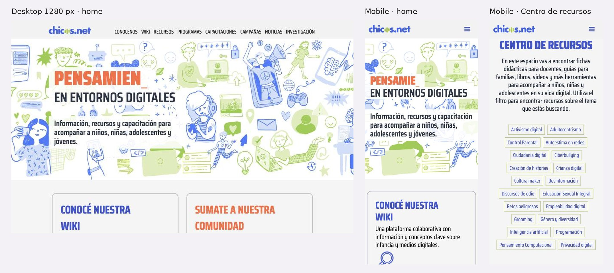

# 3.3.9 - Chicos.net

> Método: lectura de contenido con WebFetch (13 páginas, 2 sin página propia), 2026-10-05. WebFetch devuelve un resumen del HTML, no la página renderizada: filtros, menús desplegables, estados interactivos y detalles visuales pueden no aparecer completos. Las cifras y textos citados provienen de esos resúmenes; conviene contrastar los números clave al hacer las capturas. [OBS] = observación propia en el navegador del celular (2026-10-05). Referencias entre corchetes [n] = número en la sección Fuentes.

## Información general
- **Organización:** Chicos.net, "organización civil sin fines de lucro que promueve los derechos de niños, niñas, adolescentes y jóvenes en entornos digitales" [2]. Trabaja en tres líneas: uso responsable y seguro (prevención de violencias digitales y convivencia), uso crítico y reflexivo (alfabetización mediática, algoritmos, desinformación, privacidad) y uso activo, creativo y participativo (alfabetización digital, pensamiento computacional, activismo, cultura maker) [2].
- **Tipo: Direct competitor (confirmado, con matiz).** Justificación según las definiciones del brief: ofrece un **producto similar** a ReConectate, Pantasaurus y el Campus de RPI —recursos para familias, docentes y chicos, capacitaciones gratuitas, talleres en escuelas y contenidos sobre grooming, sexting, ciberbullying y ESI— a la **misma audiencia en el mismo mercado** (familias, docentes y NNyA en Argentina) [1][5][7][8]. Matiz: su foco es más amplio (ciudadanía digital, IA, programación, empleabilidad juvenil) y no tiene una ruta de pedir ayuda en la navegación ni un servicio como Bajalo Ya! [1][6]; compite con RPI por la atención de familias y docentes y por los mismos aliados corporativos, no por quien llega en crisis (HECHO [1][5][6][7]; clasificación = INFERENCIA).
- **Ubicación:** Argentina, con programas en Uruguay (Plan Ceibal, desde 2016), México y Colombia (Imagina Si, desde 2022) y propuestas para América Latina [6]. Dirección: No verificable (no apareció en las páginas leídas).
- **Oferta:** Wiki de unos 30 conceptos [3]; Centro de recursos con 70+ recursos [5]; 42 programas (26 activos y 16 finalizados) [6]; capacitaciones gratuitas (webinars HumanIA, cursos virtuales y autoasistidos en Moodle, Diplomatura "Educar en la Cultura Digital") [7]; talleres para escuelas por público [8]; campañas (2015–2026) [9]; observatorio de investigación "Chicos.net LAB" con publicaciones de 2009 a 2026 [11]; canales de WhatsApp para familias y docentes [1].
- **Website:** https://www.chicos.net (+ cursos.chicos.net/moodle30, internetenunacaja.org, eligetuforma.org, iaencasa.org y otros micrositios de campañas) [1][6][9].
- **Tamaño / alcance:** No verificable. Conocenos no da año de fundación, cifras de impacto, premios ni memorias [2]; la home tampoco muestra cifras [1]. La única cifra grande ("más de 3 millones de estudiantes de 70 países") corresponde al Desafío Bebras internacional, no a Chicos.net [6][7]. INFERENCIA: activa desde al menos 2000 (programa "Red Nacional Acercándote @l Mundo", 2000–2007 [6]; investigaciones desde 2009 [11]).
- **Target audience:** familias y docentes (los dos públicos con canal propio de WhatsApp en la home) [1]; niñas y niños de 9 a 12 años, adolescentes de 12 a 18 y jóvenes de 17 a 24 [6]; escuelas (talleres por nivel) [8]; investigadores y periodistas (LAB, "En los medios") [10][11]; empresas y organismos aliados [1].
- **Unique value proposition:** referente en derechos y ciudadanía digital de la niñez con producción propia de conocimiento (Wiki + investigación) y formación gratuita para docentes y familias (HECHO [3][7][11]; formulación = INFERENCIA). Claim de home: "Promovemos los derechos de la niñez y la adolescencia en entornos digitales" [1].
- **Otros datos de posicionamiento:** aliados en la home ("ALIANZAS" / "NOS ACOMPAÑAN"): Save the Children, Disney, Personal, TikTok, Ceibal, Google.org, Meta, UNESCO, Amnistía Internacional, Discovery, entre otros [1]. Footer con Código de Conducta, Política de salvaguarda, Lineamientos de género y Protocolo administrativo para denuncias [1][2].

## Arquitectura y navegación
- **Menú principal (8 ítems) [1][OBS]:** CONOCENOS · WIKI · RECURSOS · PROGRAMAS · CAPACITACIONES · CAMPAÑAS · NOTICIAS · INVESTIGACIÓN. La extracción mostró además un submenú de ProgramON (TALLERES, CURSOS, APRENDÉ A TU RITMO, RECURSOS) [1].
- **Home (secciones):** hero "Derechos en entornos digitales" [OBS] ("EN ENTORNOS DIGITALES - Información, recursos y capacitación para acompañar a niños, niñas, adolescentes y jóvenes." según la extracción [1]); "CONOCÉ NUESTRA WIKI"; "SUMATE A NUESTRA COMUNIDAD" (botones FAMILIAS y DOCENTES → canales de WhatsApp); bloques CAPACITAMOS / INVESTIGAMOS / COMUNICAMOS; destacados (guía de IA para familias, "Chicos.net va a tu escuela", "Jugar en el Patio Digital", HumanIA, cursos); NOVEDADES; newsletter; CENTRO DE RECURSOS; ALIANZAS; NOS ACOMPAÑAN; CONTACTO; BLOG [1].
- **Profundidad:** 2–3 niveles (menú > listado > ficha), más micrositios con navegación propia [1][6][9].
- **¿Organiza por audiencia?** No en el menú: organiza por **tipo de contenido** (Wiki, Recursos, Programas, Capacitaciones, Campañas, Noticias, Investigación) [1]. La audiencia aparece en tres lugares: los canales de WhatsApp FAMILIAS / DOCENTES de la home [1], la página Escuelas (talleres para docentes, niños, adolescentes y familias) [8] y el título de cada recurso ("Internet en una caja | Docentes") [5].
- **Centro de recursos:** filtra solo por tema, con unas 20 etiquetas [OBS] (la extracción listó 26: Activismo digital, Adultocentrismo, Control Parental, Autoestima en redes, Ciudadanía digital, Ciberbullying, Creación de historias, Crianza digital, Cultura maker, Desinformación, Discursos de odio, Educación Sexual Integral, Retos peligrosos, Empleabilidad digital, Grooming, Género y diversidad, Inteligencia artificial, Programación, Pensamiento Computacional, Privacidad digital, Realidad Aumentada, Realidad Virtual, Sexting, Sharenting, Uso excesivo de pantallas, Videojuegos [5]). No filtra por público ni por edad [OBS]; el público figura como texto dentro del título del recurso [5]. Conteo exacto de etiquetas: a verificar en captura.
- **Buscador:** No verificable; no se mencionó en la home, Wiki ni Recursos [1][3][5].
- **Registro / login:** "Registrarse", "Ingresar" y "Olvidé mi contraseña" en el sitio [1][5][OBS]. Lo que exige login: inscribirse a capacitaciones y colaborar con la Wiki [3][7]; la lectura de la Wiki es abierta (la entrada Grooming se leyó sin sesión) [4]. Si descargar recursos exige registro: No verificable ("algunos parecen accesibles sin autenticación" [5]).
- **Footer:** contacto (info@chicos.net, WhatsApp +54 9 11 2611-9120), 6 redes (LinkedIn, Instagram, Facebook, X, YouTube, TikTok) y documentos de salvaguarda y privacidad [1].
- **Selector de idioma:** no hay [1][13].

## User flows clave
1. **Pedir ayuda / derivación.**
   - No hay entrada de ayuda en el menú ni en la home, ni referencias a 102, 137, 911 o 145 en la home [1][OBS].
   - La derivación existe dentro de la Wiki: la entrada Grooming (Wiki > Grooming) explica qué hacer —no borrar conversaciones, hacer capturas, no bloquear ni exponer al agresor, denunciar formalmente, acompañar sin culpar, no negociar ante amenazas— y lista líneas: Argentina (Línea 102, Línea 137, Grooming Argentina "011-1524811722", Equipo Niñ@s 0800-222-1717) y otros países (Paraguay 147, Perú 100, Uruguay 0800 5050, Chile 134, Colombia TeProtejo, Costa Rica 800-8000-64, además de México y Bolivia) [4].
   - Fricciones: quien llega en crisis tiene que adivinar que la ayuda está en un glosario (INFERENCIA [1][4]); si los números son enlaces `tel:`: No verificable [4]. Al ser una organización sin asistencia directa, su situación es la misma que la de RPI (INFERENCIA [2]).
2. **Recursos por audiencia (familia / docente).** Home > RECURSOS ("Conocelo") > Centro de recursos: "fichas didácticas para docentes, guías para familias, libros, videos y más herramientas" [5]. Filtro por tema [OBS]; para encontrar lo de su público, la persona tiene que leer los títulos ("Guía para familias | ¿Cuándo dar el primer celular?", "Ficha didáctica: Desinformación y noticias falsas", "Libro | Influencio versus Fomo. Mi primer celular") [5]. Acción "VER" en cada tarjeta [5]. Sin edad pese a que los programas sí la indican (9–12, 12–18, 17–24) [5][6]. Alternativa directa: canales de WhatsApp FAMILIAS y DOCENTES en la home [1].
3. **Capacitaciones.** CAPACITACIONES lista HumanIA (webinars gratuitos para docentes sobre IA), cursos virtuales, cursos autoasistidos en Moodle, encuentros, conversatorios y la Diplomatura "Educar en la Cultura Digital" [7]. Dirigidas a "docentes, familias, niños, niñas y adolescentes"; se repite "100% gratuitos" [7]. Inscripción con login; formulario "CONTACTATE" con nombre, email, institución, país y tipo de capacitación [7]. Certificación: No verificable [7]. Para escuelas, /escuelas ("Talleres y capacitaciones para docentes, estudiantes y familias") separa 4 propuestas por público y nivel (docentes; 4° a 6° de primaria; 1° a 5° de secundaria; familias) con formulario y "Más información" por WhatsApp; costo no informado [8].
4. **Donar.** No hay botón ni página de donación: la home no lo muestra [1][OBS] y /donar no devolvió una página de donación [12]. El financiamiento visible es por alianzas (logos) [1]. Flujo para donantes individuales: **inexistente** en lo leído.
5. **Empresas / alianzas.** "ALIANZAS" y "NOS ACOMPAÑAN" en la home con logos [1]; programas con financiador explícito (Google.org en Internet en una caja, Save the Children, Telecom/Personal en Nuestro Lugar, Disney en Patio Digital) [6][9]. No hay página ni propuesta para sumarse como empresa; contacto general [1][2]. Flujo para empresas: **No verificable**.
6. **Prensa.** NOTICIAS tiene dos categorías: "Chicos.Net Blog" y "En los medios" (cobertura en medios), y el contacto "Para contactarse con nuestro área de prensa escribir a: comunicacion@chicos.net" [10]. No se vio kit de prensa, voceros ni datos clave [10]. Varias notas recientes aparecen sin fecha en la extracción [10].
7. **Investigación.** INVESTIGACIÓN ("Chicos.net LAB es nuestro observatorio de investigación permanente") lista publicaciones de la más reciente (2026: "Deepfakes sexuales en las escuelas", "Juego en tiempos de pantallas", "¿La ESI adoctrina?") a la más antigua (2009: "Chic@s y Tecnología") [11]. Sin filtros por tema o año; mezcla páginas web, PDFs y enlaces a Google Drive; algunas sin fecha ("Docentes y bullying") [11].
8. **Público internacional / otros idiomas.** Sitio solo en español, sin selector; /en no muestra una versión en inglés [13]. Sí hay señales de público latinoamericano: el formulario del newsletter pide país (22 países de América Latina, España y "Otro") y tiene la casilla "Soy docente" [1]; la Wiki lista líneas de ayuda de 8 países [4]; programas en Uruguay, México, Colombia y para toda la región [6].

## Contenido
- **Claridad:** alta en la Wiki: definición directa ("El grooming es un término que se utiliza para hacer referencia al delito de acoso y/o abuso sexual de una persona adulta hacia una niña, niño o adolescente a través de Internet.") y pasos de acción concretos [4]. Programas descriptos con público y edad [6].
- **Tono:** educativo y de derechos ("Promovemos los derechos..."), sin alarma; campañas en clave positiva ("Si lo hablaste, ya ganaste", "Sé la mejor influencia") [1][9].
- **Organización:** por tipo de contenido; la Wiki funciona como glosario de unos 30 términos (IA, Grooming, Sexting, Sharenting, Deepfake, Control parental, etc.) [3].
- **Cantidad de información:** muy alta: 42 programas en una sola página [6], 70+ recursos sin paginación [5], publicaciones desde 2009 [11], micrositios por campaña [9]. Riesgo de que familias y docentes no encuentren lo suyo (INFERENCIA).
- **CTAs (textuales):** "ACCEDÉ", "FAMILIAS", "DOCENTES", "CAPACITAMOS", "INVESTIGAMOS", "COMUNICAMOS", "Conocelo", "Cursos gratuitos y a tu ritmo", "VER", "Registrarse", "Ingresar", "Olvidé mi contraseña", "Colaborá con la edición de los términos", "Más información", "ENVIAR" [1][3][5][6][8].
- **Impacto / transparencia:** sin cifras propias de alcance ni memorias o informes anuales [1][2][11]; la credibilidad se apoya en aliados internacionales [1] y en la producción de investigación (2009–2026) [11]. Documentos de salvaguarda públicos [1][2]. Inconsistencia: la cifra "más de 3 millones de estudiantes de 70 países" aparece en Capacitaciones y Programas pero describe el Desafío Bebras global, lo que puede leerse como alcance propio (OBSERVACIÓN [6][7]).
- **Presencia en medios / newsroom:** "En los medios" + correo de prensa [10].

## Idiomas y accesibilidad (lo verificable desde el contenido)
- **Idiomas:** solo español [1][13]. Público regional reconocido en el newsletter y en la Wiki [1][4].
- **Accesibilidad (señales en el contenido):** contenido de la Wiki y de recursos como texto legible [3][4][5]; menú en mayúsculas [1][OBS] (INFERENCIA: más difícil de leer para algunos usuarios; revisar en capturas); 70+ recursos en una sola vista sin paginación [5]. No se encontró declaración de accesibilidad ni skip link en la extracción [1]. Requiere prueba con lector de pantalla y contraste (no verificable solo con contenido).

## First impressions (capturas propias, 2026-10-05)
- **Primera impresión (OBSERVACIÓN):** hero ilustrado a mano con un titular que se escribe solo ("PENSAMIEN_ / EN ENTORNOS DIGITALES") y la bajada "Información, recursos y capacitación para acompañar a niños, niñas, adolescentes y jóvenes." Abajo, tarjetas "Conocé nuestra Wiki" y "Sumate a nuestra comunidad".
- **Claridad de la propuesta:** clara en la bajada; el titular animado tarda en leerse completo.
- **Jerarquía visual:** contenido y comunidad primero; no hay botón de ayuda ni de donar en la primera pantalla.
- **Desktop — Good.** + Ilustraciones propias, propuesta clara, menú visible con 8 ítems. − Los 8 ítems están al mismo nivel y ninguno es por público.
- **Mobile — Okay.** + Texto real y legible, sin scroll horizontal. − Todo queda detrás del menú hamburguesa; en el Centro de recursos, unas 20 etiquetas ocupan la primera pantalla antes de ver un solo recurso.

## Visual design
- **Branding / identidad — Good.** + Ilustración propia en azul, verde y naranja, coherente con el tema digital. − El titular animado tipo máquina de escribir compite con la bajada.
- **Imágenes:** ilustraciones, no fotos de chicos (OBSERVACIÓN).
- **Coherencia entre páginas:** alta en home y recursos.
- **Relación diseño–audiencia:** pensado para familias y docentes; las etiquetas temáticas suponen que el usuario ya conoce los términos (INFERENCIA).

## Verificación técnica (JavaScript sobre el DOM, 2026-10-05)
| Chequeo | Resultado |
| --- | --- |
| `lang` | `es` |
| Skip link | No |
| Imágenes sin `alt` (home) | 17 de 48 |
| H1 en la home | 5: cuatro en ventanas ocultas de inicio de sesión y el titular animado |
| Enlaces `tel:` | 0 |
| Enlaces a WhatsApp | 3 (canales de la comunidad) |
| Buscador en la home | No |
| Zoom bloqueado | No |
| Salida rápida | No |

## Ratings finales
| Dimensión | Rating | Por qué |
| --- | --- | --- |
| Desktop | Good | Propuesta clara e ilustrada |
| Mobile | Okay | Legible; recursos con 20 etiquetas antes del contenido |
| Navegación | Okay | Por tipo de contenido, no por público |
| User flow | Okay | Recursos a 2 toques; ayuda escondida en la Wiki |
| Accesibilidad | Needs work | 17 imágenes sin `alt`, varios H1, sin skip link |
| Diseño visual | Good | Ilustración propia y consistente |
| Contenido | Good | Wiki y recursos amplios; sin impacto propio |

## Lentes del objetivo del audit
| Lente | ¿Lo resuelve? | Evidencia |
| --- | --- | --- |
| Navegación por audiencia | Parcial | Menú por tipo de contenido; audiencias en canales de WhatsApp de la home, en Escuelas y en títulos de recursos; Centro de recursos sin filtro por público ni edad [1][5][8][OBS] |
| Pedir ayuda / derivación | Parcial | Solo dentro de la Wiki (Grooming): pasos de acción y líneas de 8 países; nada en menú ni home [1][4] |
| Impacto y credibilidad | Parcial | Sin cifras propias ni memorias; credibilidad por aliados y por investigación 2009–2026 [1][2][11] |
| Prensa | Parcial | "En los medios" + comunicacion@chicos.net, sin kit ni voceros [10] |
| Internacional | Parcial | Solo español, pero newsletter con país (22 opciones), líneas de ayuda por país y programas en UY, MX y CO [1][4][6][13] |

## Qué significa → qué decisión podría afectar
- Los canales de WhatsApp separados por público (FAMILIAS / DOCENTES) en la home son una entrada por audiencia de bajo costo → **afecta** la home y la estrategia de comunidad de RPI (lente 1; US-07, US-29).
- Un centro de recursos que filtra solo por tema obliga a leer títulos para encontrar el propio público → **afecta** el diseño del buscador de recursos de RPI: filtros por público, tema y edad (lente 1; US-05, US-08, US-09).
- La derivación a líneas por país dentro de un glosario es útil pero invisible → **afecta** "Necesito Ayuda": misma información (líneas por país) pero en el header y con teléfonos tocables (lentes 2 y 4; US-01, US-02, US-03).
- Una organización sin donación individual ni impacto propio depende de aliados → **afecta** la sección para donantes de RPI: diferenciarse con impacto en números con año (lente 3; US-15, US-32).
- Público latinoamericano hispanohablante identificado con un campo "país" → **afecta** la estrategia de idiomas: medir de qué países llega el 31% antes de traducir (lente 4; US-20, US-25) (INFERENCIA).

## Evidencia
Capturas: home desktop (1280 px), home mobile y Centro de recursos mobile. Archivos: `evidencia/capturas/chicosnet_*.jpg` (hoja resumen: `evidencia/chicosnet_evidencia.jpg`).

## Ratings preliminares (solo contenido, antes de las capturas) (Needs work / Okay / Good / Outstanding, con + y −)
- **Content: Good.** + Wiki de unos 30 conceptos con definiciones claras y pasos de acción [3][4]; + 70+ recursos por tema y formato [5]; + investigación propia de 2009 a 2026 [11]; + tono de derechos, sin alarma [1][9]. − Sin impacto propio ni memorias [2]; − volumen muy alto (42 programas en una página, 70+ recursos sin paginación) [5][6]; − notas e investigaciones sin fecha [10][11].
- **Interaction / Navigation: Okay.** + Menú de una sola capa con nombres claros por tipo de contenido [1]; + accesos por público en la home (WhatsApp FAMILIAS / DOCENTES) y en Escuelas [1][8]. − 8 ítems en mayúsculas y sin audiencia en el menú [1]; − recursos sin filtro por público ni edad [5][OBS]; − buscador no verificado [1][3][5]; − micrositios externos con navegación propia [6][9].
- **User flow: Okay.** + Pedido de talleres para escuelas con formulario corto y WhatsApp [8]; + capacitaciones gratuitas [7]. − No hay flujo de donación [1][12]; − pedir ayuda escondido en la Wiki [4]; − login para inscribirse en capacitaciones [7]; − sin flujo para empresas [1][2].
- **Accessibility (preliminar): Okay.** + Contenido clave como texto real (Wiki, recursos) [3][4][5]. − Solo español [13]; − menú en mayúsculas [1][OBS]; − sin declaración de accesibilidad visible [1]. Requiere prueba con lector de pantalla y contraste.

## Fortalezas
- Wiki como base de conocimiento abierta, con pasos de acción y líneas de ayuda por país [3][4].
- Canales de WhatsApp por público en la home [1].
- Página para escuelas organizada por público y nivel educativo [8].
- Investigación propia sostenida desde 2009 [11].
- Capacitaciones gratuitas y autoasistidas, incluida una diplomatura [7].
- "En los medios" y correo de prensa [10].
- Aliados internacionales visibles y documentos de salvaguarda públicos [1][2].

## Debilidades
- Sin navegación por audiencia en el menú; recursos sin filtro por público ni edad [1][5][OBS].
- Pedir ayuda solo dentro de la Wiki [1][4].
- Sin donación individual [1][12].
- Sin cifras de impacto propias ni memorias; cifra de Bebras que puede confundirse con alcance propio [2][6][7].
- Solo español, pese al público regional [1][13].
- Volumen alto sin paginación ni filtros en programas e investigaciones [5][6][11].

## Patrones o ideas relevantes para Red por la Infancia
1. **Canales de WhatsApp por público (familias / docentes)** → lente (1); suma una entrada por audiencia y facilita compartir recursos (US-07, US-27, US-29). (HECHO [1])
2. **Wiki de conceptos con "qué hacer" y a quién llamar** → lentes (1) y (2); un glosario de ReConectate puede responder búsquedas ("qué es el sexting") y llevar a "Necesito Ayuda" (US-04, US-08). (HECHO [3][4])
3. **Líneas de ayuda por país** → lentes (2) y (4); para el 31% de usuarios fuera de Argentina, una tabla de líneas por país en "Necesito Ayuda" resuelve más que traducir (US-03, US-21, US-25). (HECHO [4]; aplicabilidad = INFERENCIA)
4. **Página de escuelas por público y nivel con formulario corto** → lente (1); modelo para que Martín pida un taller desde el celular (US-09, US-10). (HECHO [8])
5. **Antipatrón: centro de recursos que filtra solo por tema** → lente (1); RPI debería sumar público y edad como filtros (US-05, US-09). (OBSERVACIÓN [OBS][5])
6. **Investigación listada por año** → lente (3); base para un repositorio de publicaciones de RPI, con filtros por tema y año que Chicos.net no tiene (US-17). (HECHO [11])
7. **Antipatrón: ayuda escondida, sin donación y sin impacto propio** → lentes (2) y (3); RPI puede diferenciarse con "Necesito Ayuda" fijo, "Quiero Colaborar" visible e impacto con año (US-01, US-14, US-15). (OBSERVACIÓN [1][2][4][12])
8. **Prensa dentro de Noticias ("En los medios" + correo)** → lente (3); mínimo viable de sala de prensa, a completar con voceros y datos con fuente (US-31, US-32). (HECHO [10])

## Fuentes
Consultadas el 2026-10-05 con WebFetch. [OBS] = observación propia en el navegador del celular, 2026-10-05.
1. https://www.chicos.net — home
2. https://www.chicos.net/conocenos — Conocenos
3. https://www.chicos.net/wiki — Wiki
4. https://www.chicos.net/wiki/grooming — Wiki: Grooming
5. https://www.chicos.net/recursos — Centro de recursos
6. https://www.chicos.net/programas — Programas
7. https://www.chicos.net/capacitaciones — Capacitaciones
8. https://www.chicos.net/escuelas — Talleres y capacitaciones para escuelas
9. https://www.chicos.net/campanas — Campañas
10. https://www.chicos.net/noticias — Noticias
11. https://www.chicos.net/investigaciones — Investigación
12. https://www.chicos.net/donar — no accesible como página de donación (WebFetch no encontró contenido de donación; el código HTTP no se pudo confirmar)
13. https://www.chicos.net/en — no accesible como versión en inglés (WebFetch devolvió solo contenido en español; el código HTTP no se pudo confirmar)

## Capturas

